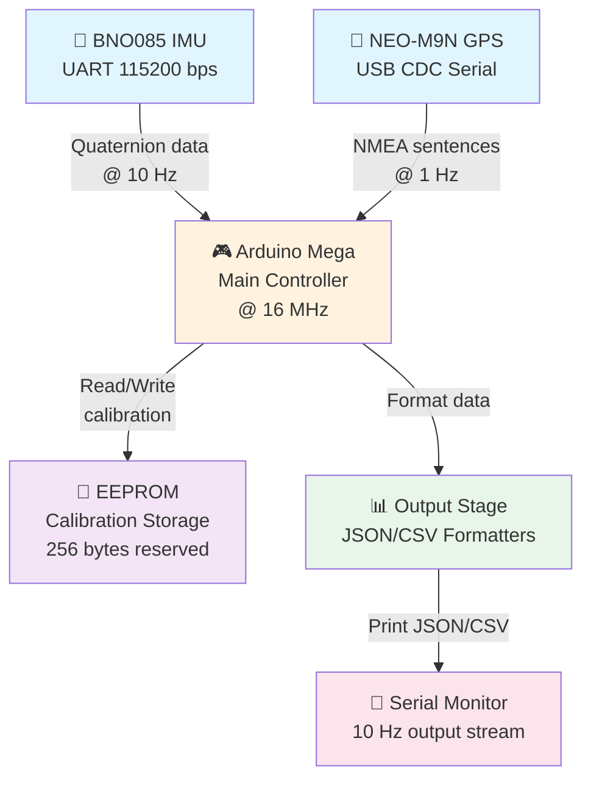
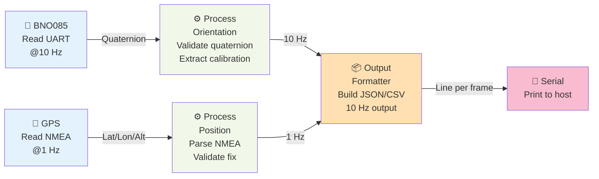
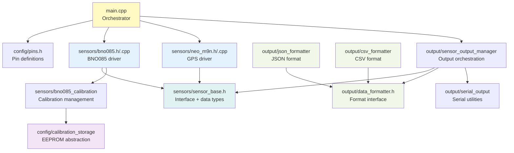
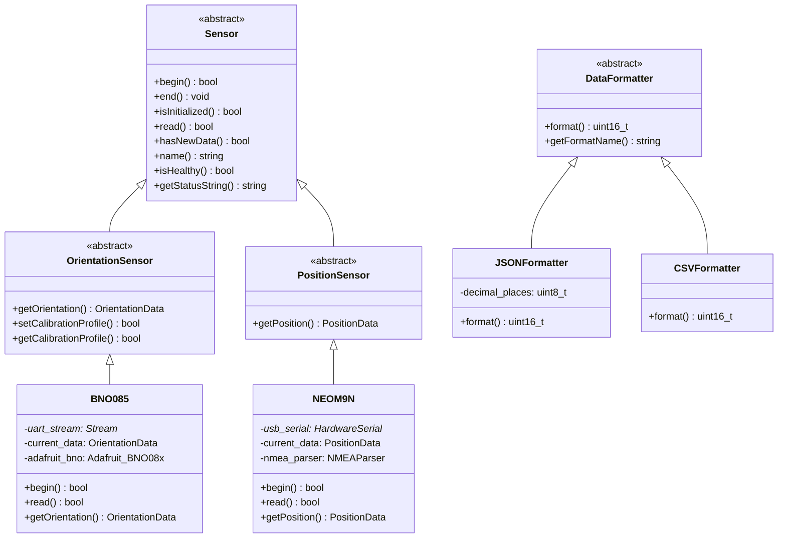
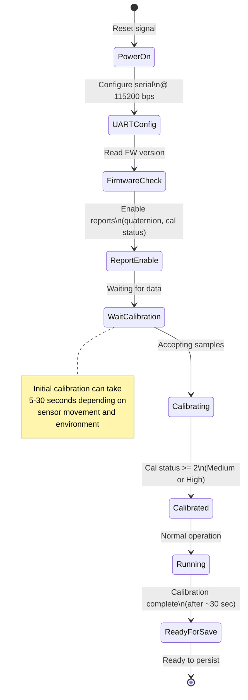
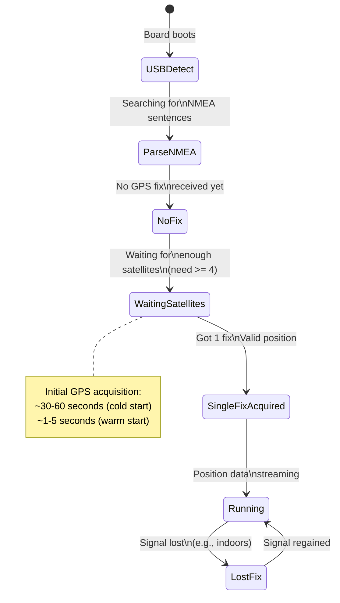
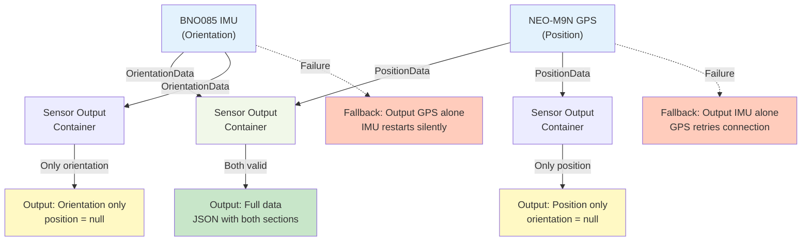
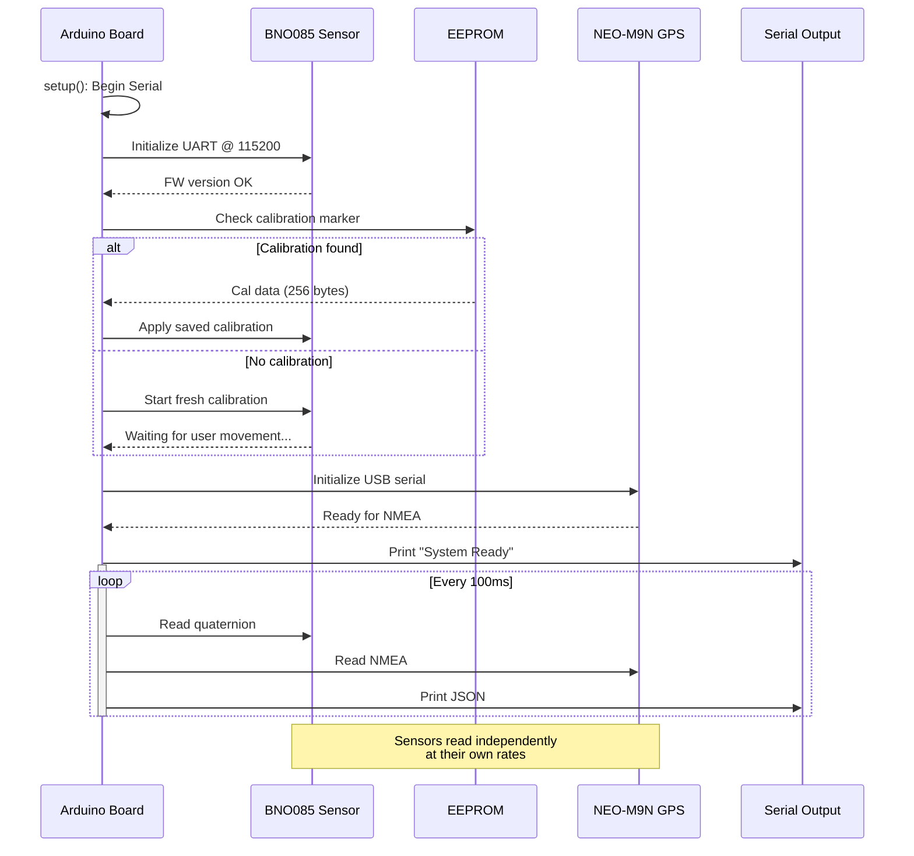

# Auto Orientation System Architecture

**Document Status**: v1.0 - Comprehensive system design with visual diagrams  
**Last Updated**: 2026-05-05  
**Scope**: BNO085 IMU + NEO-M9N GPS integration on Arduino-compatible boards

---

## Table of Contents

1. [System Overview](#system-overview)
2. [Hardware Architecture](#hardware-architecture)
3. [Data Flow](#data-flow)
4. [Code Organization](#code-organization)
5. [State Management](#state-management)
6. [Sensor Independence Principle](#sensor-independence-principle)
7. [Key Design Decisions](#key-design-decisions)
8. [Future Extension Points](#future-extension-points)
9. [Dependencies & Libraries](#dependencies--libraries)

---

## System Overview

The auto_orientation system is a real-time sensor fusion platform that combines absolute orientation (from BNO085 IMU) and geographic position (from NEO-M9N GPS) into a unified data stream suitable for robotics, drones, and navigation applications.

### System Block Diagram



### Key Characteristics

- **Decoupled Sensors**: Orientation and position sensors run independently
- **Persistent Calibration**: BNO085 calibration saved to Arduino EEPROM between boots
- **Configurable Output**: JSON or CSV format via serial
- **Multi-Platform Support**: Nano, Mega, Teensy, ESP32 via PlatformIO
- **Field-Ready**: Complete integration package for outdoor deployment

---

## Hardware Architecture

### Physical Connections

| Component | Interface | Board Pin | Baud Rate | Notes |
|-----------|-----------|-----------|-----------|-------|
| BNO085 IMU | UART | Serial1 (RX1/TX1) | 115200 | Hardware UART, Adafruit breakout |
| NEO-M9N GPS | USB | Native USB CDC | 9600 | Virtual COM port, auto-detected |
| EEPROM | Internal | N/A (on-chip) | N/A | Arduino built-in, 256 bytes used |

### Pin Configuration

See `src/config/pins.h` for board-specific pin mappings:

```
Arduino Mega Example:
- Serial1 (RX1=19, TX1=18): BNO085 UART
- USB Serial (CDC): NEO-M9N GPS
- A0-A15: Analog inputs (reserved for future sensors)
- Digital 0-53: General purpose I/O
```

### Hardware Requirements

**Minimum Configuration:**
- Arduino-compatible microcontroller (16+ MHz, 2+ KB RAM)
- BNO085 breakout board (Adafruit or clone)
- NEO-M9N GPS receiver (u-blox)
- USB cable for power/serial communication

**Optional Additions (Future):**
- SD card module (SPI interface)
- MPU6050 secondary IMU (I2C)
- Web dashboard receiver (WiFi on ESP32)

---

## Data Flow

### Sensor Reading Pipeline



### Output Data Structure

Each output frame contains:

```json
{
  "timestamp_ms": 123456,
  "orientation": {
    "valid": true,
    "quaternion": {
      "w": 0.707,
      "x": 0.0,
      "y": 0.0,
      "z": 0.707
    },
    "calibration": {
      "system": 3,
      "accel": 3,
      "gyro": 3,
      "mag": 2
    }
  },
  "position": {
    "valid": true,
    "latitude": 37.441926,
    "longitude": -122.143026,
    "altitude_m": 150.5,
    "accuracy_m": 2.1,
    "num_satellites": 12,
    "fix_quality": 1
  }
}
```

### Timing & Synchronization

- **BNO085 Output Rate**: 10 Hz (100 ms intervals)
- **GPS Output Rate**: 1 Hz (1000 ms intervals)
- **Serial Output Rate**: 10 Hz (synchronized with BNO085)
- **No cross-sensor synchronization**: GPS and IMU data combined at output stage with timestamps

---

## Code Organization

### Directory Structure

```
src/
├── main.cpp                          # Entry point: setup() + loop()
│
├── sensors/                          # Sensor abstraction layer
│   ├── sensor_base.h                 # Base classes + data structures
│   ├── bno085.h / .cpp               # BNO085 orientation sensor
│   ├── bno085_calibration.h / .cpp   # Calibration management
│   ├── neo_m9n.h / .cpp              # NEO-M9N position sensor
│   └── bno085_integration_example.h   # Example usage
│
├── output/                           # Data formatting & serial I/O
│   ├── data_formatter.h              # Base formatter interface
│   ├── json_formatter.h / .cpp       # JSON output format
│   ├── csv_formatter.h               # CSV output format
│   ├── serial_output.h               # Serial I/O utilities
│   └── sensor_output_manager.h       # Manages output pipeline
│
└── config/                           # System configuration
    ├── pins.h                        # Board-specific pin definitions
    ├── calibration_storage.h / .cpp  # EEPROM abstraction
    └── sensor_config.h               # Sensor tuning parameters
```

### Module Dependency Graph



### Class Hierarchy



---

## State Management

### BNO085 Initialization State Machine



### GPS Acquisition State Machine



### Calibration Persistence State Machine

```mermaid
stateDiagram-v2
    [*] --> BootCheck: Board powers on
    
    BootCheck --> EEPROMValid: Check EEPROM\nmarker (0xCA)
    
    EEPROMValid --> HasCal{Valid calibration\nfound?}
    
    HasCal -->|Yes| RestoreFromEEPROM: Restore 256 bytes\nfrom EEPROM
    
    HasCal -->|No| InitializeNew: Start calibration\nfrom scratch
    
    RestoreFromEEPROM --> VerifyCRC: Verify CRC8\nchecksum
    
    VerifyCRC --> CRCValid{Checksum\nvalid?}
    
    CRCValid -->|Yes| ApplyCal: Apply to BNO085\nvia setCalibration()
    
    CRCValid -->|No| InitializeNew: CRC failed,\nstart fresh
    
    InitializeNew --> WaitCalibration: Normal calibration\nflow
    
    WaitCalibration --> CalDone: Calibration\ncomplete
    
    ApplyCal --> Running: Skip init, run\nwith restored cal
    
    CalDone --> SaveToEEPROM: Save to EEPROM\n(~850 ms write time)
    
    SaveToEEPROM --> [*]: Boot complete
    
    note right of RestoreFromEEPROM
        Calibration persistence saves
        ~30 seconds of manual calibration
        per boot cycle on next startup
    end note
```

---

## Sensor Independence Principle

A core design decision: **Orientation and position sensors are completely independent** and can operate, fail, or be replaced separately.

### Decoupled Architecture



### Why Decoupling Matters

| Scenario | Benefit |
|----------|---------|
| **GPS not available** | Orientation data still streams at 10 Hz; user can log & analyze IMU alone |
| **BNO085 initializing** | GPS position available immediately; can plot trajectory while IMU calibrates |
| **Replacing GPS unit** | No need to re-calibrate IMU or change firmware; just swap USB device |
| **Adding new sensor** | New sensor (e.g., MPU6050) can be added without modifying BNO085 code |
| **Testing in lab** | Can test IMU calibration indoors; GPS testing separate in field |

### Integration Point: Output Layer

The only coupling point is at the **output formatter** stage:

```cpp
// In main.cpp loop()
// Each sensor reads independently
if (imu.read()) { /* new IMU data */ }
if (gps.read()) { /* new GPS data */ }

// Output combines at 10 Hz (IMU rate)
if (time_for_output) {
    // Both OrientationData and PositionData available
    // (even if one is invalid)
    formatter.format(imu.getOrientation(), 
                     gps.getPosition(), 
                     buffer, max_len);
}
```

---

## Key Design Decisions

### 1. Why Separate Sensors (Not Tightly Coupled)

**Decision**: Build BNO085 and NEO-M9N as independent modules with a common interface.

**Rationale**:
- Different update rates (10 Hz IMU vs 1 Hz GPS) work better with separate read loops
- GPS can fail or be unavailable without crashing IMU stream
- Easier to test & debug individual sensors
- Future sensor additions (e.g., MPU6050) don't require refactoring existing code
- Supports robotics use cases where orientation is needed independent of position

**Alternative Considered**: Tightly coupled sensor fusion (would require:)
- Complex state machine to handle mismatched data rates
- Risk of entire system failure if either sensor fails
- Harder to maintain & extend

---

### 2. Why JSON Output Format

**Decision**: Primary output format is JSON (with CSV as optional alternative).

**Rationale**:
- **Self-describing**: Field names make output human-readable
- **Extensible**: Easy to add new fields without breaking parsers
- **Logging-friendly**: JSON parsers available in Python, JavaScript, C++, etc.
- **Web dashboard ready**: Direct consumption by JavaScript frontends
- **Null handling**: Invalid sensors represented as `"valid": false` with `null` values

**Example Output**:
```json
{"timestamp_ms": 123456, "orientation": {"valid": true, "quaternion": {"w": 0.707, "x": 0, "y": 0, "z": 0.707}, "calibration": {"system": 3, "accel": 3, "gyro": 3, "mag": 2}}, "position": {"valid": false, "latitude": null, ...}}
```

**CSV Alternative**: 
```
timestamp_ms,quat_w,quat_x,quat_y,quat_z,lat,lon,alt_m,acc_m,sat_count,fix_quality
123456,0.707,0,0,0.707,37.441926,-122.143026,150.5,2.1,12,1
```

---

### 3. Why Local Library Storage

**Decision**: Clone external libraries into `lib/` directory instead of using package manager.

**Rationale**:
- **Reproducibility**: Exact library versions committed to git
- **Offline development**: No internet dependency for builds
- **Custom patches**: Can modify libraries if needed without forking on GitHub
- **Audit trail**: Full git history of library changes

**Libraries Stored Locally**:
- `Adafruit_BNO08x_Arduino/` — BNO085 driver (w/ potential calibration patches)
- Other sensor libraries as needed

**Trade-off**: Manual updates required; not automatic from package managers.

---

### 4. Why Arduino EEPROM for Calibration Storage

**Decision**: Use Arduino built-in EEPROM for persistent calibration (not SD card or cloud).

**Rationale**:
- **Minimal Dependencies**: Every Arduino board has EEPROM; no extra hardware needed
- **Fast Access**: On-board memory, read/write in milliseconds
- **Reliable**: Proven technology; EEPROM has millions of write cycles
- **Boot Performance**: Calibration restored in <100 ms without SD latency
- **Safety**: Data stays on device; no wireless transmission required

**Layout** (256 bytes reserved):
```
Offset  | Size   | Purpose
--------|--------|----------------------------------
0x00    | 1      | Validity marker (0xCA = valid)
0x01    | 1      | Data length
0x02    | 1      | Format version
0x03    | 1      | CRC8 checksum
0x04    | 252    | Calibration payload (BNO085 data)
```

**Future Extensions**:
- 0x100-0x1FF: Backup calibration profile
- 0x200-0x2FF: Metadata (timestamp, location, firmware version)
- 0x300+: SD card pointers (if extended storage added)

---

## Future Extension Points

### Adding MPU6050 Secondary IMU

```mermaid
graph TD
    BNO["BNO085<br/>(Primary IMU)"]
    MPU["MPU6050<br/>(Secondary IMU)"]
    FUSION["Sensor Fusion<br/>Logic"]
    
    BNO -->|OrientationData| FUSION
    MPU -->|AccelData,<br/>GyroData| FUSION
    
    FUSION -->|Fused<br/>Orientation| OUTPUT["Output<br/>Formatter"]
    
    note right of FUSION
        Future: Could implement complementary
        filter or Kalman filter to blend
        BNO085 absolute orientation with
        MPU6050 relative measurements
    end note
    
    style BNO fill:#e3f2fd
    style MPU fill:#ffe0b2
    style FUSION fill:#f1f8e9
    style OUTPUT fill:#c8e6c9
```

**Implementation Steps**:
1. Create `src/sensors/mpu6050.h/.cpp` extending `OrientationSensor`
2. Add I2C initialization to `config/pins.h`
3. Implement read loop in `main.cpp` (non-blocking)
4. Create fusion algorithm in `src/output/sensor_fusion.h`
5. Modify output formatter to use fused orientation

---

### Adding SD Card Logging

```mermaid
graph TD
    OUTPUT["Output<br/>Formatter"]
    JSON["JSON data"]
    CSV["CSV data"]
    
    JSON -->|Buffered| SDWRITE["SD Card<br/>Write Handler<br/>(Async)"]
    CSV -->|Buffered| SDWRITE
    
    SDWRITE -->|SPI| SDCARD["SD Card<br/>Module"]
    
    SDCARD -->|File| LOGFILE["deployment_<date>.json<br/>or .csv"]
    
    note right of SDWRITE
        Async write prevents blocking
        sensor reads. Buffer ~50 lines
        before writing to card.
    end note
    
    style OUTPUT fill:#f1f8e9
    style SDWRITE fill:#ffe0b2
    style SDCARD fill:#f3e5f5
    style LOGFILE fill:#c8e6c9
```

**Implementation Steps**:
1. Add SPI pins to `config/pins.h`
2. Create `src/output/sd_logger.h/.cpp` with async write queue
3. Add file rotation logic (max 10 MB per file)
4. Implement power-safe flush on shutdown detection

---

### Adding Web Dashboard

```mermaid
graph TD
    ARDUINO["Arduino Board<br/>with WiFi<br/>ESP32 variant"]
    
    JSON["JSON Output<br/>Stream"]
    
    WEBSOCK["WebSocket<br/>Server<br/>on ESP32"]
    
    BROWSER["Web Browser<br/>Dashboard<br/>Real-time plot"]
    
    JSON -->|Queue| WEBSOCK
    WEBSOCK -->|JSON frame<br/>per 100ms| BROWSER
    
    note right of BROWSER
        Dashboard could display:
        - Real-time quaternion plot
        - Calibration status gauges
        - GPS satellite count & accuracy
        - Compass/heading visualization
    end note
    
    style ARDUINO fill:#fff9c4
    style JSON fill:#f1f8e9
    style WEBSOCK fill:#ffe0b2
    style BROWSER fill:#c8e6c9
```

**Implementation Steps**:
1. Port codebase to ESP32 via PlatformIO
2. Add WiFi initialization in `setup()`
3. Create `src/output/websocket_server.h/.cpp` 
4. Build JavaScript dashboard with Chart.js or Three.js
5. Serve HTML/CSS/JS from SPIFFS on ESP32

---

## Dependencies & Libraries

### Arduino Libraries (Local Clone)

| Library | Purpose | Version | Location |
|---------|---------|---------|----------|
| Adafruit_BNO08x | BNO085 driver with calibration | 1.x | `lib/Adafruit_BNO08x_Arduino/` |
| Adafruit_Unified_Sensor | Sensor abstraction layer | 1.x | `lib/Adafruit/` |
| Adafruit_BusIO | I2C/SPI communication | 1.x | `lib/Adafruit/` |

### Build Tools

| Tool | Purpose | Command |
|------|---------|---------|
| PlatformIO | Build & upload system | `platformio run --target upload` |
| Arduino IDE | Alternative upload | `arduino-cli` |
| Python 3.8+ | Serial monitoring & analysis | `python3 tools/serial_monitor.py` |

### Supported Boards

| Board | Flash | RAM | EEPROM | Status |
|-------|-------|-----|--------|--------|
| Arduino Mega 2560 | 256 KB | 8 KB | 4 KB | ✅ Tested |
| Arduino Nano | 32 KB | 2 KB | 1 KB | ✅ Supported |
| Teensy 3.2 | 256 KB | 64 KB | 2 KB | ✅ Supported |
| ESP32 | 320 KB | 320 KB | ~8 KB | 🔄 Planned |

---

## Initialization & Boot Sequence



---

## Performance & Timing

### Timing Budget (per 100 ms cycle)

| Operation | Time | Notes |
|-----------|------|-------|
| BNO085 UART read | ~5 ms | Non-blocking |
| GPS NMEA parse | ~2 ms | Only if new data |
| JSON format | ~3 ms | Depends on precision |
| Serial write | ~1 ms | Depends on buffer size |
| **Total (worst case)** | **~11 ms** | **Well under 100 ms** |

### Memory Usage (Arduino Mega)

| Component | Bytes | Notes |
|-----------|-------|-------|
| Global buffers | ~512 | Input + output buffers |
| Sensor objects | ~256 | BNO085 + GPS instances |
| Stack usage | ~1024 | Function calls, local vars |
| **Total** | **~1800** | **of 8192 KB RAM available** |

### Power Consumption (Typical)

| Component | Current | Notes |
|-----------|---------|-------|
| Arduino Mega | ~50 mA | @ 16 MHz, no WiFi |
| BNO085 | ~3 mA | Active mode |
| NEO-M9N | ~30 mA | Lock + tracking |
| **Total System** | **~85 mA** | **From 5V supply** |

---

## Error Handling & Recovery

### Sensor Failure Modes

| Scenario | Behavior | Recovery |
|----------|----------|----------|
| **BNO085 UART disconnected** | Orientation stream stops | User resets board or reconnects UART |
| **GPS signal lost (indoors)** | Position marked invalid | Automatic resume when signal returns |
| **Calibration CRC failure** | Fall back to fresh cal | User moves sensor to re-calibrate |
| **EEPROM corruption** | Marker != 0xCA | Fresh calibration starts automatically |
| **Serial buffer overflow** | Drop oldest data, continue | Monitor frequency tuned to prevent |

### Graceful Degradation

The system is designed to work with partial sensor availability:

```
Scenario A: Both sensors OK
Output: {"orientation": {...}, "position": {...}}

Scenario B: GPS signal lost
Output: {"orientation": {...}, "position": {"valid": false, "latitude": null, ...}}

Scenario C: BNO085 initializing (first 30 sec)
Output: {"orientation": {"valid": false, ...}, "position": {...}}

Scenario D: Complete failure (both sensors down)
Output: Board hangs with error message on serial
Action: User must manually reset board
```

---

## Security & Data Integrity

### Calibration Data Protection

- **CRC8 checksum**: Detect accidental bit flips in EEPROM
- **Validity marker**: Detect uninitialized EEPROM (0xFF) vs valid (0xCA)
- **Format versioning**: Support future EEPROM layout changes
- **No encryption**: Data is non-sensitive; encryption would waste resources

### Serial Communication

- **No authentication**: Assumes trusted USB/UART connection
- **No encryption**: All data sent in clear text
- **No checksums on frames**: Serial line is usually short & reliable

**Future Enhancement** (if needed):
- HMAC signature on JSON frames
- Encrypted EEPROM calibration
- Rate limiting on serial reads

---

## Testing & Validation

### Unit Test Coverage

```
tests/
├── test_quaternion_math.cpp
├── test_nmea_parsing.cpp
├── test_neo_m9n_driver.cpp
└── test_json_formatter.cpp
```

### Integration Testing

1. **Hardware Test**: Build & flash to Mega, verify both sensors initialize
2. **Output Format Test**: Capture JSON output, validate against schema
3. **Calibration Persistence**: Save cal, power cycle, verify restore
4. **Edge Cases**: Test GPS loss, IMU reset, EEPROM corruption

### Field Validation

- Deploy to drone for orientation tracking
- Compare GPS accuracy vs ground truth
- Verify calibration holds over multi-hour flight
- Test temperature stability (-10°C to +40°C)

---

## Maintenance & Versioning

### Software Versioning

- **Format**: `v<major>.<minor>.<patch>`
- **v1.0.x**: Initial release (BNO085 + GPS only)
- **v1.1.x**: SD card logging, multiple IMUs
- **v2.0.x**: WiFi/web dashboard, ESP32 support

### Hardware Versioning

- **Hardware v1.0**: Mega + BNO085 + GPS
- **Hardware v1.1**: Nano variant (size/cost reduction)
- **Hardware v2.0**: ESP32 integrated WiFi

### Deprecation Policy

- **Supported**: 2 latest versions
- **Deprecated**: 1 version prior (warning only)
- **End-of-life**: Drop from testing after 2 deprecation releases

---

## Summary

The **auto_orientation system architecture** is built on three core principles:

1. **Modularity**: Independent sensor drivers with common interface
2. **Reliability**: Graceful degradation when sensors fail or unavailable
3. **Extensibility**: Clear extension points for new sensors, storage, and dashboards

This design supports field deployment, laboratory calibration, and future integration with robotics platforms while maintaining simple, understandable code.

---

**Document History**:
- 2026-05-05: v1.0 - Initial comprehensive architecture documentation with Mermaid diagrams
