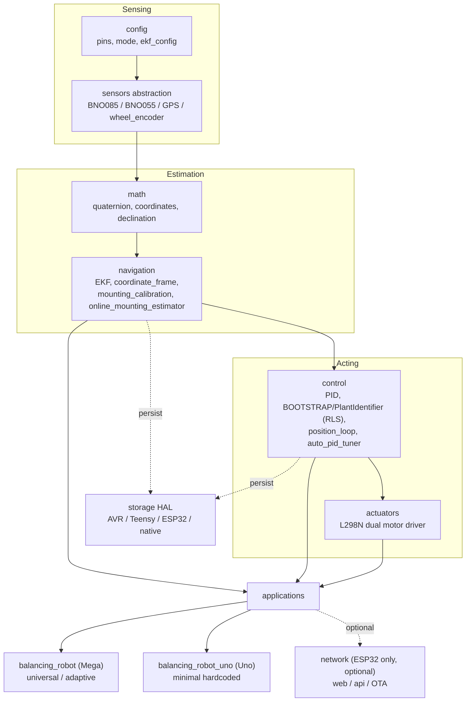

# Level 0 — System overview

The one-page mental model. The framework is a **layered pipeline**: raw sensors are abstracted, fused into an orientation/position estimate, fed to a controller, and turned into motor commands by a reference application. Persistent storage and (on ESP32) a network layer hang off the side.

[← Index](INDEX.md) · [Level 1 — subsystems →](LEVEL_1_SUBSYSTEMS.md)

---

## Major layers



---

## What each layer owns

| Layer | Responsibility | Knows nothing about |
|-------|----------------|---------------------|
| **config** | Compile-time pin maps, build mode flags, EKF/GPS tuning. | Runtime behaviour. |
| **sensors** | Hardware drivers behind a common `OrientationSensor` / `PositionSensor` / `RawIMUSensor` / `Magnetometer` interface, plus `WheelEncoder`. | Control law. |
| **math** | Pure functions: quaternion ops, GPS↔ECEF↔NED, magnetic declination. | Any I/O. |
| **navigation** | Fuses sensors into state: EKF, frame transforms, one-shot mounting capture, online mounting drift tracker. | Motors. |
| **control** | Closed-loop math: generic PID, the BOOTSTRAP/RLS plant identifier, the position outer loop, the auto-tuner coordinator + strategies. | IMUs, motors, sample sources (fed `(measurement, dt)`). |
| **actuators** | `DualMotorDriver` abstract + `L298NMotorDriver` (clamp, stiction, H-bridge). | Why it's being driven. |
| **applications** | Wires the layers together for a concrete robot and owns *behaviour* (state machine). | Hardware ownership (injected). |
| **storage (HAL)** | `ps::` namespace with per-architecture EEPROM/NVS backends. | What's being stored. |
| **network** | ESP32-only optional web/API/OTA, mirroring the flight_controller `USE_WIFI` flag cascade. | Control timing (runs off the hot path). |

---

## The Mega / Uno fork

The single most important structural fact (see [`../scope.md`](../scope.md)): **the two reference applications share every lower layer but diverge entirely at the control strategy.**

```mermaid
flowchart LR
    SHARED["Shared layers<br/>sensors · math · navigation · actuators · storage"]
    SHARED --> MEGA["Mega: balancing_robot<br/>BalanceApp state machine →<br/>BOOTSTRAP + PlantIdentifier (RLS) +<br/>PositionLoop cascade + collision detect"]
    SHARED --> UNO["Uno: balancing_robot_uno<br/>UnoBalanceApp →<br/>fixed PID(Kp,Ki,Kd) from EEPROM/seed"]
    TUNER["tools/sim/brute_tune.py<br/>(offline, optional)"] -.generates balance_constants.h.-> UNO
```

- **Mega** learns its own plant on the bench (BOOTSTRAP) then keeps adapting (RLS) — no per-bot constants.
- **Uno** is deliberately dumb: `pitch → PID → PWM`, gains baked in. The brute-force tuner is an *offline*, optional seed generator, not a runtime component.

Drill in: [Level 1 — subsystems →](LEVEL_1_SUBSYSTEMS.md)
