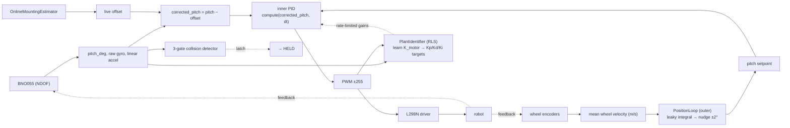
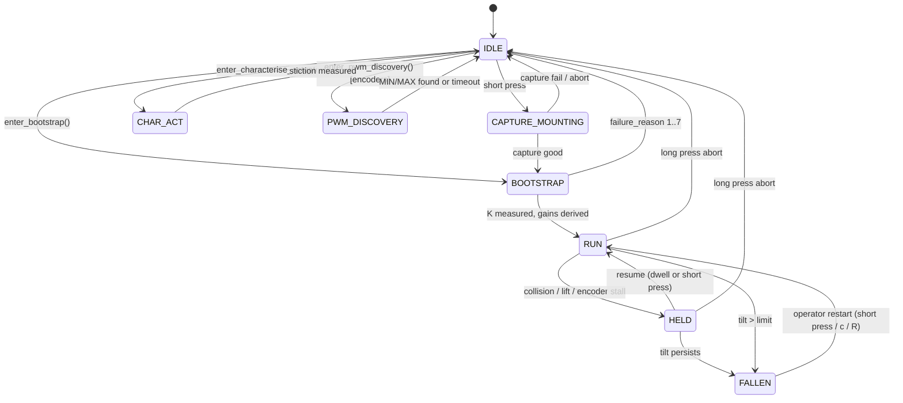
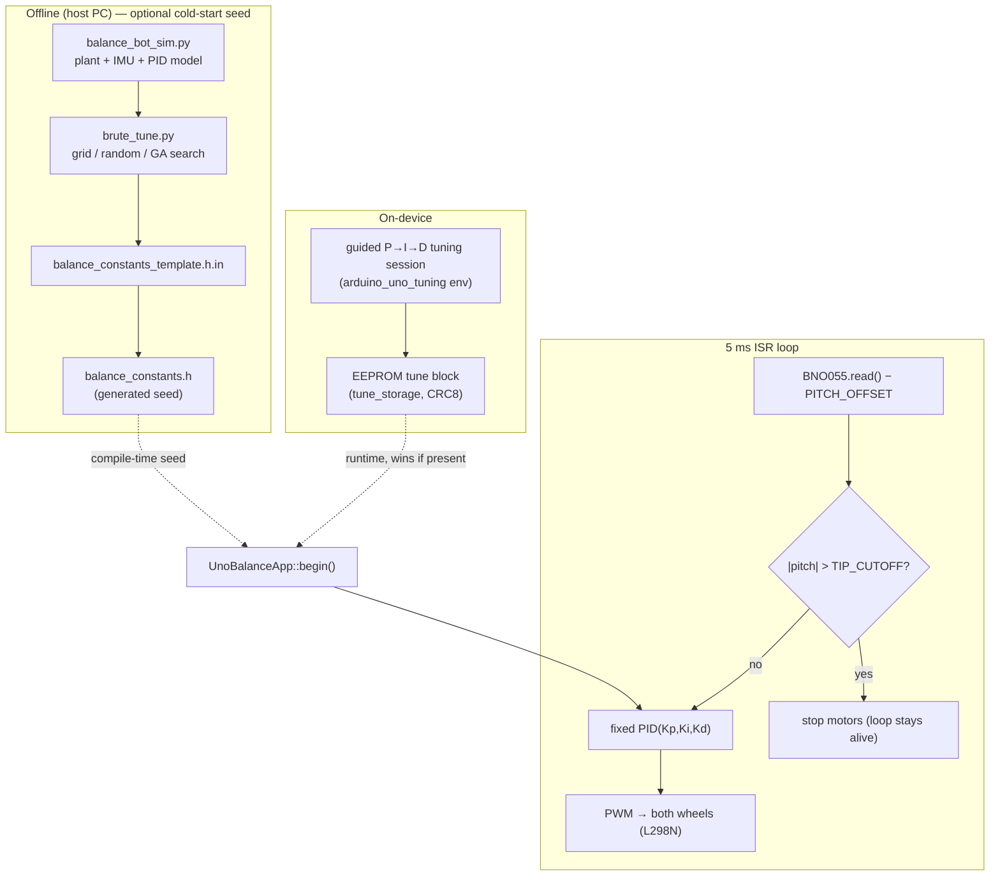
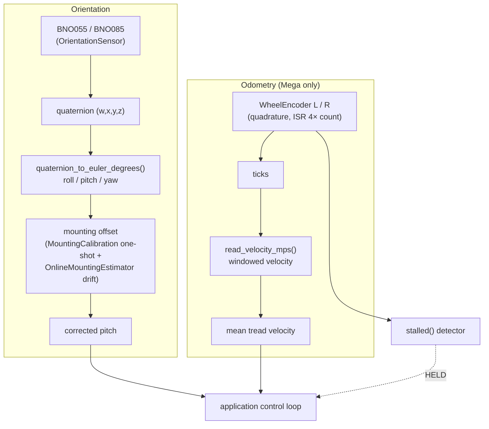
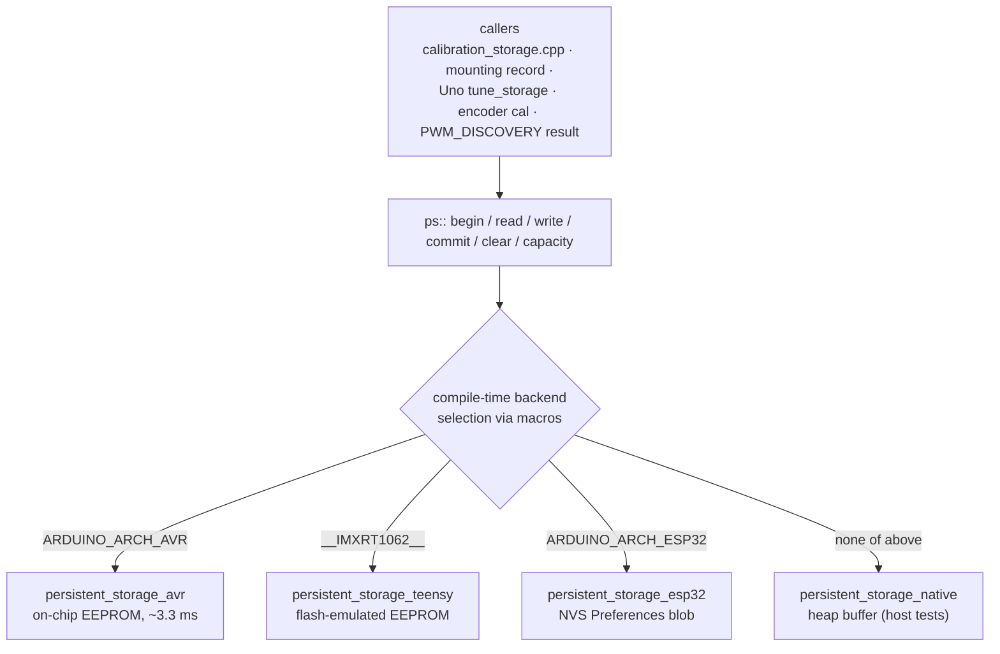

# Level 1 — Per-subsystem

Four subsystem diagrams, one per concern. Each is grounded in the cited source. If you only care about one subsystem, jump straight to it.

[← Level 0](LEVEL_0_SYSTEM_OVERVIEW.md) · [Index](INDEX.md) · [Level 2 — components →](LEVEL_2_COMPONENTS.md)

- [(a) Mega adaptive control stack](#a-mega-adaptive-control-stack)
- [(b) Uno minimal path + Python tuner](#b-uno-minimal-path--python-tuner)
- [(c) Sensor + odometry pipeline](#c-sensor--odometry-pipeline)
- [(d) Persistent-storage HAL](#d-persistent-storage-hal)

---

## (a) Mega adaptive control stack

Source: `src/applications/balancing_robot/balance_app.{h,cpp}`, `src/control/{pid_controller,plant_identifier,position_loop}.*`.

The Mega app is a state machine that **measures its own plant before balancing** and **keeps adapting while it balances**. The control law is a cascade: an outer position loop nudges the pitch setpoint; an inner PID holds pitch; an RLS identifier retunes the PID online.

### Control dataflow (RUN state)

> The outer loop and RLS are `#ifdef USE_WHEEL_ENCODERS` / always-on respectively; on a Mega build without encoders, `step_run_` keeps a fixed zero setpoint and skips the cascade.

### State machine

`BalanceAppState` (balance_app.h:88). FALLEN is sticky — only an operator command restarts. `AUTO_TUNE` exists in the enum for ABI but is unreachable (retired by BOOTSTRAP).

The BOOTSTRAP → gain-derivation internals and the PositionLoop cascade structure are detailed in [Level 2](LEVEL_2_COMPONENTS.md).

---

## (b) Uno minimal path + Python tuner

Source: `src/applications/balancing_robot_uno/{uno_balance_app,tune_storage,tuning_session}.*`, `tools/sim/{brute_tune,balance_bot_sim}.py`.

No state machine, no learning. The pipeline is literally `pitch → PID → PWM`. Gains arrive from one of two **offline / on-device** paths — never computed during flight.

> Boot precedence (uno_balance_app.h): a valid EEPROM tune block wins; otherwise the `balance_constants.h` seed is used. The brute-force tuner is *demoted to an optional seed generator* per the 2026-05-19 pivot — it is not the operational tuning loop.

---

## (c) Sensor + odometry pipeline

Source: `src/sensors/{sensor_base.h,bno055,bno085,wheel_encoder}.*`, `src/navigation/{mounting_calibration,online_mounting_estimator}.*`, `src/math/quaternion.*`.

Two independent feeds: an **orientation** feed (IMU → quaternion → pitch) and an **odometry** feed (encoders → velocity / position). They converge at the application.

> The BNO085 + GPS + EKF *navigation* fusion (Phase 3) is documented separately in [getting_started/ARCHITECTURE.md](../getting_started/ARCHITECTURE.md); the balancing apps use only the orientation feed of that stack.

---

## (d) Persistent-storage HAL

Source: `src/storage/persistent_storage.h` + `persistent_storage_{avr,teensy,esp32,native}.cpp`, `src/config/calibration_storage.*`.

A single `ps::` namespace (begin / read / write / commit / clear / capacity) with the concrete backend chosen at **compile time** by architecture macros. This is the fix for KI-1 (calibration storage previously used `<EEPROM.h>` directly, which silently failed on ESP32).

See [implementation/persistent_storage.md](../implementation/persistent_storage.md) for the per-backend timing and the `native_test` `build_src_filter` exclusion.
