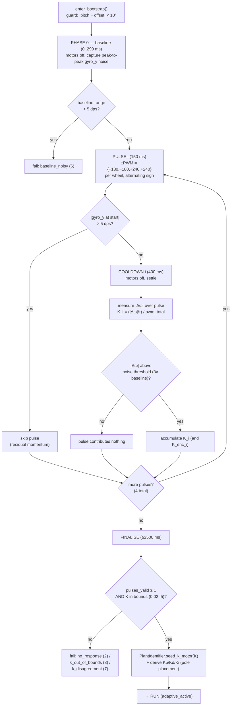
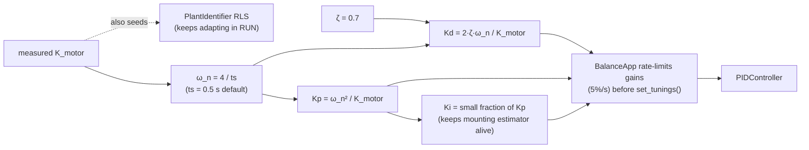
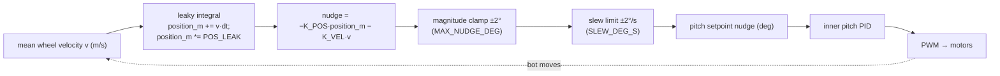
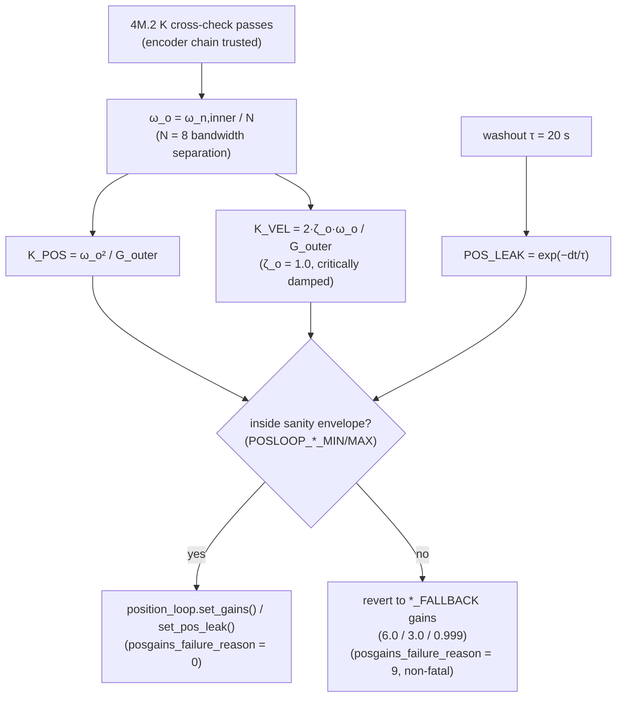

# Level 2 — Component detail

The two highest-value internals of the Mega adaptive stack. We stop here on purpose: deeper than this (per-tick RLS math, ISR/loop split, byte-level EEPROM layouts) lives in the per-component docs and the source comments, which are already thorough.

[← Level 1](LEVEL_1_SUBSYSTEMS.md) · [Index](INDEX.md)

- [(1) BOOTSTRAP — K-measurement + gain derivation](#1-bootstrap--k-measurement--gain-derivation)
- [(2) Position outer-loop cascade](#2-position-outer-loop-cascade)

---

## (1) BOOTSTRAP — K-measurement + gain derivation

Source: `src/applications/balancing_robot/balance_app.cpp` (`step_bootstrap_`, phase layout at lines 1144-1172) and `src/control/plant_identifier.h` (pole-placement mapping).

BOOTSTRAP replaces hardcoded PID gains. It fires a fixed sequence of symmetric ±PWM pulses, measures the chassis pitch-acceleration response per pulse to estimate the plant gain `K_motor`, then derives Kp/Kd/Ki in closed form before entering RUN.

### Pulse sequence + quality gates

Timeline (relative to state entry): baseline 300 ms → 4 pulses of 150 ms each separated by 400 ms cooldowns → finalise at ≥2500 ms. Pulse magnitudes are `{180, 180, 240, 240}` PWM/wheel with alternating sign.

> Why the gates exist: bench runs (2026-05-18) showed a single poisoned mean from residual momentum (`G0_MAX`) and from an operator handling the bot during baseline (`NOISE_FLOOR_MAX`). Both default to 5 dps. On Mega with encoders, a gyro-vs-encoder `K` disagreement > 30% trips `k_disagreement (7)` — evidence of wheel slip or binding. See balance_app.h:160-277.

### Pole-placement gain derivation

The plant collapses to one DoF: `α_pitch ≈ K_motor · pwm_total + g_eff · sin(pitch)`. Matching the closed-loop polynomial to a target second-order response (ω_n = 4/ts, ζ = 0.7) gives the gains directly from the measured `K_motor` (plant_identifier.h:18-31).

> The same `Kp = ω_n²/K` mapping is reused on the **outer** loop for the 4M.14 position-gain derivation (`K_POS = ω_o²/G_outer`) — see component (2). The identifier never slams the controller: it emits *targets*, the app ramps toward them.

---

## (2) Position outer-loop cascade

Source: `src/control/position_loop.{h,cpp}` and `balance_app.cpp` (`step_run_`, `derive_position_gains_`).

The cascade keeps the bot **station-keeping** instead of creeping. A slow outer loop reads wheel velocity and nudges the inner PID's pitch setpoint so the bot leans gently against its own drift.

### Structure + bandwidth separation

Key safety property: the **clamp and slew are hardcoded saturations, not loop gains** (a 2° lean ceiling keeps the outer loop inside the inner loop's linear region; the slew rate enforces the bandwidth separation analytically set by pole-placement). The *gains* `K_POS`/`K_VEL`/`POS_LEAK` are derived, not tuned.

### Where the outer-loop gains come from (4M.14)

At BOOTSTRAP finalise — after the gyro-vs-encoder K cross-check passes — `derive_position_gains_` computes the outer-loop gains in closed form, mirroring the inner-loop pole-placement.

> A rejected derivation is a *degraded success*: the bot still balances on the conservative Phase 4M.13 fallback gains (`POSLOOP_K_POS_FALLBACK` etc.). It is deliberately NOT a BOOTSTRAP abort. See position_loop.h:46-104 and balance_app.h:340-409.

---

That's the floor. For the per-tick RLS update equations, the ISR/loop split, and EEPROM byte layouts, read the source headers (`plant_identifier.h`, `balance_app.h`) — they are the authoritative, comment-heavy reference.
