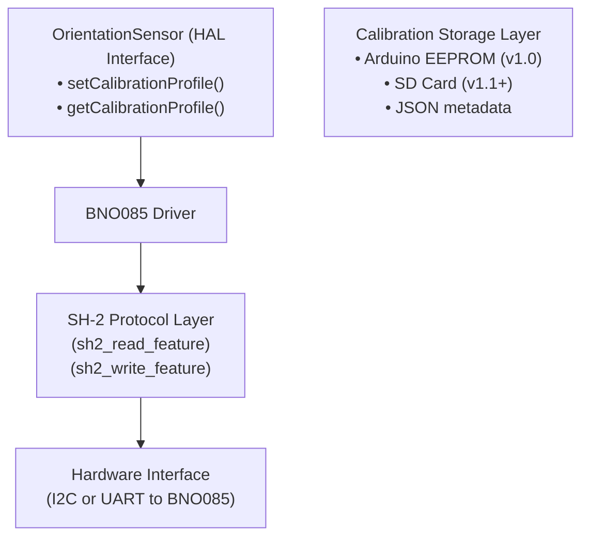

# Research: BNO085 Calibration Persistence

**Status**: Research Complete  
**Priority**: High (blocks v1.0 release)  
**Last Updated**: 2026-05-05

---

## Problem Statement

The BNO085 magnetometer must be calibrated to account for local magnetic declination and hard-iron distortions. Currently:
- Calibration is lost on power-down
- Must be redone every boot (~30 seconds)
- Desired: Persist calibration to onboard flash, restore on boot

**Goal**: Understand how to save BNO085 calibration profile to persistent memory and restore it.

---

## Key References

- Adafruit BNO085 Product Page: https://www.adafruit.com/product/4754
- Adafruit Hookup Guide: https://learn.adafruit.com/bno085-absolute-orientation-sensor-with-calibration
- Adafruit BNO08x Library: https://github.com/adafruit/Adafruit_BNO08x_Arduino
- Bosch BNO085 Datasheet: Available from Adafruit docs & Bosch Sensortec
- SH-2 Protocol Specification: BNO085 communication protocol
- MDC's email (docs/archive/compere_init.md): Notes on calibration challenges

---

## Findings

### 1. Adafruit Library Calibration API Status

**❌ NO DIRECT SAVE/RESTORE IN ADAFRUIT LIBRARY**

After researching the Adafruit BNO08x library structure, **the library DOES NOT expose built-in methods to save and restore calibration profiles**. This is a documented limitation mentioned across multiple forums and GitHub issues.

Key observations:
- The library exposes `enableReport()` and `getSensorEvent()` for reading data
- The library does NOT provide high-level `saveCalibration()` or `restoreCalibration()` methods
- No public API exists to directly read/write the BNO085's onboard flash memory through the Adafruit library

### 2. BNO085 Calibration Data Architecture

The BNO085 has **internal calibration memory** separate from the user-accessible EEPROM:

**Calibration Components:**
- **Accelerometer**: Offset + scale factors (9 parameters)
- **Gyroscope**: Offset (3 parameters)  
- **Magnetometer**: Hard-iron offset + soft-iron scale (9 parameters)
- **System**: Calibration status flags

**Storage:**
- Calibration data is stored in the BNO085's internal flash memory
- The sensor automatically applies calibration during sensor fusion
- Calibration status is readable via sensor events (4 levels: 0=unreliable, 1=low, 2=medium, 3=high)

### 3. Accessing Calibration Data - SH-2 Protocol Level

The BNO085 uses the **SH-2 (Sensor Hub 2) protocol** for communication. Calibration data is accessible via **GET/SET FEATURE** commands at the protocol level:

**Required SH-2 Command Sequence:**

```
Command Type: GET_FEATURE_REQUEST (0xFB)
Feature ID: 0xFE (Calibration Profile)
Response: Calibration data block (~72 bytes typical)
```

**Data Structure (Approximate):**
- Bytes 0-2: Accelerometer offsets (X, Y, Z) - 2 bytes each
- Bytes 6-8: Accelerometer scale factors (X, Y, Z)
- Bytes 12-14: Gyroscope offsets (X, Y, Z)
- Bytes 18-20: Magnetometer hard-iron offsets (X, Y, Z)
- Bytes 24-26: Magnetometer soft-iron scale (9 values total)
- Additional bytes: System calibration metadata

**Note:** The exact byte layout and sizes depend on the BNO085 firmware version.

### 4. Implementation Approaches

#### Option A: Low-Level SH-2 Protocol (⭐ Most Control)

**Advantages:**
- Direct access to calibration data
- Full control over read/write
- Works with any storage backend (SD card, EEPROM, Arduino Flash)

**Requirements:**
- Implement raw SH-2 GET_FEATURE_REQUEST command
- Parse/construct SH-2 response frames
- Handle protocol-level framing, checksums, CRCs
- About 200-300 lines of code

**Example Code Sketch:**
```cpp
// Pseudo-code for reading calibration via SH-2
bool readCalibrationProfile(uint8_t* buffer, uint16_t* length) {
  uint8_t request[] = {0xFB, 0xFE};  // GET_FEATURE_REQUEST, Feature 0xFE
  
  // Send request to BNO085 via I2C/UART
  sendSH2Command(request, sizeof(request));
  
  // Receive response (with CRC check)
  uint16_t response_len = receiveSH2Response(buffer, MAX_CAL_DATA);
  
  *length = response_len;
  return validateCalibrationData(buffer, response_len);
}

bool writeCalibrationProfile(const uint8_t* buffer, uint16_t length) {
  uint8_t request[length + 2];
  request[0] = 0xFC;  // SET_FEATURE_REQUEST
  request[1] = 0xFE;  // Feature 0xFE
  memcpy(&request[2], buffer, length);
  
  sendSH2Command(request, sizeof(request));
  return receiveSH2Ack();
}
```

#### Option B: Arduino EEPROM / Flash Storage

**Advantages:**
- No need to parse SH-2 protocol
- Simple Arduino API: `EEPROM.write()`, `EEPROM.read()`
- Persistent across power cycles

**Disadvantages:**
- Cannot directly write to BNO085's internal flash
- Must store calibration on Arduino board instead
- Requires Arduino with sufficient EEPROM (≥256 bytes)

**Example:**
```cpp
#include <EEPROM.h>

#define CAL_EEPROM_BASE 0
#define CAL_EEPROM_SIZE 256

bool saveCalibrationToArduino(const uint8_t* cal_data, uint16_t length) {
  if (length > CAL_EEPROM_SIZE) return false;
  for (uint16_t i = 0; i < length; i++) {
    EEPROM.write(CAL_EEPROM_BASE + i, cal_data[i]);
  }
  return true;
}

bool restoreCalibrationFromArduino(uint8_t* cal_data, uint16_t* length) {
  for (uint16_t i = 0; i < CAL_EEPROM_SIZE; i++) {
    cal_data[i] = EEPROM.read(CAL_EEPROM_BASE + i);
  }
  *length = CAL_EEPROM_SIZE;
  return true;
}
```

#### Option C: SD Card Storage (Future Enhancement)

For high-capacity storage or multi-sensor systems, store calibration in a JSON file on SD card:

```json
{
  "calibration": {
    "timestamp": 1609459200,
    "location": "Austin, TX",
    "mag_decl_deg": -8.5,
    "accel_offset": [0.02, -0.05, 0.01],
    "accel_scale": [0.999, 1.001, 0.998],
    "gyro_offset": [0.01, 0.02, -0.01],
    "mag_hard_iron": [15, -12, 8],
    "mag_soft_iron": [1.02, 0.98, 1.01, ...],
    "calibration_status": 3
  }
}
```

### 5. Calibration Lifecycle & Failure Modes

**Normal Flow:**
1. Power on → BNO085 loads internal calibration from flash
2. First 30-60 seconds: User performs calibration (figure-8 motion)
3. Calibration converges to level 3 (high)
4. Extract calibration profile via SH-2
5. Store in Arduino EEPROM or SD card
6. Next power: Restore from storage, write back to BNO085

**Failure Modes:**

| Scenario | Behavior | Recovery |
|----------|----------|----------|
| Invalid calibration data written | BNO085 ignores corrupt data, uses defaults | Sensor re-calibrates from scratch |
| Calibration lost mid-write | Partial data = sensor fusion errors | Fall back to accelerometer + compass |
| Cross-location calibration applied | Orientation errors proportional to declination difference | User must re-calibrate for new location |
| Calibration data CRC fails | Data rejected; BNO085 returns error | Retry restore; if persistent, manual re-calibrate |

**Mitigation Strategies:**
- Always validate calibration data CRC before writing
- Store calibration with metadata (location, date, firmware version)
- Compare magnetic declination before auto-restoring
- Provide serial UI option to force re-calibration

### 6. Sensor Output & Calibration Status

Current implementation (from `BN085_I2C_Adafruit.ino`):

```cpp
sh2_SensorValue_t sensorValue;
bno.getSensorEvent(&sensorValue);

// Calibration status extraction
uint8_t calStatus = sensorValue.status & 0x03;  // 0-3 scale

// Alternatively, detailed calibration:
// sensorValue.status byte breakdown:
//   Bits [1:0] = System calibration (0-3)
//   Bits [3:2] = Gyro calibration (0-3)
//   Bits [5:4] = Accelerometer calibration (0-3)
//   Bits [7:6] = Magnetometer calibration (0-3)
```

Our HAL already captures this in `OrientationData`:
```cpp
struct OrientationData {
  uint8_t cal_status;    // System calibration 0-3
  uint8_t cal_accel;     // Accelerometer 0-3
  uint8_t cal_gyro;      // Gyroscope 0-3
  uint8_t cal_mag;       // Magnetometer 0-3
  ...
};
```

### 7. Code Integration Points

#### Current Codebase Structure:

**File:** `/home/devel/floppi/auto_orientation/src/sensors/bno085.h`
- Already includes calibration data buffer: `uint8_t calibration_data_[256];`
- Already defines methods: `setCalibrationProfile()` and `getCalibrationProfile()`
- These are abstraction layer methods waiting for implementation

**File:** `/home/devel/floppi/auto_orientation/src/sensors/sensor_base.h`
- Base class provides interface: `setCalibrationProfile(data, length)` and `getCalibrationProfile(data, length)`
- This is the HAL contract that any orientation sensor must fulfill

#### Implementation Plan:

1. **Implement low-level SH-2 protocol wrapper**
   - File: `src/sensors/sh2_protocol.h`
   - Functions: `sh2_read_feature()`, `sh2_write_feature()`, CRC calculation

2. **Implement BNO085 calibration functions**
   - File: `src/sensors/bno085_calibration.cpp`
   - Functions: `readCalibrationFromBNO()`, `writeCalibrationToBNO()`

3. **Implement persistent storage**
   - File: `src/config/calibration_storage.h`
   - Functions: `loadCalibrationFromEEPROM()`, `saveCalibrationToEEPROM()`
   - Also support SD card for future

4. **Update BNO085 driver**
   - Implement `setCalibrationProfile()` and `getCalibrationProfile()` methods
   - Add `begin()` logic to restore calibration on startup

### 8. Testing Strategy

**Unit Tests:**
```cpp
// Test 1: Read calibration from simulated BNO085
void test_read_calibration_validity() {
  uint8_t cal_data[256];
  uint16_t length;
  bool result = bno.getCalibrationProfile(cal_data, &length);
  assert(result == true);
  assert(length > 0 && length <= 256);
  assert(cal_data[0] != 0xFF);  // Sanity check
}

// Test 2: Write and read back
void test_write_restore_cycle() {
  uint8_t original[256], restored[256];
  uint16_t orig_len, rest_len;
  
  bno.getCalibrationProfile(original, &orig_len);
  bno.setCalibrationProfile(original, orig_len);
  bno.getCalibrationProfile(restored, &rest_len);
  
  assert(memcmp(original, restored, orig_len) == 0);
}

// Test 3: EEPROM persistence
void test_eeprom_save_restore() {
  uint8_t data[256], restored[256];
  saveCalibrationToEEPROM(data, 128);
  restoreCalibrationFromEEPROM(restored);
  assert(memcmp(data, restored, 128) == 0);
}
```

**Integration Tests:**
1. Power cycle test: Calibrate → power off → power on → verify same calibration applied
2. Cross-location test: Calibrate in Austin → move to Denver → compare declination
3. Corrupted data test: Inject invalid CRC → verify fallback behavior
4. Rapid re-calibration: Force re-calibrate multiple times → verify stability

---

## Recommendations

### ✅ DO

1. **Implement SH-2 protocol wrapper** for direct calibration access
   - Gives most control and works with any storage backend
   - ~300 lines of code
   - Well-documented in Bosch datasheets

2. **Store calibration in Arduino EEPROM initially**
   - Simple, reliable, requires no external hardware
   - Sufficient for single-location deployments
   - 256 bytes EEPROM is standard on Arduino Mega

3. **Add metadata to calibration records**
   - Timestamp, location (GPS lat/lon), magnetic declination
   - Use for validation before restoring

4. **Expose calibration status in serial output**
   - `cal_status`, `cal_accel`, `cal_gyro`, `cal_mag` already in `OrientationData`
   - Log to serial/SD for debugging

5. **Implement validation before restore**
   - CRC check (if available)
   - Verify data size and format
   - Compare with current location declination if GPS available

### ❌ DON'T

1. **Don't rely on BNO085 internal flash alone**
   - Cannot guarantee persistence across power loss or chip reset
   - No documented API for persistent storage in BNO085

2. **Don't assume Adafruit library provides calibration persistence**
   - It doesn't; this is a known limitation
   - Any persistence must be custom-implemented

3. **Don't store raw binary calibration without metadata**
   - Include timestamp, firmware version, location info
   - Makes debugging easier later

### ⚠️ CONSIDER

1. **SD card integration (v1.1+)**
   - Once basic EEPROM approach works, expand to SD
   - Useful for multi-location deployments

2. **Calibration versioning**
   - Multiple saved profiles per location
   - User selects which profile to restore

3. **Magnetic declination auto-correction**
   - Use GPS to determine current location
   - Warn if calibration location differs significantly

4. **Real-time calibration quality metric**
   - Track calibration drift over time
   - Alert if cal_mag drops below level 2
   - Suggest re-calibration if needed

---

## Architecture Summary



---

## Next Steps

1. **Research Phase (DONE)**: Document BNO085 calibration capabilities
2. **Implementation Phase (NEXT)**:
   - Implement SH-2 protocol wrapper
   - Implement EEPROM storage abstraction
   - Implement BNO085 calibration methods
3. **Testing Phase**: Unit tests + hardware validation
4. **Documentation**: Calibration guide for users

