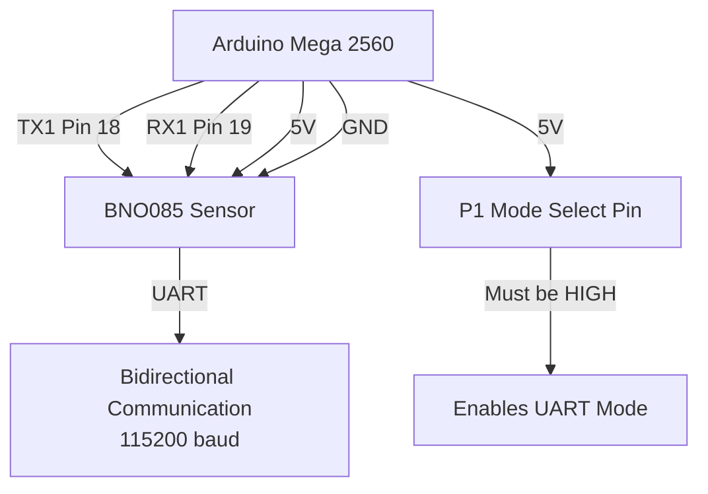
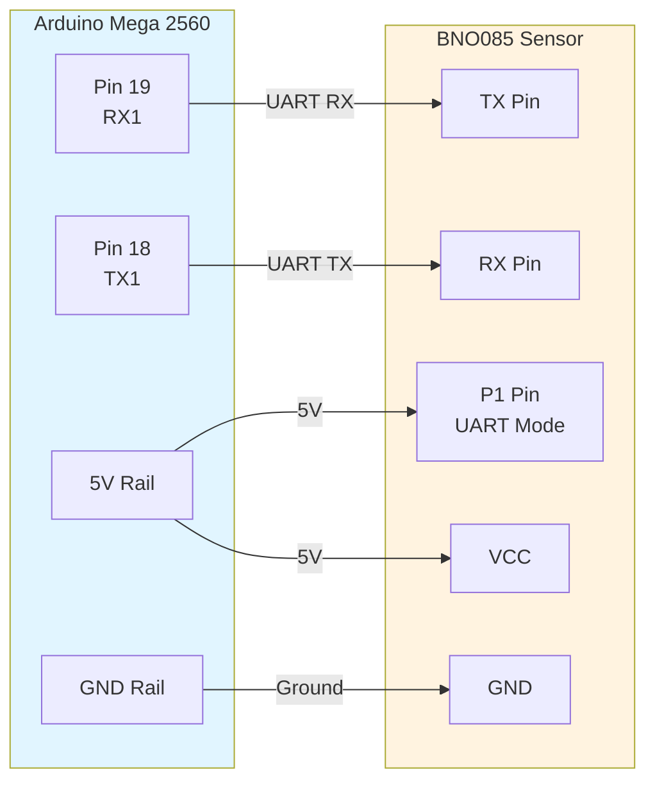
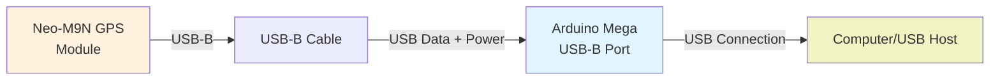
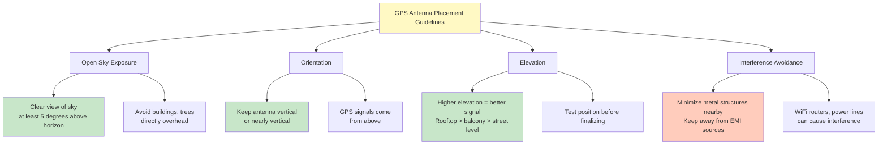
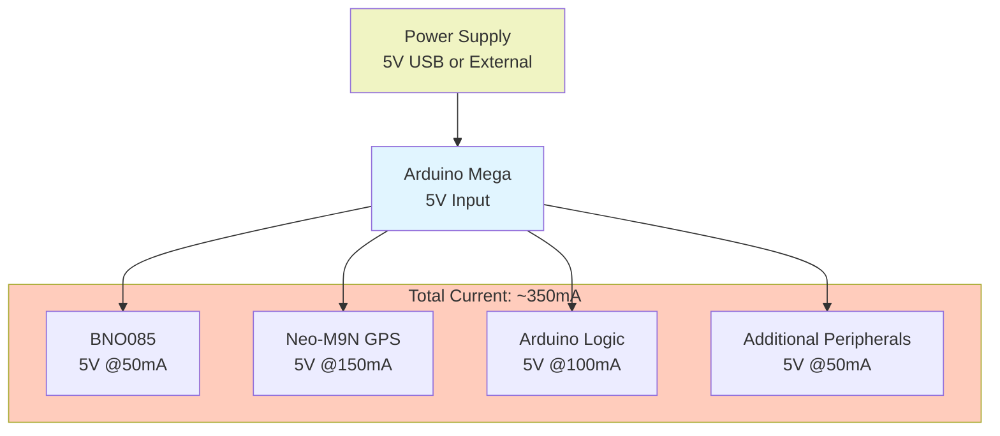
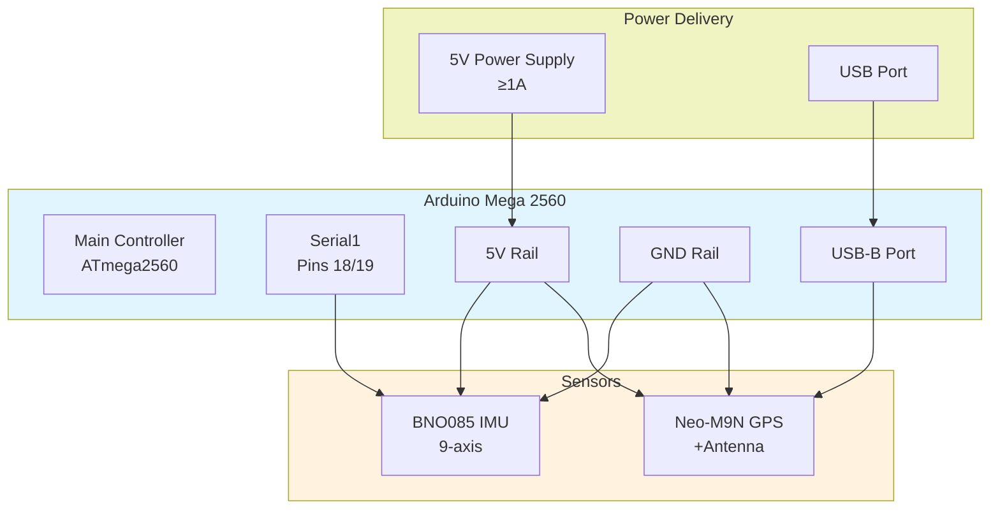

# Hardware Setup Guide

This guide documents the complete hardware configuration for the Auto Orientation system, including the BNO085 IMU sensor, GPS receiver, and power connections.

## System Overview

The Auto Orientation system uses an Arduino Mega 2560 as the main controller with two primary external sensors:
- **BNO085**: 9-axis IMU (Inertial Measurement Unit) via UART
- **Neo-M9N**: GPS receiver via USB

## BNO085 UART Connection

The BNO085 sensor communicates with the Arduino Mega via UART (Serial1) using a special UART mode that requires the P1 pin to be set HIGH (5V).

### Wiring Diagram



### Pin Mapping Table

| BNO085 Pin | Arduino Mega Pin | Purpose | Voltage |
|---|---|---|---|
| TX | 19 (RX1) | UART receive from sensor | 3.3V |
| RX | 18 (TX1) | UART transmit to sensor | 5V tolerant |
| P1 | 5V (via resistor) | UART mode enable | 5V |
| GND | GND | Ground reference | 0V |
| VCC | 5V | Power supply | 5V |

### Detailed Connection Diagram



### Hardware Requirements

- **Voltage Level Shifter**: Optional but recommended
  - BNO085 TX outputs 3.3V, Arduino can tolerate this on RX1
  - Arduino TX1 outputs 5V, BNO085 RX is 5V tolerant
  - For maximum reliability, use a 3.3V ↔ 5V level shifter

- **Resistor for P1 Pin**: 
  - 1kΩ to 10kΩ pullup resistor connecting P1 to 5V
  - Ensures reliable UART mode initialization
  - Alternative: Connect P1 directly to 5V via Arduino GPIO pin set HIGH

- **Capacitors**:
  - 100μF electrolytic capacitor between VCC and GND (for power supply stability)
  - 10μF electrolytic capacitor for local decoupling

### Serial Configuration in Code

```cpp
// Serial1 configuration for BNO085
#define BAUD_RATE 115200

void setup() {
    Serial1.begin(BAUD_RATE);  // Arduino Mega UART1 (pins 18/19)
    delay(100);
}
```

## GPS (Neo-M9N) Connection

The Neo-M9N GPS receiver connects via USB-B to the Arduino Mega's USB-B port. This provides both power and data connectivity.

### USB Connection Diagram



### USB Connection Specifications

| Component | Specification | Notes |
|---|---|---|
| **Connector** | USB-B Mini or Micro | Depends on Neo-M9N variant |
| **Data Lines** | USB 2.0 High-Speed | 480 Mbps (more than sufficient) |
| **Power Supply** | 5V ± 5% | Drawn from Arduino USB port |
| **Current Draw** | ~100-200 mA | Typical operation, antenna powered |
| **Baud Rate** | 9600 baud (NMEA) | Default configuration |

### Antenna Placement Recommendations



### Serial Configuration for GPS

```cpp
// GPS Serial Configuration
// Neo-M9N connects via USB to Arduino USB port
// Auto-detected as COM port on Windows, /dev/ttyACM0 on Linux

// For direct UART connection (if available):
// Serial3 can be used for Neo-M9N UART output (pins 14/15)
#define GPS_BAUD_RATE 9600  // Standard NMEA output rate
```

## Power Distribution

### Power Requirements Summary



### Power Supply Specifications

| Component | Voltage | Max Current | Notes |
|---|---|---|---|
| **Arduino Mega** | 5V | 500 mA | Via USB or barrel jack |
| **BNO085 Sensor** | 5V | 50 mA | UART mode operation |
| **Neo-M9N GPS** | 5V | 150-200 mA | Includes antenna power |
| **Total System** | 5V | ~350 mA | Recommended 1A+ supply for headroom |

### Recommended Power Sources

1. **USB Power**: 
   - Standard USB 2.0 can provide 500mA
   - USB 3.0 can provide 900mA
   - Sufficient for basic operation

2. **External Supply**:
   - Arduino barrel jack (5.5mm outer, 2.1mm inner)
   - 5V regulated power supply with 1A+ capacity
   - Recommended for outdoor/extended operation

3. **Power Management**:
   - Use powered USB hubs for the Neo-M9N
   - Keep separate power supplies for Arduino and sensors if possible
   - Monitor for brownouts or insufficient power symptoms

## Complete System Wiring Diagram



## Troubleshooting Guide

### BNO085 FAILED - Initialization Error

**Problem**: Sensor fails to initialize or no communication detected

**Checklist**:
- [ ] Verify P1 pin is connected to 5V (NOT GND)
  - This is the most common mistake!
  - P1 = GND means IMU mode, not UART mode
  - Verify continuity from P1 to 5V rail
- [ ] Check RX1 (pin 19) connected to BNO085 TX
- [ ] Check TX1 (pin 18) connected to BNO085 RX
- [ ] Verify all GND connections secure
- [ ] Check 5V supply to BNO085 VCC and P1

**Recovery**:
1. Power off Arduino
2. Verify all connections with multimeter
3. Check P1 voltage (should read 5V when powered)
4. Recompile and upload firmware
5. Monitor Serial output for initialization messages

### No UART Data Received

**Problem**: Serial1 shows no data or garbled characters

**Checklist**:
- [ ] Confirm Serial1 pins (18/19) connections
- [ ] Verify baud rate is 115200
- [ ] Check for loose or reversed wires
- [ ] Test with oscilloscope if available
- [ ] Try level shifter if using long cables (>1m)

**Code to Test**:
```cpp
void setup() {
    Serial.begin(9600);
    Serial1.begin(115200);
    delay(100);
}

void loop() {
    if (Serial1.available()) {
        Serial.write(Serial1.read());
    }
    delay(10);
}
```

### Baud Rate Issues

**Problem**: Data received but corrupted or unreadable

**Solution**:
- Verify Serial1.begin() uses 115200 baud
- Check BNO085 firmware configuration (should be 115200)
- If using external debugger, ensure matching baud rate
- Test with simpler baud rates (9600) if suspected

### GPS Not Responding

**Problem**: GPS module not detected or no fix

**Checklist**:
- [ ] Verify USB cable is properly seated in Arduino USB port
- [ ] Check USB cable is data-capable (not power-only)
- [ ] Confirm antenna is connected and positioned outside
- [ ] Wait 30+ seconds for initial acquisition
- [ ] Check for correct COM port in IDE serial monitor
- [ ] Try different USB port on computer
- [ ] Verify antenna has clear sky view (5+ degrees above horizon)
- [ ] Keep antenna away from RF interference

**GPS Configuration Check**:
```
USB Device Manager (Windows) or lsusb (Linux)
- Should appear as "CH340" or similar serial device
- Note the COM port assigned
- Verify no device conflicts
```

### Power Supply Issues

**Problem**: Intermittent failures, brownouts, or resets

**Symptoms**:
- Arduino resets unexpectedly
- Sensors disconnect intermittently
- System unstable under load

**Solutions**:
- [ ] Upgrade to higher capacity power supply (1A+)
- [ ] Add larger capacitor (220-470μF) near Arduino 5V input
- [ ] Check for voltage sag under load (should stay >4.8V)
- [ ] Verify USB cable quality and length
- [ ] Use powered USB hub if available
- [ ] Separate power supplies for Arduino and sensors if possible

## Assembly Checklist

Before powering on the complete system:

- [ ] **P1 Pin Configuration**
  - [ ] P1 pin is connected to 5V (HIGH)
  - [ ] Continuity verified with multimeter
  - [ ] NOT connected to GND

- [ ] **UART Wiring**
  - [ ] RX1 (Pin 19) connected to BNO085 TX
  - [ ] TX1 (Pin 18) connected to BNO085 RX
  - [ ] All connections are secure and not reversed

- [ ] **Power Connections**
  - [ ] BNO085 VCC connected to 5V rail
  - [ ] BNO085 GND connected to GND rail
  - [ ] Arduino GND and 5V rails properly connected
  - [ ] No shorts between VCC and GND

- [ ] **GPS Setup**
  - [ ] USB-B cable connected between Neo-M9N and Arduino
  - [ ] Cable is properly seated in both connectors
  - [ ] Antenna connected and positioned vertically
  - [ ] Antenna has clear sky exposure (outdoor, elevated)

- [ ] **Firmware and Code**
  - [ ] Baud rate set to 115200 for Serial1
  - [ ] Code properly initializes Serial1
  - [ ] GPS serial configuration correct (9600 baud if UART)
  - [ ] Firmware uploaded without errors

- [ ] **Initial Power-On**
  - [ ] Use limited current supply or current-limiting PSU first
  - [ ] Monitor for excessive current draw
  - [ ] Check for shorts or voltage issues
  - [ ] Observe initialization messages on Serial output
  - [ ] Verify both sensors respond correctly

## Testing Procedures

### BNO085 Quick Test

```cpp
#include <Wire.h>
#include <Adafruit_BNO085.h>

Adafruit_BNO085 bno;

void setup() {
    Serial.begin(9600);
    Serial1.begin(115200);
    
    if (!bno.begin(Adafruit_BNO085::OPERATION_MODE_NDOF_FMV)) {
        Serial.println("BNO085 FAILED");
        while (1);
    }
    
    Serial.println("BNO085 INITIALIZED");
}

void loop() {
    // Read and display sensor data
    // Verify P1 is HIGH and UART data flowing
}
```

### GPS Quick Test

```cpp
void setup() {
    Serial.begin(9600);
    delay(2000);
}

void loop() {
    if (Serial.available()) {
        Serial.println(Serial.readString());
    }
    delay(100);
}
```

### Multimeter Verification

1. **Measure P1 Voltage**:
   - Set multimeter to DC Voltage
   - Probe between P1 pin and GND
   - Should read 4.8V - 5.2V when powered
   - If reads 0V or less, check connection

2. **Measure 5V Rail**:
   - Probe between 5V rail and GND
   - Should read 4.8V - 5.2V under load
   - If drops below 4.5V, power supply is insufficient

3. **Check Continuity**:
   - Set multimeter to continuity mode
   - Verify each connection for shorts/opens
   - Listen for beep on good connections

## Safety Considerations

- **Power Supply**: Always use regulated 5V supply, never exceed 6V
- **Short Circuits**: Double-check wiring before powering on
- **USB Safety**: Use proper USB cables, check for damage
- **Antenna**: Keep GPS antenna away from eyes when pointed upward
- **Long Cables**: Use level shifters for runs >1 meter
- **Overheating**: Monitor Arduino and sensor temperatures
- **Moisture**: Protect all components from water and humidity

## Next Steps

1. Assemble hardware following this guide
2. Complete all items in Assembly Checklist
3. Run Testing Procedures to verify each component
4. Upload firmware to Arduino
5. Monitor serial output for initialization
6. Verify sensor data output in test code
7. Proceed to sensor calibration procedures

---

**Last Updated**: 2025-05
**Document Version**: 1.0
