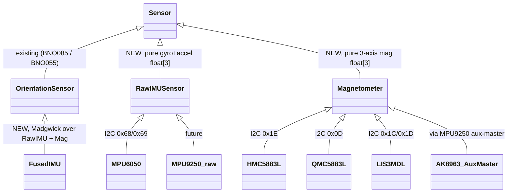

# MPU6050 + External Magnetometer 9-DOF Pipeline

**Status:** Research / design proposal
**Author:** Architecture review, 2026-05-12
**Targets:** `auto_orientation/src/sensors/` — new `mpu6050.{h,cpp}`, `external_magnetometer.{h,cpp}`, `fused_imu.{h,cpp}`
**Related:** [`bno055_driver_and_multi_imu_strategy.md`](bno055_driver_and_multi_imu_strategy.md), [`mpu6050-yaw-estimation.md`](../archive/mpu6050-yaw-estimation.md)

---

## Recommendation Summary

- **MPU9250 (preferred) or MPU6050 + QMC5883L with 9-DOF Madgwick.** Madgwick beats Mahony here because its single `beta` knob maps cleanly to "gyro-trust vs accel/mag-trust," converges in ~5 s vs Mahony's ~15 s, and we already do gyro-bias offline so Mahony's integrator buys us nothing.
- **Hide fusion behind a `FusedIMU` adapter that implements the existing `OrientationSensor` vtable.** `main.cpp`, `sensor_output_manager`, and `calibration_storage` consume it identically to `BNO085`. Underneath, `FusedIMU` composes a `RawIMUSensor` + `Magnetometer` and runs Madgwick at 100 Hz (ESP32) / 50 Hz (Mega).
- **Capture magnetometer samples in firmware, fit ellipsoid on host, upload 48 B back.** Same UX as the existing BNO085 calibration profile dance, plus one Python step. This is the value-add BNO055/BNO085 do internally — we are replicating it for $5 of silicon.

---

## 1. Sensor Stack Options

| Stack | Cost (USD) | Bus | On-chip fusion | Current (mA) | Where found |
|---|---|---|---|---|---|
| MPU6050 + HMC5883L | $4–6 | I2C 0x68 + 0x1E | none | ~5 | GY-87/86 combos. **Often counterfeit** — Honeywell EOL'd HMC5883L in 2016; most AliExpress "HMC5883L" are silently relabeled QMC5883L. |
| MPU6050 + QMC5883L | $3–5 | I2C 0x68 + 0x0D | none | ~4 | GY-271, GY-87 v3. Modern, authentic, different register map from HMC (control at 0x09/0x0A). |
| MPU9250 | $5–8 | I2C 0x68; AK8963 at 0x0C via aux-master | DMP can do 6-DOF | ~3.5 | GY-9250. **Discontinued 2018** but ubiquitous; moderate counterfeit risk. |
| ICM-20948 | $8–12 | I2C or SPI; AK09916 at 0x0C via aux-master | DMP can do 9-DOF (NDA docs) | ~2.5 | Adafruit, SparkFun. Modern MPU9250 successor. |
| LSM9DS1 | $10–15 | I2C two addrs (0x6B + 0x1E) | none | ~5 | Adafruit, SparkFun. Two dies in one package. |
| LIS3MDL (mag only) | $4–6 | I2C/SPI | n/a | 0.27 | Pair with anything. Higher quality than HMC/QMC; ±0.4 mG. |

**Budget pick:** MPU6050 + QMC5883L (~$4, two I2C addrs, well-documented). **Mid-tier:** ICM-20948 (one chip, in-stock at Mouser). **Avoid** standalone HMC5883L from anywhere except Adafruit.

---

## 2. Why Madgwick over Mahony

Both filters (Madgwick 2010 MSc thesis, Bristol; Mahony et al. 2008, *IEEE TAC* 53(5)) consume gyro+accel(+mag) and emit a unit quaternion.

| | Madgwick | Mahony |
|---|---|---|
| Math | Gradient descent on quaternion error | PI controller on SO(3) cross product |
| Knobs | 1 (`beta`) | 2 (`Kp`, `Ki`) |
| Cold-start convergence | ~5 s @ `beta=0.1` | ~15 s at typical gains |
| Bias estimation | none (assumed upstream) | yes, via `Ki` integral |
| FLOPs/step (9-DOF) | ~270 mul, ~190 add, 2 `invSqrt` | ~300 mul, ~220 add, 1 `invSqrt` |

**Recommendation: Madgwick.** Three reasons: (1) `beta` is a single intuitive knob a non-expert can sweep; Mahony's `Kp`/`Ki` interaction is opaque and the integrator causes hard-to-debug drift if mis-tuned. (2) We already estimate gyro bias offline and store it in EEPROM — Mahony's online bias estimator duplicates and can fight that. (3) Reference code already exists in-tree at `flight_controller/src/imu.cpp:198` (`Madgwick6DOF`); the 9-DOF variant is in the same paper §3.6. Direct port saves ~4 hours.

---

## 3. Driver Architecture

Three new files, two new base classes; the existing `OrientationSensor` vtable is preserved end-to-end.

`RawIMUSensor` exposes `readGyro(float[3])` (rad/s, bias-corrected), `readAccel(float[3])`, and `setGyroBias/setAccelBias`. `Magnetometer` exposes `readField(float[3])` returning calibrated µT (hard+soft iron applied inside) and `setHardIron/setSoftIron`. `FusedIMU` takes pointers to one `RawIMUSensor` and (optionally) one `Magnetometer`; with both it runs 9-DOF Madgwick, with just the IMU it falls back to 6-DOF. **Composition, not aggregation** — sensors are owned by `main.cpp` and may be shared. Mounting quaternion and declination are applied inside `FusedIMU::read()`, so the published `OrientationData.yaw_deg` is already true-north.

---

## 4. Magnetometer Calibration

Two distortion sources need correcting:

- **Hard iron** (additive): nearby permanent magnetism — screws, speakers, battery hardware. Shifts the sphere of mag samples off origin. Subtract a 3-vector offset.
- **Soft iron** (multiplicative): ferromagnetic material that bends the local field — steel brackets, motor stators. Squashes the sphere into an ellipsoid. Correct with a 3×3 matrix (inverse square root of the ellipsoid's covariance).

Procedure: user rotates device through ≥500 orientations covering both hemispheres. Firmware streams raw `(mx, my, mz)`. Fit ellipsoid `Ax² + By² + … + Iz = 1`, extract center and shape.

| Method | Pros | Cons | Recommend? |
|---|---|---|---|
| Online adaptive (Renaudin 2010, *J. Sensors* art. 967245) | No setup ritual; tracks slow drift | Needs minutes of varied motion; 9×9 SVD impossible on 2 KB AVR SRAM | ESP32 only, optional second pass |
| Offline / host fit | Robust SVD; visually inspectable; reproducible | Needs a Python step | **Yes — workhorse** |
| Manufacturer firmware (BNO055/BNO085) | Zero user effort | Black-box; costs $15–25/unit | This is what we're replicating in software |

**Recommendation: hybrid offline.** Firmware `calibrate-mag` command streams 1000 raw samples while user rotates. Host script `tools/mag_calibration_fit.py` (new) runs `scipy.optimize.least_squares`, prints 48 B hex (12 B offset + 36 B matrix). Firmware `set-mag-cal <hex>` accepts and persists. Vendor an MIT-licensed implementation of Renaudin's algorithm under `tools/` (e.g. PyPI `calibrate-imu`).

---

## 5. EEPROM/NVS Calibration Blob

Existing `calibration_storage.cpp` reserves 256 B with a 4-byte header (marker `0xCA`, length, version, CRC8) and 252 B payload. Our MPU+mag payload is ~93 B — fits with 159 B headroom.

| Offset | Size | Field | Notes |
|---|---|---|---|
| 0 | 1 | sensor_id | `0x60` = MPU6050+mag (distinguish from `0x85` BNO085, `0x55` BNO055) |
| 1 | 3 | reserved | 4-byte alignment pad |
| 4 | 12 | gyro_bias[3] | float32, rad/s, sensor frame |
| 16 | 12 | accel_bias[3] | float32, m/s², sensor frame |
| 28 | 12 | mag_hard_iron[3] | float32, µT |
| 40 | 36 | mag_soft_iron[9] | float32, row-major 3×3 |
| 76 | 16 | mounting_quat[4] | float32, [w,x,y,z], installed→body |
| 92 | 4 | mag_declination_deg | float32, east-positive |
| **96** | | **payload total** | + 4 B header = 100 B in EEPROM |

Use the sensor-id tag (see [BNO055 strategy doc §6](bno055_driver_and_multi_imu_strategy.md)) to prevent loading a BNO085 blob into the MPU+mag driver after a hardware swap. On ESP32 use the `Preferences`-backed `persistent_storage` HAL proposed there — **not** the silent-failing deprecated `<EEPROM.h>` wrapper.

---

## 6. Magnetic Declination + WMM

Absolute true-north heading needs local declination. Existing `magnetic_declination.h` exposes the API but the implementation is a stub. Three back-ends:

| Approach | Flash | Accuracy | Needs GPS | AVR | ESP32 |
|---|---|---|---|---|---|
| (a) Embedded WMM-2025 spherical-harmonic coefficients | ~3–4 KB + math | ±0.5° anywhere | yes | wants double, too tight | yes |
| (b) Major-city lookup + lerp (50 cities) | ~600 B | ±2–5° near city, ±10° mid-ocean | yes | works | OK but (a) better |
| (c) User-configured constant in EEPROM | 4 B | perfect at cal site; 0% if you move | no | yes | yes |

**Recommendation: (c) on AVR, (a) on ESP32.** A balance robot does not switch continents between power cycles; (c) is what the schema's `mag_declination_deg` field is for. On ESP32 we already have GPS and flash to spare, so wire up WMM-2025 coefficients (NOAA NCEI, public-domain ASCII). Validate against NOAA's online calculator at 5–10 known points before shipping.

---

## 7. CPU Budget

Per Madgwick 2010 §7.2, 9-DOF needs ~277 mul + ~190 add + 2 `invSqrt`/step. On AVR Mega (16 MHz, no FPU) with `avr-gcc` soft-float: mul ≈ 14 µs, add ≈ 10 µs, naive `1.0f/sqrtf` ≈ 80 µs, Quake fast-invsqrt ≈ 12 µs (acceptable precision — Madgwick himself uses it).

- 277 × 14 µs ≈ 3.9 ms
- 190 × 10 µs ≈ 1.9 ms
- 2 × 12 µs ≈ 0.024 ms

**≈ 5.8 ms per Madgwick step on Mega**, 58% of a 10 ms (100 Hz) budget. Add I2C (~1 ms total for MPU+mag at 400 kHz) and serial (~0.5 ms) → ~7.5 ms used, ~2.5 ms left for application code. Too tight.

**Recommendation: 50 Hz on Mega, 100 Hz on Teensy/ESP32.** 50 Hz is plenty for a balance robot (mechanical bandwidth ~5 Hz; 10× oversampling is textbook). Quadcopters need 200 Hz+ — Teensy/ESP32 territory anyway. Make the rate a `USE_FUSION_RATE_HZ` define so each build env picks. On ESP32 with hardware FPU Madgwick is ~80 µs/step — 1 kHz is feasible (but mag tops out at 75–220 Hz depending on chip, so 100–200 Hz is the realistic ceiling).

---

## 8. Failure Modes

| Failure | Symptom | Detector | Handling |
|---|---|---|---|
| Mag reads NaN (I2C glitch, unplugged) | Quaternion → (NaN, NaN, NaN, NaN) | `isnan()` on each axis per read | Skip mag term that step → 6-DOF cycle; if persistent >1 s, set `cal_mag = 0`, report degraded |
| Magnetic interference (motor on, steel table) | Yaw swings 10–60°; pitch/roll fine | `|mag|` vs calibrated norm (~50 µT mid-latitudes); deviation >25% → corrupted | Reduce Madgwick mag weight (or skip) for that step; resume when norm returns; log |
| Calibration drift (new accessory near sensor) | Yaw consistently ~20° off true | Horizontal-projected mag magnitude stddev over 60 s grows | Surface "recalibrate" warning; do **not** auto-recalibrate (safety) |
| GPS lost, IMU+mag still up | Position dead-reckons; **orientation stays absolute** because mag still gives true north | GPS fix-quality drop | `position_valid = false`; orientation keeps publishing — this is the killer advantage over pure 6-DOF |

---

## 9. Build Environments

Two new `platformio.ini` entries, modeled after the BNO055 envs:

| Env name | Board | Build flags (sketch) | Purpose |
|---|---|---|---|
| `arduino_mega_mpu6050_hmc5883` | `megaatmega2560` | `USE_MPU6050_ONLY`, `USE_HMC5883L`, `USE_FUSION_RATE_HZ=50`, `USE_MAG_DECL_CONSTANT` | Budget config; $4 sensors; 50 Hz; classroom balance-robot demos |
| `esp32_mpu9250` | `esp32dev` | `USE_MPU9250_ONLY`, `USE_FUSION_RATE_HZ=100`, `USE_MAG_DECL_WMM`, `USE_NVS_STORAGE` | One-chip 9-DOF; WiFi-ready; full WMM; swarm/educational deployments |

Vendor `MPU6050_light` under `lib/` (small, AVR-friendly). Write QMC/HMC drivers in-tree (~150 lines each). AK8963/AK09916 aux-master access also in-tree — no clean Arduino library exists without dragging in InvenSense's DMP blob. **Do not ship MPU+mag and BNO085 in the same binary** — Mega's 8 KB SRAM can't hold both vtables + buffers.

---

## 10. Roadmap Fit

Suggested order, given current state (BNO085 working, BNO055 driver in design):

1. **BNO055 driver first** (existing design doc). Lower risk: sync I2C, on-chip fusion, no Madgwick to debug. Validates multi-sensor architecture (`OrientationSensor` polymorphism, sensor-id tagging, persistent-storage HAL).
2. **Persistent-storage HAL refactor** in parallel — required for ESP32 anyway, unblocks everything below.
3. **Balance-robot application port** onto BNO055. Get the mechanical loop tuned with a known-good IMU before touching Madgwick.
4. **MPU6050 + magnetometer driver stack** (this document). Implement `RawIMUSensor`, `Magnetometer`, `FusedIMU`; port Madgwick from `flight_controller/src/imu.cpp:198`. Co-mount with BNO055 and compare yaw drift over 10 min.
5. **Mag calibration tool** (`tools/mag_calibration_fit.py`) + firmware sample-streaming command. Validate by recalibrating in three locations and confirming offsets track.
6. **WMM-2025 on ESP32**, gated by `USE_MAG_DECL_WMM`. Optional for v1.1.

Estimated effort: ~30–50 hours for the full MPU+mag pipeline (driver + Madgwick + cal tool + tests + docs), 2–3 weeks. Less if step 2 already done.

Payoff: BOM goes from $20 (BNO085) → $4, and we own the algorithm — no SH-2 protocol drama, no DMP blob, no NDA docs. Cost: ~2× yaw drift (±10° vs ±5°) and slightly more involved calibration UX.

---

## References

- Madgwick, S.O.H. (2010). *An efficient orientation filter for inertial and inertial/magnetic sensor arrays.* MSc thesis, University of Bristol. Reference C in §App. B.
- Mahony, R., Hamel, T., Pflimlin, J.-M. (2008). "Nonlinear complementary filters on the special orthogonal group." *IEEE Trans. Automatic Control* 53(5), 1203–1218.
- Renaudin, V., Afzal, M.H., Lachapelle, G. (2010). "Complete triaxis magnetometer calibration in the magnetic domain." *Journal of Sensors* 2010, art. 967245.
- NOAA NCEI World Magnetic Model 2025 (WMM-2025), https://www.ncei.noaa.gov/products/world-magnetic-model
- InvenSense MPU-6050 Register Map rev. 4.2 (2013); QST QMC5883L datasheet rev. C (2016).
- In-tree Madgwick reference: `flight_controller/src/imu.cpp:198` (6-DOF), `:267` (9-DOF stub).
