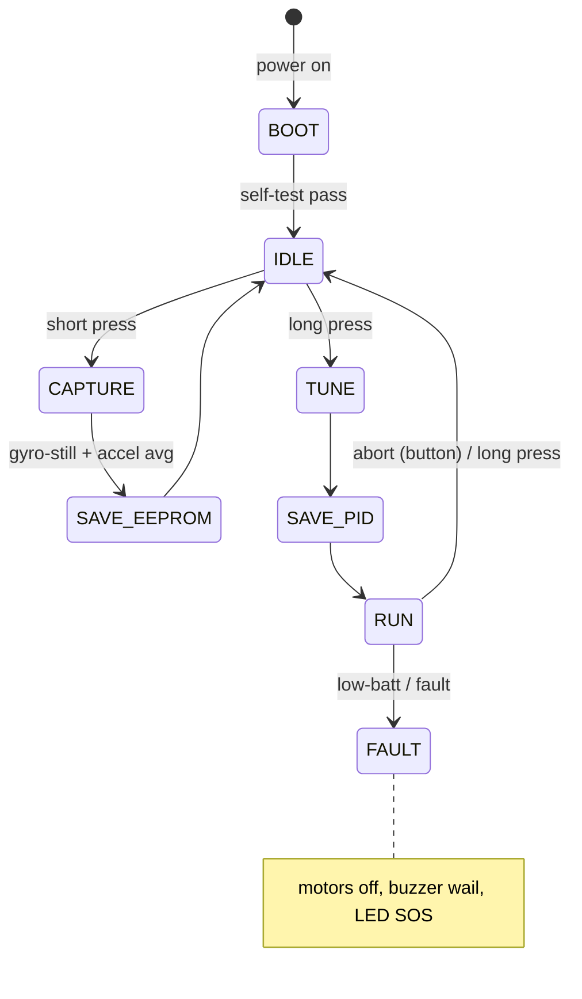

# Tetherless Operation Strategy for `auto_orientation/`

**Status:** Research / design proposal
**Date:** 2026-05-12
**Companions:** `wifi_telemetry_integration_design.md`, `multi_mcu_port_strategy.md`, `balance_point_and_mounting_research.md`

---

## Recommendation Summary

- **Treat the tether as a calibration error source, not a UX issue.** A 20 g cable hanging off a 0.5 kg bot exerts roughly 0.5–3 mN·m of bias torque — same order of magnitude as the captured zero we are trying to measure. Cable-attached "balance-point capture" captures the cable. Tetherless capture is mandatory.
- **Standardise a button + LED + buzzer floor on every MCU**, with an SSD1306 OLED on `Wire1` as the recommended upgrade. ESP32/S3 layer the browser dashboard *on top of* the same state machine, not in place of it.
- **Adopt a 5-state lifecycle (BOOT → IDLE → CAPTURE → TUNE → RUN, plus FAULT)** driven by a `Source_t` enum (`BUTTON | WIFI | BLE | SERIAL`). Identical FSM across MCUs; only trigger sources differ.

---

## 1. The Tether Problem, Quantified

A USB-A → micro-USB cable is 15–25 g; most of that mass hangs off the back, moment-arm 0.10–0.15 m from the connector.

For a 0.5 kg bot, CoM 0.10 m above the wheel axle:

- **Continuous cable bias torque:** ~0.5–3 mN·m (cable draped to floor, partial weight on bot).
- **Gravitational restoring torque per degree of tilt:** `m·g·h·sin(1°) ≈ 8.6 mN·m/deg`.
- **Implied zero-point error: ~0.06–0.35 deg per mN·m of bias** — i.e. the cable corrupts the captured zero by **0.1–0.3 deg**, which is 30–100 % of the offset `balance_point_and_mounting_research.md` is trying to measure.

Secondary effects: cable wrap geometry varies with the user's hand motion (structured noise, doesn't average out); the stiff USB-A connector torques the chassis in yaw, coupling into the accel reading on a non-level floor. There is no acceptable cable geometry during capture or auto-tune.

---

## 2. Tetherless Workflow Phases

| Phase | Tether? | Why |
| --- | --- | --- |
| Initial flash | **Yes (USB)** | Unavoidable first program load. One-time. |
| Reset / reboot | No | On-bot button, hardware watchdog, or WiFi/BLE command. |
| Mounting calibration capture | **No (critical)** | §1 — cable invalidates the measurement. |
| Auto-PID tuning | **No (critical)** | Relay-feedback tune absorbs any cable bias into the identified gains. |
| Runtime telemetry | No (nice-to-have) | Serial-over-USB is fine on bench; WiFi/BLE preferred in field. |
| Re-flash / OTA | No (nice-to-have) | ArduinoOTA on ESP32 (`wifi_telemetry_integration_design.md` §7); USB acceptable on AVR/Teensy. |

The two **bold** rows define the minimum tetherless scope; the rest is UX polish.

---

## 3. Per-MCU Strategy

| MCU | Primary tetherless | Secondary | Cost | Notes |
| --- | --- | --- | --- | --- |
| Nano | Button + LED + buzzer | HC-05 BT-classic ($3) | $0–3 | No native radio. HC-05 = phone terminal channel. Keep idle during capture (~30 mA peaks). |
| Mega | Button + LED + buzzer + OLED | HM-10 BLE on `Serial1` ($4) | $0–5 | Spare UARTs; HM-10 BLE 4.0 ~5 mA idle is the clean choice. |
| Teensy 4.0/4.1 | Button + LED + buzzer + OLED | HM-10 BLE or ESP-01 UART bridge ($2) | $2–5 | No built-in radio. T4.1 has SD — log instead of stream. |
| ESP32-WROOM | WiFi STA dashboard | BLE fallback | $0 | Phase 6 path. AP-mode setup fallback (§8). |
| ESP32-S3 | WiFi STA dashboard | BLE 5.0 only (no Classic) | $0 | PSRAM enables richer plot history. |

**Trade-offs:** Nano kit is cheapest (~$10 parts). WiFi is most powerful but adds firmware surface (`wifi_manager`, `web_server`, `ota`). Latency: USB ~1 ms, WiFi WS ~5–20 ms, BLE 30–100 ms, debounced button ~20 ms — all acceptable for capture (the loop itself doesn't need radio). Range: button = arm's reach, BLE pendant ~10 m, WiFi STA = whole LAN.

---

## 4. Recommended Balance-Robot Workflow

1. **One-time bench setup with USB:** flash, configure `wifi_credentials.h`, smoke-test with `pio device monitor`.
2. **Detach USB. Power from on-board battery.** No wires from here on.
3. **Short-press button** → CAPTURE. LED slow-pulses, buzzer chirps, OLED: "Hold me at balance".
4. **User holds bot upright.** Gyro-stillness gate (≤0.5 deg/s for 500 ms) auto-arms; OLED counts down; LED solid.
5. **Bot averages ~200 accel samples**, computes `q_mount` (`balance_point_and_mounting_research.md` §2), CRC-stamps, writes EEPROM/NVS. Triple beep. OLED: "Saved".
6. **Place bot on wheels. Long-press (≥1 s)** → TUNE.
7. **Relay-feedback auto-tune** (~10 s bang-bang). LED fast-blinks; OLED shows live Kp/Ki/Kd.
8. **Persist gains. Three-note motif. LED solid.**
9. **Short-press** → RUN. Heartbeat blink. Telemetry over WiFi/BLE if available; else OLED shows pitch + battery V.

State machine:

Every transition takes a `Source_t` (`SOURCE_BUTTON | SOURCE_WIFI | SOURCE_BLE | SOURCE_SERIAL`) — a future BLE pendant or browser dashboard drives the same graph without forking the controller.

---

## 5. Power Considerations

Typical/peak draw:

- Mega + L298N quiescent + 2x TT motors @ 50 % duty + BNO085 + OLED + LED/buzzer: **~250 mA typical, ~1.0 A peak** (motor stall).
- ESP32 + WiFi STA adds **~120 mA average, ~260 mA peak** on TX.

A single protected **18650** (3.7 V nom, 2500 mAh) yields **~8–10 h** of intermittent Mega runtime, **~4–5 h** with ESP32+WiFi. Plenty for an afternoon session.

Topology: 18650 → **TP4056** charger (USB-C in) → **MT3608** boost to 5 V → MCU + L298N logic. ~$3 in parts. Software low-V cutoff via ADC + 2:1 divider: warn at 3.4 V/cell (slow chirp + LED double-blink), motors off at 3.2 V/cell, shutdown at 3.0 V/cell. For ESP32 prefer **2S Li-Ion** + buck to dodge WiFi-TX brown-outs (same caveat as `flight_controller/`).

Critical: low-battery must be communicated audibly. Without a USB terminal, a silent power-down is a debugging black hole.

---

## 6. On-Bot User-Feedback Hardware

Minimum kit:

- **LED (1 pin).** Off=power down/FAULT; solid=CAPTURE armed / TUNE done; slow pulse=IDLE/RUN heartbeat; fast blink=TUNE in progress; SOS pattern=fault.
- **Piezo buzzer (1 pin, ~$0.50).** Audible feedback for state changes and low-battery — works when the bot is under a desk or LED isn't visible.
- **Tactile button (1 pin, $0.20).** Already in `button_input.cpp`; needs short/long/double-press discrimination.
- **SSD1306 OLED 128x32 (~$3, I2C).** Strongly recommended. On `Wire1` to avoid BNO085 bus contention (`multi_mcu_port_strategy.md` §8). Shows state name, live pitch, battery V, and during TUNE the live Kp/Ki/Kd.

**Floor = button + LED + buzzer. OLED is the recommended default on Mega and up.**

---

## 7. BLE Pendant Button

A wearable BLE button (Flic 2 ~$30, or DIY nRF52840 dongle ~$10 + CR2032) lets the user trigger CAPTURE without leaning over the bot.

| Property | On-bot button | BLE pendant |
| --- | --- | --- |
| Cost | $0.20 | $10–30 |
| Pendant battery | n/a | CR2032, ~6 months |
| Range | arm's reach | ~10 m |
| Latency | ~20 ms | ~30–100 ms |
| MCU requirement | any GPIO | native BLE (ESP32/S3) **or** HM-10 module ($4) |

Recommendation: **on-bot button is the default** — every MCU supports it, costs nothing, always works. BLE pendant is a refinement for researchers calibrating many bots in a row. It's just another `SOURCE_BLE` event into the same FSM.

---

## 8. Failure Modes & Fallbacks

| Failure | Detection | Fallback |
| --- | --- | --- |
| WiFi creds wrong / network down | `WiFi.status() != WL_CONNECTED` after 30 s | ESP32 → **AP mode** (`Floppi-Bot-Setup-XXYY`, password on a sticker). Captive portal serves the dashboard. |
| BLE pendant battery dies | No `SOURCE_BLE` events in 24 h | On-bot button still works; OLED shows pairing warning. |
| Bot software hangs | Hardware WDT (AVR `wdt_enable(WDTO_2S)`; Teensy WDT; ESP32 Task WDT) | Auto-reboot → BOOT. EEPROM cal survives. Buzzer plays "rebooted" motif. |
| Battery low | ADC divider | 3.4 V/cell → warn; 3.2 V/cell → motors off; 3.0 V → shutdown. State → FAULT. |
| EEPROM CRC fail on boot | `calculateCRC8()` mismatch | IDLE with identity `q_mount`; refuses RUN until CAPTURE; OLED "Please recalibrate". |
| I2C bus stuck | BNO085 NACK timeout | Toggle SCL 9x; if still stuck, FAULT (see `bno085_i2c_hang_diagnosis.md`). |
| Motor stall | Pitch beyond ±45 deg | PWM disable, FAULT, wait for button reset. |

**Principle:** every failure path emits a non-USB indication (buzzer + LED minimum). If the only way the user notices a fault is by plugging in USB, the workflow has regressed.

---

## 9. Changes to Existing Modules

- **`button_input.{h,cpp}`** — remove `#if ENABLE_SNAPSHOT_RECORDER` guard (always compile); add `Press_t poll()` returning `NONE | SHORT | LONG | DOUBLE`. Long-press = 1000 ms, double-press window = 400 ms, keep 20 ms debounce.
- **`sensor_output_manager.{h,cpp}`** — extend into a full output manager: `setLed(LedPattern_t)`, `setBuzzer(BuzzerTone_t)` non-blocking; `oledShow(line1, line2)` guarded by `USE_OLED`. New implementation file `output/feedback_hw.cpp`. Centralise LED/buzzer FSM here so `main.cpp` only emits high-level events.
- **`calibration_storage.{h,cpp}`** — add a `needsRecalibration()` predicate returned from `loadCalibration()` so the new state machine refuses RUN on stale/missing data. CRC API unchanged.
- **`config/mode.h`** — add `ENABLE_TETHERLESS_UX` (default on), `USE_OLED`, `USE_BUZZER`, `USE_BLE_PENDANT`. Compile-time tier so Nano can drop OLED/BLE without `#ifdef` pollution at call sites.
- **New `src/lifecycle/state_machine.{h,cpp}`** — small (~300 LOC) FSM owning BOOT/IDLE/CAPTURE/TUNE/RUN/FAULT, fed by `Source_t` events. Single place where the tetherless workflow lives.
- **No changes** to `ekf.cpp`, `quaternion.cpp`, `gps.cpp`, `bno085.cpp` — those are below the UX layer.

The `network/` subtree from `wifi_telemetry_integration_design.md` becomes one of several event sources feeding the state machine, not a replacement for it.

---

## 10. Cross-Application Implications

- **Camera mount / gimbal:** moderately affected. A cable on a stabilised gimbal fights the controller the same way it fights a balance bot, but mounts are typically rig-attached so cable geometry is constrained. Use the button+LED+buzzer floor for one-shot mounting calibration; WiFi telemetry suffices for runtime.
- **Photogrammetry rig:** matters for runtime, not calibration. Sweeps walk a 360° path — a trailing cable tangles. Drive need = runtime tetherless. ESP32 WiFi dashboard is right; Mega + SD card works for autonomous capture without telemetry.
- **AR/VR head/hand tracking:** matters for *latency*, not bias. USB is fine in lab; field VR cannot tolerate wires. BLE pendant too slow (>30 ms); WiFi borderline; a custom 2.4 GHz nRF24L01 link may be the eventual answer. Out of immediate scope, but the `Source_t` decoupling keeps the architecture unblocked.
- **General logging / data-collection probes:** matters only at runtime. Bench USB for cal, WiFi/SD for runtime. Button + LED still recommended for graceful start/stop.

The balance-robot is the most extreme case — every other application benefits from the same kit but tolerates the tether better. Designing for the balance-robot floor subsumes the rest.

---

## References

- `auto_orientation/docs/findings/balance_point_and_mounting_research.md` §1–2 (capture, EEPROM record)
- `auto_orientation/docs/findings/wifi_telemetry_integration_design.md` (ESP32 dashboard, OTA)
- `auto_orientation/docs/findings/multi_mcu_port_strategy.md` (per-MCU storage / pins / power)
- `auto_orientation/docs/findings/bno085_i2c_hang_diagnosis.md` (bus-stuck fallback)
- `auto_orientation/src/sensors/button_input.{h,cpp}`, `src/output/sensor_output_manager.{h,cpp}`, `src/config/calibration_storage.{h,cpp}` (modules to extend)
- `flight_controller/src/ota.cpp` (precedent: `armedFly` guard → mirror as "no OTA during CAPTURE/TUNE")
- Åström & Hägglund, "Automatic tuning of simple regulators," *Automatica* 20(5), 1984.
- Bosch BNO085 datasheet rev 1.13; TP4056 / MT3608 datasheets.
