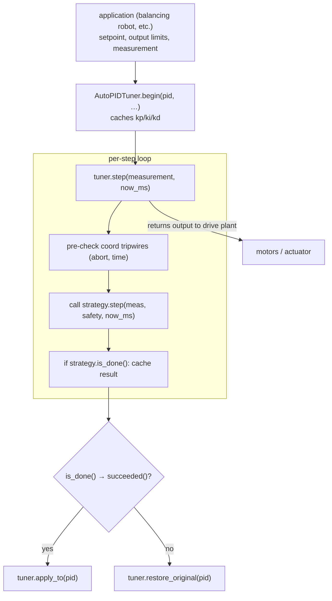

# Auto-PID Tuner (Coordinator + Strategies)

**Source**: `src/control/auto_pid_tuner.{h,cpp}`, `src/control/tuning_strategy.h`, `src/control/tuners/relay_feedback.{h,cpp}`.
**Phase**: 4.5b — generic PID + auto-tuner.
**Decision rows**: [D9, D10](../findings/MASTER_DESIGN.md) in `findings/MASTER_DESIGN.md`.

> **AS-BUILT (2026-05-22, verified vs source).** This relay-feedback tuner is **no longer the primary auto-tune path** for the balancing robot. The shipped balance build (`mega_balance`) **compiles `relay_feedback.cpp` out** (`platformio.ini` `build_src_filter -<control/tuners/relay_feedback.cpp>`) and constructs `AutoPIDTuner` with a `NoOpStrategy` (`main.cpp:107-125`) purely to satisfy the `BalanceApp` constructor without dragging in the relay machinery. The `AUTO_TUNE` app-state is retained in the enum for API stability but is **not wired to any operator gesture** — long-press / `b` / capture-success all chain to **BOOTSTRAP** instead. The real auto-tune mapping is **critically-damped pole-placement** in `PlantIdentifier::recompute_targets_()` (`plant_identifier.cpp:262-282`): `Kp = ωₙ²/K_motor`, `Kd = 2ζωₙ/K_motor`, fed by the BOOTSTRAP ±PWM pulse seed + continuous scalar RLS. The AMIGO/ZN-relay coefficients documented below survive **only** in the (now-unwired) `relay_feedback.cpp`. See decision row D9 in [`../findings/MASTER_DESIGN.md`](../findings/MASTER_DESIGN.md) and the bootstrap protocol AS-BUILT note for the divergence rationale. The rest of this document accurately describes the relay tuner *as a component*; it just is not the live tuner.

## Purpose

Splits "algorithm" from "policy" for unattended PID tuning. `ITuningStrategy` is the abstract base every algorithm implements (relay-feedback is the default; twiddle and RLS are reserved for later phases). `AutoPIDTuner` is the coordinator that owns *policy*: cache the PID's pre-tune gains, enforce safety tripwires, drive the strategy step-by-step, and either commit the result via `apply_to(pid)` or roll back via `restore_original(pid)`. The coordinator never touches the PID mid-run — the calling app is expected to disconnect the actuator from the PID and route the tuner's output directly to the plant.

## Data flow



Strategy implementations (compile-time selected via `USE_TUNER_xxx`):

- `RelayFeedbackStrategy` (`USE_TUNER_RELAY`, default)
- (future) `TwiddleStrategy` / `RLSStrategy`

## Core algorithm

**Coordinator** keeps three tripwires per step: `abort_requested`, `elapsed > max_duration_sec`, and `|error| > max_angle_deg`. First tripwire wins; stamps a `TuningResult{converged=false, failure_reason=…}` and forces `done_ = true`. If the strategy itself signals `is_done()`, the coordinator copies its `TuningResult` verbatim.

**RelayFeedbackStrategy** (Åström-Hägglund 1984, hysteretic relay):

```text
relay output:   +amplitude when (setpoint - measurement) >  +hysteresis
                -amplitude when (setpoint - measurement) <  -hysteresis

per full period (HIGH→LOW→HIGH→LOW):
    Tu = time between consecutive HIGH→LOW transitions
    a  = (cycle_max - cycle_min) / 2          # half peak-to-peak of measurement
    Ku = 4 * amplitude / (π * a)

after `cycles_to_average` periods, ring-average Tu and a → derive:
    Kp = 0.6   * Ku
    Ki = 1.2   * Ku / Tu
    Kd = 0.075 * Ku * Tu
```

Failure modes recorded in `failure_reason`: `user_aborted`, `max_duration_exceeded`, `max_angle_exceeded`, `no_oscillation` (swing < 4×hysteresis after timeout).

## Buffer / RAM costs

- `AutoPIDTuner`: ~60 B (3 cached gains + safety struct + result + abort flag + done flag + start timestamp).
- `RelayFeedbackStrategy`: ~120 B (8 ring slots × 2 floats + 4 floats of cycle tracking + result + config). `kMaxCycles = 8` is the upper bound; the ring overwrites older entries.
- `TuningResult`: 40 B (7 floats + bool + const char*).

Total auto-tuner footprint with relay strategy: ~220 B static + the PID's 52 B.

## Integration points

- **Used by**: balancing-robot reference app (`USE_BALANCING_ROBOT + USE_TUNER_RELAY` env). Triggered from button or dashboard command.
- **Gating**: `USE_TUNER_RELAY` includes `relay_feedback.cpp`; future `USE_TUNER_TWIDDLE` / `USE_TUNER_RLS` follow the same pattern (one .cpp per algorithm under `src/control/tuners/`).
- **Extension**: implement a new `ITuningStrategy` subclass, drop it under `src/control/tuners/`, wrap the .cpp in its `#ifdef USE_TUNER_xxx` guard, and add the env entry to `platformio.ini`. The coordinator needs no changes.
- **Safety**: callers set `SafetyLimits.abort_requested` from any context (button ISR is the canonical case); the coordinator OR's it with the internal abort flag each step.
- **Cross-link**: full theory in [`findings/auto_pid_tuning_research.md`](../findings/auto_pid_tuning_research.md).

## Tests

- `tests/test_relay_feedback.cpp` — Unity. Tunes a simulated 2nd-order underdamped oscillator, asserts `Ku/Tu` within sensible bounds and `converged == true`. Also exercises every failure path: `max_duration`, `max_angle`, `user_aborted`. Verifies `restore_original()` rolls back gains and `apply_to()` commits them.
- Run: `pio test -e native_test -f test_relay_feedback` from `auto_orientation/`.
