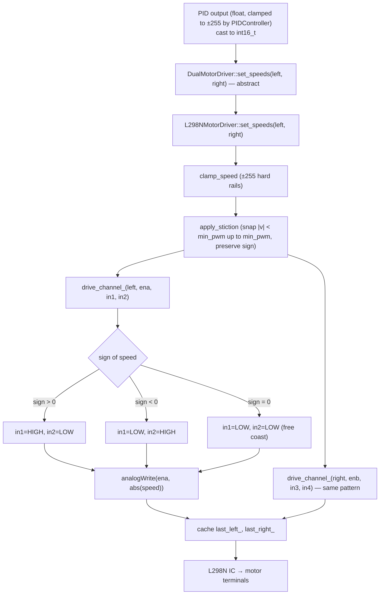

# L298N Dual-Channel Motor Driver

**Source**: `src/actuators/motor_driver.h` (abstract base), `src/actuators/l298n_motor_driver.{h,cpp}`.
**Phase**: 4.7b — self-balancing robot reference application (actuator slice).
**Decision rows**: [D18](../findings/MASTER_DESIGN.md) in `findings/MASTER_DESIGN.md`.

## Purpose

Hardware-agnostic dual-motor actuator abstraction (`DualMotorDriver` base) and a concrete L298N H-bridge driver. Direct port of the `controlMotors()` / `stopMotors()` logic from `docs/archive/balancing_robot_reference/SelfBallancingRobot3.ino` wrapped in the new interface so the balancing-robot reference application can swap implementations later (TB6612FNG, DRV8833, etc.) without touching control code. Signed `[-255, +255]` speed, free-coast `stop()`, optional active `brake()`, configurable stiction floor.

## Data flow



## Core algorithm

```text
begin():
    pinMode OUTPUT for all six pins
    digitalWrite(ENA, HIGH); digitalWrite(ENB, HIGH)   # some modules need this
    stop(); initialized_ = true

set_speeds(L, R):
    L = clamp_speed(L); R = clamp_speed(R)
    L = apply_stiction(L); R = apply_stiction(R)
    drive_channel_(L, ena, in1, in2)
    drive_channel_(R, enb, in3, in4)
    last_left_=L; last_right_=R

stop():    PWM=0, all four INx LOW         (free coast)
brake():   PWM=0, all four INx HIGH        (active brake, short across leads)
```

Stiction floor default = 15 PWM (matches `SelfBallancingRobot3.ino`). Below ~PWM 15 the motors hum but don't turn; the floor snaps any non-zero input up to the floor magnitude with the original sign preserved. Pass `stiction_min_pwm = 0` to disable.

## Buffer / RAM costs

- `L298NMotorDriver`: ~14 B (L298NPins[6] + stiction_min_pwm + 2×int16_t last_* + bool). No dynamic allocation.
- Abstract `DualMotorDriver`: vtable only (~6 B on AVR).

Negligible flash overhead (~300 B with -O2 per the agent report).

## Integration points

- **Called by**: balancing-robot reference app — PID output → `set_speed(value)` (convenience that calls `set_speeds(v, v)` for symmetric pitch-axis control).
- **Gating**: no compile flag — driver is always compiled when the file is included. The balancing-robot env (`USE_BALANCING_ROBOT`) instantiates it.
- **Pin map**: Arduino Mega reference: `ENA=5, IN1=6, IN2=7, ENB=10, IN3=9, IN4=8` (passed as `L298NPins` struct, so other boards/wiring need only construct a different struct).
- **Extension**: add a new `DualMotorDriver` subclass (e.g., `TB6612MotorDriver`) for other H-bridge chips — interface is identical, just override `begin/set_speeds/stop/brake`.

## Tests

- `tests/test_l298n_motor.cpp` — printf-style native harness. The driver `.cpp` is compiled with `-DUNIT_TEST`, which suppresses the `<Arduino.h>` include; the test file supplies stubs for `pinMode/digitalWrite/analogWrite` that record every call into a `MockPinState` buffer. Each test resets the buffer, drives the L298N, and asserts on captured pin levels and PWM duty cycles.
- Run:
  ```
  g++ -std=c++11 -O2 -DUNIT_TEST -Isrc/actuators \
      -o tests/test_l298n_motor \
      tests/test_l298n_motor.cpp src/actuators/l298n_motor_driver.cpp
  ./tests/test_l298n_motor
  ```
- Verifies: `begin()` sets all pins OUTPUT and ENA/ENB HIGH; signed-speed direction mapping; stiction floor; `stop()` → free coast; `brake()` → all INx HIGH; clamp at ±255.
