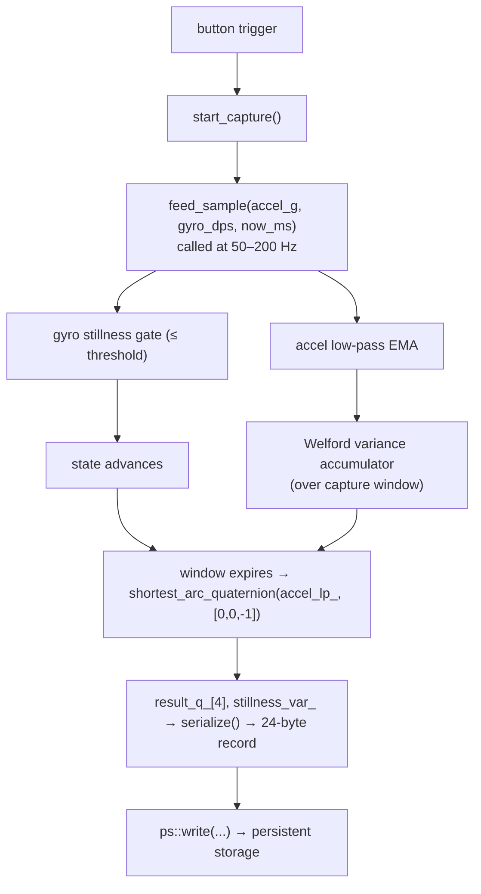
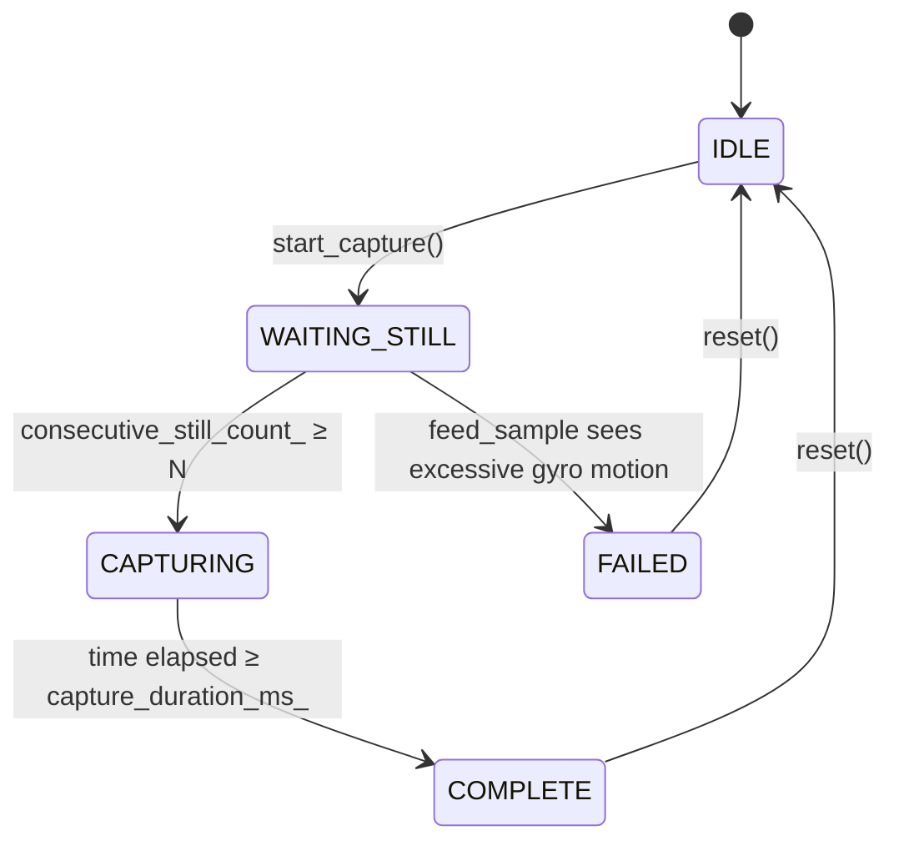

# One-Shot Mounting Calibration

**Source**: `src/navigation/mounting_calibration.{h,cpp}`
**Phase**: 4.3 — one-shot mounting capture.
**Decision rows**: [D5](../findings/MASTER_DESIGN.md) in `findings/MASTER_DESIGN.md`.

## Purpose

Captures the device's mounting offset relative to the user-chosen "level" / balance point. The user holds the device still in the desired orientation, the calibrator gates on gyro stillness, low-pass-filters the accelerometer to obtain a clean gravity estimate, then computes the shortest-arc quaternion rotating the observed gravity onto the canonical body-down axis `[0, 0, -1]`. That quaternion is `q_mount`; applying its inverse (conjugate) to the live attitude quaternion yields an orientation referenced to the user-chosen level. Outputs a self-validating 24-byte EEPROM record (magic + version + quaternion + QC variance + age + CRC8) so the balance-loop can refuse to load mismatched or corrupt records.

## Data flow



## State machine



Defaults: gyro stillness ≤ 0.5 rad/s (~28.6°/s), 3 consecutive still samples to enter capture, 200 ms capture window, accel EMA α tuned for ~50 Hz × 200 ms.

## Core algorithm

```text
shortest_arc_quaternion(observed_g, target_g) → q[4]   (Melax 2000):
    normalize both vectors
    d = dot(observed, target)
    if d > +1 - 1e-6: return identity {1,0,0,0}        # already aligned
    if d < -1 + 1e-6: pick any axis ⊥ observed; return 180° rotation
    axis = cross(observed, target)
    s    = sqrt((1+d) * 2)
    q    = { s/2, axis.x/s, axis.y/s, axis.z/s }
    normalize(q); return

EEPROM record (24 B):
    [0]   magic = 0xAB
    [1]   version = 0x01
    [2:18]  q_mount[4] (float32 LE × 4)
    [18:22] qc_stillness_var (float32 LE)
    [22]  qc_capture_age_min  (uint8, 0 in serialize(); host overwrites + recomputes CRC)
    [23]  crc8 = XOR of bytes 0..22
```

`deserialize()` validates magic, version, and CRC8 before accepting; on any mismatch returns false and the state stays IDLE.

## Buffer / RAM costs

`MountingCalibration` instance: ~80 B (config 14 B + runtime state 24 B + result 20 B + Welford accumulator 16 B + flags). Zero dynamic allocation, only `<math.h>` and `<string.h>` — compiles cleanly on AVR.

## Integration points

- **Called by**: balancing-robot app (triggered by button press in tetherless mode), dashboard (via WiFi command on ESP32 builds).
- **Persistence**: `serialize()` → 24-byte buffer → `ps::write()` + `ps::commit()`. Reverse on boot via `ps::read()` → `deserialize()`.
- **Downstream consumer**: `OnlineMountingEstimator` is initialised with the captured pitch reference; the live balance loop applies `q_mount⁻¹` before computing pitch error.
- **Gating**: no compile flag — always compiled. The hosting application decides whether to surface a "capture" gesture.
- **Cross-link**: theory and design rationale in [`findings/balance_point_and_mounting_research.md`](../findings/balance_point_and_mounting_research.md) §2.

## Tests

- `tests/test_mounting_calibration.cpp` — printf-style native harness (matches `test_quaternion.cpp` pattern). Covers: stillness gate (excessive gyro → no advance), shortest-arc edge cases (already-aligned, 180° anti-aligned, zero-length), CRC8 round-trip, serialize/deserialize symmetry, magic/version/CRC rejection paths, state-machine progression.
- Run:
  ```
  g++ -O0 -g -Wall -I src \
      tests/test_mounting_calibration.cpp \
      src/navigation/mounting_calibration.cpp \
      -o tests/test_mounting_calibration_runner
  ./tests/test_mounting_calibration_runner
  ```
