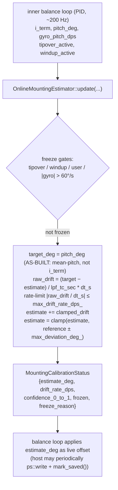

# Online Adaptive Mounting Estimator

**Source**: `src/navigation/online_mounting_estimator.{h,cpp}`
**Phase**: 4.4 — online adaptive drift tracking.
**Decision rows**: [D7, D8](../findings/MASTER_DESIGN.md) in `findings/MASTER_DESIGN.md`.

## Purpose

Complements the one-shot mounting capture (Phase 4.3 — see [`mounting_calibration.md`](mounting_calibration.md)) with a continuous, slowly-adaptive estimate of the *dynamic-equivalent* mounting offset. Tracks slow drift caused by cable-tether torque, battery sag, payload changes, and aging surfaces — phenomena that the one-shot capture cannot anticipate at boot. This file is the AVR-Mega path (decision D7). The Teensy/ESP32 path (3-state Kalman extension of the balance Kalman) is reserved and not implemented here.

> **AS-BUILT (2026-05-22, verified vs source).** Decision row D7 and the bootstrap protocol Stage 2 describe this estimator as *a slow LPF of the inner-loop PID integral term* (`mount_offset += alpha·(i_term·gain_to_angle)`). **The shipped code does not do that.** A 2026-05-18 PM bench finding showed the I-term path could only shift ±0.4° from reference (the I-term clamp is ±40 PWM) AND averaged to zero under oscillation, so it never converged. The implementation (`online_mounting_estimator.cpp:112-191`) now LPFs **mean pitch directly** — `target_deg = pitch_deg`. The `i_term` and `gain_to_angle_` parameters are retained for API stability but are dead `(void)`-cast no-ops (`online_mounting_estimator.cpp:127, 188`); `i_term` survives only as a health signal, not as the tracking input. The "Core algorithm" below reflects the as-built mean-pitch behaviour. The I-term-LPF description in D7 / bootstrap Stage 2 is **stale** — see the AS-BUILT note in [`../findings/bootstrap_protocol_unstable_plant.md`](../findings/bootstrap_protocol_unstable_plant.md) §11.

## Data flow



## Core algorithm

```text
update(i_term, pitch_deg, tipover, windup, gyro, now_ms):
    if !initialized_: return reference_deg_
    dt_ms = now_ms - last_update_ms_
    if dt_ms < MIN_DT_MS: return estimate_deg_
    dt_s  = dt_ms * 0.001

    # freeze gates (first match wins, reported via freeze_reason)
    if user_frozen_:        FREEZE_USER
    elif tipover:           FREEZE_TIPOVER
    elif windup:            FREEZE_WINDUP
    elif |gyro| > 60 dps:   FREEZE_HIGH_GYRO
    else:                   FREEZE_NONE  → adapt

    if frozen:
        drift_rate_dps_ = 0
        return estimate_deg_

    target = pitch_deg            # AS-BUILT: mean-pitch tracking.
                                  # i_term and gain_to_angle_ are (void)-cast no-ops.
    raw    = (target - estimate_deg_) / lpf_time_constant_sec_   # deg/s
    drift  = clamp(raw, ±max_drift_rate_dps_) * dt_s
    estimate_deg_ += drift
    estimate_deg_ = clamp(estimate_deg_, reference ± max_deviation_deg_)
    drift_rate_dps_ = drift / dt_s
    return estimate_deg_

confidence = 1 - |estimate - reference| / max_deviation     # 1.0 at ref → 0.0 at rail
```

Defaults (per [`findings/online_adaptive_balance_tracking.md`](../findings/online_adaptive_balance_tracking.md)): `lpf_tc = 300 s` (5 min — 1° accumulation needs ~5 min of stable runtime), `max_deviation = 5°` (D8 hard bound), `max_drift_rate = 0.5°/s` (D8 rate limit), `gain_to_angle = 0.01` (now a no-op — see AS-BUILT note above).

> **AS-BUILT — applied time constant overrides the default.** The estimator's `DEFAULT_LPF_TC_SEC = 300.0f` (5 min) is **overridden at the call site** in `main.cpp:588` to **8 s** (`online_est.set_lpf_time_constant_sec(8.0f)`), and `max_drift_rate` is overridden to **2.0°/s** (`main.cpp:589`, vs the 0.5°/s D8 default). So the running system tracks far faster than either the 300 s code default or the 60 s figure quoted in the bootstrap protocol. The triage doc ([`../findings/mega_scope_violation_triage_2026-05-22.md`](../findings/mega_scope_violation_triage_2026-05-22.md) #13) flags 8 s as itself **questionable** for what is meant to be a *slow-drift* tracker — a fast LPF on live pitch risks chasing the balance oscillation rather than the slow geometric offset. Changing the value is bench-gated; the discrepancy is documented here so it is not mistaken for the 300 s default.

## Buffer / RAM costs

~52 B per instance (5 config floats + 2 state floats + 2 timestamps + 2 flags + freeze enum + initialized flag). Zero dynamic allocation, no STL. AVR-Mega-friendly.

## Integration points

- **Called by**: balancing-robot inner loop, every PID step (~200 Hz). The application owns the persistence cadence — the estimator only stamps `last_save_ms` when the host calls `mark_saved(now_ms)`.
- **Initialised by**: `MountingCalibration` result (after one-shot capture) or restored EEPROM value (`reset_to_reference()` on a fresh capture; `initialize()` on boot).
- **Gating**: no compile flag — always compiled on AVR. The Teensy/ESP32 3-state-Kalman path (D7) is reserved for Phase 4.7 once `balance_kalman.{h,cpp}` lands; that path will extend the 2-state Kalman directly rather than duplicating this LPF.
- **Safety**: per D8, hard refuse > ±5° from reference, rate-limit to 0.5°/s, freeze on tipover/windup/high-gyro/user. The host must wire `tipover_active` and `windup_active` from its safety module and PID respectively.
- **Cross-link**: full theory in [`findings/online_adaptive_balance_tracking.md`](../findings/online_adaptive_balance_tracking.md).

## Tests

- `tests/test_online_mounting_estimator.cpp` — printf-style native harness. Coverage:
  - Initialization & reference handling
  - No-drift when I-term is zero
  - Slow LPF convergence toward an I-term target
  - Hard bound (±max_deviation) clamping
  - Rate-limit clamp on `max_drift_rate_dps`
  - All four freeze reasons (tipover, windup, user, high gyro)
  - `reset_to_reference()` semantics
  - Confidence-heuristic monotonicity
  - Status-struct integrity
  - `millis()` rollover behaviour (time is simulated — `now_ms` passed explicitly)
- Run:
  ```
  g++ -O0 -g -Wall -I src \
      tests/test_online_mounting_estimator.cpp \
      src/navigation/online_mounting_estimator.cpp \
      -o tests/test_online_mounting_estimator_runner
  ./tests/test_online_mounting_estimator_runner
  ```
