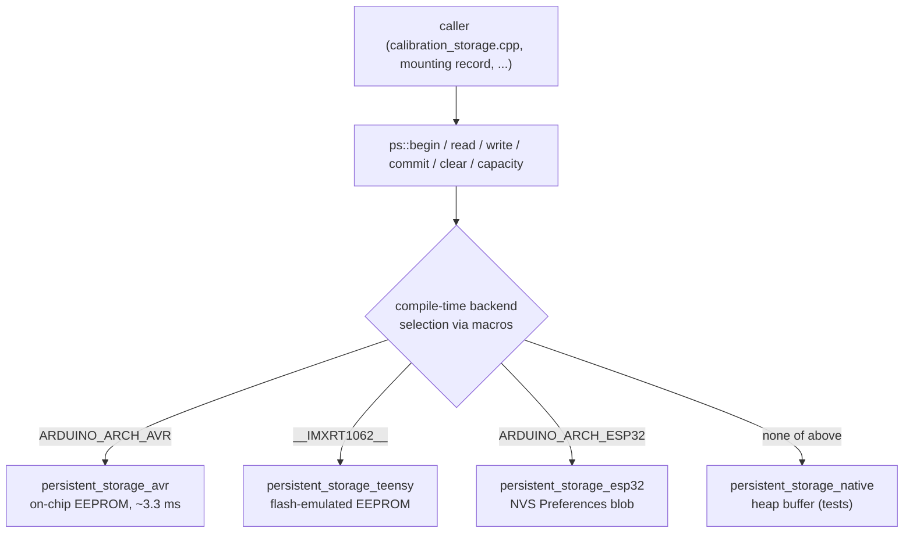

# Persistent Storage HAL

**Source**: `src/storage/persistent_storage.{h,cpp}` (header + four back-ends)
**Phase**: 4.1 — foundational. Fixes Known Issue **KI-1** (silent EEPROM drop on ESP32).
**Decision rows**: [D1](../findings/MASTER_DESIGN.md) in `findings/MASTER_DESIGN.md`.

## Purpose

A uniform, byte-addressable persistent-storage API across every MCU we target. Replaces direct `<EEPROM.h>` calls in `calibration_storage.cpp` and the new auto-orient record layer so that platforms whose EEPROM wrapper silently fails (notably ESP32, where the deprecated wrapper requires explicit `begin()`/`commit()`) behave correctly without any source-level change in the caller. Sits at the bottom of the storage stack — all higher layers (calibration blobs, mounting record, future tuned-gain persistence) go through `ps::`.

## Data flow



The `native_test` env's `build_src_filter` explicitly excludes the embedded back-ends so the host build only links the native one (see `platformio.ini` `[env:native_test]`).

## Core algorithm

Each back-end implements the same six-function namespace `ps`:

```text
begin(capacity_hint)  → init backend, snapshot any pre-existing blob to RAM
read(offset, buf, n)  → bounds-check, copy from backend/mirror to buf
write(offset, buf, n) → bounds-check, copy buf into backend/mirror
commit()              → AVR/Teensy no-op; ESP32 flushes the RAM mirror to NVS
clear(offset, n)      → fill region with 0xFF (matches erased EEPROM)
capacity()            → backend size
```

ESP32 maintains a `g_dirty` flag so back-to-back writes coalesce into one NVS commit; AVR uses `EEPROM.update()` (compare-before-write) to spare flash cells.

## Buffer / RAM costs

| Backend | Static RAM | Notes |
|---|---|---|
| AVR | ~3 B (capacity + flag) | EEPROM addressed directly, no mirror |
| Teensy | ~3 B | PJRC library handles emulation internally |
| ESP32 | `capacity_hint` bytes on heap (default 512) + Preferences handle (~80 B) | RAM mirror required because NVS stores a single blob |
| Native | `capacity_hint` bytes on heap | test-only |

The default 512 B hint comfortably exceeds the current calibration-blob footprint (BNO055 = 22 B, BNO085 = 48 B, mounting record = 24 B) with headroom for tuned-gain persistence.

## Integration points

- **Called by**: `src/config/calibration_storage.cpp`, future mounting-record writer, future tuned-gain persister.
- **Gating**: no compile flag — always compiled; backend is auto-selected via MCU macros.
- **Extension**: to add a new MCU family, drop a new `persistent_storage_<arch>.cpp` guarded by its arch macro, and add an exclusion line to `[env:native_test].build_src_filter`.
- **Cross-link**: full rationale in [`findings/multi_mcu_port_strategy.md`](../findings/multi_mcu_port_strategy.md).

## Tests

- `tests/test_persistent_storage.cpp` — Unity-based, exercises round-trip, boundary writes, clear→0xFF, `capacity()`, NULL/zero-length argument rejection.
- Run: `pio test -e native_test -f test_persistent_storage` from `auto_orientation/`.
- Embedded back-ends are exercised on hardware via the calibration round-trip path (no dedicated hardware test sketch yet — flagged in TODO).
