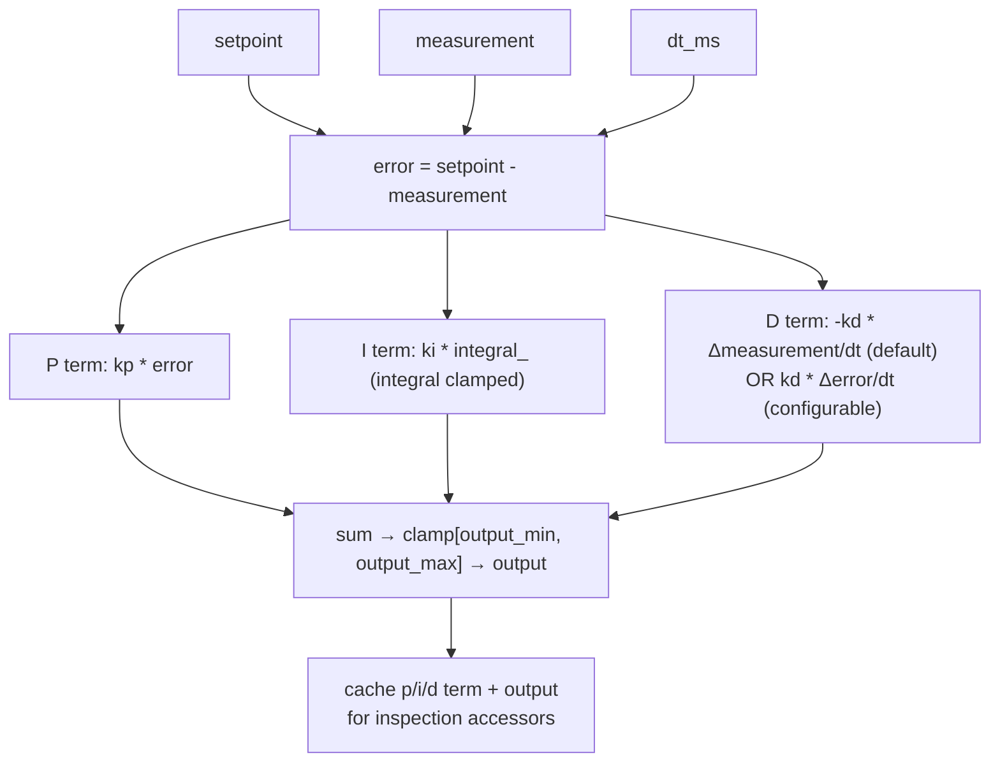

# Generic Single-Axis PID Controller

**Source**: `src/control/pid_controller.{h,cpp}`
**Phase**: 4.5a — generic PID + auto-tuner.
**Decision rows**: [D9, D10](../findings/MASTER_DESIGN.md) in `findings/MASTER_DESIGN.md`.

## Purpose

Sensor-agnostic, AVR-friendly PID controller used by every closed-loop application in the framework (balancing robot first, future gimbal/drone paths). API mirrors the legacy PID_v1 library so `SelfBallancingRobot3.ino` can migrate without behavioural surprises. Lives at the application layer — knows nothing about IMUs, motors, or sample sources; the application feeds it `(measurement, dt_ms)` and consumes a clamped float output. Used as the regression target for `AutoPIDTuner` (which writes `kp/ki/kd` back via `set_tunings()`).

## Data flow



## Core algorithm

```text
compute(measurement, dt_ms):
    if isnan(measurement) or dt_ms == 0: return last_output
    dt_s = dt_ms * 0.001
    error = setpoint - measurement
    integral_ += error * dt_s
    clamp_integral()                          # ki * integral bounded by output span
    if first_compute: D term = 0, arm history
    elif d_on_measurement: D = -kd * (Δmeas / dt_s)
    else:                  D =  kd * (Δerr  / dt_s)
    output = clamp(P + I + D, output_min, output_max)
    cache last_*; return output
```

Anti-windup is integral clamping (back-calculation style): each step `integral_` is bounded so `ki * integral_` fits within the output span. Re-tunes are safe at runtime — `set_tunings()` re-clamps the integral immediately. The first-compute guard suppresses the D-term on the first call (no prior measurement). NaN inputs return the last output rather than propagating.

## Buffer / RAM costs

~52 B per controller instance (13 floats + 2 bools + uint16_t sample_ms). Zero dynamic allocation, no STL, only `<math.h>`. Compiles cleanly on Arduino Mega; agent flash-overhead report had this at ~600 B of code with -O2.

## Integration points

- **Used by**: `AutoPIDTuner` (caches/applies gains), balancing-robot reference app (drives motors), dashboard telemetry (inspection accessors).
- **Gating**: no compile flag — always built; PID is foundational.
- **Extension**: `set_d_on_measurement(false)` for setpoint-tracking apps; `set_output_limits()` to retarget different actuators (e.g., signed servo µs).
- **Cross-link**: design rationale in [`findings/auto_pid_tuning_research.md`](../findings/auto_pid_tuning_research.md) and [`findings/disturbance_compensation_research.md`](../findings/disturbance_compensation_research.md).

## Tests

- `tests/test_pid_controller.cpp` — Unity. Covers P-only, anti-windup, output clamp, D-on-measurement vs D-on-error, reset, settling step response, and a parity check against the PID_v1 arithmetic from `SelfBallancingRobot3.ino` (±2 PWM tolerance).
- Run: `pio test -e native_test -f test_pid_controller` from `auto_orientation/`.
