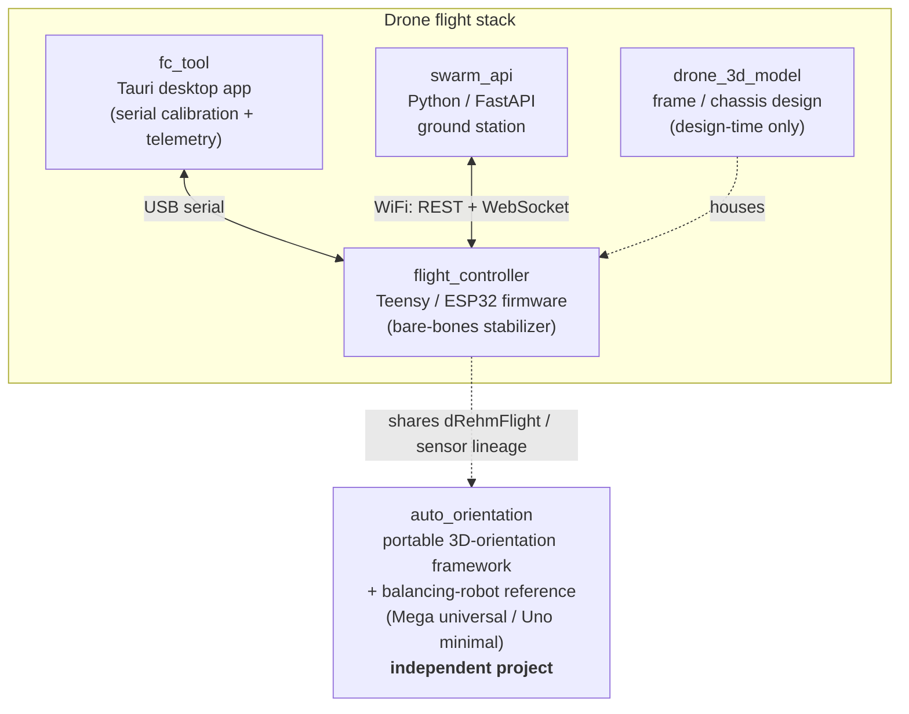
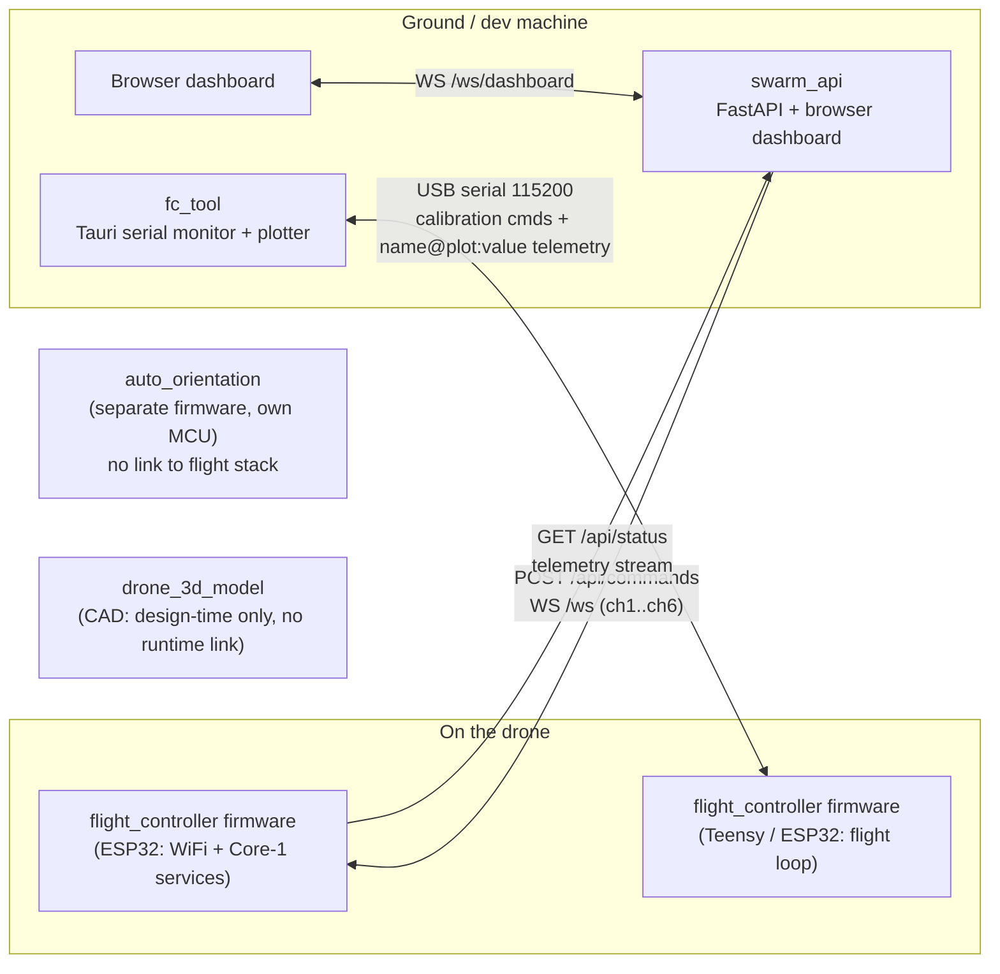

# floppi — Whole-Repo Architecture (Level -1)

This is the **top of the architecture drill-down** for the entire `floppi`
repository. It explains how the five sub-projects relate at the highest level,
then points down into each sub-project's own `docs/architecture/` for the
detail. Read this first so the rest of the repo doesn't overwhelm you.

> **Hierarchy:** this doc is *Level -1* (the repo). Each sub-project's
> `docs/architecture/INDEX.md` is its own *Level 0*, and drills further into
> Level 1 (subsystems) and Level 2 (components). Stop at whatever depth you
> need.

---

## The five sub-projects at a glance

| Sub-project | What it is | Language / stack | Talks to |
|---|---|---|---|
| **`flight_controller/`** | Bare-bones flight **stabilizer** firmware (command + IMU → motor PWM, 1–2 kHz). NOT an autopilot. | C++ / PlatformIO (Teensy 4.0/4.1/3.6, ESP32/S3) | `fc_tool` (USB), `swarm_api` (WiFi, ESP32 only) |
| **`swarm_api/`** | Browser + scripting **ground station** to control and monitor ESP32 drones over WiFi. | Python 3.10+ / FastAPI / uvicorn | `flight_controller` (ESP32) over REST + WebSocket |
| **`fc_tool/`** | Desktop **serial calibration + telemetry** tool (monitor + multi-graph plotter). | Rust + Tauri 2 / vanilla JS / Chart.js | `flight_controller` over USB serial |
| **`auto_orientation/`** | Portable **3D-orientation framework** (sensor fusion, EKF, auto-PID) + balancing-robot reference (Mega universal / Uno minimal). **Independent project.** | C++ / PlatformIO (Mega, Uno, Teensy, ESP32) | Nothing in the flight stack |
| **`drone_3d_model/`** | **Frame / chassis design** (quad, hex, VTOL): geometry, mounts, layouts for 3D printing. **Design-time only.** | CAD / STEP + STL, Python helper scripts | Nothing at runtime |

The drone flight stack is `flight_controller` + `swarm_api` + `fc_tool`, with
`drone_3d_model` providing the physical airframe those run on.
`auto_orientation` is a **separate framework** that happens to share sensor and
dRehmFlight lineage but does not participate in the flight stack — do not wire
it into the drone control path.

---

## Diagram 1 — Repo map (what each project is, who talks to whom)

- **Solid arrows** = real runtime communication.
- **Dotted arrows** = a relationship that is *not* a runtime link: `drone_3d_model`
  is the airframe the firmware physically rides on, and `auto_orientation` only
  shares code lineage (dRehmFlight base, sensor drivers) — there is no message
  passing between them.

---

## Diagram 2 — Runtime / data flow across projects

Two live integrations, and two non-integrations:

1. **ESP32 firmware ↔ `swarm_api` over WiFi.** STA mode on a shared network;
   discovery via mDNS (`floppi-XXXX.local`) with `config.json` IP fallback.
   `swarm_api` pushes commands (`POST /api/commands` and `WS /ws`, payload
   `{"ch1":1500,...,"ch6":1000}`) and pulls telemetry (`GET /api/status` plus
   the WebSocket stream). On the firmware side these WiFi commands feed back
   into **RadioComm as just another command source** — they get no private path
   to the motors. The browser dashboard talks to `swarm_api` over its own
   `WS /ws/dashboard` bridge.
2. **FC firmware ↔ `fc_tool` over USB serial** (115200 baud). `fc_tool` sends
   calibration commands and renders the firmware's `name@plotId:value`
   telemetry in the plotter. This is the calibration/diagnostics path, distinct
   from the live-flight WiFi path.
3. **`auto_orientation`** runs as its own firmware on its own MCU (Mega/Uno/etc.)
   and has **no runtime link** to the flight stack.
4. **`drone_3d_model`** is **design-time only** — CAD outputs (STEP/STL), no
   runtime data flow.

---

## Where to go next (drill down into each sub-project)

Each sub-project owns its deeper architecture docs. Follow these down for the
Level 0 → 1 → 2 detail:

- **flight_controller** → [../flight_controller/docs/architecture/INDEX.md](../flight_controller/docs/architecture/INDEX.md)
  — flight loop + PID tiers, command sources + arbitration, ESP32 dual-core
  split, sensor/telemetry pipeline.
- **auto_orientation** → [../auto_orientation/docs/architecture/INDEX.md](../auto_orientation/docs/architecture/INDEX.md)
  — layered framework (config → sensors → math → navigation → control →
  actuators → applications), Mega/Uno fork, BOOTSTRAP + auto-PID internals.
- **swarm_api** → [../swarm_api/docs/README.md](../swarm_api/docs/README.md)
  (overview), [../swarm_api/docs/scope.md](../swarm_api/docs/scope.md)
  (boundaries). Live API surface is also at `/docs` (Swagger UI) when running.
  *(No dedicated `docs/architecture/` yet.)*
- **fc_tool** → [../fc_tool/docs/README.md](../fc_tool/docs/README.md)
  (overview + Rust backend / JS frontend split), [../fc_tool/docs/scope.md](../fc_tool/docs/scope.md).
  *(No dedicated `docs/architecture/` yet.)*
- **drone_3d_model** → [../drone_3d_model/README.md](../drone_3d_model/README.md),
  [../drone_3d_model/docs/scope.md](../drone_3d_model/docs/scope.md).
  *(No dedicated `docs/architecture/` yet.)*

### Repo-wide references

- [../README.md](../README.md) — project overview and quick start.
- [../FOLDER_STRUCTURE.md](../FOLDER_STRUCTURE.md) — full directory layout.
- Base system: [dRehmFlight](https://github.com/nickrehm/dRehmFlight) (MIT).

---

*Level -1 entry point. Diagrams validated with Mermaid Chart.*
