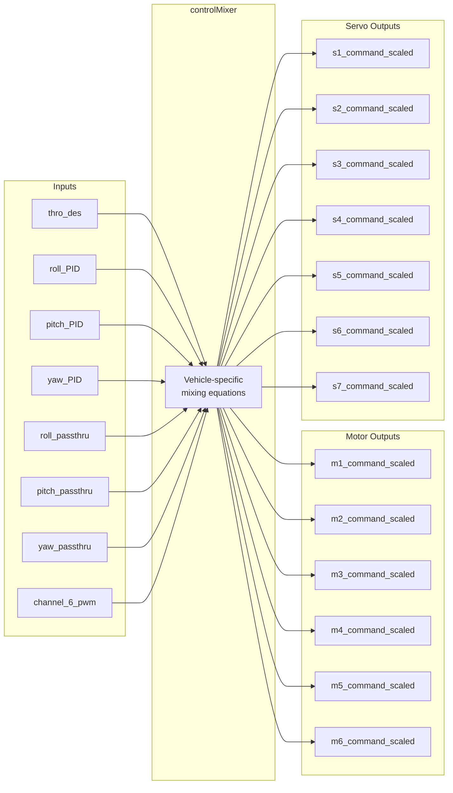
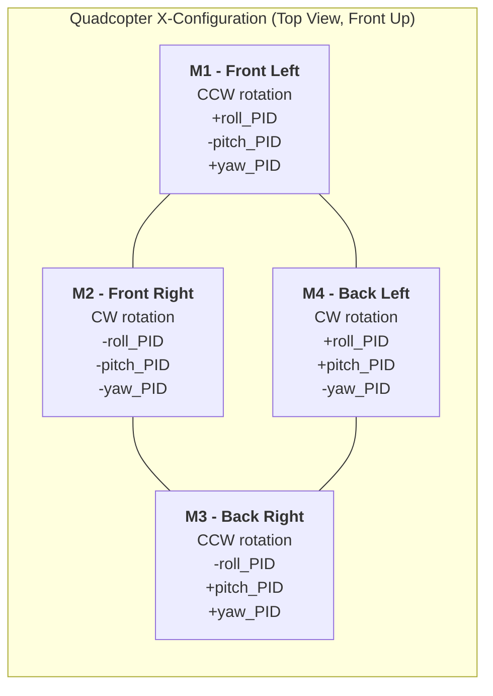
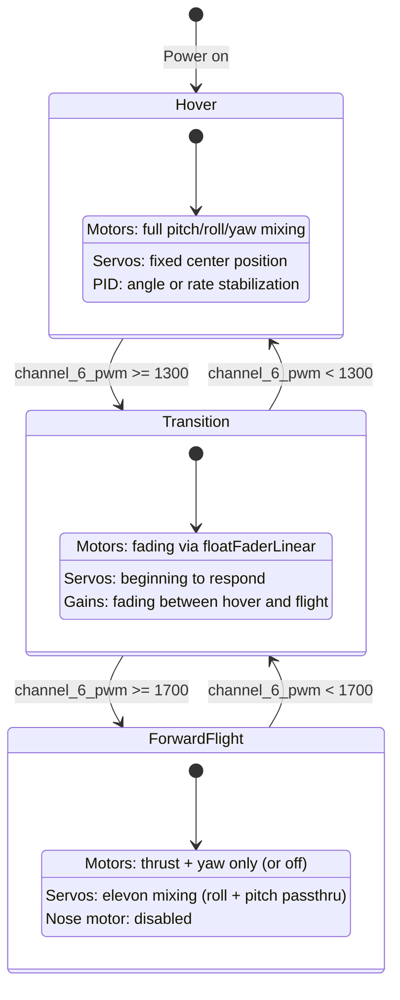
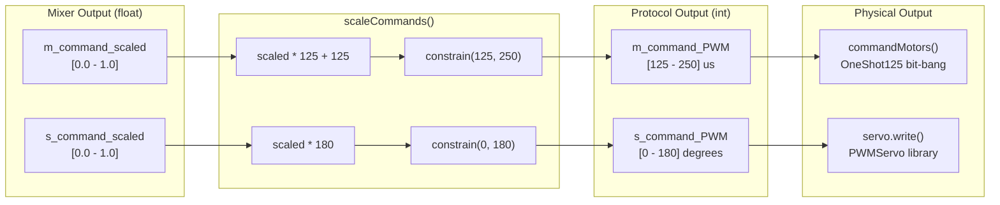
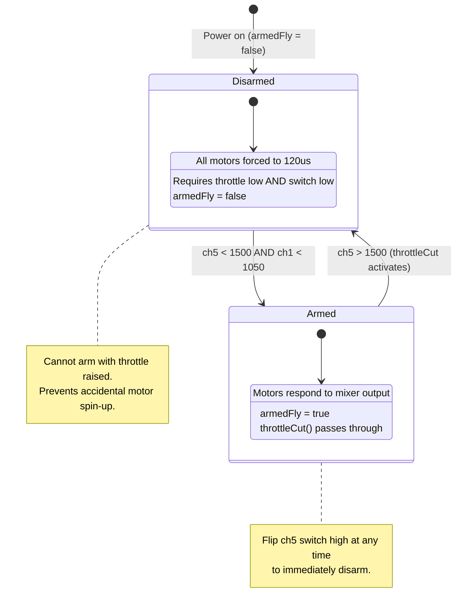
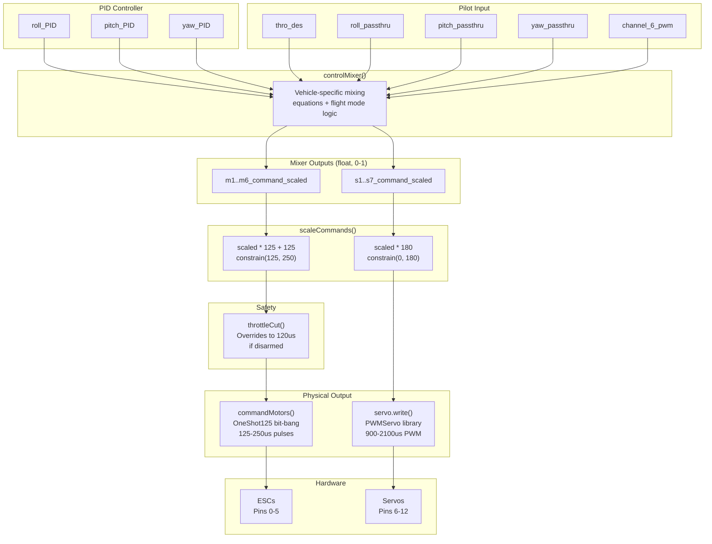

# Control Mixing System and Actuator Outputs

This document covers the complete actuator output pipeline in the dRehmFlight flight controller: from stabilized PID outputs through control mixing, command scaling, motor protocols, servo outputs, arming logic, and safety systems. All references point to `dRehmFlight_Teensy_BETA_1.3.ino`.

---

## Table of Contents

1. [Control Mixing Overview](#1-control-mixing-overview)
2. [Available Mixing Variables](#2-available-mixing-variables)
3. [Output Variables](#3-output-variables)
4. [Default Quadcopter Mixing Example](#4-default-quadcopter-mixing-example)
5. [VTOL Flight Mode Switching](#5-vtol-flight-mode-switching)
6. [Command Scaling (scaleCommands)](#6-command-scaling-scalecommands)
7. [OneShot125 Motor Protocol](#7-oneshot125-motor-protocol)
8. [Motor Arming](#8-motor-arming)
9. [Throttle Cut Safety](#9-throttle-cut-safety)
10. [ESC Calibration](#10-esc-calibration)
11. [Servo Output](#11-servo-output)
12. [Utility Functions](#12-utility-functions)

---

## 1. Control Mixing Overview

The `controlMixer()` function is the bridge between the stabilization system and the physical actuators. Its purpose is to translate the abstract, axis-oriented PID corrections into concrete motor and servo commands for a specific vehicle configuration.

The PID controller produces three stabilized correction signals -- `roll_PID`, `pitch_PID`, and `yaw_PID` -- which represent how much corrective authority is needed on each axis. These signals are unitless and normalized to approximately the [-1, 1] range. The mixer takes these signals, combines them with the throttle command (`thro_des`), and assigns the result to individual motor and servo output variables according to the physical layout of the vehicle.

This function is **vehicle-configuration-dependent**. The default code ships with a quadcopter mixing example, but the user is expected to replace or augment it for their specific airframe: tricopter, hexacopter, fixed-wing, VTOL tiltrotor, tailsitter, and so on. The mixer is the single function that must change when porting dRehmFlight to a new vehicle type.



### Position in the Main Loop

The mixer is called once per loop iteration, after PID computation and before command scaling:

```
getDesState() --> controlANGLE() / controlRATE() --> controlMixer() --> scaleCommands() --> throttleCut() --> servo.write() / commandMotors()
```

---

## 2. Available Mixing Variables

These variables are available for use inside `controlMixer()`. You combine them with addition, subtraction, multiplication, conditionals, and any other standard operations to define your vehicle's mixing behavior.

| Variable | Range | Description |
|---|---|---|
| `thro_des` | [0, 1] | Direct throttle command. Derived from `channel_1_pwm` as `(ch1 - 1000) / 1000`. |
| `roll_PID` | approx [-1, 1] | Stabilized roll correction output from the PID controller. Scaled by 0.01 internally to fit this range. |
| `pitch_PID` | approx [-1, 1] | Stabilized pitch correction output from the PID controller. |
| `yaw_PID` | approx [-1, 1] | Stabilized yaw correction output from the PID controller. |
| `roll_passthru` | [-0.5, 0.5] | Unstabilized (raw) roll command from the transmitter. Computed as `roll_des / 2.0`. Useful for direct surface control on fixed-wing aircraft or mixed VTOL modes. |
| `pitch_passthru` | [-0.5, 0.5] | Unstabilized pitch command passthrough. |
| `yaw_passthru` | [-0.5, 0.5] | Unstabilized yaw command passthrough. |
| `channel_6_pwm` | [1000, 2000] | Free auxiliary radio channel. Commonly used with `if/else` logic to switch between flight modes (e.g., hover vs. forward flight). |
| Any float constant | [0, 1] | For servo trim, offset, or fixed positions. For example, `0.5` centers a servo. |

### Stabilized vs. Unstabilized

- **Stabilized** (`roll_PID`, `pitch_PID`, `yaw_PID`): The PID controller has computed a correction based on the difference between the desired and actual attitude. These outputs actively fight disturbances and stabilize the aircraft.
- **Unstabilized** (`roll_passthru`, `pitch_passthru`, `yaw_passthru`): The raw pilot stick input is passed through directly with no PID correction. This is useful for control surfaces that need direct pilot input (e.g., ailerons in forward flight on a VTOL that only uses PID for hover).

---

## 3. Output Variables

The mixer writes to 13 output variables: 6 motor channels and 7 servo channels.

### Motor Outputs

| Variable | Range | Protocol |
|---|---|---|
| `m1_command_scaled` | [0, 1] | OneShot125 via `commandMotors()` |
| `m2_command_scaled` | [0, 1] | OneShot125 |
| `m3_command_scaled` | [0, 1] | OneShot125 |
| `m4_command_scaled` | [0, 1] | OneShot125 |
| `m5_command_scaled` | [0, 1] | OneShot125 |
| `m6_command_scaled` | [0, 1] | OneShot125 |

- `0.0` = zero throttle (motor off / idle depending on ESC)
- `1.0` = maximum throttle

### Servo Outputs

| Variable | Range | Protocol |
|---|---|---|
| `s1_command_scaled` | [0, 1] | Standard PWM via `servo.write()` |
| `s2_command_scaled` | [0, 1] | Standard PWM |
| `s3_command_scaled` | [0, 1] | Standard PWM |
| `s4_command_scaled` | [0, 1] | Standard PWM |
| `s5_command_scaled` | [0, 1] | Standard PWM |
| `s6_command_scaled` | [0, 1] | Standard PWM |
| `s7_command_scaled` | [0, 1] | Standard PWM |

- `0.0` = full deflection in one direction (or zero throttle if driving an ESC)
- `0.5` = servo center position
- `1.0` = full deflection in the opposite direction (or max throttle if driving an ESC)

### Pin Mapping

| Output | Teensy Pin |
|---|---|
| m1 (motor) | Pin 0 |
| m2 (motor) | Pin 1 |
| m3 (motor) | Pin 2 |
| m4 (motor) | Pin 3 |
| m5 (motor) | Pin 4 |
| m6 (motor) | Pin 5 |
| servo1 | Pin 6 |
| servo2 | Pin 7 |
| servo3 | Pin 8 |
| servo4 | Pin 9 |
| servo5 | Pin 10 |
| servo6 | Pin 11 |
| servo7 | Pin 12 |

---

## 4. Default Quadcopter Mixing Example

The default `controlMixer()` implements a standard X-configuration quadcopter using motors 1 through 4:

```cpp
// Quad mixing - EXAMPLE
m1_command_scaled = thro_des - pitch_PID + roll_PID + yaw_PID; // Front Left
m2_command_scaled = thro_des - pitch_PID - roll_PID - yaw_PID; // Front Right
m3_command_scaled = thro_des + pitch_PID - roll_PID + yaw_PID; // Back Right
m4_command_scaled = thro_des + pitch_PID + roll_PID - yaw_PID; // Back Left
m5_command_scaled = 0;
m6_command_scaled = 0;
```

### Motor Layout Diagram



### Sign Convention Explanation

**Pitch axis** (`pitch_PID` positive means "nose-up correction needed"):

- Front motors (M1, M2) get `-pitch_PID`: they slow down, allowing the nose to pitch up.
- Rear motors (M3, M4) get `+pitch_PID`: they speed up, pushing the tail down and nose up.
- This follows the convention that a positive `pitch_PID` produces a nose-up moment.

**Roll axis** (`roll_PID` positive means "right-roll correction needed"):

- Left motors (M1, M4) get `+roll_PID`: they speed up, pushing the left side down and rolling right.
- Right motors (M2, M3) get `-roll_PID`: they slow down, allowing the right side to rise.
- A positive `roll_PID` therefore produces a roll to the right.

**Yaw axis** (`yaw_PID` and propeller torque):

- On a standard quadcopter, diagonal motor pairs spin in the same direction. M1 (Front Left) and M3 (Back Right) are one diagonal pair; M2 (Front Right) and M4 (Back Left) are the other.
- Increasing throttle on one diagonal pair and decreasing on the other creates a net torque about the yaw axis, because opposite-spinning props produce opposite reactive torques.
- M1 and M3 get `+yaw_PID`; M2 and M4 get `-yaw_PID`. The sign depends on prop rotation direction and the desired yaw direction convention.

---

## 5. VTOL Flight Mode Switching

For vehicles that transition between hover and forward flight (e.g., tilt-rotors, tailsitters, or VTOL fixed-wings like the F-35 style configuration), the `controlMixer()` function uses `channel_6_pwm` with conditional logic to switch between mixing configurations.

### Example: F-35 Style VTOL

A typical three-mode VTOL mixer structure using `channel_6_pwm`:

```cpp
void controlMixer() {
    if (channel_6_pwm < 1300) {
        // HOVER MODE
        // Motors provide all pitch/roll/yaw control
        m1_command_scaled = thro_des - pitch_PID + roll_PID + yaw_PID;
        // ... more motor mixing ...
        // Servos held at fixed positions
        s1_command_scaled = 0.5; // Aileron centered
        s2_command_scaled = 0.5; // Aileron centered
    }
    else if (channel_6_pwm < 1700) {
        // TRANSITION MODE
        // Motors still active but fading
        // Ailerons begin to respond
        s1_command_scaled = 0.5 + roll_passthru;
        s2_command_scaled = 0.5 - roll_passthru;
    }
    else {
        // FORWARD FLIGHT MODE
        // Nose motor off, rear motors for thrust + yaw
        m1_command_scaled = 0; // Nose motor off
        // Ailerons function as elevons
        s1_command_scaled = 0.5 + roll_passthru + pitch_passthru;
        s2_command_scaled = 0.5 - roll_passthru + pitch_passthru;
    }
}
```

### VTOL Flight Mode State Machine



### floatFaderLinear() -- Smooth Parameter Transitions

When switching between flight modes, abrupt changes to gains or mixing coefficients can cause dangerous transients. `floatFaderLinear()` provides smooth, time-based linear interpolation between two values.

**Signature:**
```cpp
float floatFaderLinear(float param, float param_min, float param_max,
                       float fadeTime, int state, int loopFreq)
```

**Parameters:**
- `param`: The variable being faded (passed by value, returned modified).
- `param_min`, `param_max`: Lower and upper bounds for the fade.
- `fadeTime`: Time in seconds for the complete transition.
- `state`: Target state -- `1` fades toward `param_max`, `0` fades toward `param_min`.
- `loopFreq`: Main loop frequency in Hz (typically 2000).

**Behavior:** Each loop iteration, the function adds or subtracts `(param_max - param_min) / (fadeTime * loopFreq)` from `param`, then constrains the result within bounds. Over `fadeTime` seconds, the parameter moves linearly from one bound to the other.

### floatFaderLinear2() -- Asymmetric Fade Rates

**Signature:**
```cpp
float floatFaderLinear2(float param, float param_des, float param_lower,
                        float param_upper, float fadeTime_up,
                        float fadeTime_down, int loopFreq)
```

This variant allows different fade rates for increasing (`fadeTime_up`) vs. decreasing (`fadeTime_down`). It fades `param` toward `param_des` at the appropriate rate depending on the current direction. This is useful when, for example, you want to ramp motors up slowly for safety but allow them to cut quickly.

---

## 6. Command Scaling (scaleCommands)

The `scaleCommands()` function converts the normalized [0, 1] mixer outputs into protocol-specific values for the ESCs and servo library.

### Motor Scaling (OneShot125)

```cpp
m1_command_PWM = m1_command_scaled * 125 + 125;
// ...
m1_command_PWM = constrain(m1_command_PWM, 125, 250);
```

| Scaled Value | PWM (microseconds) | Meaning |
|---|---|---|
| 0.0 | 125 us | 0% throttle |
| 0.5 | 187 us | 50% throttle |
| 1.0 | 250 us | 100% throttle |

The `constrain()` call ensures that even if the mixer produces values outside [0, 1] (which can happen when PID corrections push beyond the throttle range), the output remains within valid OneShot125 bounds.

### Servo Scaling (PWM via Servo Library)

```cpp
s1_command_PWM = s1_command_scaled * 180;
// ...
s1_command_PWM = constrain(s1_command_PWM, 0, 180);
```

| Scaled Value | Servo Angle | Actual PWM | Meaning |
|---|---|---|---|
| 0.0 | 0 degrees | 900 us | Full one direction |
| 0.5 | 90 degrees | 1500 us | Center |
| 1.0 | 180 degrees | 2100 us | Full other direction |

The PWMServo library maps the 0-180 degree range to the actual microsecond pulse width. The `servo.attach(pin, 900, 2100)` call in `setup()` defines the minimum and maximum PWM pulse widths corresponding to 0 and 180 degrees respectively.

### Command Scaling Pipeline



---

## 7. OneShot125 Motor Protocol

OneShot125 is a high-speed ESC communication protocol that uses pulse lengths of 125-250 microseconds, compared to 1000-2000 microseconds for standard PWM. This 8x reduction in pulse length allows motor commands to be sent at much higher rates, enabling responsive control at the 2kHz loop rate used by dRehmFlight.

### commandMotors() Implementation

The function implements OneShot125 using software bit-banging (manual GPIO toggling with busy-wait timing):

```cpp
void commandMotors() {
    // 1. Set ALL motor pins HIGH simultaneously
    digitalWrite(m1Pin, HIGH);
    digitalWrite(m2Pin, HIGH);
    // ... m3Pin through m6Pin ...
    pulseStart = micros();

    // 2. Busy-wait loop: set each pin LOW when its pulse duration elapses
    while (wentLow < 6) {
        timer = micros();
        if ((m1_command_PWM <= timer - pulseStart) && (flagM1 == 0)) {
            digitalWrite(m1Pin, LOW);
            wentLow++;
            flagM1 = 1;
        }
        // ... same for m2 through m6 ...
    }
}
```

**Key design details:**

1. All motor pins go HIGH at the same instant, ensuring synchronized pulse starts.
2. A busy-wait (`while`) loop continuously checks elapsed time with `micros()`.
3. Each pin is pulled LOW individually as soon as its commanded pulse duration has elapsed.
4. Flag variables prevent a pin from being set LOW more than once.
5. The loop exits once all 6 motors have completed their pulses (the longest pulse determines total blocking time: max 250 us).

### OneShot125 Timing Diagram (Conceptual)

```mermaid
gantt
    title OneShot125 Pulse Timing (one commandMotors call)
    dateFormat X
    axisFormat %L us

    section Motor 1
    HIGH pulse (125-250us)  :m1, 0, 180

    section Motor 2
    HIGH pulse (125-250us)  :m2, 0, 200

    section Motor 3
    HIGH pulse (125-250us)  :m3, 0, 160

    section Motor 4
    HIGH pulse (125-250us)  :m4, 0, 220

    section Motor 5
    HIGH pulse (125us, off) :m5, 0, 125

    section Motor 6
    HIGH pulse (125us, off) :m6, 0, 125
```



### Standard PWM vs. OneShot125

| Property | Standard PWM | OneShot125 |
|---|---|---|
| Pulse range | 1000 - 2000 us | 125 - 250 us |
| Frame period | ~20 ms (50 Hz) | No fixed frame |
| Max update rate | 50-500 Hz | 2000+ Hz |
| Latency | Up to 20 ms | Up to 250 us |
| Implementation | Hardware timer / library | Software bit-bang in dRehmFlight |

---

## 8. Motor Arming

ESCs require a specific startup sequence before they will respond to throttle commands. The `armMotors()` function handles this during `setup()`.

### armMotors() Implementation

```cpp
void armMotors() {
    for (int i = 0; i <= 50; i++) {
        commandMotors();
        delay(2);
    }
}
```

This sends 50 consecutive minimum-throttle pulses (125 us each, since `m_command_PWM` is initialized to 125) with a 2 ms delay between each. The total arming sequence takes approximately 100 ms. This ensures ESCs recognize the controller and enter their armed state, even when other `setup()` delays might otherwise cause the ESC to miss the initial throttle-low signal.

### armedStatus() -- Software Arming Gate

```cpp
void armedStatus() {
    if ((channel_5_pwm < 1500) && (channel_1_pwm < 1050)) {
        armedFly = true;
    }
}
```

This function is called every loop iteration. For the `armedFly` flag to become `true`, **both** conditions must be met simultaneously:

1. **Channel 5 (throttle cut switch) must be LOW** (< 1500): The safety switch must be in the "fly" position.
2. **Channel 1 (throttle) must be near minimum** (< 1050): The throttle stick must be at its lowest position.

Once `armedFly` is set to `true`, it remains `true` until `throttleCut()` resets it (when ch5 goes HIGH).

### Arming State Machine



---

## 9. Throttle Cut Safety

`throttleCut()` is the **last function called before motor output** in the main loop. It acts as a final safety gate.

### Implementation

```cpp
void throttleCut() {
    if ((channel_5_pwm > 1500) || (armedFly == false)) {
        armedFly = false;
        m1_command_PWM = 120;
        m2_command_PWM = 120;
        m3_command_PWM = 120;
        m4_command_PWM = 120;
        m5_command_PWM = 120;
        m6_command_PWM = 120;
    }
}
```

### Behavior

- **If ch5 is HIGH (> 1500):** The throttle cut switch is engaged. All motor commands are overridden to 120 us, which is **below** the OneShot125 minimum of 125 us. This ensures the ESCs do not spin the motors at all. The `armedFly` flag is also set to `false`.
- **If armedFly is false:** Even if ch5 is LOW, if the system was never armed (or was previously disarmed), motors remain at 120 us.
- **Re-arming:** To re-arm after a throttle cut, the pilot must have ch5 LOW **and** throttle at minimum (< 1050). This is checked by `armedStatus()` on the next loop iteration.

The value 120 us (below the 125 us OneShot125 minimum) is intentional: it guarantees the ESC interprets the signal as "no throttle" regardless of calibration tolerances.

### Safety Chain

The complete safety chain before motor output, in order of execution within each loop:

1. `armedStatus()` -- checks if arming conditions are met
2. `controlMixer()` -- computes desired motor commands
3. `scaleCommands()` -- converts to PWM values
4. `throttleCut()` -- **overrides** all motor PWM to 120 if disarmed or cut engaged
5. `commandMotors()` -- sends the (possibly overridden) PWM to ESCs

---

## 10. ESC Calibration

The `calibrateESCs()` function provides a way to calibrate ESC throttle ranges during initial setup. It must be explicitly uncommented in `setup()` -- it is disabled by default.

### Implementation

```cpp
void calibrateESCs() {
    while (true) {
        // Runs a simplified main loop forever:
        getCommands();
        failSafe();
        getDesState();
        getIMUdata();
        Madgwick(...);
        getDesState();

        // Pass throttle directly to ALL outputs
        m1_command_scaled = thro_des;
        m2_command_scaled = thro_des;
        // ... all motors and servos set to thro_des ...

        scaleCommands();
        // throttleCut() is commented out -- intentional for calibration
        servo1.write(s1_command_PWM);
        // ... all servos ...
        commandMotors();

        loopRate(2000);
    }
}
```

### ESC Calibration Procedure

1. Uncomment `calibrateESCs()` in `setup()`.
2. Move throttle stick to **maximum** on the transmitter.
3. Power on the flight controller (with ESCs powered).
4. ESCs will detect the high signal and enter calibration mode (usually indicated by beeps).
5. Lower the throttle stick to **minimum**.
6. ESCs register the low point and complete calibration (confirmation beeps).
7. Power off, re-comment `calibrateESCs()`, and re-upload.

This establishes the full throttle range that the ESCs expect. Since `calibrateESCs()` is an infinite `while(true)` loop, it never returns to the normal main loop -- the flight controller stays in calibration mode until powered off.

---

## 11. Servo Output

Servo commands are written directly using the Arduino `PWMServo` library after motor commands in the main loop:

```cpp
// In loop():
servo1.write(s1_command_PWM);
servo2.write(s2_command_PWM);
servo3.write(s3_command_PWM);
servo4.write(s4_command_PWM);
servo5.write(s5_command_PWM);
servo6.write(s6_command_PWM);
servo7.write(s7_command_PWM);
```

### PWMServo Library

The `PWMServo` library handles PWM signal generation for servos in the background using hardware timers. Unlike motor output (which uses software bit-banging in `commandMotors()`), servo PWM is generated autonomously by the Teensy's timer peripherals after each `servo.write()` call.

### Servo Initialization

In `setup()`:

```cpp
servo1.attach(servo1Pin, 900, 2100); // Pin 6, min 900us, max 2100us
servo2.attach(servo2Pin, 900, 2100); // Pin 7
// ... through servo7 on Pin 12 ...
```

The `attach()` parameters set:
- The GPIO pin number
- Minimum PWM pulse width: 900 us (corresponding to `servo.write(0)`)
- Maximum PWM pulse width: 2100 us (corresponding to `servo.write(180)`)

On startup, all servos are initialized to `servo.write(0)`. The code comments note that this should be changed to `servo.write(90)` if using actual servos (to avoid them slamming to one end), but left at 0 when servo outputs drive motor ESCs.

---

## 12. Utility Functions

### switchRollYaw()

```cpp
void switchRollYaw(int reverseRoll, int reverseYaw) {
    float switch_holder;
    switch_holder = yaw_des;
    yaw_des = reverseYaw * roll_des;
    roll_des = reverseRoll * switch_holder;
}
```

**Purpose:** Swaps the `roll_des` and `yaw_des` variables for tailsitter-type configurations where the vehicle transitions between orientations (e.g., a tailsitter that hovers vertically but flies horizontally).

**Parameters:**
- `reverseRoll`: `1` or `-1`. Multiplied with the new roll axis value to optionally reverse its direction.
- `reverseYaw`: `1` or `-1`. Multiplied with the new yaw axis value.

**Use case:** In a tailsitter, when the vehicle rotates 90 degrees from hover to forward flight, what was the roll axis in hover becomes the yaw axis in flight (and vice versa). Calling `switchRollYaw(1, 1)` swaps them without reversing. Calling `switchRollYaw(-1, 1)` swaps and reverses the new roll axis.

This function is called inside `controlMixer()` within the appropriate flight mode conditional block.

### floatFaderLinear() and floatFaderLinear2()

See [Section 5 - VTOL Flight Mode Switching](#5-vtol-flight-mode-switching) for complete documentation of these functions.

---

## Complete Actuator Output Pipeline

The following diagram shows the full data flow from PID controller output to physical actuator signals:


