# dRehmFlight Mathematics and Algorithms Reference

> Complete mathematical documentation for every computation in the dRehmFlight Teensy BETA 1.3 flight controller.
> Source file: `dRehmFlight-master/code/dRehmFlight_Teensy_BETA_1.3.ino`

---

## 1. IMU Sensor Data Processing

### 1.1 Raw Sensor Reading and Scale Factors

The IMU produces raw 16-bit signed integer ADC values. These must be converted to physical units before use.

#### Accelerometer

The raw 16-bit value is divided by a scale factor that depends on the configured full-scale range:

```
AccX = AcX / ACCEL_SCALE_FACTOR   [G's]
AccY = AcY / ACCEL_SCALE_FACTOR   [G's]
AccZ = AcZ / ACCEL_SCALE_FACTOR   [G's]
```

| Full-Scale Range | ACCEL_SCALE_FACTOR | Sensitivity        |
|------------------|--------------------|---------------------|
| +/-2G (default)  | 16384.0            | 16384 LSB/G         |
| +/-4G            | 8192.0             | 8192 LSB/G          |
| +/-8G            | 4096.0             | 4096 LSB/G          |
| +/-16G           | 2048.0             | 2048 LSB/G          |

The scale factor is derived from the 16-bit signed range (-32768 to +32767) divided by twice the full-scale range. For +/-2G: 65536 / 4 = 16384.

#### Gyroscope

```
GyroX = GyX / GYRO_SCALE_FACTOR   [deg/sec]
GyroY = GyY / GYRO_SCALE_FACTOR   [deg/sec]
GyroZ = GyZ / GYRO_SCALE_FACTOR   [deg/sec]
```

| Full-Scale Range       | GYRO_SCALE_FACTOR | Sensitivity          |
|------------------------|-------------------|----------------------|
| +/-250 DPS (default)   | 131.0             | 131 LSB/(deg/sec)    |
| +/-500 DPS             | 65.5              | 65.5 LSB/(deg/sec)   |
| +/-1000 DPS            | 32.8              | 32.8 LSB/(deg/sec)   |
| +/-2000 DPS            | 16.4              | 16.4 LSB/(deg/sec)   |

#### Magnetometer (MPU9250 only)

The magnetometer raw value is divided by 6.0 to convert to microtesla, then hard-iron and soft-iron corrections are applied:

```
MagX = MgX / 6.0                          [uT, uncorrected]
MagX = (MagX - MagErrorX) * MagScaleX     [uT, corrected]
```

- **MagErrorX/Y/Z**: Hard-iron bias offsets (constant magnetic field from nearby ferrous materials on the PCB). These shift the center of the measured magnetic sphere to the origin.
- **MagScaleX/Y/Z**: Soft-iron scale factors (distortion of the magnetic field into an ellipsoid). These reshape the ellipsoid back into a sphere. Default is 1.0 (no correction).

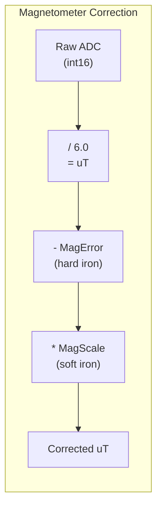

### 1.2 Low-Pass Filtering (First-Order IIR)

After scaling, all sensor readings pass through a first-order IIR (Infinite Impulse Response) low-pass filter, also known as an Exponential Moving Average (EMA):

```
filtered[n] = (1 - B) * filtered[n-1] + B * raw[n]
```

This is equivalent to the transfer function of a single-pole low-pass filter in the Z-domain:

```
H(z) = B / (1 - (1-B) * z^(-1))
```

#### Filter Coefficients

| Signal          | Coefficient (B)  | Approximate Cutoff Frequency |
|-----------------|-------------------|------------------------------|
| Accelerometer   | B_accel = 0.14    | ~44.6 Hz                     |
| Gyroscope       | B_gyro = 0.1      | ~31.8 Hz                     |
| Magnetometer    | B_mag = 1.0       | No filtering (passthrough)   |
| Radio commands  | b = 0.7           | ~222.8 Hz                    |

#### Cutoff Frequency Derivation

For a first-order IIR filter running at sample rate `f_s`, the -3dB cutoff frequency is:

```
f_c = -f_s / (2*pi) * ln(1 - B)
```

For small B, this simplifies to the approximation:

```
f_c ~ B * f_s / (2*pi)
```

With `f_s = 2000 Hz` (the loop rate):
- Accelerometer: `f_c ~ 0.14 * 2000 / (2*pi) = 44.6 Hz`
- Gyroscope: `f_c ~ 0.1 * 2000 / (2*pi) = 31.8 Hz`

The exact formula gives:
- Accelerometer: `f_c = -2000/(2*pi) * ln(0.86) = 48.0 Hz`
- Gyroscope: `f_c = -2000/(2*pi) * ln(0.9) = 33.5 Hz`

#### Interpretation

- **B = 0**: Output never changes (infinite memory, zero bandwidth).
- **B = 1**: No filtering; output equals current input (full bandwidth passthrough).
- **Larger B**: More responsive but noisier. Smaller B: smoother but more lag.

The magnetometer uses `B_mag = 1.0` meaning no filtering is applied (the Madgwick filter itself handles magnetometer fusion). Radio commands use `b = 0.7`, which is relatively aggressive but appropriate since radio signals update at a much lower rate than the 2kHz loop.

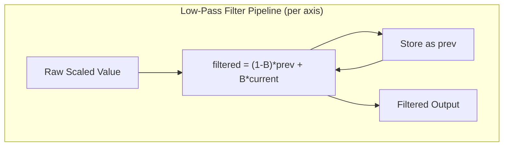

### 1.3 IMU Error Calibration

On startup, the `calculate_IMU_error()` function computes bias offsets by averaging 12,000 samples while the vehicle is stationary and level:

```
AccErrorX = (1/N) * SUM(AccX_i)   for i = 1..12000
AccErrorY = (1/N) * SUM(AccY_i)
AccErrorZ = (1/N) * SUM(AccZ_i) - 1.0    <-- subtract gravity!
GyroErrorX = (1/N) * SUM(GyroX_i)
GyroErrorY = (1/N) * SUM(GyroY_i)
GyroErrorZ = (1/N) * SUM(GyroZ_i)
```

Key points:
- The accelerometer Z-axis error has `1.0` subtracted because when the vehicle is level, Z should read exactly 1.0 G (gravity). The error is the deviation from this expected value.
- Gyroscope errors represent the zero-rate offset (bias drift). When stationary, all gyro readings should be zero.
- These errors are subtracted from every subsequent reading in `getIMUdata()`:
  ```
  AccX = AccX - AccErrorX
  GyroX = GyroX - GyroErrorX
  ```
- The calibration values are printed to the serial monitor and then hard-coded into the source. The calibration function is then commented out for production use.

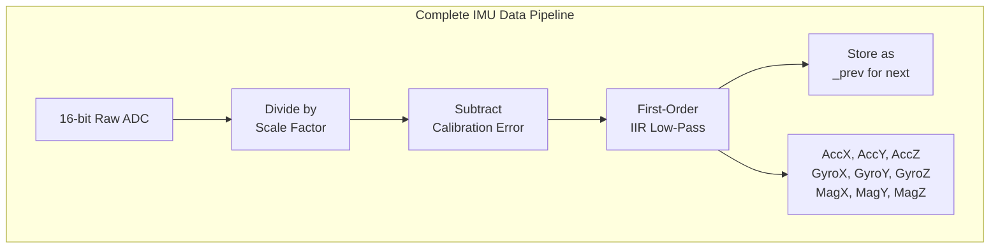

---

## 2. Madgwick Attitude Estimation Filter

The Madgwick filter is a computationally efficient sensor fusion algorithm that combines gyroscope, accelerometer, and (optionally) magnetometer data to estimate the vehicle's orientation as a quaternion. It was published by Sebastian Madgwick in 2010.

### 2.1 Quaternion Representation

A unit quaternion encodes a 3D rotation without gimbal lock:

```
q = q0 + q1*i + q2*j + q3*k = [q0, q1, q2, q3]
```

where:
- `q0` is the scalar (real) part
- `q1, q2, q3` are the vector (imaginary) parts
- The unit constraint: `q0^2 + q1^2 + q2^2 + q3^2 = 1`

The quaternion is initialized to the identity rotation (level orientation):

```c
float q0 = 1.0f;
float q1 = 0.0f;
float q2 = 0.0f;
float q3 = 0.0f;
```

This represents zero rotation: the body frame is aligned with the world frame (NWU -- North-West-Up convention).

### 2.2 Axis Remapping at the Call Site

Before the Madgwick function is called, the code remaps sensor axes to match the NWU convention:

```c
Madgwick(GyroX, -GyroY, -GyroZ, -AccX, AccY, AccZ, MagY, -MagX, MagZ, dt);
```

The negations and swaps align the IMU's physical axes with the expected NWU frame of the Madgwick algorithm.

### 2.3 The 6DOF Algorithm (Madgwick6DOF)

This variant is used with the MPU6050 (no magnetometer). It fuses gyroscope and accelerometer data only.

#### Step 1: Convert Gyroscope to Radians

```
gx_rad = gx * 0.0174533    (pi/180 = 0.0174533)
gy_rad = gy * 0.0174533
gz_rad = gz * 0.0174533
```

#### Step 2: Quaternion Derivative from Gyroscope

The kinematic equation for quaternion propagation using angular velocity is:

```
q_dot = (1/2) * q (x) omega
```

where `(x)` denotes quaternion multiplication and `omega = [0, gx, gy, gz]` is the angular velocity as a pure quaternion. Expanding:

```
qDot1 = 0.5 * (-q1*gx - q2*gy - q3*gz)
qDot2 = 0.5 * ( q0*gx + q2*gz - q3*gy)
qDot3 = 0.5 * ( q0*gy - q1*gz + q3*gx)
qDot4 = 0.5 * ( q0*gz + q1*gy - q2*gx)
```

This can be written in matrix form:

```
| qDot1 |         |  0  -gx  -gy  -gz | | q0 |
| qDot2 | = 0.5 * | gx   0    gz  -gy | | q1 |
| qDot3 |         | gy  -gz   0    gx | | q2 |
| qDot4 |         | gz   gy  -gx   0  | | q3 |
```

This gyroscope-only estimate would drift over time because gyroscopes have bias errors that accumulate during integration.

#### Step 3: Accelerometer Correction via Gradient Descent

The accelerometer measures the direction of gravity in the body frame. In the world frame, gravity points in the `[0, 0, 1]` direction (assuming NWU, where Z is up). The expected gravity direction in the body frame, given quaternion `q`, is:

```
g_expected = [2*(q1*q3 - q0*q2),
              2*(q0*q1 + q2*q3),
              q0^2 - q1^2 - q2^2 + q3^2]
```

The objective function `f` is the difference between the measured (normalized) accelerometer reading and the expected gravity direction:

```
f = g_expected - a_measured
```

The gradient of `||f||^2` with respect to `q` gives the direction to adjust `q` to minimize this error:

```
s0 = 4*q0*q2q2 + 2*q2*ax + 4*q0*q1q1 - 2*q1*ay
s1 = 4*q1*q3q3 - 2*q3*ax + 4*q0q0*q1 - 2*q0*ay - 4*q1 + 8*q1*q1q1 + 8*q1*q2q2 + 4*q1*az
s2 = 4*q0q0*q2 + 2*q0*ax + 4*q2*q3q3 - 2*q3*ay - 4*q2 + 8*q2*q1q1 + 8*q2*q2q2 + 4*q2*az
s3 = 4*q1q1*q3 - 2*q1*ax + 4*q2q2*q3 - 2*q2*ay
```

The gradient is then normalized:

```
norm = 1 / sqrt(s0^2 + s1^2 + s2^2 + s3^2)
s0 *= norm;  s1 *= norm;  s2 *= norm;  s3 *= norm;
```

#### Step 4: Apply Correction

The correction term is subtracted from the gyroscope-derived quaternion derivative, weighted by `B_madgwick`:

```
qDot1 -= B_madgwick * s0
qDot2 -= B_madgwick * s1
qDot3 -= B_madgwick * s2
qDot4 -= B_madgwick * s3
```

`B_madgwick = 0.04` controls the trade-off:
- **Higher B_madgwick**: Trusts accelerometer more; converges faster but noisier (susceptible to vibration).
- **Lower B_madgwick**: Trusts gyroscope more; smoother but slower to correct drift.

#### Step 5: Integrate

Forward Euler integration of the quaternion derivative:

```
q0 += qDot1 * dt
q1 += qDot2 * dt
q2 += qDot3 * dt
q3 += qDot4 * dt
```

where `dt` is `invSampleFreq`, the time elapsed since the last loop iteration in seconds.

#### Step 6: Normalize

Re-normalize the quaternion to maintain the unit constraint (numerical integration causes drift from unit length):

```
norm = 1 / sqrt(q0^2 + q1^2 + q2^2 + q3^2)
q0 *= norm;  q1 *= norm;  q2 *= norm;  q3 *= norm;
```

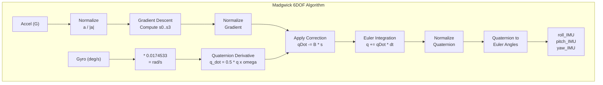

### 2.4 The 9DOF Algorithm (with Magnetometer)

Used with the MPU9250 when magnetometer data is available. The structure is identical to the 6DOF algorithm but with an extended gradient descent that also minimizes the error between the measured magnetic field and the expected Earth's magnetic field direction.

#### Reference Magnetic Field Computation

The Earth's magnetic field in the body frame is rotated to the world frame using the current quaternion estimate, then projected onto the horizontal plane:

```
hx = mx*q0q0 - 2*q0*my*q3 + 2*q0*mz*q2 + mx*q1q1 + 2*q1*my*q2 + 2*q1*mz*q3 - mx*q2q2 - mx*q3q3
hy = 2*q0*mx*q3 + my*q0q0 - 2*q0*mz*q1 + 2*q1*mx*q2 - my*q1q1 + my*q2q2 + 2*q2*mz*q3 - my*q3q3
```

The reference field is then defined as:

```
_2bx = sqrt(hx^2 + hy^2)     [horizontal component magnitude]
_2bz = (vertical component)   [computed similarly]
```

This means the algorithm does not need to know the local magnetic declination -- it dynamically computes the reference from the current measurement and only uses the relative direction.

#### Extended Gradient

The gradient `s0..s3` now includes terms from both the gravity objective function AND the magnetic field objective function. The expressions are significantly longer (each line in the source code combines both contributions):

```
s0 = (gravity terms) + (magnetic field terms)
s1 = (gravity terms) + (magnetic field terms)
s2 = (gravity terms) + (magnetic field terms)
s3 = (gravity terms) + (magnetic field terms)
```

The magnetic field terms involve `_2bx`, `_2bz`, `_4bx = 2*_2bx`, and `_4bz = 2*_2bz` along with the measured magnetometer vector `[mx, my, mz]`.

The rest of the algorithm (correction, integration, normalization, Euler extraction) is identical to the 6DOF version.

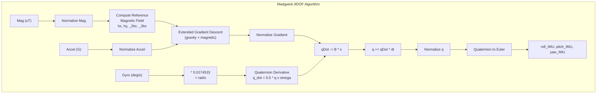

### 2.5 Quaternion to Euler Angles

After the quaternion is updated, Euler angles are extracted using the NWU convention:

```
roll_IMU  =  atan2(q0*q1 + q2*q3, 0.5 - q1^2 - q2^2)  * 57.29577951
pitch_IMU = -asin(constrain(-2*(q1*q3 - q0*q2), -0.999999, 0.999999)) * 57.29577951
yaw_IMU   = -atan2(q1*q2 + q0*q3, 0.5 - q2^2 - q3^2)  * 57.29577951
```

Where `57.29577951 = 180/pi` converts radians to degrees.

**Important details:**

- The `constrain(-2*(q1*q3 - q0*q2), -0.999999, 0.999999)` prevents the `asin` argument from exceeding `[-1, +1]` due to floating-point errors, which would return `NaN`. This also provides **gimbal lock protection** near +/-90 degree pitch.
- The `0.5 - q1^2 - q2^2` terms come from the rotation matrix elements derived from the quaternion. Specifically, using the identity `q0^2 + q1^2 + q2^2 + q3^2 = 1`, we get `q0^2 - q1^2 - q2^2 + q3^2 = 1 - 2*q1^2 - 2*q2^2 = 2*(0.5 - q1^2 - q2^2)`. Since `atan2` is scale-invariant, the factor of 2 is dropped.
- The negative signs on `pitch_IMU` and `yaw_IMU` adjust the sign conventions to match the desired output frame.

These are the ZYX (yaw-pitch-roll) Tait-Bryan angles, representing sequential rotations about Z (yaw), Y (pitch), X (roll).

### 2.6 Fast Inverse Square Root

The `invSqrt()` function computes `1/sqrt(x)` and is called repeatedly for normalization. The source contains two commented-out versions of the famous "fast inverse square root" algorithm (originally from Quake III Arena):

```c
// Quake III version (commented out):
float halfx = 0.5f * x;
float y = x;
long i = *(long*)&y;
i = 0x5f3759df - (i>>1);    // "magic number" bit-level hack
y = *(float*)&i;
y = y * (1.5f - (halfx * y * y));  // Newton-Raphson iteration
y = y * (1.5f - (halfx * y * y));  // Second iteration for accuracy
return y;
```

This uses IEEE 754 floating-point bit manipulation to compute an initial approximation, then refines it with Newton-Raphson iterations. On the Teensy 4.0 (ARM Cortex-M7 with FPU), the hardware floating-point unit makes the standard library version fast enough:

```c
return 1.0/sqrtf(x);  // Used in practice
```

---

## 3. Desired State Computation

The `getDesState()` function converts raw radio PWM values (typically 1000-2000 us) into normalized control commands.

### 3.1 Throttle

```
thro_des = (channel_1_pwm - 1000) / 1000
```

Maps PWM 1000-2000 to the range [0.0, 1.0]. Constrained to [0, 1].

### 3.2 Roll, Pitch, Yaw

```
roll_des  = (channel_2_pwm - 1500) / 500    --> [-1, 1]
pitch_des = (channel_3_pwm - 1500) / 500    --> [-1, 1]
yaw_des   = (channel_4_pwm - 1500) / 500    --> [-1, 1]
```

Then scaled by the maximum allowed angle/rate:

```
roll_des  = constrain(roll_des, -1, 1) * maxRoll     [degrees or deg/sec]
pitch_des = constrain(pitch_des, -1, 1) * maxPitch    [degrees or deg/sec]
yaw_des   = constrain(yaw_des, -1, 1) * maxYaw        [deg/sec]
```

Default values: `maxRoll = 30 deg`, `maxPitch = 30 deg`, `maxYaw = 160 deg/sec`.

### 3.3 Passthrough Commands

For direct (unstabilized) actuator control:

```
roll_passthru  = roll_des_normalized / 2.0    --> [-0.5, 0.5]
pitch_passthru = pitch_des_normalized / 2.0   --> [-0.5, 0.5]
yaw_passthru   = yaw_des_normalized / 2.0     --> [-0.5, 0.5]
```

These are computed before the maxAngle scaling is applied (from the [-1,1] normalized value).

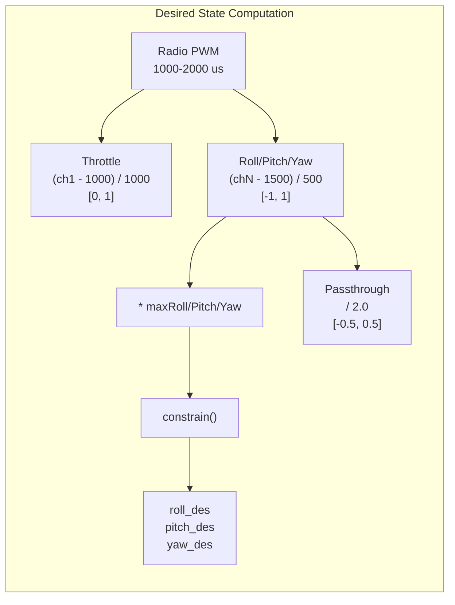

---

## 4. PID Control Mathematics

dRehmFlight implements three PID controller variants. All share common features:
- Output is scaled by `0.01` to bring it into approximately [-1, 1] range
- Integrators are saturated at `+/- i_limit` (default 25.0)
- Integrators are reset to 0 when throttle PWM < 1060 (preventing wind-up on the ground)
- Yaw is always controlled in **rate mode** (even in `controlANGLE`)

### 4.1 controlANGLE() -- Single-Loop Angle Stabilization

This is the primary controller for beginners. It uses angle error for roll/pitch and rate error for yaw.

#### Roll and Pitch

```
error     = desired_angle - measured_angle     (e.g., roll_des - roll_IMU)
integral  = integral_prev + error * dt
integral  = constrain(integral, -i_limit, i_limit)
derivative = GyroX                              (measured angular rate, NOT derivative of error!)

output = 0.01 * (Kp * error + Ki * integral - Kd * derivative)
```

**Critical note on the D-term**: The derivative term uses the **raw gyroscope reading** (angular rate), not `d(error)/dt`. This is the "derivative on measurement" technique. The key insight:

```
d(error)/dt = d(desired - measured)/dt = d(desired)/dt - d(measured)/dt
```

Since desired angle changes slowly (or is constant between updates), `d(desired)/dt ~ 0`, so `d(error)/dt ~ -d(measured)/dt = -GyroX`. The code uses `- Kd * GyroX` which is equivalent to `+ Kd * (-GyroX)`. This avoids the "derivative kick" problem where sudden changes in setpoint cause large D-term spikes.

The sign is **negative** (`- Kd * derivative`) because `GyroX` is the rate in the same direction as increasing `roll_IMU`, so it naturally opposes the error without an extra negation.

#### Yaw

Yaw always operates in rate mode:

```
error     = yaw_des - GyroZ                    (desired rate - measured rate)
integral  = integral_prev + error * dt
integral  = constrain(integral, -i_limit, i_limit)
derivative = (error - error_prev) / dt          (derivative of error)

output = 0.01 * (Kp * error + Ki * integral + Kd * derivative)
```

Note: Yaw uses `+ Kd` (standard derivative of error), while roll/pitch use `- Kd` (derivative on measurement).

#### Default Gains

| Parameter | Roll | Pitch | Yaw |
|-----------|------|-------|-----|
| Kp        | 0.2  | 0.2   | 0.3 |
| Ki        | 0.3  | 0.3   | 0.05 |
| Kd        | 0.05 | 0.05  | 0.00015 |

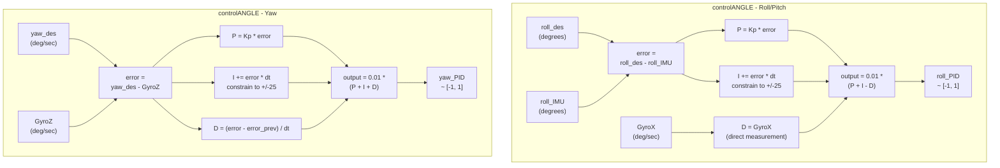

### 4.2 controlANGLE2() -- Cascaded Angle + Rate Control

This is a two-loop (cascaded) controller that provides better performance but is harder to tune. The outer loop converts angle error into a desired rate, and the inner loop tracks that desired rate.

#### Outer Loop (Angle to Rate)

```
error     = desired_angle - measured_angle        (roll_des - roll_IMU)
integral  = integral_prev_ol + error * dt
integral  = constrain(integral, -i_limit, i_limit)
// Note: D-term is COMMENTED OUT in the code
rate_des  = Kp_angle * error + Ki_angle * integral

rate_des  = rate_des * Kl          (Kl = 30.0, loop gain)
rate_des  = constrain(rate_des, -240, 240)    [deg/sec]
rate_des  = (1 - B_loop) * rate_des_prev + B_loop * rate_des
```

The loop gain `Kl = 30.0` amplifies the PI output to produce desired angular rates. The constraint at +/-240 deg/sec prevents excessive rates. The LP filter with `B_loop_roll = 0.9` (or `B_loop_pitch = 0.9`) provides **artificial damping** -- it smooths the transition of the commanded rate, reducing overshoot without needing an explicit D-term in the outer loop.

#### Inner Loop (Rate PID)

```
error     = rate_des_from_outer - GyroX           (desired rate - measured rate)
integral  = integral_prev_il + error * dt
integral  = constrain(integral, -i_limit, i_limit)
derivative = (error - error_prev) / dt

output = 0.01 * (Kp_rate * error + Ki_rate * integral + Kd_rate * derivative)
```

This uses the **rate-mode gains** (`Kp_roll_rate`, `Ki_roll_rate`, `Kd_roll_rate`), not the angle-mode gains.

Yaw in `controlANGLE2()` is identical to yaw in `controlANGLE()`.

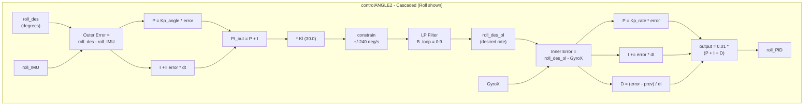

### 4.3 controlRATE() -- Pure Rate Stabilization

This is the simplest controller, used for acrobatic flight. It stabilizes on a desired angular rate.

```
error     = desired_rate - measured_rate       (roll_des - GyroX)
integral  = integral_prev + error * dt
integral  = constrain(integral, -i_limit, i_limit)
derivative = (error - error_prev) / dt

output = 0.01 * (Kp_rate * error + Ki_rate * integral + Kd_rate * derivative)
```

All three axes (roll, pitch, yaw) use the same structure. `maxRoll` and `maxPitch` represent maximum rates in deg/sec (not angles) when in rate mode.

#### Default Rate Gains

| Parameter | Roll   | Pitch  | Yaw     |
|-----------|--------|--------|---------|
| Kp        | 0.15   | 0.15   | 0.3     |
| Ki        | 0.2    | 0.2    | 0.05    |
| Kd        | 0.0002 | 0.0002 | 0.00015 |

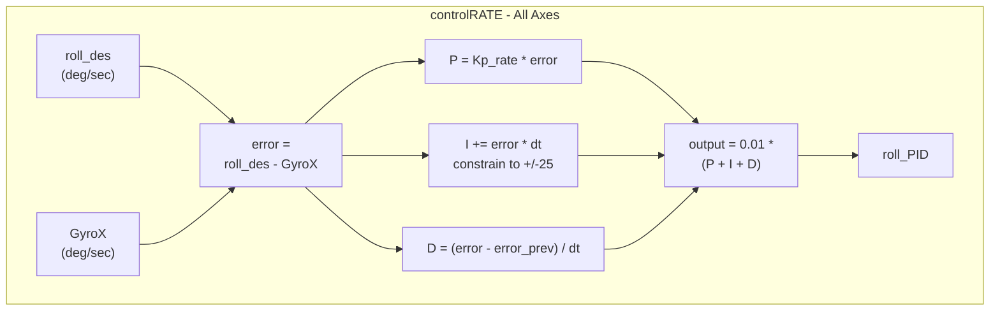

### 4.4 Integrator Anti-Windup

All PID controllers implement two anti-windup mechanisms:

1. **Saturation clamping**: `integral = constrain(integral, -i_limit, i_limit)` where `i_limit = 25.0`. This prevents the integral term from growing unboundedly when the error persists (e.g., the vehicle is held at an angle while on the ground).

2. **Low-throttle reset**: When `channel_1_pwm < 1060` (throttle essentially at zero), the integral is forced to zero. This prevents integral wind-up on the ground and ensures the integrator starts from zero at takeoff.

---

## 5. Command Scaling

### 5.1 Motor Commands (OneShot125)

PID outputs and throttle are mixed in `controlMixer()` (application-specific), producing `mX_command_scaled` values in approximately [0, 1]. These are then scaled to OneShot125 protocol timing:

```
m_command_PWM = m_command_scaled * 125 + 125
m_command_PWM = constrain(m_command_PWM, 125, 250)
```

| Scaled Value | PWM (us) | Meaning        |
|-------------|----------|----------------|
| 0.0         | 125      | Motor off      |
| 1.0         | 250      | Full throttle  |

The `commandMotors()` function implements OneShot125 by bit-banging GPIO: all motor pins go HIGH simultaneously, then each pin goes LOW after its specific pulse duration has elapsed.

### 5.2 Servo Commands

```
s_command_PWM = s_command_scaled * 180
s_command_PWM = constrain(s_command_PWM, 0, 180)
```

| Scaled Value | Servo Angle | Meaning          |
|-------------|-------------|------------------|
| 0.0         | 0 degrees   | Minimum position |
| 0.5         | 90 degrees  | Center position  |
| 1.0         | 180 degrees | Maximum position |

The PWMServo library converts these 0-180 degree values to the appropriate 1000-2000 us PWM signals.

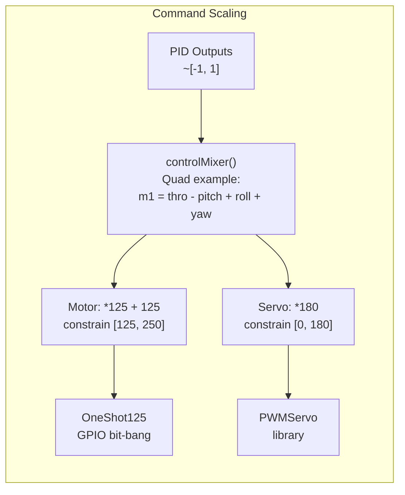

### 5.3 Example Quad Mixer

The default mixer implements a standard quadcopter "X" configuration:

```
m1 (Front Left)  = thro_des - pitch_PID + roll_PID + yaw_PID
m2 (Front Right) = thro_des - pitch_PID - roll_PID - yaw_PID
m3 (Back Right)  = thro_des + pitch_PID - roll_PID + yaw_PID
m4 (Back Left)   = thro_des + pitch_PID + roll_PID - yaw_PID
```

The sign pattern encodes:
- **Pitch**: Front motors subtract pitch_PID (nose-down torque), rear motors add it
- **Roll**: Left motors add roll_PID, right motors subtract it
- **Yaw**: Diagonal pairs share yaw sign (CW props on one diagonal, CCW on the other)

---

## 6. Transition Fading Utilities

### 6.1 floatFaderLinear()

Linearly interpolates a parameter between min and max at a fixed rate:

```
diffParam = (param_max - param_min) / (fadeTime * loopFreq)

if state == 1:    param += diffParam    (fade toward max)
if state == 0:    param -= diffParam    (fade toward min)

param = constrain(param, param_min, param_max)
```

Each loop iteration moves the parameter by `diffParam`. After `fadeTime` seconds (at `loopFreq` Hz), the full range is traversed.

### 6.2 floatFaderLinear2()

Fades a parameter toward a target value, with independent rates for increasing and decreasing:

```
if param > param_des:    (need to decrease)
    diffParam = (param_upper - param_des) / (fadeTime_down * loopFreq)
    param -= diffParam

if param < param_des:    (need to increase)
    diffParam = (param_des - param_lower) / (fadeTime_up * loopFreq)
    param += diffParam

param = constrain(param, param_lower, param_upper)
```

Note that the rate is computed based on the distance from the boundary to the target, not the current distance to the target. This means the approach speed is constant (linear), not proportional to remaining distance.

---

## 7. Comprehensive Math Flow Diagrams

### 7.1 Complete Pipeline: Sensors to Actuators

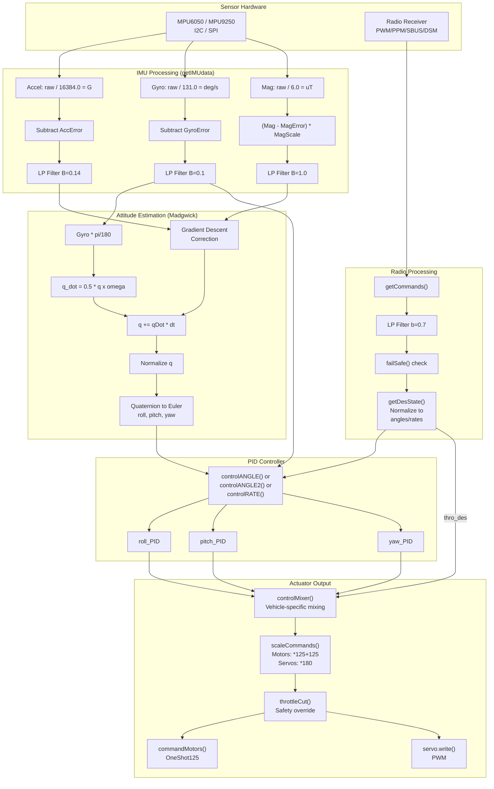

### 7.2 Madgwick Filter Detailed Data Flow

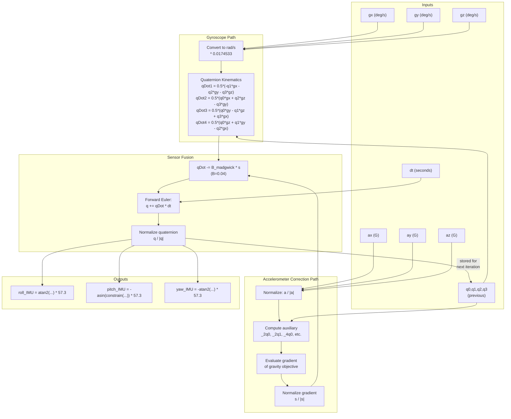

### 7.3 PID Controller Comparison

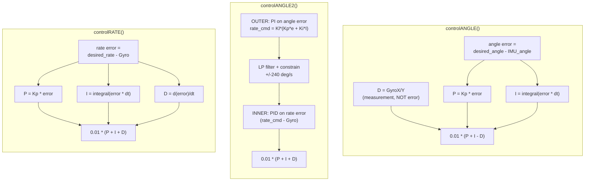

### 7.4 Command Scaling Pipeline

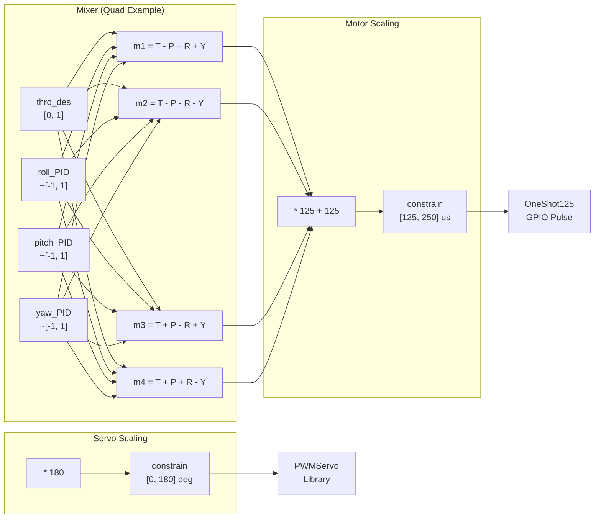

---

## Appendix A: Constants Reference

| Constant | Value | Meaning |
|----------|-------|---------|
| `0.0174533` | pi / 180 | Degrees to radians |
| `57.29577951` | 180 / pi | Radians to degrees |
| `0x5f3759df` | Quake magic number | Fast invSqrt initial guess (unused) |
| `16384.0` | 2^14 | Accel scale for +/-2G |
| `131.0` | 32768 / 250 | Gyro scale for +/-250 DPS |
| `6.0` | MPU9250 mag constant | Magnetometer raw-to-uT divisor |
| `0.04` | B_madgwick | Madgwick filter gain |
| `0.14` | B_accel | Accelerometer LP coefficient |
| `0.1` | B_gyro | Gyroscope LP coefficient |
| `1.0` | B_mag | Magnetometer LP coefficient (no filtering) |
| `0.7` | b (radio) | Radio command LP coefficient |
| `25.0` | i_limit | Integrator saturation limit |
| `30.0` | Kl | Cascaded controller loop gain |
| `240.0` | Rate limit | Cascaded controller rate constraint (deg/sec) |
| `0.9` | B_loop_roll/pitch | Cascaded controller damping filter |
| `2000` | Loop rate | Target control loop frequency (Hz) |
| `12000` | Calibration samples | Number of IMU samples for error calibration |

## Appendix B: Variable Flow Summary

| Stage | Input | Output | Function |
|-------|-------|--------|----------|
| IMU Read | I2C/SPI registers | AcX..MgZ (int16) | `getIMUdata()` |
| Scale | Raw int16 | AccX..MagZ (float, physical units) | `getIMUdata()` |
| Calibrate | Scaled values | Error-corrected values | `getIMUdata()` |
| LP Filter | Corrected values | Smoothed AccX..MagZ | `getIMUdata()` |
| Attitude | AccX,GyroX,MagX,dt | roll/pitch/yaw_IMU (degrees) | `Madgwick()` / `Madgwick6DOF()` |
| Radio | PWM/SBUS/DSM | channel_X_pwm (1000-2000) | `getCommands()` |
| Radio Filter | Raw channel PWM | Filtered channel PWM | `getCommands()` |
| Desired State | channel_X_pwm | thro/roll/pitch/yaw_des | `getDesState()` |
| PID | desired + IMU + Gyro | roll/pitch/yaw_PID (~[-1,1]) | `controlANGLE/2/RATE()` |
| Mix | PID + throttle | mX/sX_command_scaled | `controlMixer()` |
| Scale | Scaled commands | mX_PWM (125-250), sX_PWM (0-180) | `scaleCommands()` |
| Safety | PWM commands | Overridden if disarmed | `throttleCut()` |
| Output | Final PWM | GPIO pulses / Servo signals | `commandMotors()` / `servo.write()` |
