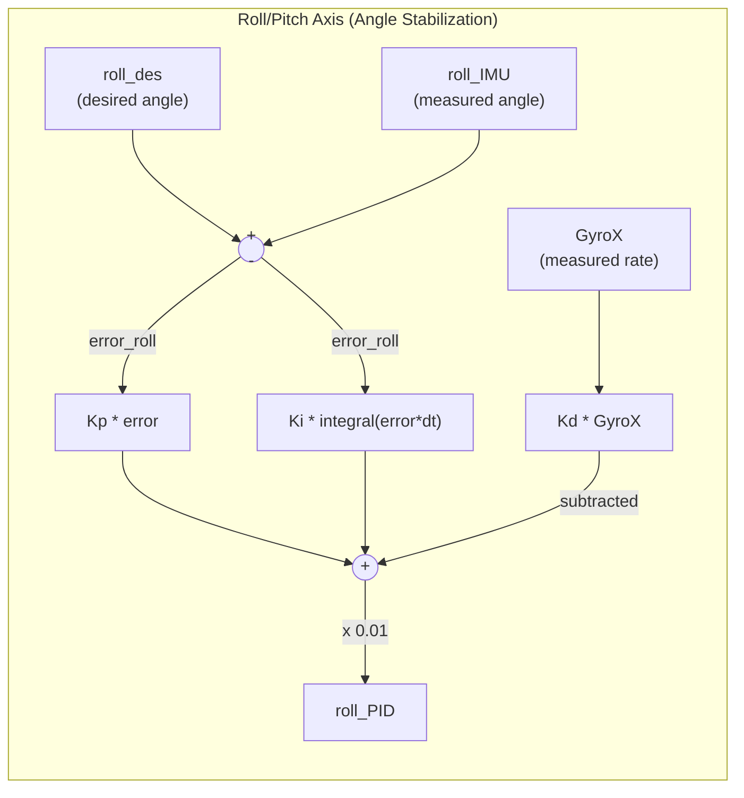
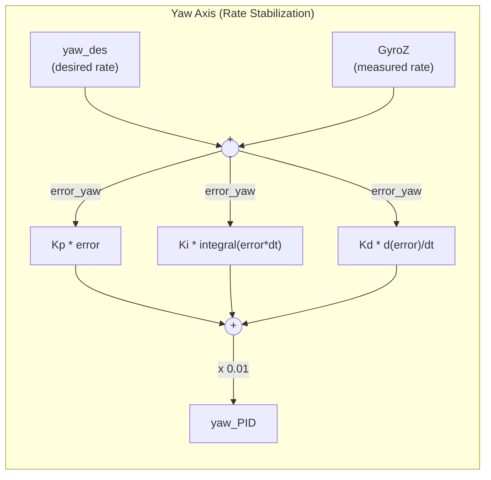
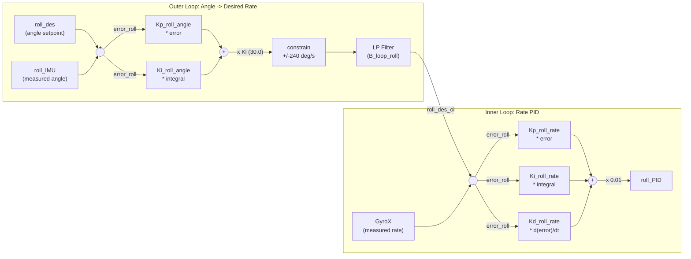
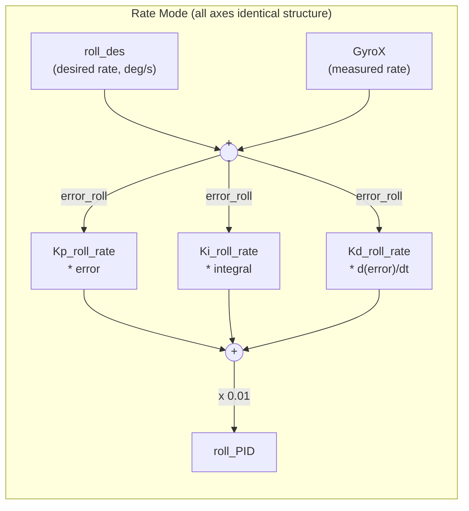
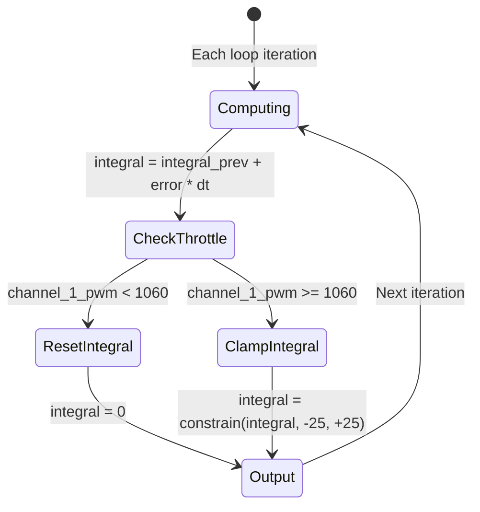

# PID Control Systems in dRehmFlight

This document provides a comprehensive reference for every PID controller implementation in the dRehmFlight BETA 1.3 flight controller firmware. It covers the underlying control theory, walks through each function line-by-line, and provides guidance on gain tuning and safety mechanisms.

---

## Table of Contents

1. [PID Control Theory Primer](#1-pid-control-theory-primer)
2. [controlANGLE() -- Angle Mode](#2-controlangle----angle-mode)
3. [controlANGLE2() -- Cascaded Angle+Rate Control](#3-controlangle2----cascaded-anglerate-control)
4. [controlRATE() -- Rate Mode](#4-controlrate----rate-mode)
5. [Gain Tuning Guide](#5-gain-tuning-guide)
6. [Safety Features in PID](#6-safety-features-in-pid)
7. [Variable Reference Table](#7-variable-reference-table)

---

## 1. PID Control Theory Primer

### What is PID Control?

PID stands for **Proportional-Integral-Derivative**. It is a feedback control algorithm that continuously calculates an error value (the difference between a desired setpoint and a measured process variable) and applies a correction based on three terms:

- **Proportional (P):** Reacts to the *current* error. Larger error produces a larger correction. This is the primary "spring" force that pulls the system toward the setpoint.
- **Integral (I):** Reacts to the *accumulated* error over time. Eliminates steady-state offset that the P term alone cannot correct (e.g., a constant wind pushing the vehicle off-angle).
- **Derivative (D):** Reacts to the *rate of change* of error. Provides damping that resists rapid changes, preventing overshoot and oscillation.

### The Standard PID Equation

In continuous time:

```
u(t) = Kp * e(t) + Ki * integral(e(t) dt) + Kd * de(t)/dt
```

Where:
- `u(t)` is the controller output (actuator command)
- `e(t)` is the error: `setpoint - measurement`
- `Kp`, `Ki`, `Kd` are the proportional, integral, and derivative gains

### Discrete-Time Implementation

The dRehmFlight code runs in a fixed-rate loop (typically 2000 Hz, `dt` in seconds). The continuous PID equation is discretized as follows:

| Continuous | Discrete (dRehmFlight) |
|---|---|
| `e(t)` | `error = desired - measured` |
| `integral(e dt)` | `integral = integral_prev + error * dt` |
| `de/dt` | `derivative = (error - error_prev) / dt` or `derivative = GyroX` (direct measurement) |

The integral is computed via rectangular (Euler) integration. The derivative is computed either as a finite difference of the error signal or by directly reading the gyroscope (which inherently measures angular rate).

### Why PID Works for Flight Stabilization

A multirotor in flight is an inherently unstable system -- without active control, any small perturbation causes the vehicle to tumble. PID control works well here because:

1. **P term** provides the restoring force to return to level flight (like a spring).
2. **I term** compensates for persistent disturbances (wind, center-of-gravity offset, motor asymmetry).
3. **D term** damps oscillations and prevents overshoot, which is critical because overcorrection at hundreds of Hz would cause violent oscillation.

The system is sampled at 2000 Hz (0.5 ms loop time), which is fast enough to stabilize even aggressive maneuvers and reject high-frequency disturbances.

---

## 2. controlANGLE() -- Angle Mode

This is the simplest and most beginner-friendly controller. It stabilizes the vehicle to a desired **angle** (roll and pitch) and a desired **yaw rate**.

### Signal Flow Diagram





### Roll Axis -- Line-by-Line

```cpp
// Line 945: Compute error between desired angle and measured angle
error_roll = roll_des - roll_IMU;

// Line 946: Rectangular integration of error
integral_roll = integral_roll_prev + error_roll * dt;

// Line 947-949: Integrator reset at low throttle
if (channel_1_pwm < 1060) {
    integral_roll = 0;
}

// Line 950: Integrator anti-windup clamp
integral_roll = constrain(integral_roll, -i_limit, i_limit);

// Line 951: Derivative term uses GYRO DIRECTLY, not derivative of error
derivative_roll = GyroX;

// Line 952: Compute PID output
roll_PID = 0.01 * (Kp_roll_angle * error_roll
                  + Ki_roll_angle * integral_roll
                  - Kd_roll_angle * derivative_roll);
```

**Why use GyroX directly instead of differentiating the angle error?**

This is a critical design choice. Differentiating the angle error `(error - error_prev) / dt` would amplify high-frequency sensor noise, since differentiation is a high-pass operation. The gyroscope already measures angular rate directly with far less noise than a numerically differentiated angle signal. Since `d(error)/dt = d(roll_des)/dt - d(roll_IMU)/dt` and the desired angle changes slowly (from pilot stick input), `d(error)/dt` is approximately `-d(roll_IMU)/dt`, which is exactly `-GyroX`. Hence the **minus sign** on the Kd term: `- Kd * GyroX` is equivalent to `+ Kd * d(error)/dt` with the noise advantage of direct gyro measurement.

### Pitch Axis

Identical structure to roll, substituting `pitch_des`, `pitch_IMU`, `GyroY`, and pitch gains.

### Yaw Axis

The yaw axis **always operates as a rate controller**, even in angle mode. This is because yaw angle is unbounded (0-360 degrees wraps around) and pilots intuitively expect yaw stick input to command a rotation rate, not an absolute heading.

```cpp
error_yaw = yaw_des - GyroZ;                          // Rate error
integral_yaw = integral_yaw_prev + error_yaw * dt;    // Integrate
// ... anti-windup and throttle check ...
derivative_yaw = (error_yaw - error_yaw_prev) / dt;   // Derivative of error
yaw_PID = 0.01 * (Kp_yaw * error_yaw
                 + Ki_yaw * integral_yaw
                 + Kd_yaw * derivative_yaw);           // Note: PLUS sign on Kd
```

The **plus sign** on the Kd term for yaw (vs. minus for roll/pitch) is because the derivative here is computed from the error signal directly `(error - error_prev)/dt`, not from a raw gyro measurement. The sign convention is consistent: positive derivative of error means error is growing, so we add more correction.

### Default Gains

| Parameter | Value | Description |
|---|---|---|
| `Kp_roll_angle` | 0.2 | Roll proportional gain (angle mode) |
| `Ki_roll_angle` | 0.3 | Roll integral gain (angle mode) |
| `Kd_roll_angle` | 0.05 | Roll derivative gain (angle mode) |
| `Kp_pitch_angle` | 0.2 | Pitch proportional gain (angle mode) |
| `Ki_pitch_angle` | 0.3 | Pitch integral gain (angle mode) |
| `Kd_pitch_angle` | 0.05 | Pitch D-gain (angle mode) |

---

## 3. controlANGLE2() -- Cascaded Angle+Rate Control

This is a two-loop (cascaded) controller that provides superior disturbance rejection at the cost of additional tuning complexity. The outer loop operates on angle error and outputs a desired angular rate. The inner loop then tracks that desired rate using a separate PID.

### Cascaded Control Loop Diagram



### Outer Loop Details

```cpp
// Angle error
error_roll = roll_des - roll_IMU;

// Integral with anti-windup
integral_roll_ol = integral_roll_prev_ol + error_roll * dt;
if (channel_1_pwm < 1060) { integral_roll_ol = 0; }
integral_roll_ol = constrain(integral_roll_ol, -i_limit, i_limit);

// Derivative computed but COMMENTED OUT in code
derivative_roll = (roll_IMU - roll_IMU_prev) / dt;

// PI controller output (D term commented out)
roll_des_ol = Kp_roll_angle * error_roll + Ki_roll_angle * integral_roll_ol;
// The following is commented out: - Kd_roll_angle * derivative_roll
```

The outer loop is effectively a **PI controller** (the D term is commented out in the source). This is intentional -- the inner rate loop already provides damping, so adding a derivative term in the outer loop is usually unnecessary and can introduce noise.

**Loop gain, rate limiting, and low-pass filter:**

```cpp
float Kl = 30.0;
roll_des_ol = Kl * roll_des_ol;                                      // Scale to rate command
roll_des_ol = constrain(roll_des_ol, -240.0, 240.0);                 // Limit to +/-240 deg/sec
roll_des_ol = (1.0 - B_loop_roll)*roll_des_prev + B_loop_roll*roll_des_ol;  // LP filter
```

- **Kl = 30.0**: The loop gain scales the angle-domain PI output into the rate domain (deg/sec). A value of 30 means that 1 degree of angle error (after PI processing) commands 30 deg/sec of rotation to correct it.
- **constrain to +/-240 deg/sec**: Prevents the outer loop from commanding excessively fast rotation, providing built-in rate limiting.
- **Low-pass filter**: `B_loop_roll = 0.9` (default). This is a first-order exponential moving average filter. The transfer function is `y[n] = (1 - B)*y[n-1] + B*x[n]`. With B=0.9 the filter is very light (passes most of the signal). Lower values of B provide heavier damping (more smoothing). This provides "artificial damping" to the outer loop's rate command.

### Inner Loop Details

```cpp
// Rate error: desired rate from outer loop minus measured rate
error_roll = roll_des_ol - GyroX;

// Standard PID on rate error
integral_roll_il = integral_roll_prev_il + error_roll * dt;
if (channel_1_pwm < 1060) { integral_roll_il = 0; }
integral_roll_il = constrain(integral_roll_il, -i_limit, i_limit);
derivative_roll = (error_roll - error_roll_prev) / dt;

roll_PID = 0.01 * (Kp_roll_rate * error_roll
                  + Ki_roll_rate * integral_roll_il
                  + Kd_roll_rate * derivative_roll);
```

The inner loop uses the **rate mode gains** (`Kp_roll_rate`, `Ki_roll_rate`, `Kd_roll_rate`), not the angle mode gains. The derivative is computed from the error signal (not direct gyro), which is standard for rate-mode PID.

### Yaw Axis

Identical to the yaw implementation in `controlANGLE()` -- a single-loop rate PID. The yaw axis does not use the cascaded structure.

### Advantages and Disadvantages

| Aspect | Advantage | Disadvantage |
|---|---|---|
| Disturbance rejection | Superior -- inner loop rejects rate disturbances before they become angle errors | More complex to understand |
| Rate limiting | Built-in via constrain on outer loop output | Additional parameters to tune |
| Tuning | Loops can be tuned independently (inner first, then outer) | Two full sets of gains (angle + rate) |
| Performance | Better tracking and damping | Not recommended for first-time setup |

### Default Gains

| Parameter | Value | Description |
|---|---|---|
| `Kp_roll_angle` | 0.2 | Outer loop P-gain |
| `Ki_roll_angle` | 0.3 | Outer loop I-gain |
| `B_loop_roll` | 0.9 | Outer loop LP filter coefficient (0-1, lower = more damping) |
| `B_loop_pitch` | 0.9 | Outer loop LP filter coefficient for pitch |
| `Kl` | 30.0 | Loop gain (angle-to-rate scaling) |
| `Kp_roll_rate` | 0.15 | Inner loop P-gain |
| `Ki_roll_rate` | 0.2 | Inner loop I-gain |
| `Kd_roll_rate` | 0.0002 | Inner loop D-gain |

---

## 4. controlRATE() -- Rate Mode

Rate mode stabilizes the vehicle's angular **rate** (deg/sec) rather than its angle. The pilot stick directly commands a rotation rate. When the stick is centered, the controller holds zero rotation rate (holds current attitude), but does not actively return to level flight.

### Signal Flow Diagram



### Line-by-Line

```cpp
// Rate error
error_roll = roll_des - GyroX;

// Integral with anti-windup and throttle check
integral_roll = integral_roll_prev + error_roll * dt;
if (channel_1_pwm < 1060) { integral_roll = 0; }
integral_roll = constrain(integral_roll, -i_limit, i_limit);

// Derivative of error (finite difference)
derivative_roll = (error_roll - error_roll_prev) / dt;

// PID output
roll_PID = 0.01 * (Kp_roll_rate * error_roll
                  + Ki_roll_rate * integral_roll
                  + Kd_roll_rate * derivative_roll);
```

All three axes (roll, pitch, yaw) use the same structure. The derivative is computed via finite difference of the error signal.

### Default Gains

| Parameter | Value |
|---|---|
| `Kp_roll_rate` | 0.15 |
| `Ki_roll_rate` | 0.2 |
| `Kd_roll_rate` | 0.0002 |
| `Kp_pitch_rate` | 0.15 |
| `Ki_pitch_rate` | 0.2 |
| `Kd_pitch_rate` | 0.0002 |
| `Kp_yaw` | 0.3 |
| `Ki_yaw` | 0.05 |
| `Kd_yaw` | 0.00015 |

### Use Cases

- Preferred by experienced pilots for aerobatics and manual flight.
- Essential for VTOL transition phases where angle stabilization may fight the desired flight envelope.
- Used as the inner loop of `controlANGLE2()`.

---

## 5. Gain Tuning Guide

### Comparison of All Three Controller Types

```mermaid
graph TD
    subgraph "controlANGLE()"
        A1["Angle Setpoint"] --> A2["PID on Angle Error<br/>(D term uses gyro directly)"]
        A2 --> A3["Actuator Command"]
    end

    subgraph "controlANGLE2()"
        B1["Angle Setpoint"] --> B2["PI on Angle Error<br/>(outer loop)"]
        B2 -->|"Rate Command<br/>(x30, constrain, LP filter)"| B3["PID on Rate Error<br/>(inner loop)"]
        B3 --> B4["Actuator Command"]
    end

    subgraph "controlRATE()"
        C1["Rate Setpoint"] --> C2["PID on Rate Error"]
        C2 --> C3["Actuator Command"]
    end
```



### Understanding Each Gain

| Gain | Effect | Too High | Too Low |
|---|---|---|---|
| **Kp** (Proportional) | Responsiveness to current error. Main "stiffness" of the controller. | Oscillation, instability. The vehicle will oscillate around the setpoint with increasing amplitude. | Sluggish response, large steady-state error (without Ki). Vehicle feels "mushy". |
| **Ki** (Integral) | Eliminates steady-state error. Compensates for persistent disturbances (wind, CG offset). | Slow, low-frequency oscillation and overshoot. The integrator "winds up" and causes the vehicle to swing past the setpoint. | Persistent offset/drift. Vehicle won't hold exact setpoint under disturbance. |
| **Kd** (Derivative) | Damping. Resists rapid changes in error, prevents overshoot. | Motors overheat from high-frequency corrections. Amplifies sensor noise causing audible motor buzz and vibration. | Underdamped response with overshoot and ringing after step inputs. |

### The 0.01 Scale Factor

All PID outputs are multiplied by `0.01`:

```cpp
roll_PID = 0.01 * (Kp * error + Ki * integral + Kd * derivative);
```

This normalizes the PID output to approximately the [-1, 1] range, which is then mixed in `controlMixer()` and mapped to servo/motor commands. Without this factor, the gains would need to be 100x smaller, making them harder to work with. The gains as published (e.g., `Kp_roll_angle = 0.2`) should be understood as being effectively `0.002` after the 0.01 scaling.

### The i_limit Parameter

`i_limit = 25.0` constrains the integrator state to [-25, 25]. Since the integrator is multiplied by Ki and then by 0.01, the maximum integral contribution to the output is:

```
max_integral_output = 0.01 * Ki * i_limit
                    = 0.01 * 0.3 * 25.0
                    = 0.075   (for angle mode roll)
```

This prevents the integrator from dominating the controller output.

### Practical Tuning Approach

1. **Start with all gains at zero** (or very low values).
2. **Increase Kp** until the vehicle responds crisply to stick input but begins to oscillate. Then back off to roughly 60-70% of that value.
3. **Add Ki** slowly. Increase until the vehicle holds its angle precisely against disturbances. If slow oscillation or overshoot appears, reduce Ki.
4. **Add Kd** in small increments. This damps overshoot from the P and I terms. Stop increasing when you hear motor buzz or feel vibration -- this means the D term is amplifying sensor noise.
5. **For controlANGLE2()**: Tune the inner (rate) loop first with the outer loop disconnected, then tune the outer loop gains and filter coefficient.

### Recommended Tuning Order

| Step | Action | Watch For |
|---|---|---|
| 1 | Set `Ki = 0`, `Kd = 0`, increase `Kp` | Oscillation onset |
| 2 | Back off `Kp` to ~60% of oscillation value | Stable but responsive |
| 3 | Slowly increase `Ki` | Slow oscillation, overshoot |
| 4 | Add small `Kd` | Motor buzz, vibration, overheating |
| 5 | Fine-tune all three together | Overall flight feel |

---

## 6. Safety Features in PID

### Integrator Anti-Windup



**Why integrator windup is dangerous:**

If the vehicle is held at an angle on the ground (or stuck against an obstacle), the error persists and the integrator accumulates indefinitely. When released, the accumulated integral causes a massive correction that can flip the vehicle or drive motors to maximum thrust on one side. The two protections are:

1. **Clamping (`constrain`):** The integrator is constrained to `[-i_limit, +i_limit]` (default +/-25) every iteration, preventing unbounded growth regardless of error magnitude or duration.

2. **Throttle-based reset:** When `channel_1_pwm < 1060` (throttle stick at or near minimum), the integrator is forced to zero. This ensures:
   - Motors do not spool up on the ground due to accumulated integral.
   - The integrator always starts from zero on takeoff.
   - Landing resets the integrator state cleanly.

### Output Scaling

The `0.01` multiplier on all PID outputs ensures the final command stays in approximately the [-1, 1] range. This prevents any single axis from commanding full actuator deflection from the PID alone, leaving headroom for the mixer to combine all axes.

---

## 7. Variable Reference Table

### Gain Parameters

| Variable | Type | Default | Range | Description |
|---|---|---|---|---|
| `Kp_roll_angle` | `float` | 0.2 | > 0 | Roll P-gain for angle mode |
| `Ki_roll_angle` | `float` | 0.3 | >= 0 | Roll I-gain for angle mode |
| `Kd_roll_angle` | `float` | 0.05 | >= 0 | Roll D-gain for angle mode (no effect in controlANGLE2) |
| `Kp_pitch_angle` | `float` | 0.2 | > 0 | Pitch P-gain for angle mode |
| `Ki_pitch_angle` | `float` | 0.3 | >= 0 | Pitch I-gain for angle mode |
| `Kd_pitch_angle` | `float` | 0.05 | >= 0 | Pitch D-gain for angle mode (no effect in controlANGLE2) |
| `Kp_roll_rate` | `float` | 0.15 | > 0 | Roll P-gain for rate mode and controlANGLE2 inner loop |
| `Ki_roll_rate` | `float` | 0.2 | >= 0 | Roll I-gain for rate mode and controlANGLE2 inner loop |
| `Kd_roll_rate` | `float` | 0.0002 | >= 0 | Roll D-gain for rate mode (caution: motors overheat if too high) |
| `Kp_pitch_rate` | `float` | 0.15 | > 0 | Pitch P-gain for rate mode and controlANGLE2 inner loop |
| `Ki_pitch_rate` | `float` | 0.2 | >= 0 | Pitch I-gain for rate mode and controlANGLE2 inner loop |
| `Kd_pitch_rate` | `float` | 0.0002 | >= 0 | Pitch D-gain for rate mode (caution: motors overheat if too high) |
| `Kp_yaw` | `float` | 0.3 | > 0 | Yaw P-gain (rate control in all modes) |
| `Ki_yaw` | `float` | 0.05 | >= 0 | Yaw I-gain |
| `Kd_yaw` | `float` | 0.00015 | >= 0 | Yaw D-gain (caution: motors overheat if too high) |

### Configuration Parameters

| Variable | Type | Default | Range | Description |
|---|---|---|---|---|
| `i_limit` | `float` | 25.0 | > 0 | Integrator saturation limit (all axes) |
| `maxRoll` | `float` | 30.0 | 0-70 | Max roll angle (angle mode) or rate (rate mode) |
| `maxPitch` | `float` | 30.0 | 0-70 | Max pitch angle (angle mode) or rate (rate mode) |
| `maxYaw` | `float` | 160.0 | > 0 | Max yaw rate in deg/sec |
| `B_loop_roll` | `float` | 0.9 | 0-1 | LP filter coefficient for controlANGLE2 roll (lower = more damping) |
| `B_loop_pitch` | `float` | 0.9 | 0-1 | LP filter coefficient for controlANGLE2 pitch (lower = more damping) |
| `Kl` | `float` | 30.0 | > 0 | Loop gain in controlANGLE2 (angle-to-rate scaling, local variable) |

### State Variables

| Variable | Type | Description |
|---|---|---|
| `error_roll` | `float` | Current roll error |
| `error_pitch` | `float` | Current pitch error |
| `error_yaw` | `float` | Current yaw error |
| `error_roll_prev` | `float` | Previous roll error (for derivative computation) |
| `error_pitch_prev` | `float` | Previous pitch error |
| `error_yaw_prev` | `float` | Previous yaw error |
| `integral_roll` | `float` | Roll integrator state (controlANGLE, controlRATE) |
| `integral_pitch` | `float` | Pitch integrator state (controlANGLE, controlRATE) |
| `integral_yaw` | `float` | Yaw integrator state (all modes) |
| `integral_roll_prev` | `float` | Previous roll integrator value |
| `integral_pitch_prev` | `float` | Previous pitch integrator value |
| `integral_yaw_prev` | `float` | Previous yaw integrator value |
| `integral_roll_ol` | `float` | Outer loop roll integrator (controlANGLE2) |
| `integral_pitch_ol` | `float` | Outer loop pitch integrator (controlANGLE2) |
| `integral_roll_prev_ol` | `float` | Previous outer loop roll integrator |
| `integral_pitch_prev_ol` | `float` | Previous outer loop pitch integrator |
| `integral_roll_il` | `float` | Inner loop roll integrator (controlANGLE2) |
| `integral_pitch_il` | `float` | Inner loop pitch integrator (controlANGLE2) |
| `integral_roll_prev_il` | `float` | Previous inner loop roll integrator |
| `integral_pitch_prev_il` | `float` | Previous inner loop pitch integrator |
| `derivative_roll` | `float` | Roll derivative term |
| `derivative_pitch` | `float` | Pitch derivative term |
| `derivative_yaw` | `float` | Yaw derivative term |
| `roll_PID` | `float` | Final roll PID output (approx. -1 to 1) |
| `pitch_PID` | `float` | Final pitch PID output (approx. -1 to 1) |
| `yaw_PID` | `float` | Final yaw PID output (approx. -1 to 1) |
| `roll_des_prev` | `float` | Previous outer loop roll rate command (for LP filter) |
| `pitch_des_prev` | `float` | Previous outer loop pitch rate command (for LP filter) |
| `roll_IMU_prev` | `float` | Previous roll angle (for outer loop derivative) |
| `pitch_IMU_prev` | `float` | Previous pitch angle (for outer loop derivative) |

### Input Variables

| Variable | Type | Description |
|---|---|---|
| `roll_des` | `float` | Desired roll angle (angle mode) or rate (rate mode), from `getDesState()` |
| `pitch_des` | `float` | Desired pitch angle or rate, from `getDesState()` |
| `yaw_des` | `float` | Desired yaw rate, from `getDesState()` |
| `roll_IMU` | `float` | Measured roll angle from IMU sensor fusion (Madgwick filter) |
| `pitch_IMU` | `float` | Measured pitch angle from IMU sensor fusion |
| `GyroX` | `float` | Measured roll rate from gyroscope (deg/sec) |
| `GyroY` | `float` | Measured pitch rate from gyroscope (deg/sec) |
| `GyroZ` | `float` | Measured yaw rate from gyroscope (deg/sec) |
| `channel_1_pwm` | `unsigned long` | Throttle channel PWM value (1000-2000 us) |
| `dt` | `float` | Loop timestep in seconds |

---

*Source file: `dRehmFlight_Teensy_BETA_1.3.ino` (dRehmFlight BETA 1.3)*
