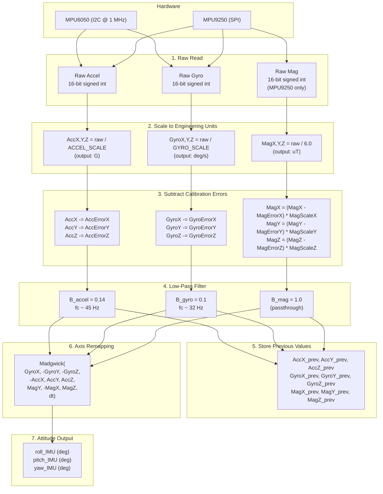
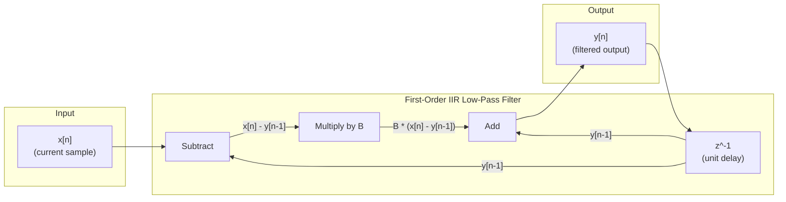
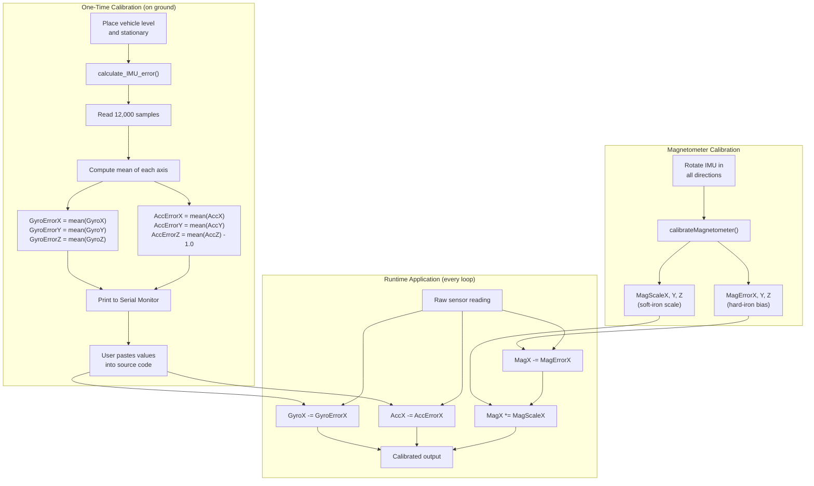
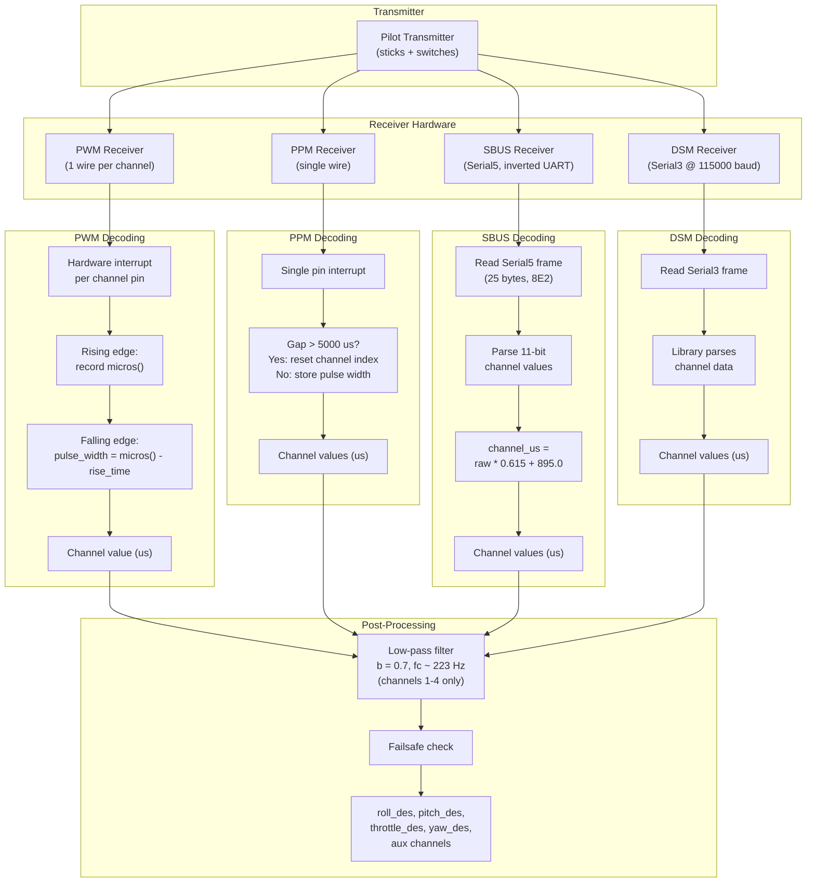
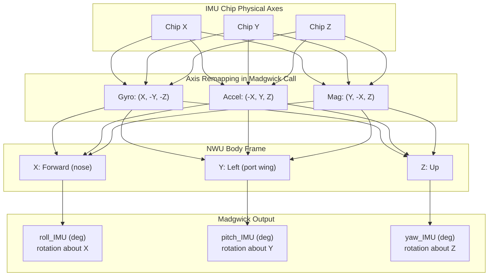

# Sensor Data Acquisition and Processing Pipeline

This document describes the complete sensor data pipeline in the dRehmFlight flight controller, from raw hardware readings through calibration and filtering to processed attitude estimates.

---

## 1. Hardware Overview

### IMU Options

**MPU6050 (6-DOF)**
- 3-axis accelerometer + 3-axis gyroscope
- Interface: I2C, overclocked to 1 MHz (spec is 400 kHz)
- No magnetometer; attitude estimation uses 6-DOF Madgwick variant

**MPU9250 (9-DOF)**
- 3-axis accelerometer + 3-axis gyroscope + 3-axis magnetometer
- Interface: SPI
- Magnetometer (AK8963) is internally connected via auxiliary I2C inside the MPU9250 package
- Enables full 9-DOF Madgwick fusion with heading reference

### Axis Convention

The system uses the **NWU (North-West-Up)** body frame convention:

- **X**: forward (nose direction)
- **Y**: left (port wing)
- **Z**: up

Note the axis remapping that occurs in the Madgwick filter call to align the physical sensor axes with the NWU convention:

```cpp
Madgwick(GyroX, -GyroY, -GyroZ, -AccX, AccY, AccZ, MagY, -MagX, MagZ, dt);
```

The negations and axis swaps correct for differences between the IMU chip's native axis orientation and the desired NWU body frame. The gyroscope Y and Z axes are negated, the accelerometer X axis is negated, and the magnetometer X and Y axes are swapped (with X negated) to produce a consistent right-hand coordinate system.

---

## 2. IMU Initialization (`IMUinit`)

### MPU6050 Initialization Sequence

1. `Wire.begin()` -- start I2C bus
2. `Wire.setClock(1000000)` -- overclock I2C to 1 MHz for faster sensor reads (the MPU6050 spec rates at 400 kHz, but most boards tolerate 1 MHz)
3. Initialize the MPU6050 device
4. Test connection; if failed, enter an infinite loop (hard fault -- the vehicle cannot fly without an IMU)
5. Set gyroscope full-scale range (e.g., +/-250, +/-500, +/-1000, or +/-2000 deg/s)
6. Set accelerometer full-scale range (e.g., +/-2G, +/-4G, +/-8G, or +/-16G)

### MPU9250 Initialization Sequence

1. `SPI.begin()` -- start SPI bus
2. Set accelerometer full-scale range
3. Set gyroscope full-scale range
4. Set magnetometer calibration values (hard-iron and soft-iron)
5. Set sample rate divider to 0:
   - Gyroscope and accelerometer output at **1 kHz**
   - Magnetometer output at **100 Hz**

### Error Handling

Both initialization paths check the connection to the sensor. On failure, the controller enters an infinite `while(1)` loop, preventing any flight operations. This is intentional: there is no safe degraded mode without an IMU.

---

## 3. Sensor Scale Factors

The IMU outputs raw 16-bit signed integers. These must be divided by a scale factor determined by the configured full-scale range to produce engineering units.

### Gyroscope Scale Factors

| Full-Scale Range | Scale Factor (LSB per deg/s) | Output Unit |
|------------------|------------------------------|-------------|
| +/-250 deg/s     | 131.0                        | deg/s       |
| +/-500 deg/s     | 65.5                         | deg/s       |
| +/-1000 deg/s    | 32.8                         | deg/s       |
| +/-2000 deg/s    | 16.4                         | deg/s       |

### Accelerometer Scale Factors

| Full-Scale Range | Scale Factor (LSB per G) | Output Unit |
|------------------|--------------------------|-------------|
| +/-2 G           | 16384.0                  | G           |
| +/-4 G           | 8192.0                   | G           |
| +/-8 G           | 4096.0                   | G           |
| +/-16 G          | 2048.0                   | G           |

### Magnetometer Scale Factor

| Conversion            | Output Unit |
|-----------------------|-------------|
| raw / 6.0             | microtesla  |

---

## 4. `getIMUdata()` -- Complete Pipeline

This function is called once per control loop iteration (nominally at 2 kHz). It performs the full sequence from raw sensor read to filtered, calibrated engineering values.

### Step-by-Step

1. **Read raw data**: Read six 16-bit signed integers (three gyro axes, three accel axes) from the IMU. For the MPU9250, also read three 16-bit magnetometer values.

2. **Scale to engineering units**: Divide raw values by the appropriate scale factor:
   - `AccX = raw_acc_x / ACCEL_SCALE_FACTOR` (result in G)
   - `GyroX = raw_gyro_x / GYRO_SCALE_FACTOR` (result in deg/s)
   - `MagX = raw_mag_x / 6.0` (result in microtesla)

3. **Subtract calibration errors**: Remove bias offsets determined during calibration:
   - `AccX = AccX - AccErrorX`
   - `GyroX = GyroX - GyroErrorX`
   - `MagX = (MagX - MagErrorX) * MagScaleX` (hard-iron then soft-iron)

4. **Apply first-order low-pass filter**: Smooth the signal to reject high-frequency noise:
   - `AccX = (1.0 - B_accel) * AccX_prev + B_accel * AccX`
   - `GyroX = (1.0 - B_gyro) * GyroX_prev + B_gyro * GyroX`
   - `MagX = (1.0 - B_mag) * MagX_prev + B_mag * MagX` (B_mag = 1.0, so no filtering)

5. **Store previous values**: Save the filtered output for use as `_prev` on the next iteration.

---

## 5. Low-Pass Filter Deep Dive

### Transfer Function

The filter is a first-order IIR (infinite impulse response) low-pass filter, also known as an exponential moving average:

```
y[n] = (1 - B) * y[n-1] + B * x[n]
```

This is algebraically equivalent to:

```
y[n] = y[n-1] + B * (x[n] - y[n-1])
```

The second form is sometimes called the "leaky integrator" form and makes the behavior intuitive: the output moves a fraction `B` of the way from its previous value toward the new input each sample.

### Filter Coefficient `B`

- `B = 0`: output is stuck at its initial value (infinite smoothing, no new data gets through)
- `B = 1`: output equals the input exactly (no filtering, full passthrough)
- `0 < B < 1`: low-pass filtering; smaller values of `B` produce heavier smoothing

### Relationship to Cutoff Frequency

The -3 dB cutoff frequency of this filter is:

```
fc = -fs / (2 * pi) * ln(1 - B)
```

For small values of `B`, this simplifies to the approximation:

```
fc ~= B * fs / (2 * pi)
```

where `fs` is the sampling frequency.

### Configured Values at 2 kHz Loop Rate

| Signal       | B coefficient | Approx. cutoff frequency | Notes                            |
|--------------|---------------|--------------------------|----------------------------------|
| Accelerometer| 0.14          | ~45 Hz                   | Moderate filtering; removes vibration while preserving tilt info |
| Gyroscope    | 0.1           | ~32 Hz                   | Heavier filtering; gyro noise is more problematic for integration |
| Magnetometer | 1.0           | N/A (passthrough)        | No filtering; mag already at 100 Hz sample rate |
| Radio (ch1-4)| 0.7           | ~223 Hz                  | Light filtering; preserves pilot responsiveness |

### Design Tradeoff

Lower `B` values produce cleaner signals but introduce more phase lag. In a flight controller, excessive lag on the gyroscope signal degrades stability margins and can cause oscillations. The chosen values represent a balance between noise rejection and control responsiveness.

---

## 6. IMU Calibration (`calculate_IMU_error`)

This function determines the bias (zero-offset) error for each accelerometer and gyroscope axis.

### Procedure

1. The vehicle must be placed on a **level surface** and remain **completely stationary**.
2. The function reads **12,000 samples** from the IMU.
3. For each axis, it computes the **mean** of all samples.
4. **Gyroscope biases**: The mean of each gyro axis at rest should be zero. Any nonzero mean is the bias error.
   - `GyroErrorX = mean(GyroX_samples)`
   - `GyroErrorY = mean(GyroY_samples)`
   - `GyroErrorZ = mean(GyroZ_samples)`
5. **Accelerometer biases**: At rest and level, AccX and AccY should read 0 G, and AccZ should read 1.0 G (due to gravity).
   - `AccErrorX = mean(AccX_samples)`
   - `AccErrorY = mean(AccY_samples)`
   - `AccErrorZ = mean(AccZ_samples) - 1.0`

The subtraction of 1.0 from the Z-axis mean accounts for the gravity vector. Without this correction, the calibration would try to zero out the gravity reading, producing incorrect tilt estimates.

### Usage

This is a **one-time calibration procedure**. The computed values are printed to the serial monitor. The user copies these values into the source code as constants. They are then subtracted from every subsequent sensor reading in `getIMUdata()`.

---

## 7. Magnetometer Calibration

Magnetometer calibration corrects for two classes of distortion caused by nearby ferromagnetic materials and current-carrying wires on the vehicle.

### Hard-Iron Correction

Hard-iron effects produce a constant bias offset on each axis. These shift the center of the measured magnetic sphere away from the origin.

```
MagX_corrected = MagX_raw - MagErrorX
MagY_corrected = MagY_raw - MagErrorY
MagZ_corrected = MagZ_raw - MagErrorZ
```

### Soft-Iron Correction

Soft-iron effects distort the magnetic sphere into an ellipsoid. Scale factors on each axis re-normalize the ellipsoid back to a sphere.

```
MagX_final = MagX_corrected * MagScaleX
MagY_final = MagY_corrected * MagScaleY
MagZ_final = MagZ_corrected * MagScaleZ
```

### `calibrateMagnetometer()` Function

1. The user rotates the IMU slowly in all directions (figure-eight pattern or full sphere coverage).
2. The library collects min/max values on each axis and computes the bias (center) and scale (axis ratios) automatically.
3. The resulting `MagError` and `MagScale` values are set during `IMUinit()`.

### Location Dependence

The Earth's magnetic field varies by geographic location (declination, inclination, and intensity all differ). Soft-iron distortions from the vehicle airframe are fixed, but the interaction with the local field direction means calibration may need to be repeated when flying at a significantly different location.

---

## 8. Attitude Estimation Warm-Up (`calibrateAttitude`)

Before entering the main control loop, the Madgwick filter must converge from its arbitrary initial state to a valid attitude estimate.

### Procedure

1. Run **10,000 iterations** of the following at the nominal 2 kHz loop rate:
   - Call `getIMUdata()` to obtain fresh, calibrated, filtered sensor data
   - Call `Madgwick()` with the current sensor values and timestep `dt`
2. After 10,000 iterations (approximately 5 seconds), the filter's internal quaternion has converged to represent the true orientation.

### Assumptions

- The vehicle is **stationary** and approximately **level** during this warm-up period.
- The gyroscope biases have already been calibrated (either hardcoded or via `calculate_IMU_error()`).
- After warm-up, the Madgwick filter's roll and pitch estimates will be near zero (level), and yaw will reflect the magnetic heading (9-DOF) or will be arbitrary (6-DOF).

---

## 9. Radio Receiver Pipeline

dRehmFlight supports four radio receiver protocols. All produce normalized channel values in the range of approximately 1000 to 2000 microseconds.

### PWM (Pulse Width Modulation)

- Each channel uses a **dedicated pin** with a **hardware interrupt** attached.
- On rising edge: record `micros()` timestamp.
- On falling edge: compute pulse width as `micros() - rising_timestamp`.
- Result: pulse width in microseconds (typically 1000-2000 us).
- Most common protocol; one wire per channel.

### PPM (Pulse Position Modulation)

- **Single pin** carries all channels as a pulse train.
- A gap greater than **5000 us** between pulses indicates the start of a new frame.
- Each subsequent pulse-to-pulse interval encodes one channel value.
- Channels are decoded sequentially from the frame sync gap.

### SBUS (Serial Bus)

- Uses **Serial5** (inverted UART at 100 kbaud, 8E2 framing).
- Raw SBUS values are 11-bit integers (0-2047).
- Conversion to standard microsecond range:
  ```
  channel_us = raw_value * 0.615 + 895.0
  ```
  This maps the SBUS range into approximately 895-2154 us, centered near 1500 us.

### DSM (Digital Spectrum Modulation / Spektrum Satellite)

- Uses **Serial3** at **115000 baud**.
- Proprietary Spektrum satellite receiver protocol.
- Library handles frame parsing and channel extraction.

### Radio Low-Pass Filtering

Channels 1 through 4 (roll, pitch, throttle, yaw) are passed through the same first-order IIR low-pass filter used for IMU data, with coefficient `b = 0.7`:

```
channel1_filtered = (1.0 - 0.7) * channel1_prev + 0.7 * channel1_raw
```

At a 2 kHz loop rate, this gives a cutoff frequency of approximately 223 Hz. The filtering is light, preserving pilot stick responsiveness while removing any jitter or noise from the radio link.

---

## 10. Pipeline Diagrams

### Full Sensor Data Flow Pipeline



### Low-Pass Filter Signal Flow



### Calibration Data Flow



### Radio Receiver Pipeline



### Axis Convention and Madgwick Remapping


