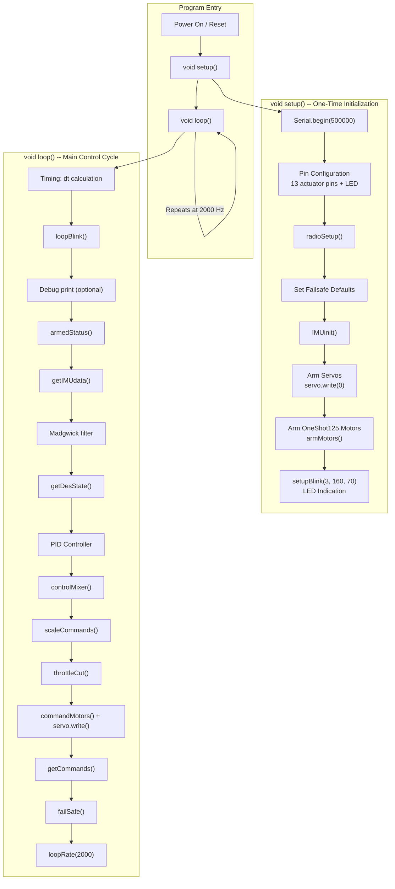
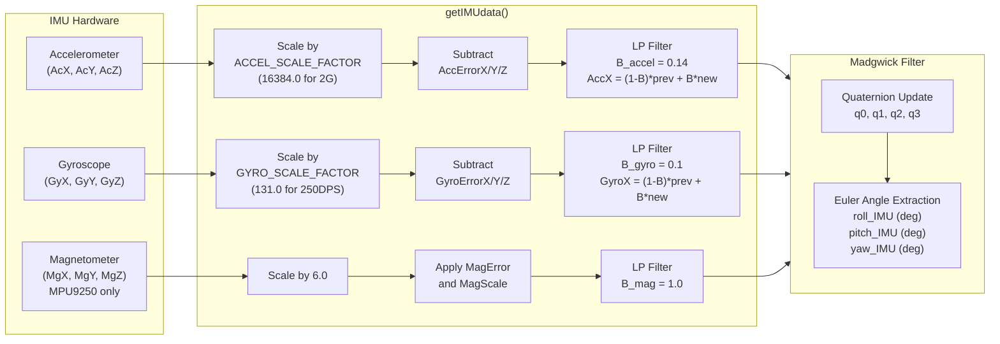
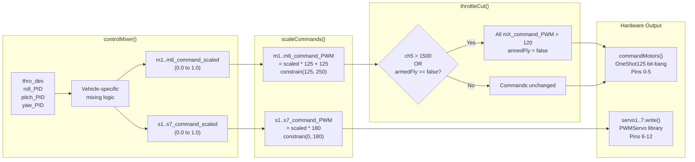
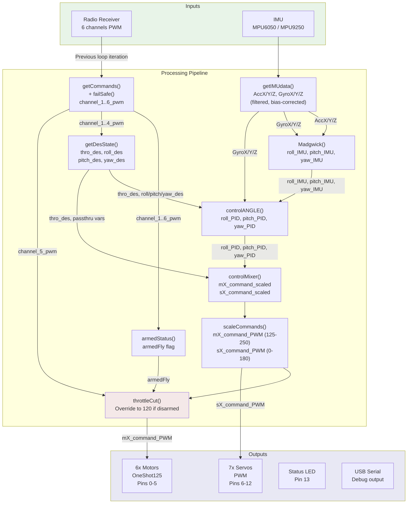

# dRehmFlight VTOL Flight Controller -- System Overview

## Table of Contents

- [1. System Overview](#1-system-overview)
- [2. Architecture](#2-architecture)
- [3. Main Control Loop Flow](#3-main-control-loop-flow)
- [4. Initialization Sequence](#4-initialization-sequence-void-setup)
- [5. Safety Systems](#5-safety-systems)
- [6. Sensor Processing and Attitude Estimation](#6-sensor-processing-and-attitude-estimation)
- [7. PID Control Modes](#7-pid-control-modes)
- [8. Actuator Output](#8-actuator-output)
- [9. Radio and Failsafe](#9-radio-and-failsafe)
- [10. Tunable Parameters Reference](#10-tunable-parameters-reference)

---

## 1. System Overview

dRehmFlight is a bare-bones VTOL (Vertical Take-Off and Landing) flight stabilization system designed by Nicholas Rehm. It runs on a **Teensy 4.0** microcontroller and is implemented as a single Arduino sketch (`dRehmFlight_Teensy_BETA_1.3.ino`). The system is purpose-built for experimental and custom VTOL aircraft, providing:

- **6-axis or 9-axis IMU-based attitude estimation** using a Madgwick complementary filter
- **PID-based flight stabilization** with three selectable control modes (angle, cascaded angle, and rate)
- **Support for up to 6 brushless motors** via OneShot125 ESC protocol (125-250 microsecond pulses)
- **Support for up to 7 PWM servo outputs** via the standard Arduino Servo library (0-180 degrees)
- **Multiple radio receiver protocols**: PWM, PPM, SBUS, and DSM/Spektrum
- **Configurable vehicle mixing** to support arbitrary multirotor and VTOL configurations (quadcopter, hexacopter, tilt-rotor, tailsitter, etc.)

The firmware is intentionally minimal and readable. There is no operating system, no task scheduler, and no abstraction layers. Everything runs in a single-threaded polling loop at a fixed **2000 Hz** (500 microsecond) loop rate. All filter parameters are tuned for this rate.

### Supported Hardware

| Component | Default | Alternative |
|-----------|---------|-------------|
| Microcontroller | Teensy 4.0 | -- |
| IMU | MPU6050 (I2C) | MPU9250 (SPI) |
| Radio RX | PWM receiver | PPM, SBUS (Serial5/pin 21), DSM (Serial3/pin 15) |
| ESCs | OneShot125-compatible | -- |
| Servos | Standard PWM (900-2100us) | -- |

### Compile-Time Configuration

The system uses `#define` directives to select hardware at compile time:

```cpp
// Receiver type (uncomment one)
#define USE_PWM_RX
//#define USE_PPM_RX
//#define USE_SBUS_RX
//#define USE_DSM_RX

// IMU type (uncomment one)
#define USE_MPU6050_I2C  // Default
//#define USE_MPU9250_SPI

// Gyro full-scale range
#define GYRO_250DPS      // Default (scale factor 131.0)

// Accelerometer full-scale range
#define ACCEL_2G         // Default (scale factor 16384.0)
```

---

## 2. Architecture

The entire flight controller is structured around the standard Arduino two-function architecture: `void setup()` for one-time initialization and `void loop()` for the repeating control cycle. There is no RTOS, no interrupts for control logic (only for radio PWM reading), and no multi-file module system beyond the included libraries.



### Key Design Decisions

1. **Radio commands are read at the END of the loop**, not the beginning. The values retrieved by `getCommands()` are used in the NEXT iteration. This decouples radio latency from the control path.
2. **Throttle cut is the LAST safety check** before motor output, ensuring it always overrides any computed command.
3. **All filters (LP, Madgwick) are tuned to 2000 Hz**. Changing the loop rate requires retuning `B_accel`, `B_gyro`, `B_mag`, and `B_madgwick`.

---

## 3. Main Control Loop Flow

Every iteration of `void loop()` executes the following steps in strict sequential order. The entire loop must complete within 500 microseconds to maintain the 2000 Hz rate.

```mermaid
flowchart TD
    START(["loop() begins"]) --> TIMING

    subgraph TIMING_BLOCK["1. Timing"]
        TIMING["prev_time = current_time<br/>current_time = micros()<br/>dt = (current_time - prev_time) / 1000000.0"]
    end

    TIMING --> BLINK["2. loopBlink()<br/>Toggle LED every 1.5s"]
    BLINK --> DEBUG["3. Debug Print (optional)<br/>printRadioData() / printGyroData() / etc.<br/>Runs at 100 Hz subcycle"]

    DEBUG --> ARMED["4. armedStatus()<br/>Check: ch5 < 1500 AND ch1 < 1050<br/>Sets armedFly = true"]

    subgraph SENSE["5-6. Sensing and Estimation"]
        IMU["5. getIMUdata()<br/>Read AccX/Y/Z, GyroX/Y/Z, MagX/Y/Z<br/>Apply error correction<br/>Apply LP filter (B_accel, B_gyro, B_mag)"]
        MADGWICK["6. Madgwick()<br/>Fuse accel + gyro (+ mag)<br/>Update quaternion q0..q3<br/>Compute roll_IMU, pitch_IMU, yaw_IMU"]
        IMU --> MADGWICK
    end

    ARMED --> SENSE

    MADGWICK --> DESSTATE["7. getDesState()<br/>Map ch1..ch4 PWM to:<br/>thro_des (0..1)<br/>roll_des (-maxRoll..+maxRoll)<br/>pitch_des (-maxPitch..+maxPitch)<br/>yaw_des (-maxYaw..+maxYaw)"]

    DESSTATE --> PID["8. PID Controller<br/>controlANGLE() / controlANGLE2() / controlRATE()<br/>Outputs: roll_PID, pitch_PID, yaw_PID"]

    PID --> MIXER["9. controlMixer()<br/>Combine thro_des + PID outputs<br/>into mX_command_scaled, sX_command_scaled"]

    MIXER --> SCALE["10. scaleCommands()<br/>Motors: scaled * 125 + 125 -> 125..250us<br/>Servos: scaled * 180 -> 0..180 deg"]

    SCALE --> TCUT["11. throttleCut()<br/>If ch5 > 1500 OR armedFly == false:<br/>Set all mX_command_PWM = 120"]

    TCUT --> OUTPUT["12. commandMotors()<br/>Send OneShot125 pulses<br/>servo1..7.write(sX_command_PWM)"]

    OUTPUT --> RADIO["13. getCommands()<br/>Read radio PWM values<br/>LP filter critical channels (b=0.7)"]

    RADIO --> FAILSAFE["14. failSafe()<br/>If any channel outside 800..2200:<br/>Reset ALL channels to failsafe defaults"]

    FAILSAFE --> RATE["15. loopRate(2000)<br/>Busy-wait until 500us elapsed"]

    RATE --> START

    style TIMING_BLOCK fill:#e8f4e8
    style SENSE fill:#e8e8f4
    style TCUT fill:#f4e8e8
    style FAILSAFE fill:#f4e8e8
```



### Step-by-Step Detail

#### Step 1: Timing (`dt` calculation)

```cpp
prev_time = current_time;
current_time = micros();
dt = (current_time - prev_time) / 1000000.0;
```

The variable `dt` (in seconds) is the elapsed time since the last loop iteration. It is used by the PID integrators and the Madgwick filter. At 2000 Hz, `dt` is approximately 0.0005 seconds.

#### Step 2: LED Blink

`loopBlink()` toggles the onboard LED (pin 13) every 1.5 seconds to provide a visual heartbeat indication that the main loop is running.

#### Step 3: Debug Printing

A collection of optional print functions run at a 100 Hz subcycle. Only one should be uncommented at a time. Available options:

| Function | Output |
|----------|--------|
| `printRadioData()` | Raw PWM values per channel (1000-2000 expected) |
| `printDesiredState()` | Desired angles/rates after normalization |
| `printGyroData()` | Filtered gyro readings in deg/s |
| `printAccelData()` | Filtered accelerometer readings in g |
| `printMagData()` | Filtered magnetometer readings in uT |
| `printRollPitchYaw()` | Madgwick-estimated attitude in degrees |
| `printPIDoutput()` | PID controller outputs (-1 to 1 range) |
| `printMotorCommands()` | Final motor PWM values (120-250) |
| `printServoCommands()` | Final servo positions (0-180) |
| `printLoopRate()` | Loop period in microseconds |

#### Step 4: Arming Status Check

`armedStatus()` sets `armedFly = true` only when both conditions are met:
- `channel_5_pwm < 1500` (throttle cut switch is OFF / low position)
- `channel_1_pwm < 1050` (throttle stick is at minimum)

Once `armedFly` is set to `true`, it stays `true` until `throttleCut()` sets it back to `false` (when ch5 goes high or it was never armed).

#### Step 5: IMU Data Acquisition

`getIMUdata()` performs three operations on each axis:
1. **Read raw data** from the IMU (MPU6050 via I2C or MPU9250 via SPI)
2. **Apply error correction** (subtract bias values determined during calibration)
3. **Apply first-order low-pass filter**: `X = (1.0 - B) * X_prev + B * X`

Filter coefficients (tuned for 2000 Hz loop rate):
- `B_accel = 0.14` (accelerometer)
- `B_gyro = 0.1` (gyroscope)
- `B_mag = 1.0` (magnetometer, effectively unfiltered)

#### Step 6: Madgwick Filter

The Madgwick AHRS (Attitude and Heading Reference System) filter fuses accelerometer, gyroscope, and (optionally) magnetometer data to estimate the vehicle's orientation as a quaternion `(q0, q1, q2, q3)`, then converts to Euler angles:

- `roll_IMU` (degrees)
- `pitch_IMU` (degrees)
- `yaw_IMU` (degrees)

When using MPU6050 (no magnetometer), the 6DOF variant `Madgwick6DOF()` is automatically called. The tuning parameter `B_madgwick = 0.04` controls the filter's responsiveness: higher values trust the accelerometer more (noisier but faster), lower values trust the gyro more (smoother but slower to converge).

#### Step 7: Desired State Computation

`getDesState()` maps raw radio PWM commands to normalized control setpoints:

| Variable | Source | Mapping | Range |
|----------|--------|---------|-------|
| `thro_des` | ch1 (1000-2000) | `(ch1 - 1000) / 1000` | 0.0 to 1.0 |
| `roll_des` | ch2 (1000-2000) | `(ch2 - 1500) / 500 * maxRoll` | -30 to +30 deg |
| `pitch_des` | ch3 (1000-2000) | `(ch3 - 1500) / 500 * maxPitch` | -30 to +30 deg |
| `yaw_des` | ch4 (1000-2000) | `(ch4 - 1500) / 500 * maxYaw` | -160 to +160 deg/s |

Passthrough variables (`roll_passthru`, `pitch_passthru`, `yaw_passthru`) are also computed at half scale (-0.5 to 0.5) for direct unstabilized mixing.

#### Step 8: PID Controller

See [Section 7: PID Control Modes](#7-pid-control-modes) for full detail. Produces `roll_PID`, `pitch_PID`, and `yaw_PID` values in the approximate range of -1 to 1.

#### Step 9: Control Mixer

`controlMixer()` combines throttle and PID outputs into per-actuator commands. The default configuration is a quadcopter:

```cpp
m1_command_scaled = thro_des - pitch_PID + roll_PID + yaw_PID;  // Front Left
m2_command_scaled = thro_des - pitch_PID - roll_PID - yaw_PID;  // Front Right
m3_command_scaled = thro_des + pitch_PID - roll_PID + yaw_PID;  // Back Right
m4_command_scaled = thro_des + pitch_PID + roll_PID - yaw_PID;  // Back Left
```

This function is the primary customization point for different vehicle configurations.

#### Step 10: Command Scaling

`scaleCommands()` converts normalized (0-1) values to protocol-specific ranges:

- **Motors**: `PWM = scaled * 125 + 125`, constrained to 125-250 (OneShot125)
- **Servos**: `PWM = scaled * 180`, constrained to 0-180 (servo library degrees)

#### Step 11: Throttle Cut

`throttleCut()` is the final safety gate. If `channel_5_pwm > 1500` OR `armedFly == false`, all motor commands are forced to 120us (below the OneShot125 minimum of 125us, ensuring motors are fully stopped). The `armedFly` flag is also reset to `false`.

#### Step 12: Actuator Output

`commandMotors()` implements OneShot125 by bit-banging GPIO pins: all motor pins are set HIGH simultaneously, then each is set LOW individually when its required pulse duration has elapsed. Servos are written using the standard PWMServo library.

#### Step 13: Radio Command Retrieval

`getCommands()` reads the latest radio values. For PWM/PPM receivers, values come from interrupt-driven background reading. For SBUS/DSM, values are read from serial buffers. A low-pass filter with coefficient `b = 0.7` is applied to channels 1-4 to reduce noise.

#### Step 14: Failsafe

`failSafe()` checks if ANY channel value is outside the 800-2200 range. If so, ALL channels are reset to their failsafe defaults (defined at the top of the file). The default failsafe sets `channel_5_fs = 2000`, which triggers the throttle cut on the next iteration.

#### Step 15: Loop Rate Regulation

`loopRate(2000)` busy-waits (spins) until 500 microseconds have elapsed since the start of the current loop iteration, enforcing the 2000 Hz rate.

---

## 4. Initialization Sequence (void setup)

The `void setup()` function runs once at power-on and prepares all hardware before entering the main loop.

```mermaid
flowchart TD
    POWER(["Power On / Reset"]) --> SERIAL["Serial.begin(500000)<br/>USB serial at 500 kbaud<br/>delay(500ms)"]

    SERIAL --> PINS["Pin Initialization<br/>pinMode(13, OUTPUT) -- LED<br/>pinMode(m1..m6, OUTPUT) -- Motors<br/>servo1..7.attach(pin, 900, 2100) -- Servos"]

    PINS --> LED_ON["digitalWrite(13, HIGH)<br/>LED on to signal startup"]

    LED_ON --> RADIO["radioSetup()<br/>Configure receiver pins/interrupts<br/>based on #define"]

    RADIO --> FS_DEFAULTS["Set Channel Failsafe Defaults<br/>ch1=1000, ch2-4=1500<br/>ch5=2000 (throttle cut ON)<br/>ch6=2000"]

    FS_DEFAULTS --> IMU_INIT["IMUinit()<br/>Wire.begin() at 1 MHz (I2C)<br/>or SPI init for MPU9250<br/>Set gyro/accel full-scale range<br/>Verify connection (halt if fail)"]

    IMU_INIT --> CAL{{"(Optional)<br/>calculate_IMU_error()<br/>Average 12000 samples<br/>Print bias values to serial"}}

    CAL --> SERVO_ARM["Arm Servos<br/>servo1..7.write(0)<br/>(Set to 0 deg / min throttle)"]

    SERVO_ARM --> ESC_CAL{{"(Optional)<br/>calibrateESCs()<br/>Throttle passthrough loop<br/>CODE HALTS HERE IF ENABLED"}}

    ESC_CAL --> MOTOR_ARM["Arm OneShot125 Motors<br/>Set m1..m6_command_PWM = 125<br/>armMotors() -- 50 pulse cycles<br/>with 2ms delays"]

    MOTOR_ARM --> BLINK["setupBlink(3, 160, 70)<br/>3 blinks: 160ms on, 70ms off<br/>Signals ready for main loop"]

    BLINK --> MAG_CAL{{"(Optional)<br/>calibrateMagnetometer()<br/>MPU9250 only<br/>Print scale/offset values"}}

    MAG_CAL --> LOOP(["Enter void loop()"])

    style CAL fill:#fff3cd,stroke:#856404
    style ESC_CAL fill:#fff3cd,stroke:#856404
    style MAG_CAL fill:#fff3cd,stroke:#856404
    style IMU_INIT fill:#d1ecf1
```



### Initialization Detail

**Serial Communication**: USB serial is initialized at 500,000 baud for high-speed debug output. A 500ms delay allows the USB connection to stabilize.

**Pin Configuration**: 13 actuator output pins are configured:
- Pin 13: Onboard LED (status indicator)
- Pins 0-5: Motor ESC outputs (OneShot125, `m1Pin` through `m6Pin`)
- Pins 6-12: Servo/ESC outputs (PWM, `servo1Pin` through `servo7Pin`, configured for 900-2100us range)

**Radio Setup**: `radioSetup()` configures the receiver interface based on the compile-time `#define`. For PWM receivers, this sets up pin-change interrupts on the channel input pins. For SBUS, it initializes Serial5. For DSM, it initializes Serial3.

**Channel Failsafe Defaults**: All channels are pre-loaded with safe values before the main loop begins. Critically, `channel_5_fs = 2000` ensures that the throttle cut is active by default (since `channel_5_pwm > 1500` triggers the cut).

**IMU Initialization**: For MPU6050, I2C is started at 1 MHz (2.5x the rated 400 kHz, which works reliably on Teensy 4.0). The connection is tested, and the firmware halts in an infinite loop if the IMU is not detected. Full-scale ranges are configured per the compile-time defines.

**Optional Calibration Steps** (commented out by default):
- `calculate_IMU_error()`: Takes 12,000 IMU samples, averages them to compute accelerometer and gyro bias. Values are printed to serial for the user to paste into the source code.
- `calibrateESCs()`: Enters an infinite loop that passes throttle directly to motors, allowing standard ESC calibration (high-low throttle procedure). The firmware will not proceed past this point while enabled.
- `calibrateMagnetometer()`: MPU9250 only. Runs the magnetometer hard/soft iron calibration routine and prints correction values.

**Motor Arming**: OneShot125 ESCs require a series of minimum-throttle pulses (125us) to arm. `armMotors()` sends 50 such pulses with 2ms delays between them.

---

## 5. Safety Systems

The safety architecture is designed around multiple independent layers, each providing protection against different failure modes.

```mermaid
stateDiagram-v2
    [*] --> DISARMED: Power On

    state DISARMED {
        note right of DISARMED
            armedFly = false
            All motors at 120us (below min)
            Throttle cut ACTIVE
        end note
    }

    state ARMED {
        note right of ARMED
            armedFly = true
            Motors respond to PID output
            Throttle cut INACTIVE
        end note
    }

    state FAILSAFE {
        note right of FAILSAFE
            All channels reset to defaults
            ch5_fs = 2000 triggers throttle cut
            on next loop iteration
        end note
    }

    DISARMED --> ARMED: armedStatus():\nch5 < 1500 AND ch1 < 1050
    ARMED --> DISARMED: throttleCut():\nch5 > 1500
    ARMED --> FAILSAFE: failSafe():\nAny channel outside 800..2200
    FAILSAFE --> DISARMED: Next loop iteration:\nch5_fs=2000 triggers throttleCut()
    DISARMED --> FAILSAFE: failSafe():\nAny channel outside 800..2200
    FAILSAFE --> DISARMED: Next loop iteration
```

### 5.1 Arming Logic

The vehicle arms when BOTH conditions are true simultaneously:

1. **Throttle cut switch is OFF**: `channel_5_pwm < 1500` (channel 5 in low position)
2. **Throttle is at minimum**: `channel_1_pwm < 1050` (stick at bottom)

This two-condition requirement prevents accidental arming. The pilot must explicitly flip the arming switch AND have the throttle at idle. Once `armedFly` becomes `true`, it remains `true` until `throttleCut()` resets it.

### 5.2 Throttle Cut

`throttleCut()` runs as the **last function before motor output** in every loop iteration. This placement is deliberate: no matter what the PID controller computes, the throttle cut can override it.

When activated (`channel_5_pwm > 1500` OR `armedFly == false`):
- All six motor commands are forced to **120us** (below the OneShot125 minimum command of 125us)
- `armedFly` is set to `false`
- The pilot must complete the full arming sequence again (throttle low + switch flip) to regain motor control

### 5.3 Radio Failsafe

`failSafe()` checks every channel against hard bounds of 800-2200us. If ANY channel is outside this range (indicating a disconnected receiver, interference, or hardware fault), ALL channels are reset to their failsafe defaults:

| Channel | Failsafe Value | Effect |
|---------|---------------|--------|
| ch1 (throttle) | 1000 | Zero throttle |
| ch2 (aileron) | 1500 | Centered |
| ch3 (elevator) | 1500 | Centered |
| ch4 (rudder) | 1500 | Centered |
| ch5 (gear/arm) | 2000 | **Throttle cut ACTIVE** |
| ch6 (aux) | 2000 | -- |

The failsafe value of 2000 for channel 5 ensures that on the next loop iteration, `throttleCut()` will activate and disable all motors.

### 5.4 Integrator Saturation

All PID integrator terms are clamped to `+/- i_limit` (default 25.0) to prevent integrator windup:

```cpp
integral_roll = constrain(integral_roll, -i_limit, i_limit);
```

Additionally, if the throttle is below 1060us (effectively idle), all integrators are forced to zero. This prevents integrator buildup while the vehicle is on the ground:

```cpp
if (channel_1_pwm < 1060) {
    integral_roll = 0;
}
```

### 5.5 IMU Connection Check

During `IMUinit()`, if the IMU fails its connection test, the firmware prints an error message and enters an infinite loop (`while(1) {}`), preventing the vehicle from entering the main control loop with no sensor data.

---

## 6. Sensor Processing and Attitude Estimation



### Low-Pass Filter

All sensor channels use a simple first-order IIR (exponential moving average) low-pass filter:

```
output = (1.0 - B) * previous_output + B * new_reading
```

Where `B` is the filter coefficient. A lower `B` means more smoothing (more lag), and a higher `B` means less smoothing (more noise). The values are tuned assuming an 80 Hz cutoff at 2000 Hz sample rate.

### Madgwick Filter Variants

- **Madgwick() (9DOF)**: Uses accelerometer, gyroscope, and magnetometer. Only active when using MPU9250 with valid magnetometer data. Provides absolute yaw reference via Earth's magnetic field.
- **Madgwick6DOF()**: Uses accelerometer and gyroscope only. Active by default with MPU6050, or as a fallback when magnetometer data is zero. Yaw angle will drift over time without magnetometer correction.

Both variants use gradient descent to fuse the gyroscope integration with accelerometer (and magnetometer) reference measurements. The fusion weight is controlled by `B_madgwick = 0.04`.

---

## 7. PID Control Modes

Three mutually exclusive control modes are available. Only one should be uncommented in `void loop()` at a time.

### 7.1 controlANGLE() -- Angle Stabilization (Default)

Stabilizes the vehicle on an angle setpoint. Roll and pitch errors are computed as the difference between the desired angle and the Madgwick-estimated angle. Yaw stabilizes on a rate setpoint (desired yaw rate minus measured gyro rate).

**Roll axis example:**

```
error_roll = roll_des - roll_IMU
integral_roll += error_roll * dt                    (clamped to +/- i_limit)
derivative_roll = GyroX                             (uses gyro directly, not error derivative)
roll_PID = 0.01 * (Kp * error + Ki * integral - Kd * derivative)
```

Note: The derivative term uses the raw gyro reading (`GyroX`) rather than differentiating the error signal. This avoids derivative kick when the setpoint changes. The negative sign on `Kd` (subtraction) accounts for the fact that the gyro measures rate of change directly.

Default gains:
| Axis | Kp | Ki | Kd |
|------|-----|-----|-----|
| Roll | 0.2 | 0.3 | 0.05 |
| Pitch | 0.2 | 0.3 | 0.05 |
| Yaw | 0.3 | 0.05 | 0.00015 |

### 7.2 controlANGLE2() -- Cascaded Angle Stabilization

A two-loop cascaded controller. The outer loop runs PID on the angle error to produce a desired angular rate. The inner loop runs PID on the rate error (desired rate minus gyro reading). This architecture provides better disturbance rejection but requires careful tuning of both loops.

```
Outer loop: roll_des_ol = Kp_angle * angle_error + Ki_angle * integral
Inner loop: roll_PID = Kp_rate * (roll_des_ol - GyroX) + Ki_rate * integral + Kd_rate * derivative
```

A low-pass filter with damping parameters `B_loop_roll` and `B_loop_pitch` (default 0.9) is applied between the outer and inner loops to smooth the rate setpoint.

### 7.3 controlRATE() -- Rate Stabilization

Stabilizes on rate setpoints directly. Error is the desired rate minus the measured gyro rate. Used for acrobatic flight or as an inner loop with an external angle controller. `maxRoll` and `maxPitch` are interpreted as deg/sec in this mode rather than degrees.

---

## 8. Actuator Output



### OneShot125 Protocol

The `commandMotors()` function implements OneShot125 by bit-banging digital pins:

1. All 6 motor pins are set HIGH simultaneously
2. A busy-wait loop monitors elapsed microseconds
3. Each pin is set LOW individually when its commanded pulse length (125-250us) is reached
4. The loop exits after all 6 pins have gone low

This approach has microsecond-level jitter but is simple and does not require hardware timer resources.

### Pin Assignment Summary

| Pin | Function | Protocol |
|-----|----------|----------|
| 0 | Motor 1 (m1Pin) | OneShot125 |
| 1 | Motor 2 (m2Pin) | OneShot125 |
| 2 | Motor 3 (m3Pin) | OneShot125 |
| 3 | Motor 4 (m4Pin) | OneShot125 |
| 4 | Motor 5 (m5Pin) | OneShot125 |
| 5 | Motor 6 (m6Pin) | OneShot125 |
| 6 | Servo 1 (servo1Pin) | PWM 900-2100us |
| 7 | Servo 2 (servo2Pin) | PWM 900-2100us |
| 8 | Servo 3 (servo3Pin) | PWM 900-2100us |
| 9 | Servo 4 (servo4Pin) | PWM 900-2100us |
| 10 | Servo 5 (servo5Pin) | PWM 900-2100us |
| 11 | Servo 6 (servo6Pin) | PWM 900-2100us |
| 12 | Servo 7 (servo7Pin) | PWM 900-2100us |
| 13 | Onboard LED | Digital |
| 15 | ch1 / DSM RX3 | PWM in / Serial |
| 16 | ch2 | PWM in |
| 17 | ch3 | PWM in |
| 18 | (Reserved) | I2C SDA (MPU6050) |
| 19 | (Reserved) | I2C SCL (MPU6050) |
| 20 | ch4 | PWM in |
| 21 | ch5 / SBUS RX5 | PWM in / Serial |
| 22 | ch6 | PWM in |
| 23 | PPM input | PPM in |

---

## 9. Radio and Failsafe

### Channel Mapping

| Channel | Variable | Function | Typical Range |
|---------|----------|----------|---------------|
| 1 | `channel_1_pwm` | Throttle | 1000 (idle) - 2000 (full) |
| 2 | `channel_2_pwm` | Aileron (roll) | 1000-2000 (center 1500) |
| 3 | `channel_3_pwm` | Elevator (pitch) | 1000-2000 (center 1500) |
| 4 | `channel_4_pwm` | Rudder (yaw) | 1000-2000 (center 1500) |
| 5 | `channel_5_pwm` | Gear / Arm switch | < 1500 = armed, > 1500 = throttle cut |
| 6 | `channel_6_pwm` | Aux1 (free) | 1000-2000 |

### Supported Receiver Protocols

- **PWM**: One wire per channel, interrupt-driven pulse width measurement on individual pins
- **PPM**: Single wire carrying all channels sequentially on pin 23
- **SBUS**: Inverted serial protocol on Serial5 (pin 21), parsed by SBUS library
- **DSM/Spektrum**: Serial protocol on Serial3 (pin 15), 1024-resolution, configurable channel count

### Command Filtering

Channels 1-4 are low-pass filtered after reading with coefficient `b = 0.7`:

```cpp
channel_X_pwm = (1.0 - 0.7) * channel_X_pwm_prev + 0.7 * channel_X_pwm;
```

Channels 5 and 6 are NOT filtered, allowing instantaneous response for the arming switch and auxiliary functions.

---

## 10. Tunable Parameters Reference

### Filter Parameters

| Parameter | Default | Description |
|-----------|---------|-------------|
| `B_madgwick` | 0.04 | Madgwick filter gain. Higher = noisier but faster convergence |
| `B_accel` | 0.14 | Accelerometer LP filter. MPU9250: use 0.2 |
| `B_gyro` | 0.1 | Gyroscope LP filter. MPU9250: use 0.17 |
| `B_mag` | 1.0 | Magnetometer LP filter (1.0 = no filtering) |

### Controller Limits

| Parameter | Default | Description |
|-----------|---------|-------------|
| `i_limit` | 25.0 | Integrator saturation limit |
| `maxRoll` | 30.0 | Max roll angle (deg) or rate (deg/s) |
| `maxPitch` | 30.0 | Max pitch angle (deg) or rate (deg/s) |
| `maxYaw` | 160.0 | Max yaw rate (deg/s) |

### PID Gains -- Angle Mode

| Parameter | Default | Notes |
|-----------|---------|-------|
| `Kp_roll_angle` | 0.2 | |
| `Ki_roll_angle` | 0.3 | |
| `Kd_roll_angle` | 0.05 | No effect in controlANGLE2 |
| `B_loop_roll` | 0.9 | Damping for controlANGLE2 cascade (0 to 1) |
| `Kp_pitch_angle` | 0.2 | |
| `Ki_pitch_angle` | 0.3 | |
| `Kd_pitch_angle` | 0.05 | No effect in controlANGLE2 |
| `B_loop_pitch` | 0.9 | Damping for controlANGLE2 cascade (0 to 1) |

### PID Gains -- Rate Mode

| Parameter | Default | Notes |
|-----------|---------|-------|
| `Kp_roll_rate` | 0.15 | |
| `Ki_roll_rate` | 0.2 | |
| `Kd_roll_rate` | 0.0002 | Caution: high values cause motor overheating |
| `Kp_pitch_rate` | 0.15 | |
| `Ki_pitch_rate` | 0.2 | |
| `Kd_pitch_rate` | 0.0002 | Caution: high values cause motor overheating |

### PID Gains -- Yaw

| Parameter | Default | Notes |
|-----------|---------|-------|
| `Kp_yaw` | 0.3 | |
| `Ki_yaw` | 0.05 | |
| `Kd_yaw` | 0.00015 | Caution: high values cause motor overheating |

### Calibration Parameters

| Parameter | Default | Description |
|-----------|---------|-------------|
| `AccErrorX/Y/Z` | 0.0 | Accelerometer bias (from `calculate_IMU_error()`) |
| `GyroErrorX/Y/Z` | 0.0 | Gyroscope bias (from `calculate_IMU_error()`) |
| `MagErrorX/Y/Z` | 0.0 | Magnetometer hard-iron offset (MPU9250 only) |
| `MagScaleX/Y/Z` | 1.0 | Magnetometer soft-iron scale (MPU9250 only) |

---

## Data Flow Summary


