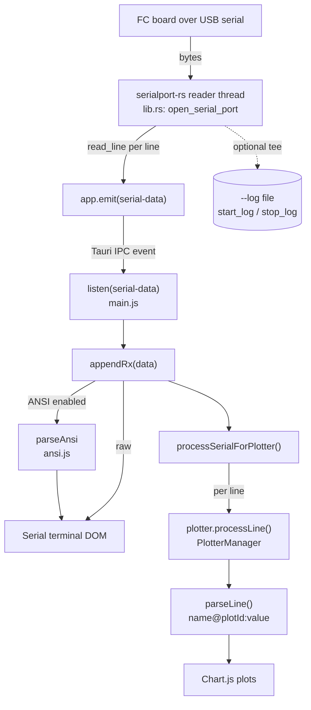
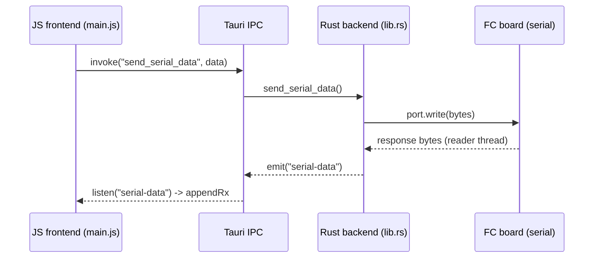

# fc_tool Architecture

A concise map of how serial data flows through fc_tool, from the flight
controller board to the on-screen terminal and plotter. This grounds the
high-level summary in [README.md](README.md#architecture) and points at the
exact source files involved.

fc_tool is a Tauri 2 desktop app:

- **Rust backend** (`src-tauri/src/lib.rs`) — owns the serial port via
  `serialport-rs`, runs a background reader thread, and emits line-oriented
  events over Tauri IPC.
- **JS frontend** (`src/*.js`) — listens for those events, renders the serial
  terminal (with an ANSI SGR parser), and feeds the dynamic multi-graph plotter
  (Chart.js).

## Serial Data Path (device to UI)

A dedicated reader thread reads the port line by line and emits a `serial-data`
event per line. The frontend's single listener fans each line out to both the
terminal and (when visible) the plotter.

Key handoffs:

- `open_serial_port` (lib.rs) spawns the reader thread; each `read_line` result
  becomes one `app.emit("serial-data", ...)`.
- `listen("serial-data")` (main.js) calls `appendRx(data)`, which writes to the
  terminal (optionally through `parseAnsi` for SGR colors) and calls
  `processSerialForPlotter(data)`.
- The plotter path runs `parseLine()` (protocol `name@plotId:value`, also
  `name:value`, `name=value`, and plain CSV) and updates Chart.js datasets.

## Command + Response Loop

Outbound commands (typed in the terminal, or control actions) go back to the
board through a Tauri command; responses return through the same `serial-data`
event stream described above.

## Source Map

| Concern | File |
|---------|------|
| Serial backend, reader thread, IPC events, logging | `src-tauri/src/lib.rs` |
| Headless mode (no GUI, serial to stdout) | `src-tauri/src/lib.rs` (`run_headless`) |
| Event wiring, terminal, control buttons | `src/main.js` |
| ANSI SGR parser | `src/ansi.js` |
| Plotter (parse, datasets, stats, cursors) | `src/plotter.js` |
| Port scanning / connection UI | `src/connection.js` |

See [scope.md](scope.md) for project boundaries and [README.md](README.md) for
build/run instructions.
