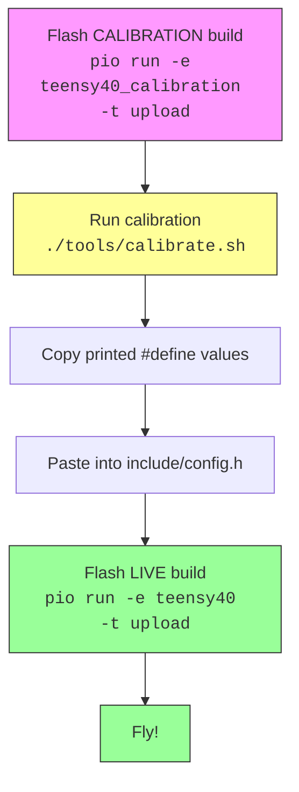

# Flight Controller Firmware

Open-source flight controller firmware for DIY drones. Based on [dRehmFlight](https://github.com/nickrehm/dRehmFlight), designed for hobbyists who want to build and fly their own aircraft.

**What this firmware does:**

- Reads sensors (accelerometer, gyroscope) to know which way the drone is pointing
- Takes your radio transmitter inputs (throttle, pitch, roll, yaw)
- Calculates motor speeds to keep the drone stable
- Supports quadcopters, hexcopters, and other VTOL aircraft

---

## What This Firmware Does **NOT** Do

This is a stabilization-only flight controller. It deliberately omits a number
of features common in larger stacks (Betaflight, INAV, ArduPilot). Read this
list before assuming a feature exists — silent absence is the most dangerous
kind of bug:

- **No altitude hold.** Barometer is telemetry-only; throttle is fully manual.
- **No GPS navigation.** GPS is raw NMEA passthrough only — the firmware does
  not parse it. No waypoints, no position fix consumed in the flight loop.
- **No return-to-home (RTH).**
- **No position hold / loiter.**
- **No DSHOT.** Motor protocols are PWM and OneShot125 only.
- **No battery voltage / current monitoring.** Pilot must manage cell voltage
  with an external alarm or timer.
- **No SD card / black-box logging.** Telemetry is live-only over serial or
  WiFi.
- **No autotune.** PID tuning is a manual `g`-command workflow (see
  [docs/pid-tuning-guide.md](docs/pid-tuning-guide.md)).
- **Defaults are tuned for a 5" quad-X.** Other airframes (7" quad,
  tricopter, hex/octo, fixed-wing/VTOL hybrid) **require PID rescaling**
  before first flight — see pid-tuning-guide.md §4.

Full scope and explicit non-goals: [docs/scope.md](docs/scope.md).

---

## Supported Hardware

| Platform | Status | Notes |
|----------|--------|-------|
| **Teensy 4.0** | Recommended | 600 MHz, excellent performance |
| **Teensy 4.1** | Supported | Same as 4.0, more pins |
| **ESP32** | Supported | 240 MHz, built-in WiFi |
| **ESP32-S3** | Supported | Newer ESP32 variant |
| Teensy 3.6 | Legacy | Older, still works |
| Arduino Uno/Mega | NOT supported | Too slow (16 MHz, no FPU) |

**Required components:**

- MPU6050 IMU sensor (GY-521 breakout board, ~$3)
- SBUS receiver (FlySky FS-iA6B recommended, ~$15)
- Radio transmitter (FlySky FS-i6X recommended, ~$50)
- Motors, ESCs, frame (depends on your build)

---

## Prerequisites

Install PlatformIO: https://platformio.org/install

---

## Build Environments

This project uses **two types of builds**:

| Build Type | Purpose | When to Use |
|------------|---------|-------------|
| **Live** | Lean flight firmware | Flying the aircraft |
| **Calibration** | Debug + calibration tools | Setting up and testing |

### Available Environments

| Environment | Platform | Type | Command |
|-------------|----------|------|---------|
| `teensy40` | Teensy 4.0 | Live | `pio run -e teensy40` |
| `teensy40_calibration` | Teensy 4.0 | Calibration | `pio run -e teensy40_calibration` |
| `teensy41` | Teensy 4.1 | Live | `pio run -e teensy41` |
| `teensy41_calibration` | Teensy 4.1 | Calibration | `pio run -e teensy41_calibration` |
| `esp32` | ESP32 | Live | `pio run -e esp32` |
| `esp32_calibration` | ESP32 | Calibration | `pio run -e esp32_calibration` |
| `esp32s3` | ESP32-S3 | Live | `pio run -e esp32s3` |
| `esp32s3_calibration` | ESP32-S3 | Calibration | `pio run -e esp32s3_calibration` |

---

## Quick Start

```bash
# 1. Build and upload calibration firmware
pio run -e teensy40_calibration -t upload

# 2. Run calibration (recommended — menu-driven wrapper)
./tools/calibrate.sh

# 3. Copy calibration values to config.h, then flash live build
pio run -e teensy40 -t upload
```

### Required pre-flight steps (PROPS OFF)

Before powering motors for the first time, you must complete:

1. **Failsafe detection** (`f` command) — measures TX-off channel values so the firmware can stop motors on radio loss. See [docs/0_quickstart.md](docs/0_quickstart.md) Part 4a and [docs/2_calibration_guide.md](docs/2_calibration_guide.md) "Part: Failsafe Detection".
2. **ESC endpoint calibration** (`e` command) — teaches each ESC the min/max throttle range. See [docs/0_quickstart.md](docs/0_quickstart.md) Part 4b and [docs/2_calibration_guide.md](docs/2_calibration_guide.md) "Part: ESC Endpoint Calibration".
3. **PID sanity check** (`g` command) — tethered hover verification, especially if your airframe is not a 5" quad-X. See [docs/0_quickstart.md](docs/0_quickstart.md) Part 4c.

For the full hardware-bring-up sequence (all 17 hardware-gated items in safe-first order), use [docs/findings/bench_validation_runbook_2026-05-27.md](docs/findings/bench_validation_runbook_2026-05-27.md).

---

## The Two-Build Workflow



**Why two builds?**

- The **live build** is small and fast (no debug code, no calibration overhead)
- The **calibration build** includes guided routines, serial command interface, and debug output
- IMU offsets persist across reflashes via the `CalibrationStorage` HAL (calibration builds). Scale factors and other tuning values are still compile-time `#define`s today; the calibration UI emits the values for you to paste once.

---

## Calibration Tools

### calibrate.sh (Recommended)

Interactive menu-driven wrapper around `serial_monitor.py`. Handles port detection, ModemManager, and all calibration commands.

```bash
./tools/calibrate.sh                          # Auto-detect port, launch menu
./tools/calibrate.sh /dev/ttyACM0             # Specific port, launch menu
./tools/calibrate.sh /dev/ttyACM0 imu         # Run IMU calibration directly
./tools/calibrate.sh /dev/ttyACM0 dump        # Dump all values directly
./tools/calibrate.sh help                     # Show all CLI commands
```

CLI commands: `help` `status` `channels` `pid` `filters` `dump` `imu` `imu6` `orientation` `radio` `failsafe` `esc` `tuning-pid` `tuning-filter` `telemetry` `network` `sequential`

### serial_monitor.py (Scripting / Advanced)

Raw serial monitor for direct interaction or automated scripts.

```bash
python3 tools/serial_monitor.py /dev/ttyACM0                          # Interactive monitor
python3 tools/serial_monitor.py /dev/ttyACM0 --send h --wait 3        # Send command, capture output
python3 tools/serial_monitor.py /dev/ttyACM0 --send i --wait 1 --interactive  # Interactive calibration
```

### PlatformIO (Fallback)

```bash
pio device monitor
```

---

## Serial Commands (Calibration Build Only)

| Command | Action | Type |
|---------|--------|------|
| `h` | Help (show all commands) | Display |
| `c` | Calibration status (what's done/pending) | Display |
| `s` | Channel status (CH1-6 + Armed) | Display |
| `g` | Show PID gains | Display |
| `p` | Show filter & limits | Display |
| `d` | Dump ALL calibration values (config.h block) | Display |
| `t` | Toggle telemetry (off/IMU/full) | Display |
| `i` | IMU calibration (single-position, offsets only) | Interactive |
| `m` | IMU calibration (6-position, offsets + scale) | Interactive |
| `o` | IMU + Orientation detection | Interactive |
| `r` | Radio calibration (channel mapping) | Interactive |
| `f` | Failsafe auto-detection | Interactive |
| `e` | ESC endpoint calibration | Interactive |
| `n` | Network diagnostics (ESP32 only) | Display |
| `a` | Sequential calibration (guided workflow) | Interactive |
| `g <name> <value>` | Set PID gain (e.g. `g kp_roll 0.25`) | Tuning |
| `p <name> <value>` | Set filter param (e.g. `p b_accel 0.12`) | Tuning |

### CH6 Switch (no serial required)

| CH6 Position | Action (hold 3s) |
|--------------|------------------|
| Low (<1200) | Normal flight (no calibration) |
| Mid (1200-1800) | IMU calibration |
| High (>1800) | IMU + Orientation calibration |

---

## Debug Output Options

In the **calibration build**, enable debug outputs by editing `src/main.cpp` (around line 294):

```cpp
// Debug output (uncomment as needed)
//printRadioData();      // CH1:1500 CH2:1500 CH3:1000 ...
//printDesiredState();   // thro_des:0.5 roll_des:0.0 ...
//printGyroData();       // GyroX:0.5 GyroY:-0.3 GyroZ:0.1
//printAccelData();      // AccX:0.02 AccY:-0.01 AccZ:1.01
//printRollPitchYaw();   // roll:2.5 pitch:-1.0 yaw:45.0
//printPIDoutput();      // roll_PID:0.1 pitch_PID:-0.2 ...
//printMotorCommands();  // m1:1200 m2:1300 m3:1250 m4:1275
//printLoopRate();       // dt(us):500
```

Remove `//` to enable, rebuild, and open serial monitor.

---

## Wiring Guides

Complete pinout diagrams and wiring instructions:

| Platform | Wiring Guide |
|----------|--------------|
| Teensy 4.0/4.1 | [docs/teensy_wiring.md](docs/teensy_wiring.md) |
| ESP32 / ESP32-S3 | [docs/esp32_wiring.md](docs/esp32_wiring.md) |

---

## Configuration — Files You Edit

There are only **2 files** you need to edit to configure the firmware:

### 1. `include/config.h` — Hardware, Calibration, and Flight Settings

This is the main configuration file. Everything lives here:

```cpp
// Select your OLED display
#define DISPLAY_SSD1306_128X32       // 0.91" (DSD TECH, most common)
//#define DISPLAY_SSD1306_128X64     // 0.96"
//#define DISPLAY_SH1106_128X64      // 1.3"

// Select your IMU
#define USE_MPU6050          // Most common
//#define USE_MPU9250        // 9-axis with magnetometer
//#define USE_BNO055         // Phase A: detect-only scaffolding (not yet flight-ready)
//#define USE_BNO085         // Phase A: detect-only scaffolding (not yet flight-ready)

// Select your receiver protocol
#define USE_SBUS_RECEIVER    // FlySky, FrSky
//#define USE_DSM_RECEIVER   // Spektrum
//#define USE_PPM_RECEIVER   // PPM signal

// Select flight mode
#define USE_ANGLE_CONTROLLER // Self-leveling (beginner)
//#define USE_RATE_CONTROLLER // Acro mode (advanced)

// Calibration values (paste from calibration output)
#define IMU_ACC_ERROR_X 0.0f
// ... (generated by calibration mode)

// Radio channel mapping (generated by calibration mode)
#define THROTTLE_CHANNEL 3
// ...

// PID gains (tune for your aircraft)
#define KP_ROLL_RATE 0.15f
// ...
```

### 2. `include/wifi_credentials.h` — WiFi Network (ESP32 only)

Edit with your WiFi network name and password. The ESP32 connects to your existing WiFi — useful for swarm coordination and remote monitoring.

```cpp
#define WIFI_SSID       "YourNetworkName"
#define WIFI_PASSWORD   "YourPassword"
```

For university/eduroam networks, set `WIFI_AUTH_MODE_ENTERPRISE` in `config.h` AND populate the EAP fields in `wifi_credentials.h` (see [docs/esp32_wifi_onboarding.md](docs/esp32_wifi_onboarding.md)).

**That's it.** Everything else is handled by build flags in `platformio.ini`.

---

## File Structure

```text
flight_controller/
├── src/
│   ├── main.cpp              # Main program (dual-core on ESP32)
│   ├── calibration_mode.cpp  # Serial command dispatch (calibration builds)
│   ├── imu.cpp               # IMU sensor handling
│   ├── control.cpp           # PID controllers
│   ├── motors.cpp            # Motor/servo output
│   ├── display.cpp           # OLED display rendering (U8g2)
│   ├── wifi_manager.cpp      # WiFi STA mode (ESP32 only)
│   └── debug.cpp             # Debug print functions
├── include/
│   ├── config.h              # *** YOUR SETTINGS: hardware, calibration, PID ***
│   ├── wifi_credentials.h    # *** YOUR SETTINGS: WiFi network (ESP32) ***
│   ├── calibration.h         # Calibration library interface
│   ├── pin_definitions.h     # Pin assignments (Teensy)
│   ├── pin_definitions_esp32.h # Pin assignments (ESP32/S3)
│   ├── globals.h             # Shared variables
│   └── ...                   # Display, WiFi, RadioComm headers
├── lib/                      # Libraries (Calibration, RadioComm, SBUS, MPU6050, U8g2)
├── tools/
│   ├── calibrate.sh          # *** PRIMARY CALIBRATION TOOL ***
│   ├── serial_monitor.py     # Raw serial monitor (Python, POSIX termios)
│   ├── flash_and_run.sh      # Build + flash + serial monitor
│   ├── calibration_reset.py  # Reset config.h to factory defaults
│   └── complexity_calculator.py  # CPU/memory analysis
├── tests/
│   └── test_calibration.sh   # Automated test suite (18 tests / 42 assertions)
├── platformio.ini            # Build configuration
└── docs/                     # Documentation
```

---

## Documentation

| Document | Description |
|----------|-------------|
| [docs/architecture/INDEX.md](docs/architecture/INDEX.md) | Layered architecture diagrams (system overview → subsystems → component detail) |
| [docs/0_quickstart.md](docs/0_quickstart.md) | 60-minute setup guide (Parts 4a/4b/4c cover failsafe, ESC endpoints, and PID sanity — all required pre-flight) |
| [docs/1_hardware_setup.md](docs/1_hardware_setup.md) | Complete wiring guide with diagrams and BOM |
| [docs/2_calibration_guide.md](docs/2_calibration_guide.md) | Detailed calibration procedures (incl. Failsafe Detection + ESC Endpoint Calibration walkthroughs) |
| [docs/3_troubleshooting.md](docs/3_troubleshooting.md) | Problem-solving reference |
| [docs/diagnose_decision_tree.md](docs/diagnose_decision_tree.md) | Decision-tree symptom flow |
| [docs/pid-tuning-guide.md](docs/pid-tuning-guide.md) | `g`-command PID tuning workflow |
| [docs/build_matrix.md](docs/build_matrix.md) | Per-env build status — flash / RAM / warnings, verified vs unverified this session |
| [docs/findings/bench_validation_runbook_2026-05-27.md](docs/findings/bench_validation_runbook_2026-05-27.md) | Safe-first bench sequence for the 17 hardware-deferred items (read before first power-on) |
| [docs/teensy_wiring.md](docs/teensy_wiring.md) | Teensy wiring diagrams |
| [docs/esp32_wiring.md](docs/esp32_wiring.md) | ESP32 wiring diagrams |
| [docs/esp32_wifi_onboarding.md](docs/esp32_wifi_onboarding.md) | First-time ESP32 WiFi credentials setup (uses `include/wifi_credentials.h.example` template) |
| [docs/scope.md](docs/scope.md) | Project scope and boundaries |
| [docs/roadmap.md](docs/roadmap.md) | Feature roadmap |

## Tools

| Tool | Description |
|------|-------------|
| [tools/calibrate.sh](tools/calibrate.sh) | Menu-driven calibration wrapper (primary calibration tool) |
| [tools/serial_monitor.py](tools/serial_monitor.py) | Raw serial monitor (scripting backend) |
| [tools/flash_and_run.sh](tools/flash_and_run.sh) | Build, flash, and launch serial monitor |
| [tools/calibration_reset.py](tools/calibration_reset.py) | Reset config.h calibration values to defaults |
| [tools/complexity_calculator.py](tools/complexity_calculator.py) | CPU timing, memory usage, and source complexity analysis |
| [tests/test_calibration.sh](tests/test_calibration.sh) | Automated calibration command test suite (18 tests / 42 assertions) |

---

## Related Projects

- **[fc_tool](../fc_tool/)** - Desktop app for serial monitoring and data visualization
- **[swarm_api](../swarm_api/)** - Python FastAPI server for ESP32 drone fleet control over WiFi

---

## Credits

Based on [dRehmFlight](https://github.com/nickrehm/dRehmFlight) by Nicholas Rehm. MIT License.


## Status <!-- repo-schema:status -->

Active — managed by ResearchHub (workspace: `floppi_flight_controller`).
Last schema sync: 2026-05-31.


## Current Subjects <!-- repo-schema:current-subjects -->

Embedded VTOL flight controller firmware covering attitude estimation, control algorithms, sensor fusion, and trajectory planning


## Recent Papers <!-- repo-schema:recent-papers -->

- (Populated automatically as papers are ingested by ResearchHub.)
