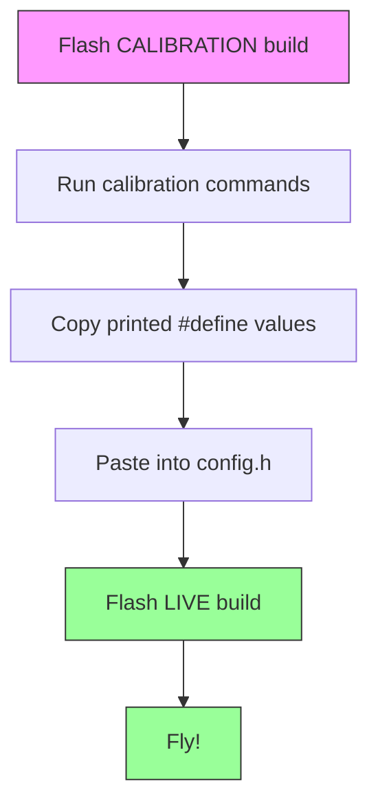

# Flight Controller Firmware

Open-source flight controller firmware for DIY drones. Based on [dRehmFlight](https://github.com/nickrehm/dRehmFlight), designed for hobbyists who want to build and fly their own aircraft.

**What this firmware does:**

- Reads sensors (accelerometer, gyroscope) to know which way the drone is pointing
- Takes your radio transmitter inputs (throttle, pitch, roll, yaw)
- Calculates motor speeds to keep the drone stable
- Supports quadcopters, hexcopters, and other VTOL aircraft

---

## Supported Hardware

| Platform | Status | Notes |
|----------|--------|-------|
| **Teensy 4.0** | Recommended | 600 MHz, excellent performance |
| **Teensy 4.1** | Supported | Same as 4.0, more pins |
| **ESP32** | Supported | 240 MHz, built-in WiFi |
| **ESP32-S3** | Supported | Newer ESP32 variant |
| Teensy 3.6 | Legacy | Older, still works |
| Arduino Uno/Mega | NOT supported | Too slow (16 MHz, no FPU) |

**Required components:**

- MPU6050 IMU sensor (GY-521 breakout board, ~$3)
- SBUS receiver (FlySky FS-iA6B recommended, ~$15)
- Radio transmitter (FlySky FS-i6X recommended, ~$50)
- Motors, ESCs, frame (depends on your build)

---

## Prerequisites

Install PlatformIO: https://platformio.org/install

---

## Build Environments

This project uses **two types of builds**:

| Build Type | Purpose | When to Use |
|------------|---------|-------------|
| **Live** | Lean flight firmware | Flying the aircraft |
| **Calibration** | Debug + calibration tools | Setting up and testing |

### Available Environments

| Environment | Platform | Type | Command |
|-------------|----------|------|---------|
| `teensy40` | Teensy 4.0 | Live | `pio run -e teensy40` |
| `teensy40_calibration` | Teensy 4.0 | Calibration | `pio run -e teensy40_calibration` |
| `teensy41` | Teensy 4.1 | Live | `pio run -e teensy41` |
| `teensy41_calibration` | Teensy 4.1 | Calibration | `pio run -e teensy41_calibration` |
| `esp32` | ESP32 | Live | `pio run -e esp32` |
| `esp32_calibration` | ESP32 | Calibration | `pio run -e esp32_calibration` |
| `esp32s3` | ESP32-S3 | Live | `pio run -e esp32s3` |
| `esp32s3_calibration` | ESP32-S3 | Calibration | `pio run -e esp32s3_calibration` |

---

## Quick Start

```bash
# Build and upload (Teensy 4.0)
pio run -e teensy40 -t upload

# Build and upload calibration version
pio run -e teensy40_calibration -t upload

# Open serial monitor
pio device monitor
```

---

## The Two-Build Workflow



**Why two builds?**

- The **live build** is small and fast (no debug code)
- The **calibration build** includes tools for setup
- Calibration values are "baked in" for reliability

---

## Serial Commands (Calibration Build Only)

| Command | What It Does |
|---------|--------------|
| `h` | Show help menu |
| `i` | Run IMU calibration (single position, quick) |
| `m` | Run 6-position IMU calibration (more accurate) |
| `o` | Run IMU calibration + detect mounting orientation |
| `r` | Run radio/receiver calibration |
| `s` | Show current status (channel values, armed state) |
| `t` | Toggle telemetry output for fc_tool (off/IMU/full) |

---

## Debug Output Options

In the **calibration build**, enable debug outputs by editing `src/main.cpp` (around line 294):

```cpp
// Debug output (uncomment as needed)
//printRadioData();      // CH1:1500 CH2:1500 CH3:1000 ...
//printDesiredState();   // thro_des:0.5 roll_des:0.0 ...
//printGyroData();       // GyroX:0.5 GyroY:-0.3 GyroZ:0.1
//printAccelData();      // AccX:0.02 AccY:-0.01 AccZ:1.01
//printRollPitchYaw();   // roll:2.5 pitch:-1.0 yaw:45.0
//printPIDoutput();      // roll_PID:0.1 pitch_PID:-0.2 ...
//printMotorCommands();  // m1:1200 m2:1300 m3:1250 m4:1275
//printLoopRate();       // dt(us):500
```

Remove `//` to enable, rebuild, and open serial monitor.

---

## Wiring Guides

Complete pinout diagrams and wiring instructions:

| Platform | Wiring Guide |
|----------|--------------|
| Teensy 4.0/4.1 | [docs/teensy_wiring.md](docs/teensy_wiring.md) |
| ESP32 / ESP32-S3 | [docs/esp32_wiring.md](docs/esp32_wiring.md) |

---

## Configuration — Files You Edit

There are only **2 files** you need to edit to configure the firmware:

### 1. `include/config.h` — Hardware, Calibration, and Flight Settings

This is the main configuration file. Everything lives here:

```cpp
// Select your OLED display
#define DISPLAY_SSD1306_128X32       // 0.91" (DSD TECH, most common)
//#define DISPLAY_SSD1306_128X64     // 0.96"
//#define DISPLAY_SH1106_128X64      // 1.3"

// Select your IMU
#define USE_MPU6050          // Most common
//#define USE_MPU9250        // 9-axis with magnetometer

// Select your receiver protocol
#define USE_SBUS_RECEIVER    // FlySky, FrSky
//#define USE_DSM_RECEIVER   // Spektrum
//#define USE_PPM_RECEIVER   // PPM signal

// Select flight mode
#define USE_ANGLE_CONTROLLER // Self-leveling (beginner)
//#define USE_RATE_CONTROLLER // Acro mode (advanced)

// Calibration values (paste from calibration output)
#define IMU_ACC_ERROR_X 0.0f
// ... (generated by calibration mode)

// Radio channel mapping (generated by calibration mode)
#define THROTTLE_CHANNEL 3
// ...

// PID gains (tune for your aircraft)
#define KP_ROLL_RATE 0.15f
// ...
```

### 2. `include/wifi_credentials.h` — WiFi Network (ESP32 only)

Edit with your WiFi network name and password. The ESP32 connects to your existing WiFi — useful for swarm coordination and remote monitoring.

```cpp
#define WIFI_SSID       "YourNetworkName"
#define WIFI_PASSWORD   "YourPassword"
```

For university/eduroam networks, uncomment the WPA2-Enterprise section.

**That's it.** Everything else is handled by build flags in `platformio.ini`.

---

## File Structure

```text
flight_controller/
├── src/
│   ├── main.cpp              # Main program (dual-core on ESP32)
│   ├── imu.cpp               # IMU sensor handling
│   ├── control.cpp           # PID controllers
│   ├── motors.cpp            # Motor/servo output
│   ├── display.cpp           # OLED display rendering (U8g2)
│   ├── wifi_manager.cpp      # WiFi STA mode (ESP32 only)
│   └── debug.cpp             # Debug print functions
├── include/
│   ├── config.h              # *** YOUR SETTINGS: hardware, calibration, PID ***
│   ├── wifi_credentials.h    # *** YOUR SETTINGS: WiFi network (ESP32) ***
│   ├── pin_definitions.h     # Pin assignments (Teensy)
│   ├── pin_definitions_esp32.h # Pin assignments (ESP32/S3)
│   ├── display.h             # Display module interface
│   ├── display_data.h        # Shared data struct (FC → display)
│   ├── wifi_config.h         # WiFi function declarations
│   └── globals.h             # Shared variables
├── lib/                      # Libraries (Calibration, SBUS, MPU6050)
├── platformio.ini            # Build configuration
└── docs/                     # Documentation
```

---

## Documentation

| Document | Description |
|----------|-------------|
| [docs/0_quickstart.md](docs/0_quickstart.md) | 60-minute setup guide |
| [docs/teensy_wiring.md](docs/teensy_wiring.md) | Teensy wiring diagrams |
| [docs/esp32_wiring.md](docs/esp32_wiring.md) | ESP32 wiring diagrams |
| [docs/2_calibration_guide.md](docs/2_calibration_guide.md) | Detailed calibration |
| [docs/roadmap.md](docs/roadmap.md) | Feature roadmap |

---

## Related Projects

- **[fc_tool](../fc_tool/)** - Desktop app for serial monitoring and IMU visualization
- **[tools/timing_calculator.py](tools/timing_calculator.py)** - CPU timing analysis tool

---

## Credits

Based on [dRehmFlight](https://github.com/nickrehm/dRehmFlight) by Nicholas Rehm. MIT License.
