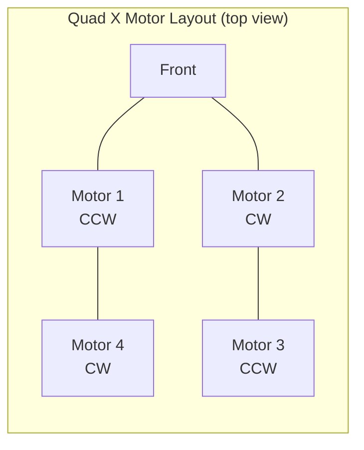

# Quickstart Guide

Get your flight controller working in under 60 minutes.

---

## Prerequisites

### Hardware

- Teensy 4.0 or 4.1
- MPU6050 (GY-521 breakout board)
- FlySky FS-iA6B receiver (or compatible SBUS receiver)
- FlySky transmitter
- USB cable for Teensy

### Software

- PlatformIO installed (VS Code extension or CLI)
- Python 3 (for calibration tools)
- USB drivers for Teensy (Teensy Loader), or run `sudo ./setup_permissions.sh`

---

## Part 1: Hardware Setup (20 minutes)

### Wire the MPU6050

| MPU6050 GY-521 | Teensy 4.0 |
|----------------|------------|
| VCC | 3.3V |
| GND | GND |
| SDA | Pin 18 |
| SCL | Pin 19 |

### Wire the FS-iA6B Receiver

**First, set transmitter to SBUS mode:**

1. Power ON transmitter
2. Menu -> System -> RX Setup -> Serial Mode -> **SBUS**
3. Save and power cycle

**Then wire receiver:**

| FS-iA6B SBUS Port | Teensy 4.0 |
|--------------------|------------|
| GND (Black wire) | GND |
| +5V (Red wire) | VIN |
| SBUS (White wire) | Pin 21 (RX5) |

### Bind Receiver

1. Transmitter OFF
2. Press and HOLD bind button on receiver
3. While holding, plug in USB to Teensy
4. Receiver LED flashes rapidly
5. Turn transmitter ON
6. Wait 3-5 seconds - LED becomes solid
7. Release bind button

---

## Part 2: Software Upload (10 minutes)

### Clone and Open Project

```bash
cd ~/floppi/flight_controller
code .
```

### Configure Hardware

Open `include/config.h` and verify:

```cpp
#define USE_MPU6050          // Your IMU
#define USE_SBUS_RECEIVER    // Your receiver
#define USE_ANGLE_CONTROLLER // Beginner-friendly mode
```

### Upload Calibration Build

```bash
pio run -e teensy40_calibration -t upload
```

Teensy LED should blink 3 times, then 1Hz blinking.

---

## Part 3: Calibration (15 minutes)

### Launch Calibration Tool

**Recommended** -- use the interactive calibration wrapper:

```bash
./tools/calibrate.sh
```

This provides a menu-driven interface with all 17 calibration commands, auto port detection, and ModemManager handling.

**Alternative** -- direct serial monitor:

```bash
python3 tools/serial_monitor.py /dev/ttyACM0
```

**Fallback** -- PlatformIO monitor:

```bash
pio device monitor
```

### Run IMU Calibration

Using calibrate.sh, select option **7** (IMU single-position), or from serial monitor type `i`:

1. Place aircraft **flat and level** on desk
2. Confirm when prompted
3. Wait for calibration (~10 seconds)
4. **Copy the printed `#define` lines**

Example output:

```
#define IMU_ACC_ERROR_X 0.012345f
#define IMU_ACC_ERROR_Y -0.008765f
#define IMU_ACC_ERROR_Z 0.023456f
#define IMU_GYRO_ERROR_X 0.456789f
#define IMU_GYRO_ERROR_Y -0.234567f
#define IMU_GYRO_ERROR_Z 0.123456f
```

### Run Orientation Detection (if IMU is not flat)

If your IMU is mounted at an angle (e.g., sideways, rotated), use calibrate.sh option **9** or type `o`. This auto-detects mounting orientation and generates axis transformation code.

### Run Radio Calibration (Optional)

If your channel mapping is non-standard, use calibrate.sh option **10** or type `r`:

1. Follow the prompts to move sticks
2. Copy the output to config.h

### Apply Calibration

1. **Paste** values into `include/config.h`
2. **Save** config.h
3. **Flash live build:**

```bash
pio run -e teensy40 -t upload
```

---

## Part 4: Ground Testing (10 minutes)

### PROPS OFF!

### Test Arming System

**Arming conditions:**

- Throttle stick LOW (<1050us)
- CH5 switch LOW

**Test:**

1. Lower throttle stick
2. CH5 switch to LOW position → "ARMED"
3. CH5 switch to HIGH → "DISARMED"

### Test Motor Direction (No Props!)



1. Arm system
2. Slowly raise throttle to 30%
3. Verify motor rotation matches diagram
4. Swap any 2 of 3 motor wires to reverse direction

---

## Part 5: First Flight (5 minutes)

### Pre-Flight Checklist

- [ ] Calibrations complete
- [ ] Arming/disarming tested
- [ ] Motor directions correct
- [ ] Props installed (correct direction!)
- [ ] Battery charged
- [ ] Clear, open area
- [ ] No wind (<5 mph)

### Hover Test

1. Place aircraft on ground
2. Arm (throttle low + CH5 low)
3. Slowly raise throttle to 40-50%
4. Lift 15cm, hold 5 seconds
5. Land gently
6. Disarm (CH5 high)

**Success criteria:**

- Stable hover
- Responds to stick inputs
- Lands gently

---

## Quick Troubleshooting

| Problem | Solution |
|---------|----------|
| Receiver not responding | Check SBUS wiring, verify TX in SBUS mode, re-bind |
| IMU data noisy | Re-run calibration, keep perfectly still |
| Motors won't arm | Throttle below 1050, CH5 low |
| Aircraft flips on takeoff | Check motor/prop directions |
| Serial commands not working | Flash calibration build, not live |

---

## Commands Reference

### Build & Flash

| Command | Purpose |
|---------|---------|
| `pio run -e teensy40_calibration -t upload` | Upload calibration firmware |
| `pio run -e teensy40 -t upload` | Upload live firmware |
| `pio run -e teensy40` | Build live firmware (no upload) |

### Calibration & Serial Tools

| Command | Purpose |
|---------|---------|
| `./tools/calibrate.sh` | Interactive calibration menu (recommended) |
| `./tools/calibrate.sh /dev/ttyACM0 imu` | Run specific calibration directly |
| `python3 tools/serial_monitor.py /dev/ttyACM0` | Raw serial monitor |
| `pio device monitor` | PlatformIO serial monitor (fallback) |
| `./tools/flash_and_run.sh` | Build + flash + open serial monitor |
| `python3 tools/calibration_reset.py` | Reset config.h calibration values |

### Testing

| Command | Purpose |
|---------|---------|
| `./tests/test_calibration.sh /dev/ttyACM0` | Run automated test suite (18 tests / 42 assertions) |
| `./tests/test_calibration.sh /dev/ttyACM0 imu` | Run single test |

---

## Optional ESP32 Sensors

ESP32 builds support two optional, telemetry-only sensors. Both default **OFF**, are
enabled via `#define` flags in `include/config.h`, and compile to zero bytes when off.
Neither feeds the flight loop — they only add data to the WiFi telemetry feed.

| Sensor | Flag | Notes |
|--------|------|-------|
| Barometer | `USE_BAROMETER` | Pressure / temperature / relative altitude. Telemetry-only — no altitude-hold. |
| GPS | `USE_GPS` | Raw NMEA passthrough. The firmware parses nothing; bytes are relayed to an external flight computer. No navigation. |

Setup detail: [phase_w2_barometer_landed_2026-05-20.md](findings/phase_w2_barometer_landed_2026-05-20.md)
and [phase_w5_gps_landed_2026-05-20.md](findings/phase_w5_gps_landed_2026-05-20.md).

---

## Next Steps

1. [Calibration Guide](2_calibration_guide.md) -- Detailed calibration procedures (all 17 commands)
2. [Hardware Setup](1_hardware_setup.md) -- Detailed wiring diagrams
3. [Troubleshooting](3_troubleshooting.md) -- Problem solving

**Happy flying!**
