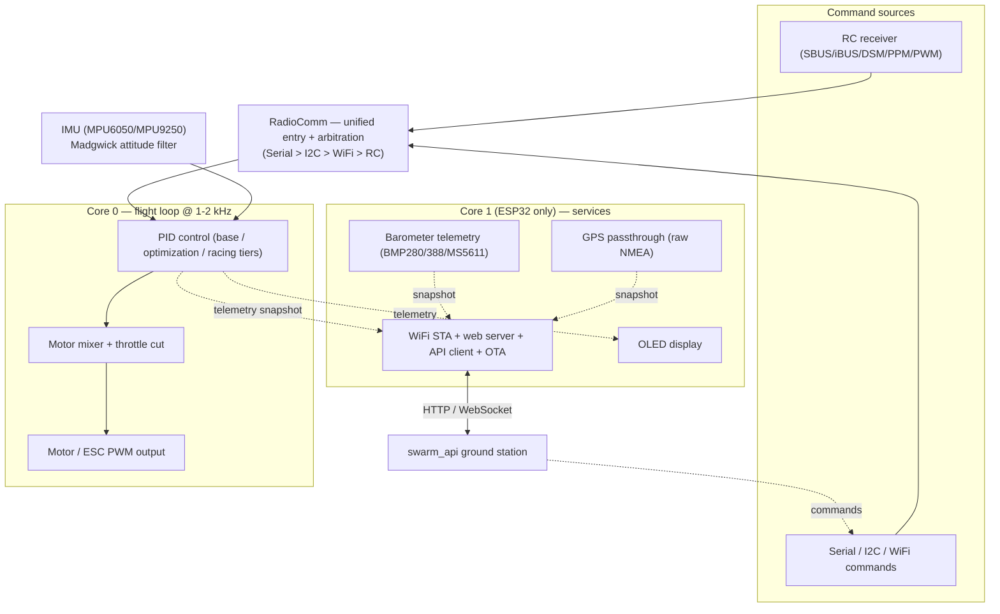

# Architecture — Level 0: System Overview

> Part of the layered [architecture/](INDEX.md) docs. This is the top of the
> drill-down: one diagram of the whole firmware. Each box links down to a
> Level 1 subsystem doc.

The flight controller is a **bare-bones stabilizer**: it turns command input
(from any source) plus IMU attitude into motor PWM, every loop iteration, at
1–2 kHz. Everything else (WiFi, telemetry, optional sensors) is bolted on
*around* that loop without slowing it down. On ESP32 the heavy network/sensor
work is physically separated onto Core 1; the flight loop owns Core 0.

## System diagram

## How to read this

- **Solid arrows** = the real-time flight path. Command in → RadioComm →
  PID → mixer → motors. This runs every loop iteration and nothing is allowed
  to block it.
- **Dotted arrows** = telemetry / out-of-band data. Core 0 publishes a
  telemetry snapshot; Core 1 consumers (web server, display) read it without
  ever touching the flight loop's variables directly.
- **WiFi command loopback**: commands that arrive over WiFi from `swarm_api`
  do **not** get a private path — they feed back *into* RadioComm as just
  another command source, so the flight loop only ever reads `channel_X_pwm`.

## Drill down (Level 1)

| Subsystem | Doc |
|---|---|
| Flight loop + PID feature tiers | [1a_flight_loop_and_pid.md](1a_flight_loop_and_pid.md) |
| Receiver protocols + command arbitration | [1b_command_sources_and_arbitration.md](1b_command_sources_and_arbitration.md) |
| ESP32 Core 0 / Core 1 split + WiFi/web/API/OTA | [1c_esp32_dual_core.md](1c_esp32_dual_core.md) |
| Sensor telemetry pipeline (IMU + baro + GPS → swarm_api) | [1d_sensor_telemetry_pipeline.md](1d_sensor_telemetry_pipeline.md) |

## Source anchors

- Flight loop call order: `src/main.cpp` `flightControl()` (getCommands →
  getIMUdata → Madgwick → getDesState → controlRATE/controlANGLE →
  controlMixer → scaleCommands → throttleCut → commandMotors → loopRate).
- Dual-core spawn: `src/main.cpp` `xTaskCreatePinnedToCore(flightControlTask, …, 0)`.
- RadioComm arbitration: `lib/RadioComm/radioComm.cpp` `getCommands()`.
- Flag cascade: `include/config.h` — `USE_WIFI` → `USE_WEB_SERVER` +
  `USE_API_SERVER` + `USE_OTA`.
