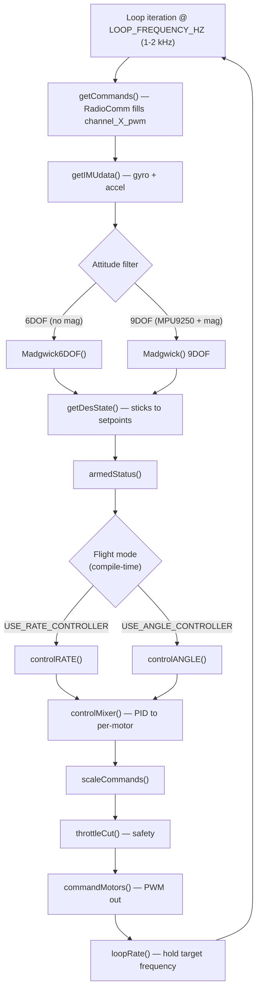
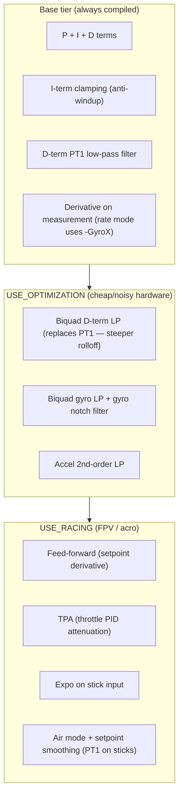

# Architecture — Level 1a: Flight Loop & PID Feature Tiers

> Up: [Level 0 — System Overview](0_system_overview.md) ·
> Index: [architecture/](INDEX.md)

The flight loop is the one piece of code that is **always** compiled and must
**never** be blocked. On Teensy it is `loop()`; on ESP32 it is
`flightControlTask()` pinned to Core 0. Both call the same `flightControl()`
body.

## Loop iteration

## PID feature tiers

Each PID axis (roll/pitch/yaw) computes P, I and D terms. **What filtering and
extras wrap those terms is selected at compile time** via three tiers. Higher
tiers add code only when their `#ifdef` is set — zero runtime cost otherwise.

- **Base** is the honest minimum: a PID with anti-windup and a single-pole
  D-term filter. Good enough to fly a stable frame.
- **USE_OPTIMIZATION** swaps the D-term PT1 for a biquad and adds gyro/accel
  filtering — for boards with noisy IMUs or cheap MCUs that need cleaner
  signals.
- **USE_RACING** adds the responsiveness features (feed-forward, TPA, expo,
  air mode) that acro/FPV pilots expect.

The tiers are independent flags; you can enable optimization without racing or
vice-versa.

## Source anchors

- Loop body + call order: `src/main.cpp` `flightControl()`.
- Loop driver: `flightControlTask()` (ESP32, Core 0) / `loop()` (Teensy).
- PID + tiers: `src/control.cpp` (`controlRATE()`, `controlANGLE()`,
  `controlMixer()`) — `#ifdef USE_OPTIMIZATION` and `#ifdef USE_RACING`
  blocks gate the extras.
- Biquad / PT1 DSP primitives: `include/filters.h`, `src/filters.cpp`.
- Mode selection: `include/config.h` `USE_RATE_CONTROLLER` /
  `USE_ANGLE_CONTROLLER`.
