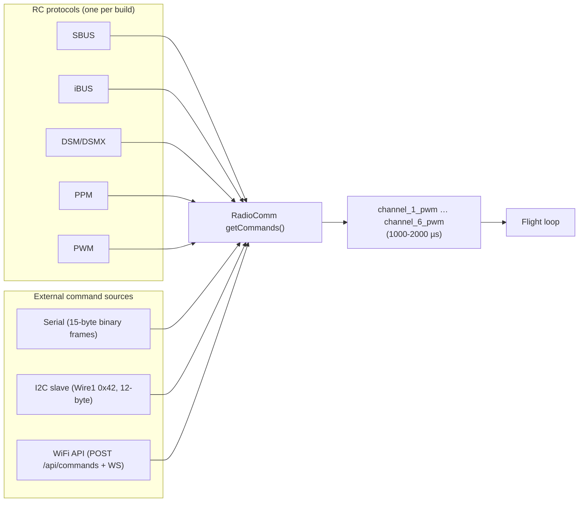
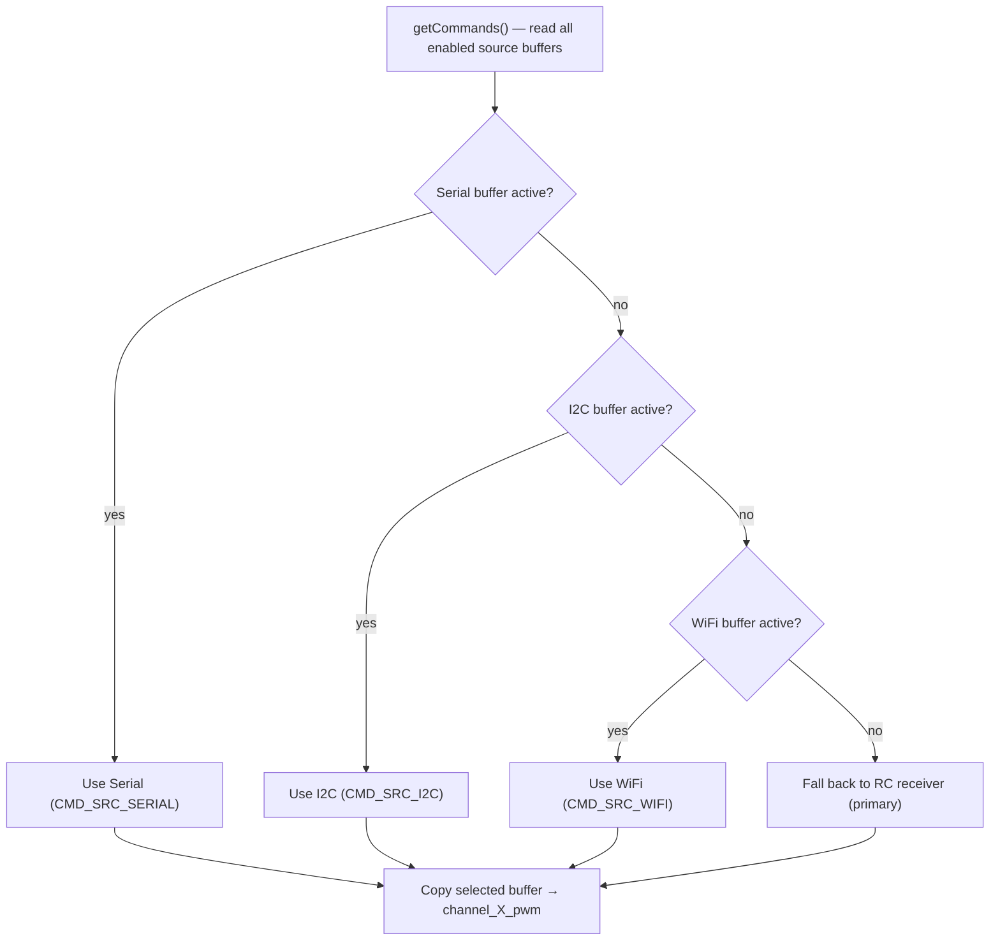

# Architecture — Level 1b: Command Sources & Arbitration

> Up: [Level 0 — System Overview](0_system_overview.md) ·
> Index: [architecture/](INDEX.md) ·
> Detail: [Level 2 — Arbitration buffers & timeout](2a_arbitration_buffers.md)

Every command into the flight controller — hardware radio, serial, I2C, or
WiFi — flows through **RadioComm**, the single entry point. The flight loop
only ever reads `channel_1_pwm` … `channel_6_pwm` (1000–2000 µs); it neither
knows nor cares where those values came from.

## Sources into RadioComm

- Exactly **one RC protocol** may be compiled per build (compile-time
  `#error` enforces this).
- RC protocol code lives in `radioComm_rc.cpp`; the external sources (serial,
  I2C, WiFi) live in `radioComm_ext.cpp`; the core dispatch + arbitration is
  in `radioComm.cpp`.

## Arbitration priority

When `USE_COMMAND_ARBITRATION` is set and more than one source is active,
`getCommands()` reads **all** enabled sources into their buffers each
iteration, then selects the highest-priority *active* source:

The mental model: **Serial > I2C > WiFi are "override" sources** (typically a
flight computer), and **RC is the primary real-time fallback**. An override
source only wins while it is actively sending; the moment it goes silent past
the timeout, RadioComm falls back down the chain (ultimately to RC). Failsafe
applies across all sources. See
[Level 2 — Arbitration buffers & timeout](2a_arbitration_buffers.md) for the
`CommandBuffer` struct and the 500 ms liveness timeout that drives the
`active` flag in each decision node above.

## Source anchors

- Arbitration: `lib/RadioComm/radioComm.cpp` `getCommands()` (priority
  Serial > I2C > WiFi > RC), `CommandSource activeSource`.
- Buffers: `CommandBuffer` instances `rcBuffer` / `serialCmdBuffer` /
  `i2cCmdBuffer` / `wifiCmdBuffer`, `SAFE_INIT` default.
- Source readers: `readSerialCmd()`, `readI2CCmd()`, `readWifiCmd()` in
  `lib/RadioComm/radioComm_ext.cpp`; RC parsers in `radioComm_rc.cpp`.
- Flags: `include/config.h` `USE_COMMAND_ARBITRATION`,
  `USE_*_RECEIVER`, `USE_SERIAL_COMMANDS`, `USE_I2C_COMMANDS`.
