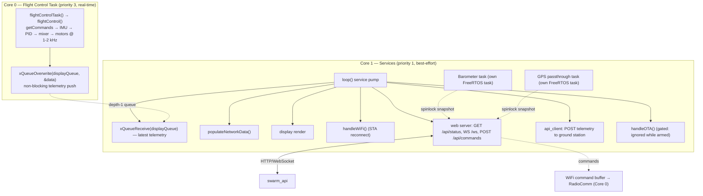

# Architecture — Level 1c: ESP32 Core 0 / Core 1 Split

> Up: [Level 0 — System Overview](0_system_overview.md) ·
> Index: [architecture/](INDEX.md) ·
> Detail: [Level 2 — Barometer Core-1 task & snapshot](2b_baro_core1_task.md)

On ESP32 the firmware is split across the two cores so that nothing on the
network/sensor side can ever steal cycles from the flight loop. **Teensy runs
the identical flight code in a single-core `loop()`** — the dual-core wiring
below is ESP32-only.

## Key rules

- **Core 0 owns flight, Core 1 owns everything else.** The flight task is
  pinned with `xTaskCreatePinnedToCore(flightControlTask, …, 0)` at priority 3.
- **Cross-core handoff is non-blocking.** Telemetry to the display goes
  through a **depth-1 queue** (`xQueueOverwrite` always keeps the latest
  sample; Core 0 never waits). Barometer and GPS instead publish into their
  own **spinlock-guarded snapshots** that the web serializer reads.
- **WiFi commands loop back through RadioComm**, not a private path — the web
  server writes a WiFi command buffer that Core 0's `getCommands()` reads
  (see [Level 1b](1b_command_sources_and_arbitration.md)).
- **OTA is safety-gated**: `handleOTA()` ignores OTA traffic while the drone
  is armed.
- **Flag cascade** (`include/config.h`): setting `USE_WIFI` on an ESP32 build
  auto-defines `USE_WEB_SERVER`, `USE_API_SERVER`, and `USE_OTA`.

## Drill down

- [Level 2 — Barometer Core-1 task & spinlock snapshot](2b_baro_core1_task.md)
  shows how an optional Core-1 sensor task stays off the flight loop.

## Source anchors

- Task spawn + queue: `src/main.cpp` `xTaskCreatePinnedToCore(...)`,
  `displayQueue = xQueueCreate(1, sizeof(DisplayData_t))`,
  `xQueueOverwrite` / `xQueueReceive`.
- Core 1 service pump: `src/main.cpp` `loop()` (ESP32 branch) —
  `populateNetworkData`, `handleWiFi`, `handleOTA`, `vTaskDelay`.
- Web server: `src/web_server.cpp` (`/api/status`, `/ws`, `/api/commands`).
- API client: `src/api_client.cpp`. OTA: `src/ota.cpp`.
- Flag cascade: `include/config.h` `#if defined(USE_ESP32) && defined(USE_WIFI)`.
