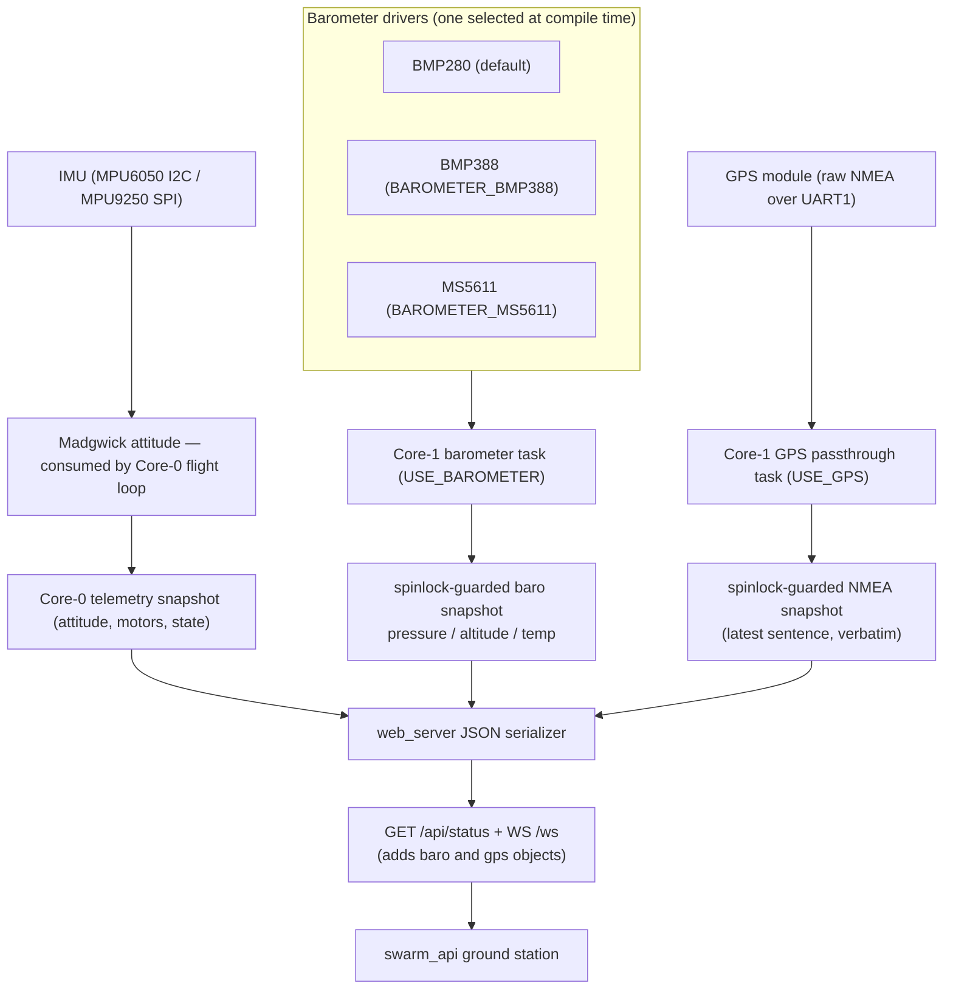

# Architecture — Level 1d: Sensor Telemetry Pipeline

> Up: [Level 0 — System Overview](0_system_overview.md) ·
> Index: [architecture/](INDEX.md) ·
> Detail: [Level 2 — Barometer Core-1 task & snapshot](2b_baro_core1_task.md)

This subsystem covers everything that produces **data** rather than control
output: the IMU (which the flight loop also consumes), and the optional
telemetry-only barometer and passthrough-only GPS. All of it converges on the
ESP32 web server, which serves it to `swarm_api`.

**Scope guardrail:** the barometer and GPS are deliberately **telemetry-only /
passthrough-only**. They add data; they never feed the flight loop. Onboard
navigation, altitude hold, and GPS-guided flight remain out of scope (flight
computer territory). See the carve-out in
[`docs/scope.md`](../scope.md) and the specs
[`barometer_integration_spec_2026-05-20.md`](../findings/barometer_integration_spec_2026-05-20.md)
and [`gps_passthrough_spec_2026-05-20.md`](../findings/gps_passthrough_spec_2026-05-20.md).

## How the three data sources differ

| Source | Where it runs | Used by flight loop? | Published as |
|---|---|---|---|
| IMU attitude | Core 0 (flight loop) | **Yes** — drives PID | telemetry snapshot |
| Barometer | Core 1 task | No (telemetry only) | `baro` object in `/api/status` + `/ws` |
| GPS | Core 1 task | No (passthrough only) | `gps` object (raw NMEA + liveness/age) |

- The **barometer** has three interchangeable drivers behind one public API;
  the chip is selected by a compile-time flag (BMP280 is the default). The
  task polls the sensor and writes a spinlock-guarded snapshot — it never
  touches Core-0 variables.
- The **GPS** is pure passthrough (Flavour A): the FC parses nothing. The
  Core-1 task reads raw NMEA bytes off UART1 and republishes the most recent
  complete sentence verbatim into a snapshot, plus a liveness bit and the
  sentence age. NMEA parsing is the consumer's job.
- Both schema additions are wire-contract changes to `/api/status` and `/ws`;
  the canonical contract is
  [`swarm_api_contract_2026-05-20.md`](../findings/swarm_api_contract_2026-05-20.md).

## Drill down

- [Level 2 — Barometer Core-1 task & spinlock snapshot](2b_baro_core1_task.md).

## Source anchors

- IMU: `src/imu.cpp` (`#ifdef USE_MPU6050` I2C / `#elif USE_MPU9250` SPI),
  Madgwick in `src/main.cpp` `flightControl()`.
- Barometer: `include/barometer.h`, `src/barometer.cpp`
  (`#ifdef USE_BAROMETER`, `BAROMETER_BMP388` / `BAROMETER_MS5611` selectors).
- GPS: `include/gps.h`, `src/gps.cpp` (`#ifdef USE_GPS`, UART1 conflict
  `#error` guards).
- Serializer: `src/web_server.cpp` — `baro` and `gps` JSON objects on
  `/api/status` and `/ws`.
