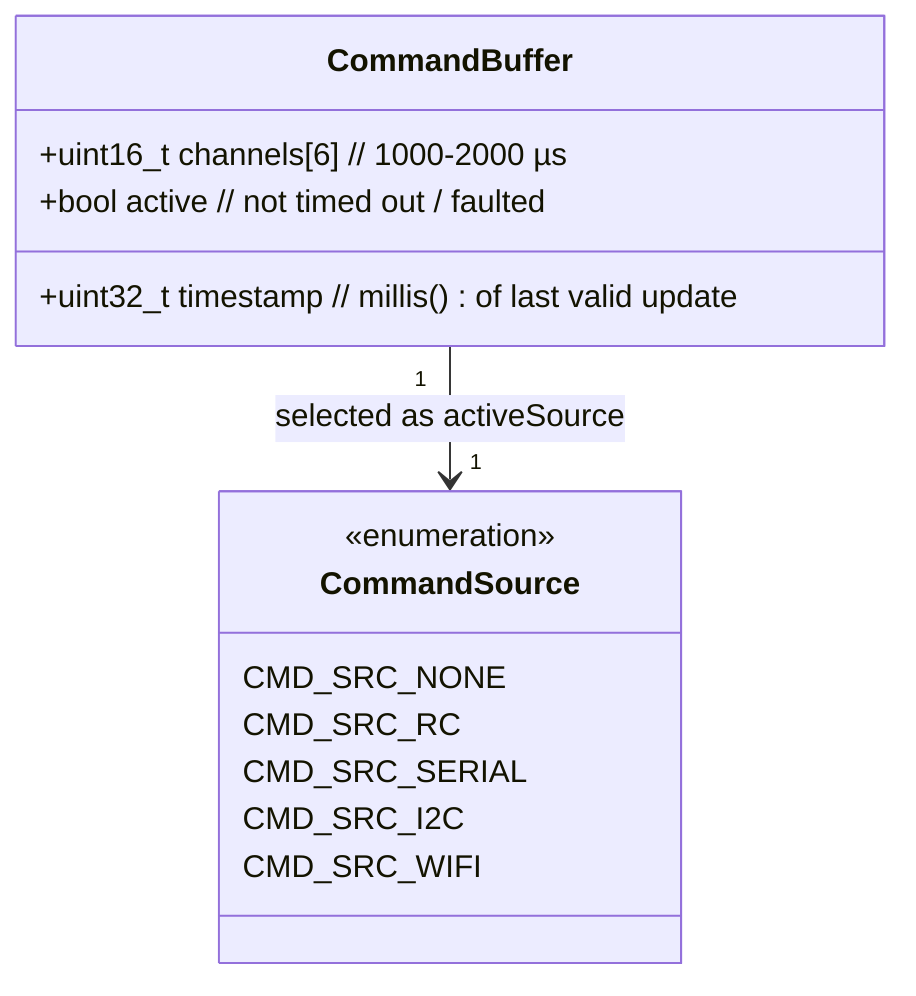
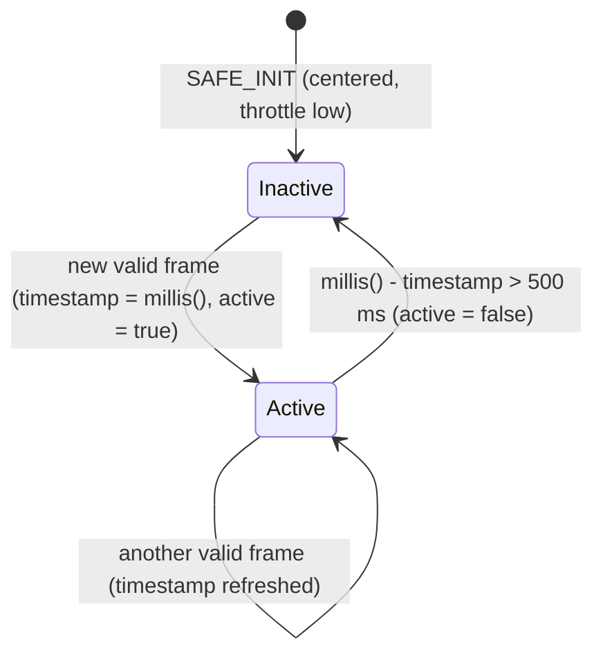
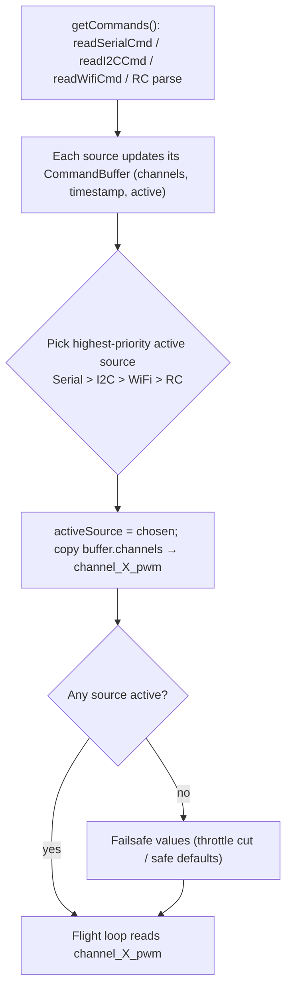

# Architecture — Level 2: Arbitration Buffers & Timeout

> Up: [Level 1b — Command Sources & Arbitration](1b_command_sources_and_arbitration.md) ·
> Index: [architecture/](INDEX.md)

This is the detail behind the `active` flag that the
[Level 1b arbitration decision](1b_command_sources_and_arbitration.md) branches
on. Each command source owns one `CommandBuffer`; a 500 ms liveness timeout is
what flips a source from active to inactive so RadioComm can fall back.

## The buffer

There is one `CommandBuffer` per source — `rcBuffer`, `serialCmdBuffer`,
`i2cCmdBuffer`, `wifiCmdBuffer` — each initialized to `SAFE_INIT`
(centered sticks, throttle low: `{1500,1500,1000,1500,1000,1000}`).

## Per-source liveness state machine

Every override source (`readSerialCmd` / `readI2CCmd` / `readWifiCmd`) runs
the same logic: a fresh frame stamps `timestamp = millis()` and sets
`active = true`; if no new data arrives within `OVERRIDE_TIMEOUT_MS` (500 ms),
the source is marked `active = false`.

## How a frame becomes motor output

The 500 ms timeout is the safety hinge: if the controlling flight computer
crashes or the WiFi link drops, its buffer goes inactive within half a second
and RadioComm hands control back down the priority chain — to RC if present,
or to failsafe if nothing is live.

## Source anchors

- Struct + enum + timeout: `lib/RadioComm/radioComm.h`
  (`struct CommandBuffer`, `enum CommandSource`, `#define OVERRIDE_TIMEOUT_MS 500`).
- Liveness updates: `lib/RadioComm/radioComm_ext.cpp` lines around the
  `buf.timestamp = millis(); buf.active = true;` /
  `millis() - buf.timestamp > OVERRIDE_TIMEOUT_MS` blocks.
- Selection: `lib/RadioComm/radioComm.cpp` `getCommands()`,
  `SAFE_INIT`, `activeSource`.
