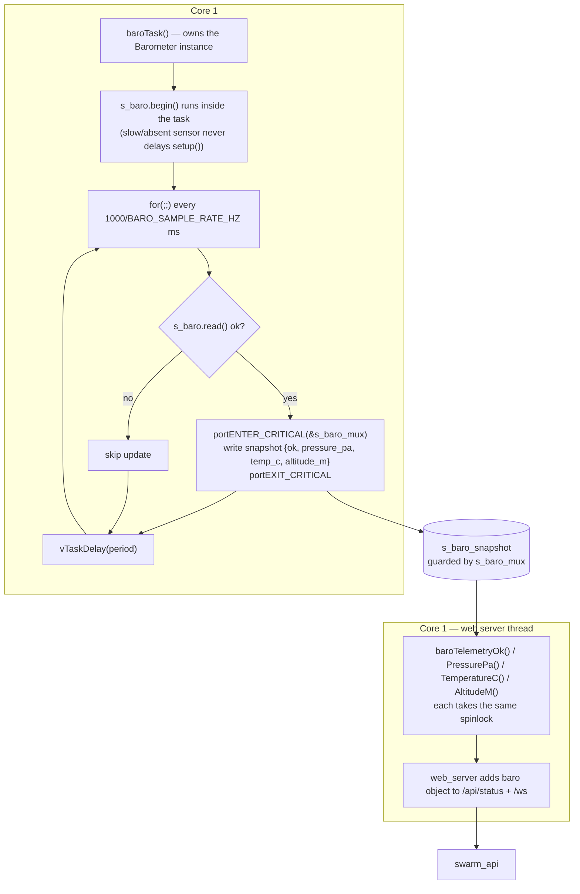

# Architecture — Level 2: Barometer Core-1 Task & Spinlock Snapshot

> Up: [Level 1c — ESP32 Dual Core](1c_esp32_dual_core.md) ·
> [Level 1d — Sensor Telemetry Pipeline](1d_sensor_telemetry_pipeline.md) ·
> Index: [architecture/](INDEX.md)

The barometer is the worked example of "an optional sensor that adds data
without ever touching the flight loop." It is a dedicated Core-1 FreeRTOS task
that owns the sensor and publishes into a spinlock-guarded snapshot; the web
serializer reads that snapshot under the same spinlock. Core 0 never sees any
of it. The GPS passthrough task follows the identical pattern.

## Producer / consumer across cores

## Why it is built this way

- **The task spawns from `setup()` and immediately detaches** — `begin()` runs
  *inside* the task, so a sensor that is slow to respond or simply absent
  cannot stall the main setup path or the web server bring-up.
- **The snapshot is the only shared state**, and it is tiny (4 fields). The
  `portENTER_CRITICAL` / `portEXIT_CRITICAL` spinlock around both the write
  (in the task) and every read (in the accessors) guarantees the Core-1
  baro read and the Core-0 IMU read cannot corrupt each other — they are on
  different buses/variables, and the snapshot itself is never half-written.
- **Graceful absence**: if `begin()` fails, `s_baro_snapshot.ok` stays
  `false` and the telemetry simply reports not-ok rather than crashing.
- **Cadence is POST-immune**: a dedicated task (priority 1, 3072 B stack,
  pinned to Core 1) gives the barometer a steady sample rate that an
  HTTP-POST-driven loop slice could not.

## Source anchors

- Task + snapshot + spinlock: `src/barometer.cpp` `baroTask()`,
  `s_baro_snapshot`, `s_baro_mux` (`portMUX_TYPE`), `startBarometerTask()`
  (`xTaskCreatePinnedToCore(baroTask, "Baro", 3072, NULL, 1, …, 1)`).
- Accessors: `baroTelemetryOk()` / `baroTelemetryPressurePa()` /
  `baroTelemetryTemperatureC()` / `baroTelemetryAltitudeM()` —
  declared in `include/barometer.h`, each takes `s_baro_mux`.
- Spawn site: `src/main.cpp` setup (`[ESP32] Barometer telemetry task on Core 1`).
- Serializer: `src/web_server.cpp` — `baro` JSON object.
- Budget rationale: `docs/findings/fc_core1_budget_2026-05-20.md`.
