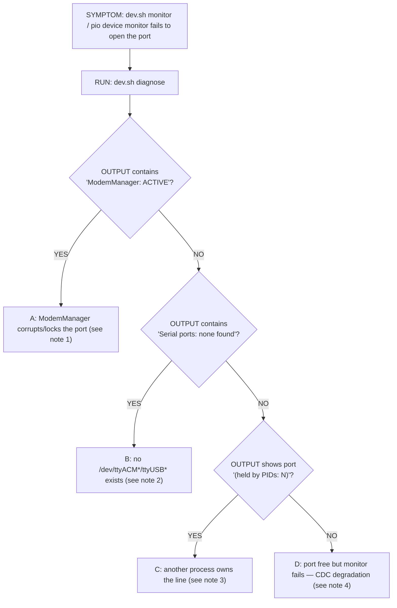
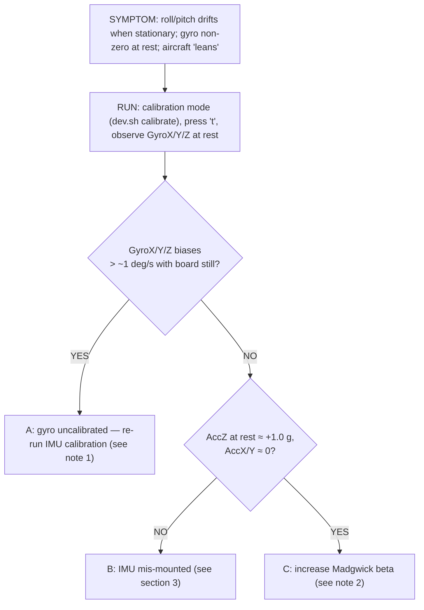
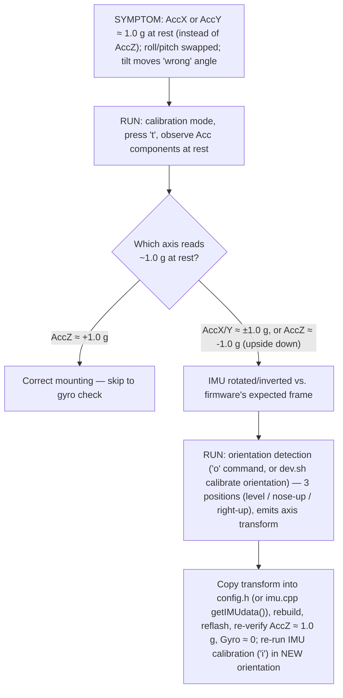
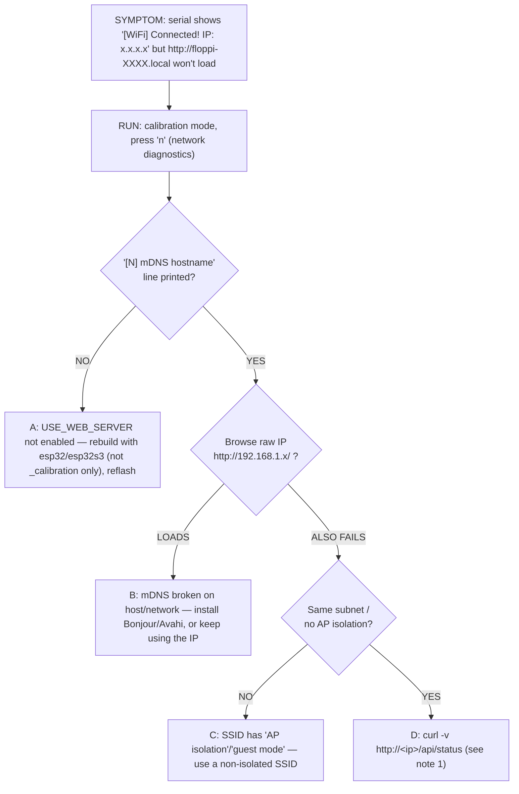
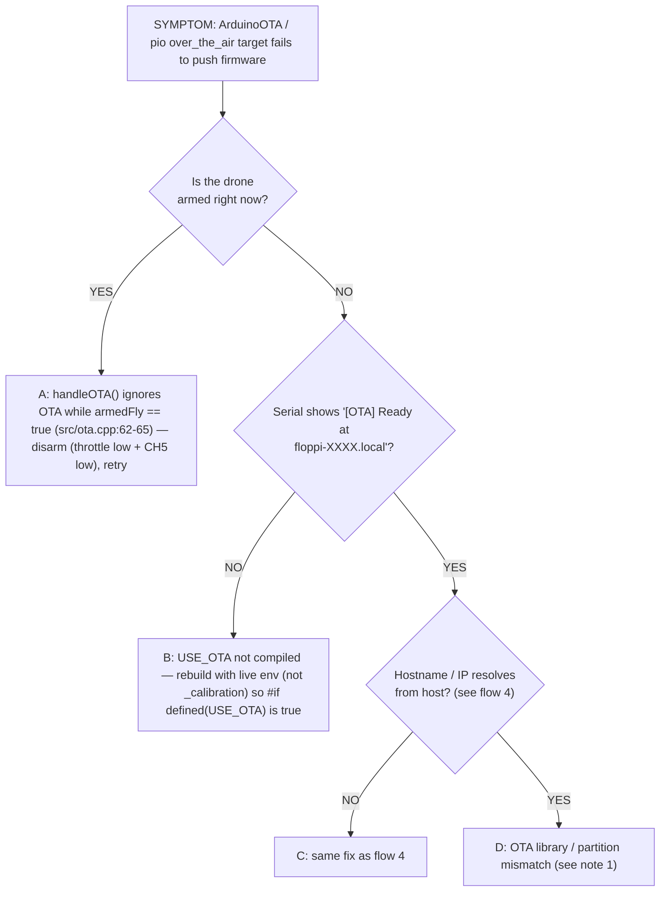
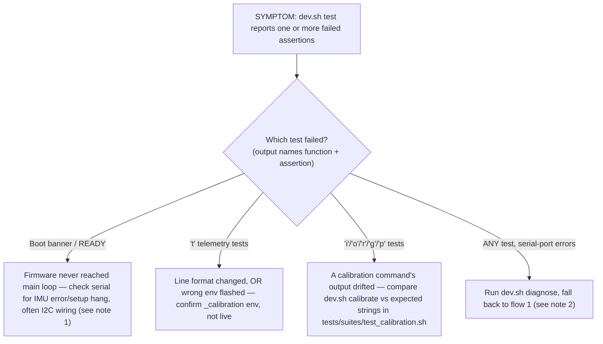

# Diagnose Decision Tree

Symptom-first troubleshooting flow for the flight controller. Pair this with
`dev.sh diagnose [PORT]` (host-side readiness check) and the `n` calibration
command (on-board network diagnostics, ESP32 only).

This is a **decision-tree presentation**. For flat-list troubleshooting
(upload errors, motor wiring, flight tuning) see
[3_troubleshooting.md](3_troubleshooting.md). Each block follows
`SYMPTOM → RUN → BRANCH`: pick the symptom you see, run the first check,
follow YES/NO down.

---

## 1. Serial port not detected / `dev.sh monitor` can't open the port

1. **ModemManager ACTIVE** — opens every new CDC device for 30 s, corrupting the stream and locking the port. Remediation: `sudo systemctl stop ModemManager` (one-shot), `sudo systemctl mask ModemManager` (permanent disable), `sudo apt remove modemmanager` (nuke entirely). Then unplug+replug the board.
2. **No serial port** — no `/dev/ttyACM*` or `/dev/ttyUSB*` exists. Teensy: may be in HalfKay bootloader (no CDC) — press reset or run `tools/teensy_reboot`. USB cable: must be a data cable. ESP32: check USB-UART driver (CP2102/CH340) — `lsusb` should show the bridge. Receiver drawing too much current can brown out the MCU on USB power — disconnect receiver and retry.
3. **Held by PIDs** — another process owns the line. Identify and kill: `fuser -k /dev/ttyACM0`, `pkill -f serial_monitor` (typical culprit), `pkill -f "pio device"`.
4. **CDC degradation** — Teensy USB CDC degrades after ~15 rapid open/close cycles (`docs/todo.md` Notes). Only `teensy_reboot` or a physical unplug recovers — DTR/RTS does NOT reboot Teensy 4.0.

## 2. Gyro / attitude drift while running

1. **Gyro uncalibrated** — re-run IMU calibration (`i` → `y` → `y`). Board MUST be still and level; let MPU warm up 5 min first (temperature-dependent — see `3_troubleshooting.md` IMU section). Copy the printed `IMU_GYRO_ERROR_X/Y/Z` into config.h, rebuild, reflash.
2. **Attitude still drifts, biases small** — try increasing Madgwick beta (e.g. 0.04 → 0.06) so the filter trusts accel more — see `3_troubleshooting.md` "IMU values drift over time".

## 3. MPU mounting wrong / axes swapped or inverted

Reference: `docs/todo.md` Notes — "MPU6050 mounting: AccX≈1.02 g, AccY≈0.05 g,
AccZ≈-0.10 g → X-axis points down" is the canonical example of a wrong-mount.

## 4. WiFi works but the web UI won't load

1. **`curl -v http://<ip>/api/status`** — "refused": port 80 not listening, check calibration `n` for "Web server port availability". "timed out": host firewall blocks 80, OR ESP32 lost WiFi between attempts (check serial).

Reference: `src/web_server.cpp:131-138` (mDNS), `features/wifi-configuration.md`
"Network Diagnostics".

## 5. OTA upload fails

1. **Partition mismatch** — confirm host PlatformIO and the board's installed firmware were built from the same ESP32 Arduino core version. A clean `pio run -t clean && pio run -t upload` over USB-serial re-syncs partitions.

## 6. `tools/dev.sh test` (test_calibration.sh) fails

1. **Boot/READY failure** — see `3_troubleshooting.md` "IMU/Sensor Issues".
2. **Serial-port errors in tests** — the harness wraps `serial_monitor.py`; ModemManager or CDC degradation makes every test look broken.

Reference: `tests/lib/harness.sh` (shared) and `tests/suites/test_calibration.sh`
(18 functions / 42 assertions).

---

## When all else fails

1. `dev.sh diagnose` — host environment.
2. `n` (calibration mode, ESP32) — on-board network state.
3. `c` (calibration mode) — which calibrations are stored vs. fresh.
4. `d` — dumps all config #defines as the firmware sees them.

If none isolate the problem, fall through to
[3_troubleshooting.md](3_troubleshooting.md) for upload errors, receiver
binding, ESC behavior, flight tuning, and power problems — not duplicated here.
