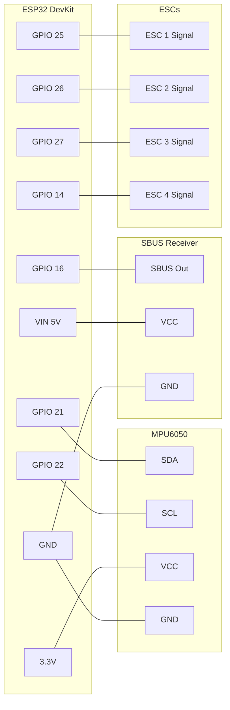

# ESP32 Wiring Guide

Complete wiring reference for ESP32 and ESP32-S3 flight controllers.

---

## Wiring Diagram (ESP32)



---

## ESP32 Pin Reference

### Core Connections

| Component | Component Pin | ESP32 GPIO | Notes |
|-----------|---------------|------------|-------|
| MPU6050 | SDA | 21 | I2C data |
| MPU6050 | SCL | 22 | I2C clock |
| MPU6050 | VCC | 3.3V | **NOT 5V!** |
| MPU6050 | GND | GND | Common ground |
| SBUS Receiver | SBUS | 16 | Serial2 RX |
| SBUS Receiver | VCC | VIN | 5V power |
| SBUS Receiver | GND | GND | Common ground |
| Status LED | - | 2 | Built-in |

### Motors (LEDC PWM)

| Motor | ESP32 GPIO | Quad X Position | Rotation |
|-------|------------|-----------------|----------|
| Motor 1 | 25 | Front Left | CCW |
| Motor 2 | 26 | Front Right | CW |
| Motor 3 | 27 | Back Right | CCW |
| Motor 4 | 14 | Back Left | CW |
| Motor 5 | 12 | Optional | - |
| Motor 6 | 13 | Optional | - |

### Servos

| Servo | ESP32 GPIO |
|-------|------------|
| Servo 1 | 32 |
| Servo 2 | 33 |
| Servo 3 | 4 |
| Servo 4 | 16 |
| Servo 5 | 17 |
| Servo 6 | 5 |
| Servo 7 | 18 |

### Alternative Receiver Protocols

| Protocol | RX GPIO | Notes |
|----------|---------|-------|
| SBUS | 16 | Serial2, software inversion |
| iBUS | 4 | Serial1 |
| DSM | 4 | Serial1 |
| PPM | 35 | Input-only GPIO |

---

## ESP32-S3 Pin Reference

The ESP32-S3 uses different GPIO assignments:

### Core Connections (S3)

| Component | Component Pin | S3 GPIO | Notes |
|-----------|---------------|---------|-------|
| MPU6050 | SDA | 8 | I2C data |
| MPU6050 | SCL | 9 | I2C clock |
| SBUS Receiver | SBUS | 18 | Serial RX |
| Status LED | - | 48 | RGB LED |

### Motors (S3)

| Motor | S3 GPIO | Position |
|-------|---------|----------|
| Motor 1 | 35 | Front Left |
| Motor 2 | 36 | Front Right |
| Motor 3 | 37 | Back Right |
| Motor 4 | 38 | Back Left |
| Motor 5 | 39 | Optional |
| Motor 6 | 40 | Optional |

### Servos (S3)

| Servo | S3 GPIO |
|-------|---------|
| Servo 1 | 41 |
| Servo 2 | 42 |
| Servo 3 | 1 |
| Servo 4 | 2 |
| Servo 5 | 10 |
| Servo 6 | 11 |
| Servo 7 | 12 |

---

## Motor Layout (Quad X)

```text
        FRONT
    M1 (CCW)    M2 (CW)
    GPIO 25     GPIO 26
        \      /
         \    /
          \  /
          /  \
         /    \
        /      \
    M4 (CW)     M3 (CCW)
    GPIO 14     GPIO 27
        BACK
```

---

## ESP32 GPIO Notes

### Avoid These Pins

| GPIO | Reason |
|------|--------|
| 0 | Strapping pin (boot mode) |
| 2 | Strapping pin (OK after boot, used for LED) |
| 12 | Strapping pin (flash voltage) |
| 15 | Strapping pin (debugging) |
| 6-11 | Connected to internal flash |

### Input-Only Pins

These GPIOs can only be used as inputs:
- GPIO 34, 35, 36 (VP), 39 (VN)

Good for PPM/PWM receiver input.

---

## SBUS Inversion

ESP32 can invert the SBUS signal in software:

```cpp
Serial2.begin(100000, SERIAL_8E2, 16, 17, true);  // true = inverted
```

No external inverter circuit needed (unlike some other MCUs).

---

## Power Notes

| Source | Voltage | Notes |
|--------|---------|-------|
| USB | 5V | Development only |
| VIN | 5-12V | Flight (from BEC) |
| 3.3V out | 3.3V | Sensors only |

**WiFi power spikes:**
- WiFi TX can spike to 350mA
- Use a quality 5V supply rated for 500mA+

---

## Quick Wiring Checklist (ESP32)

- [ ] MPU6050 SDA → GPIO 21
- [ ] MPU6050 SCL → GPIO 22
- [ ] MPU6050 VCC → 3.3V
- [ ] MPU6050 GND → GND
- [ ] Receiver SBUS → GPIO 16
- [ ] Receiver VCC → VIN (5V)
- [ ] Receiver GND → GND
- [ ] ESC 1 Signal → GPIO 25
- [ ] ESC 2 Signal → GPIO 26
- [ ] ESC 3 Signal → GPIO 27
- [ ] ESC 4 Signal → GPIO 14
- [ ] All ESC grounds → GND
