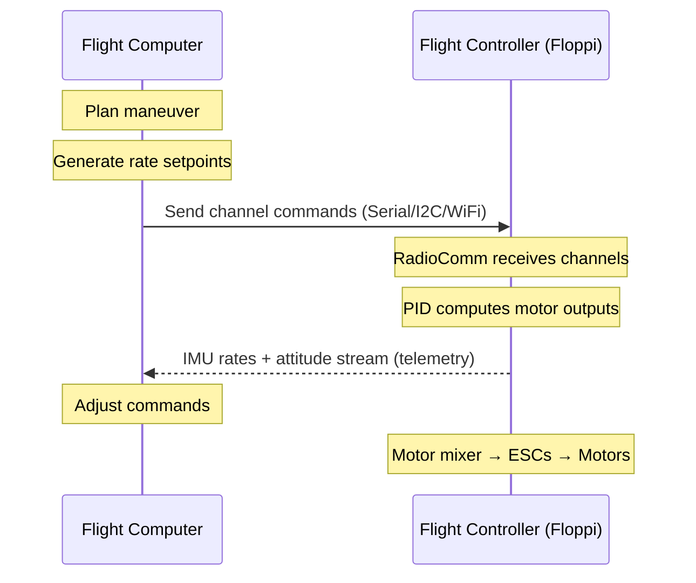

# Acrobatics Command Architecture: FC + Flight Computer Split

> Date: 2026-02-20
> Status: Research finding

## Summary

Floppi's current architecture **already supports all physically possible acrobatic maneuvers**. Rate mode PID + channel command inputs + telemetry output is the same pattern used by Betaflight, PX4, and research platforms (ETH Zurich, MIT) for aggressive aerobatic flight. No firmware changes are required. An external flight computer sends rate setpoints, the FC tracks them.

## How Acrobatics Work

### The FC's Role (What Floppi Already Does)

In rate mode, the FC's PID controller tracks **body rate setpoints** (degrees/second around roll, pitch, yaw axes) and a **thrust level**. This is exactly what acrobatic flight needs:

| Channel | Function | Acro Usage |
|---------|----------|------------|
| CH1 (Roll) | Roll rate setpoint | ±400 deg/s for flips, rolls |
| CH2 (Pitch) | Pitch rate setpoint | ±400 deg/s for flips, loops |
| CH3 (Throttle) | Thrust level | 0-100%, varied during maneuvers |
| CH4 (Yaw) | Yaw rate setpoint | ±400 deg/s for pirouettes |
| CH5 | Aux (arm/disarm) | Safety switch |
| CH6 | Aux (mode/trigger) | Flight computer mode select |

The FC doesn't know or care that it's doing a flip. It just tracks the commanded rates. A 360° roll is simply: command +400 deg/s roll for ~0.9 seconds, then command 0 deg/s.

### The Flight Computer's Role (External)

The flight computer is responsible for:

1. **Trajectory planning** — deciding what maneuver to execute and when
2. **Rate command generation** — converting desired maneuvers into rate setpoints over time
3. **Throttle management** — adjusting thrust through maneuvers (e.g., increased thrust during inverted portions)
4. **State estimation** — reading FC telemetry to know current attitude/rates
5. **Safety monitoring** — abort conditions, geofencing, battery monitoring

### Command Flow



## Specific Maneuver Examples

### Barrel Roll (360° roll)

```
Time    CH1(Roll)   CH3(Throttle)   Notes
0.0s    1500(0°/s)  1500(hover)     Level flight
0.1s    2000(+400)  1600(+boost)    Initiate roll, add thrust
0.5s    2000(+400)  1700(+more)     Inverted — needs extra thrust
0.9s    2000(+400)  1600(+boost)    Coming upright
1.0s    1500(0°/s)  1500(hover)     Stop roll, resume hover
```

### Flip (360° pitch)

```
Time    CH2(Pitch)  CH3(Throttle)   Notes
0.0s    1500(0°/s)  1700(climb)     Pre-climb for altitude margin
0.5s    2000(+400)  1400(reduce)    Initiate flip, reduce thrust
1.0s    2000(+400)  1700(boost)     Inverted — boost thrust
1.4s    1500(0°/s)  1500(hover)     Stop pitch, resume hover
```

### Inverted Hover

```
Time    CH1(Roll)   CH2(Pitch)   CH3(Throttle)   Notes
0.0s    2000(+400)  1500         1600             Roll 180°
0.5s    1500(0)     1500         1000(idle)       Inverted — zero throttle
0.6s    1500(0)     1500         1500(hover)      Resume thrust (inverted)
```

**Note**: Inverted hover requires USE_AIRMODE (under USE_RACING flag) to keep PID active at low/zero throttle. Without air mode, PID output zeroes when throttle is low, causing loss of control during the transition.

### Pirouette (yaw spin while hovering)

```
Time    CH4(Yaw)    CH3(Throttle)   Notes
0.0s    2000(+400)  1500(hover)     Spin yaw at 400°/s
3.6s    1500(0)     1500(hover)     Stop after 4 full rotations
```

## What Floppi Already Has

| Feature | Status | Relevance |
|---------|--------|-----------|
| Rate mode PID | Done | Core acro control loop |
| Angle mode PID | Done | Self-leveling for beginners (not used in acro) |
| USE_AIRMODE | Done (USE_RACING) | PID stays active at zero throttle — required for flips |
| Feed-forward | Done (USE_RACING) | Faster response to rapid setpoint changes |
| TPA (Throttle PID Attenuation) | Done (USE_RACING) | Prevents oscillation at high throttle |
| Expo curves | Done (USE_RACING) | Fine control near center, fast response at extremes |
| Setpoint smoothing | Done (USE_RACING) | Reduces step-response harshness |
| Serial commands | Done | UART binary frames, 50-100Hz capable |
| I2C commands | Done | Wire1 slave, 200+Hz capable |
| WiFi commands | Done | HTTP/WebSocket, 10-50Hz (marginal for aggressive acro) |
| Command arbitration | Done | Priority: Serial > I2C > WiFi > RC |
| Telemetry output | Done | IMU rates + attitude via serial/WiFi |
| D-term LP filter | Done | Prevents D-kick on rapid setpoint changes |
| Biquad filters | Done (USE_OPTIMIZATION) | Better noise rejection for noisy hardware |

## Command Interface Recommendations

For acrobatic flight, command source matters:

| Source | Rate | Latency | Acro Suitability |
|--------|------|---------|-------------------|
| Serial UART | 50-100 Hz | 1-2 ms | Good — recommended for FC→FC |
| I2C | 200+ Hz | <1 ms | Excellent — lowest latency |
| WiFi API | 10-50 Hz | 5-50 ms | Marginal — OK for slow maneuvers |
| RC (SBUS/iBUS) | 50-150 Hz | 5-15 ms | Good — standard pilot control |

**Recommendation**: For autonomous acrobatics via flight computer, use Serial UART or I2C. WiFi has too much jitter for aggressive maneuvers. For human-piloted acro, standard RC (SBUS/iBUS) is fine.

## What Real Systems Do

### Betaflight (FPV Racing)

- Rate mode = "Acro mode" — the default for all competitive FPV
- Commands: rate setpoints (deg/s) on roll/pitch/yaw + thrust %
- Air mode: always on in competition (PID active at all throttles)
- Feed-forward: standard for fast response
- MAX_RATE: typically 800-1200 deg/s for FPV racing
- Command rate: RC at 150 Hz (ELRS), PID loop at 4-8 kHz

### PX4 / ArduPilot (Autonomous)

- "Acro mode": body rate setpoints via RC or offboard commands
- Offboard mode: external computer sends rate/thrust commands via MAVLink
- Command rate: MAVLink at 50-100 Hz, PID at 250-1000 Hz
- Used for autonomous acrobatic research (ETH Zurich, CMU)

### Research Platforms

- **ETH Zurich (Flying Machine Arena)**: Custom FCs, body rate commands at 500 Hz via radio, achieved 20+ g maneuvers
- **MIT (Aggressive Flight)**: PX4 in acro mode, offboard rate commands at 100 Hz via serial
- **Crazyflie**: Rate commands at 100 Hz via radio, flips and loops demonstrated
- **UZH Swift (Autonomous Drone Racing)**: Custom stack, 400+ Hz rate commands, competitive with human pilots

## Implemented Enhancements (2026-02-20)

The following improvements were identified during research and implemented in this session:

### Bug Fixes

1. **MPU6050 gyro range initialization** — `mpu6050.initialize()` hardcodes 250 DPS regardless of `config.h` `GYRO_SCALE` setting. Fix: explicit `setFullScaleGyroRange(GYRO_SCALE)` call after `initialize()` in `imu.cpp`. Without this fix, gyro readings were scaled incorrectly (4x error when config says 1000 DPS but hardware runs at 250 DPS).

2. **MPU6050 accel range initialization** — Same issue: `initialize()` hardcodes 2G. Fix: explicit `setFullScaleAccelRange(ACCEL_SCALE)` after `initialize()`. Accel readings could be clipped or mis-scaled.

### New Features

1. **Higher MAX_RATE defaults** — Roll/pitch: 200 -> 500 deg/s. Yaw: 160 -> 400 deg/s. Previous values too low for any aggressive maneuvering. Config.h comments document recommended ranges (250-500 sport, 500-800 aggressive acro, 800+ FPV racing).

2. **Quaternion telemetry** — New telemetry mode 3: outputs q0-q3 (Madgwick filter internals) + gyro rates. Avoids gimbal lock during aggressive maneuvers. Toggled via `t` command cycling (off -> IMU -> full -> quat). Plot ID 4 for quaternions, plot ID 1 for gyro rates.

3. **Gyro saturation warning** — One-shot diagnostic printed when entering quaternion telemetry mode. Shows current gyro readings as % of full-scale range, warns if >90% utilization. Helps users identify if they need to increase gyro range (e.g., GYRO_1000DPS -> GYRO_2000DPS).

4. **Acro setup guide in config.h** — 6-step quick setup guide as comment block: switch to rate mode, enable USE_RACING, enable USE_AIRMODE, set gyro range, tune MAX_RATE, optional USE_OPTIMIZATION.

### Still Nice-to-Have (Not Implemented)

1. **Bidirectional serial protocol** — Current telemetry is one-way (FC->computer). A request-response protocol would let the flight computer query specific values. Low priority since telemetry already streams continuously.

2. **GYRO_2000DPS as default for acro** — Currently configurable in config.h (GYRO_250DPS through GYRO_2000DPS). The acro setup guide recommends GYRO_2000DPS. No code change needed, just user config.

## Conclusion

**Floppi already supports acrobatic flight.** The architecture is correct: rate mode PID + external commands + telemetry feedback is the universal pattern for aerobatic drones, from toy quadcopters to research platforms pulling 20g. The key requirements are:

1. **Rate mode** (compile-time, already default)
2. **USE_RACING flag** (for air mode + feed-forward)
3. **Serial or I2C command source** (for flight computer control)
4. **Adequate PID tuning** (needs real hardware testing)

The flight computer handles all the "intelligence" — trajectory planning, maneuver sequencing, safety monitoring. The FC just tracks rates. This is exactly the bare-bones philosophy: the FC is a stabilizer, everything else is external.
