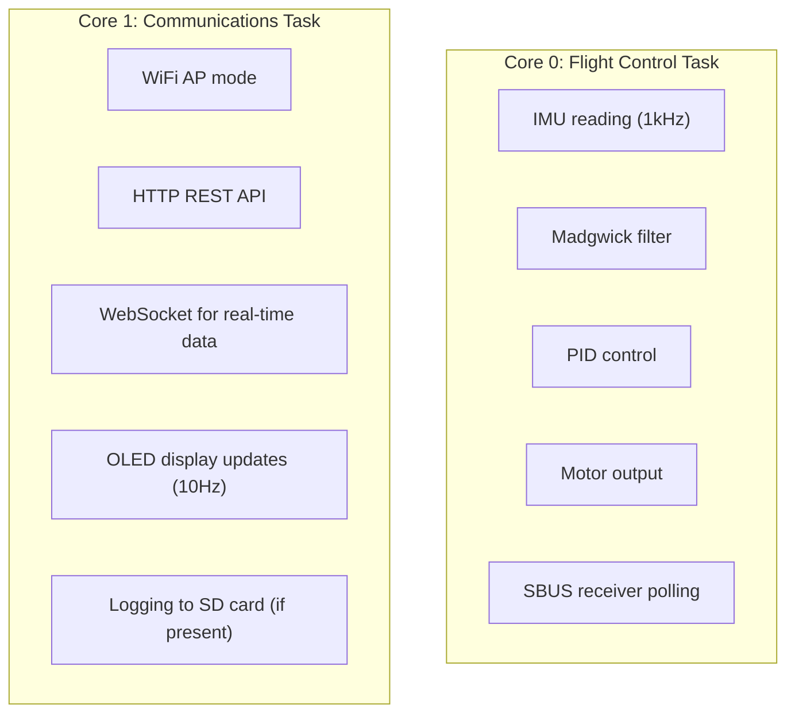

# ESP32 Dual-Core Architecture for Flight Controllers

> Research date: 2026-02-06

## Overview

The ESP32 has two Xtensa LX6 CPU cores (Core 0 and Core 1) running at up to 240MHz. Using FreeRTOS task pinning, we can dedicate one core to time-critical flight control and the other to WiFi/API tasks.

---

## Core Assignment Strategy

### Recommended Architecture for Flight Controller

| Core | Purpose | Tasks |
|------|---------|-------|
| **Core 0** | Flight Control (Real-time) | IMU reading, PID loop, motor commands |
| **Core 1** | Communications | WiFi, HTTP API, WebSocket, OLED display |

### Why This Split?

- **Core 0** handles WiFi interrupts by default in Arduino framework
- However, for flight control we want Core 0 dedicated to FC because:
  - Flight control needs deterministic timing
  - WiFi can be bursty and cause jitter
- **Alternative**: Pin FC to Core 1, let WiFi stay on Core 0 (simpler but less isolated)

---

## Task Pinning with FreeRTOS

### Basic Syntax

```cpp
#include <Arduino.h>

TaskHandle_t flightControlTask;
TaskHandle_t wifiTask;

void flightControlLoop(void *parameter) {
    for (;;) {
        // Time-critical: read IMU, run PID, update motors
        getIMUdata();
        runPIDLoop();
        commandMotors();

        // Maintain precise loop timing
        vTaskDelay(1);  // or use precise timing
    }
}

void wifiLoop(void *parameter) {
    for (;;) {
        // Non-critical: handle HTTP requests, WebSocket, display
        server.handleClient();
        updateDisplay();

        vTaskDelay(10);  // 100Hz is plenty for comms
    }
}

void setup() {
    // Pin flight control to Core 0 (higher priority)
    xTaskCreatePinnedToCore(
        flightControlLoop,    // Task function
        "FlightControl",      // Name
        4096,                 // Stack size
        NULL,                 // Parameters
        2,                    // Priority (higher = more priority)
        &flightControlTask,   // Task handle
        0                     // Core 0
    );

    // Pin WiFi/API to Core 1 (lower priority)
    xTaskCreatePinnedToCore(
        wifiLoop,
        "WiFiComms",
        8192,                 // Larger stack for WiFi
        NULL,
        1,                    // Lower priority
        &wifiTask,
        1                     // Core 1
    );
}

void loop() {
    // Empty - everything runs in FreeRTOS tasks
}
```

---

## Priority Levels

ESP32 FreeRTOS uses priority levels 0-24 (higher = more priority):

| Priority | Use Case |
|----------|----------|
| 3+ | Flight control (highest) |
| 2 | Sensor fusion, filtering |
| 1 | WiFi/API handling |
| 0 | Background tasks (logging, display) |

---

## Critical Considerations

### 1. WiFi Default Behavior

By default, ESP32 Arduino runs WiFi on Core 0. Options:

```cpp
// Option A: Let Arduino handle WiFi normally (Core 0)
// Pin FC to Core 1 instead
xTaskCreatePinnedToCore(flightControlLoop, "FC", 4096, NULL, 2, &fcTask, 1);

// Option B: Disable Arduino loop task entirely
// Create both tasks manually with full control
```

### 2. Shared Data Protection

When sharing data between cores, use mutexes:

```cpp
SemaphoreHandle_t imuMutex;

void setup() {
    imuMutex = xSemaphoreCreateMutex();
}

// In flight control task (Core 0)
void updateIMUData() {
    xSemaphoreTake(imuMutex, portMAX_DELAY);
    // Update shared IMU values
    xSemaphoreGive(imuMutex);
}

// In WiFi task (Core 1) - when API requests current attitude
void getIMUForAPI() {
    float localRoll, localPitch, localYaw;
    xSemaphoreTake(imuMutex, portMAX_DELAY);
    localRoll = roll_IMU;
    localPitch = pitch_IMU;
    localYaw = yaw_IMU;
    xSemaphoreGive(imuMutex);
    // Use local copies for API response
}
```

### 3. Stack Size Recommendations

| Task | Minimum Stack | Recommended |
|------|--------------|-------------|
| Flight Control | 2048 bytes | 4096 bytes |
| WiFi + HTTP | 4096 bytes | 8192 bytes |
| WebSocket | 4096 bytes | 8192 bytes |
| OLED Display | 2048 bytes | 4096 bytes |

### 4. Single-Core ESP32 Variants

Some ESP32 variants (ESP32-S2, ESP32-C3) are single-core. Guard code:

```cpp
#if CONFIG_FREERTOS_UNICORE
    #error "This firmware requires dual-core ESP32"
#endif
```

---

## Timing Guarantees

### Using vTaskDelayUntil for Precise Timing

```cpp
void flightControlLoop(void *parameter) {
    TickType_t lastWakeTime = xTaskGetTickCount();
    const TickType_t period = pdMS_TO_TICKS(2);  // 500Hz = 2ms period

    for (;;) {
        // Flight control work
        getIMUdata();
        runPIDLoop();
        commandMotors();

        // Wait until next period (accounts for execution time)
        vTaskDelayUntil(&lastWakeTime, period);
    }
}
```

### High-Resolution Timing

For sub-millisecond precision, use hardware timers:

```cpp
hw_timer_t *timer = NULL;
volatile bool loopFlag = false;

void IRAM_ATTR onTimer() {
    loopFlag = true;
}

void setup() {
    timer = timerBegin(0, 80, true);  // 80MHz / 80 = 1MHz
    timerAttachInterrupt(timer, &onTimer, true);
    timerAlarmWrite(timer, 1000, true);  // 1000us = 1kHz
    timerAlarmEnable(timer);
}
```

---

## ESP32 Variant Comparison

| Feature | ESP32 | ESP32-S2 | ESP32-S3 | ESP32-C3 |
|---------|-------|----------|----------|----------|
| CPU Cores | 2 | 1 | 2 | 1 |
| Max Freq | 240MHz | 240MHz | 240MHz | 160MHz |
| WiFi | Yes | Yes | Yes | Yes |
| Bluetooth | Yes | No | Yes | BLE only |
| USB | No | Yes | Yes | No |
| **FC Suitable** | **Yes** | No | **Yes** | No |

**Recommendation**: Use ESP32 (original) or ESP32-S3 for flight controller.

---

## Integration with dRehmFlight

### Proposed Architecture



### Build Configuration

In `platformio.ini`:

```ini
[env:esp32_fc]
platform = espressif32
board = esp32dev
framework = arduino
build_flags =
    -D USE_ESP32
    -D WIFI_ENABLED
    -D OLED_ENABLED
    -D CONFIG_FREERTOS_HZ=1000
lib_deps =
    olikraus/U8g2
    ; Other libs...
```

---

## Sources

- [ESP32 Dual Core using FreeRTOS - Microcontrollers Lab](https://microcontrollerslab.com/esp32-dual-core-freertos-arduino-ide/)
- [ESP32 with FreeRTOS - Random Nerd Tutorials](https://randomnerdtutorials.com/esp32-freertos-arduino-tasks/)
- [Task Affinity and Core Pinning - CircuitLabs](https://circuitlabs.net/task-affinity-and-core-pinning/)
- [Parallel Multitasking for ESP32 - CircuitState](https://www.circuitstate.com/tutorials/how-to-write-parallel-multitasking-applications-for-esp32-using-freertos-arduino/)

---

## Implementation Priority

1. **Phase 1**: Basic ESP32 port with single-task architecture (verify FC works)
2. **Phase 2**: Add dual-core split (FC on Core 0, comms on Core 1)
3. **Phase 3**: Add WiFi AP + HTTP API
4. **Phase 4**: Add WebSocket for real-time telemetry
5. **Phase 5**: Add OLED display support
