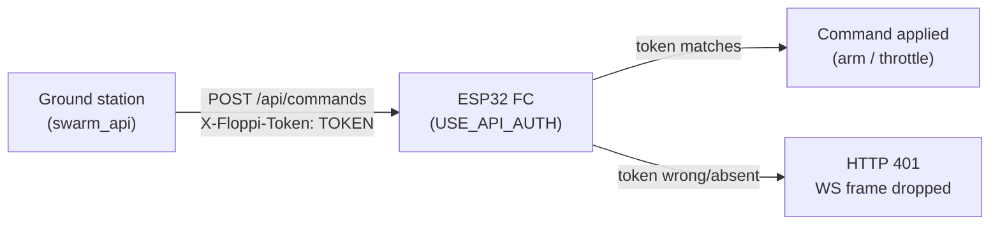

# Network Security Setup (Operator How-To)

Practical steps for the opt-in network-security features added in the 2026-05-22
hardening wave: **command-API authentication**, an **OTA password**, and a
**GPS position-privacy** build switch.

This is a how-to. For the *why* — the threat model, attack surface, and severity
ratings — see [security_posture.md](security_posture.md). Don't duplicate it; read
it before flying on any network.

> All of these features are **ESP32/S3-only** (they live under the WiFi build
> gate). They have no effect on Teensy builds, which have no network surface.

You edit only two files:

- `include/config.h` — turn features on/off (build flags).
- `include/wifi_credentials.h` — set the secrets (token, OTA password).

Both files ship with safe placeholder values committed to git. Keep placeholders
in git; put real secrets only in your local working copy.

---

## 1. Command-API authentication (`USE_API_AUTH`)

By default the WiFi command surface is **open**: `POST /api/commands` and any
WebSocket `/ws` command frame can arm and throttle the aircraft with no sender
authentication (audit SEC-01/SEC-03). Every ESP32 build prints a one-time
`#warning` reminding you of this. Enabling `USE_API_AUTH` requires every
command-bearing request to carry a shared token; mismatches are rejected.

Read paths (`GET /api/status`, `GET /`, the `/ws` telemetry broadcast) are
**never** gated — only commands are.

### Steps

1. **Set the token** in `include/wifi_credentials.h`. Change it from the
   placeholder:

   ```c
   #define FLOPPI_CMD_TOKEN "pick-a-long-random-string"
   ```

2. **Enable the flag** in `include/config.h` — uncomment:

   ```c
   #define USE_API_AUTH
   ```

3. **Rebuild and flash.** `pio run -e esp32 -t upload`

4. **Configure the ground station to send the matching token** (see §1.2). If
   you skip this, commands will start coming back `401 unauthorized` and the
   drone will not respond to control input.

### 1.1 The build will FAIL on a weak token (this is intentional)

When `USE_API_AUTH` is on, `src/web_server.cpp` enforces token quality at compile
time. The build is **expected to fail** — not a bug, a guardrail — if:

- `FLOPPI_CMD_TOKEN` is still the placeholder `"CHANGE-ME-floppi-token"`
  (a public default = no protection), or
- the token is shorter than **8 characters**, or
- `FLOPPI_CMD_TOKEN` is undefined entirely (raises a `#error`).

Fix it by setting a unique token of 8+ characters. There is no way to ship an
auth build with a useless token.

### 1.2 Ground-station (swarm_api) side — the matching token

This is a cross-project contract. The full spec is in
[docs/handoffs/api_auth_contract_2026-05-22.md](handoffs/api_auth_contract_2026-05-22.md).
Summary of what swarm_api must do:

- Store a `token` per drone in the registry (`config.json`), or a global default,
  matching that drone's `FLOPPI_CMD_TOKEN`. (The handoff doc refers to the
  swarm_api-side `command_token` / `auth_token` config — set it to the same
  value as `FLOPPI_CMD_TOKEN`.)
- Present the token on every **command** request:
  - HTTP: header `X-Floppi-Token: <token>` (preferred), **or** a `"token"` field
    in the JSON body, e.g.
    `{"token":"<token>","ch1":1500,...,"ch6":1000}`.
  - WebSocket: the frame has no headers, so the token rides in the JSON body as a
    `"token"` field alongside the channel keys.
- Do **not** add the token to telemetry GETs — they aren't gated.

> The token is a **control-plane gate, not confidentiality.** Traffic is plaintext
> HTTP/WS (SEC-06), so a passive sniffer on the LAN can read the token. Always run
> the FC on an isolated network.

### Auth flow



---

## 2. OTA password (`USE_OTA`)

ArduinoOTA with no password lets any LAN peer flash arbitrary firmware (remote
code execution — audit SEC-02). An OTA-enabled build now **requires** a
credential, enforced in `src/ota.cpp`. Operational OTA steps live in
[ota_runbook.md](ota_runbook.md); this section is only the credential setup.

### Steps

1. **Set the password** in `include/wifi_credentials.h` — change it from the
   placeholder:

   ```c
   #define OTA_PASSWORD "pick-a-strong-ota-password"
   ```

2. (Optional, preferred) **Use a hash instead of plaintext.** Define
   `OTA_PASSWORD_HASH` as the **32-char lowercase MD5** of the password and leave
   `OTA_PASSWORD` empty — `ota.cpp` prefers the hash when both are present:

   ```c
   #define OTA_PASSWORD ""
   #define OTA_PASSWORD_HASH "0123456789abcdef0123456789abcdef"
   ```

3. **Rebuild and flash.** Supply this password/hash from your OTA upload tool.

### The build will FAIL without a credential (intentional)

With `USE_OTA` enabled, `ota.cpp` enforces at compile time:

- If **neither** `OTA_PASSWORD` nor `OTA_PASSWORD_HASH` is defined → `#error`.
- If `OTA_PASSWORD` is defined but **empty** → `static_assert` failure.
- If `OTA_PASSWORD_HASH` is defined but is **not exactly 32 hex chars** →
  `static_assert` failure.

There is no silent "no password" default. To build OTA without a password you'd
have to remove the guard — don't.

> For field firmware, consider building with `USE_OTA` **off** entirely (comment
> it out in config.h). OTA is a development convenience, and the smallest attack
> surface is no OTA server at all.

---

## 3. GPS position privacy (`GPS_TELEMETRY_INCLUDE_POSITION`)

When `USE_GPS` is enabled, the FC is a pure NMEA passthrough — it relays the raw
GGA/RMC sentence verbatim over the (by default unauthenticated) network via the
API client and web server. Those sentences carry latitude/longitude/altitude, so
any LAN peer can track precise aircraft position (audit SEC-04).

Because the FC parses nothing, position data lives **entirely** inside the raw
NMEA string — there is no separate lat/lon field to drop. The only way to
withhold coordinates is to omit the raw `nmea` field altogether, keeping the
non-identifying liveness fields (`gps.ok`, `gps.age_ms` — a "GPS is alive"
heartbeat).

### Build an OPSEC variant (withhold coordinates)

The flag defaults to `1` (full passthrough, preserving the existing swarm-API
contract). To suppress position, define it as `0` in `include/config.h` inside
the GPS section:

```c
#define GPS_TELEMETRY_INCLUDE_POSITION 0
```

Consumers then see only `gps.ok` / `gps.age_ms` and no coordinates. Pair this
with `USE_API_AUTH` (§1) to also gate the *read* path against unauthorized peers.

---

## 4. Recommended secure deployment checklist

Defer the full threat model to [security_posture.md](security_posture.md) §4 —
this is the short, actionable version.

- [ ] **Isolate the flight network.** Dedicated/private AP, no other devices, never
      a shared/office/guest WiFi, never internet-reachable.
- [ ] **Treat the WiFi PSK as a flight-control credential** — anyone with it can
      reach the device. Use a strong, private PSK; rotate if it leaks.
- [ ] **Enable `USE_API_AUTH`** and set a **strong, unique** `FLOPPI_CMD_TOKEN`
      (8+ chars; the build enforces this). Confirm the ground station sends the
      matching token.
- [ ] **Set a strong OTA password** (prefer `OTA_PASSWORD_HASH`), or build field
      firmware with `USE_OTA` off entirely.
- [ ] **Set `GPS_TELEMETRY_INCLUDE_POSITION 0`** on builds where broadcasting
      aircraft location is not acceptable.
- [ ] **Keep `wifi_credentials.h` placeholders in git**; real secrets stay only in
      your local working copy.
- [ ] **Bench-test with props off** after any security/firmware change.

---

*Related: [security_posture.md](security_posture.md) (threat model) ·
[ota_runbook.md](ota_runbook.md) (OTA operations) ·
[handoffs/api_auth_contract_2026-05-22.md](handoffs/api_auth_contract_2026-05-22.md)
(swarm_api token contract).*
