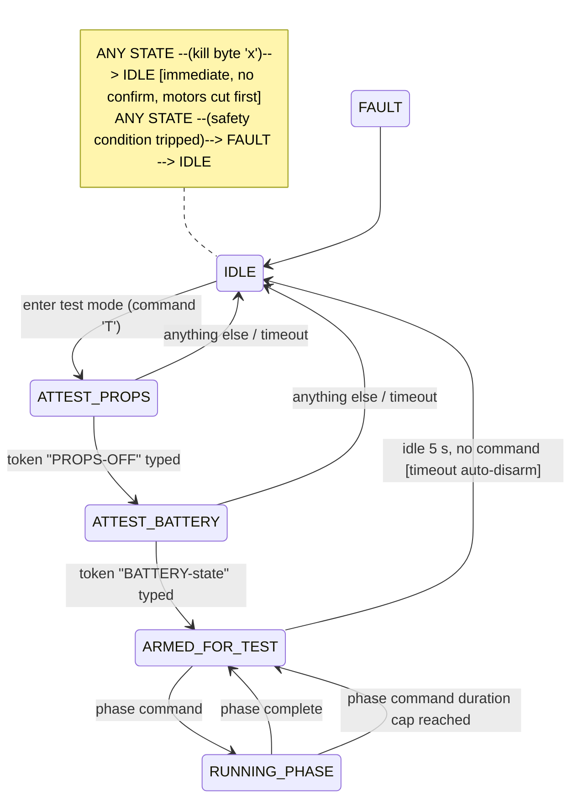

# Plan: Motor / ESC Test Framework

> Status: Spec only — no implementation
> Priority: Medium (gated on hardware)
> Created: 2026-05-20
> Author: fc-motor-test-spec@flight_controller:2
> Source contract: `docs/findings/future_session_scaffolding_2026-05-20.md` §3.1
> Cross-refs: `docs/findings/project_recon_2026-05-20.md` Workstream 4; `src/motors.cpp`; `include/config.h`; `tests/lib/harness.sh`

## Scope of this document

This is a SPEC. No code is written here, and none should be written until ESCs,
motors, and a secured test rig exist on the bench (see §6). The document scaffolds
a future implementation session: it defines the safety model, six test phases,
the firmware command surface the implementation must add, and where it plugs into
the existing shell test harness.

Today only the `e` calibration command (ESC endpoint calibration in
`lib/Calibration/calibration_hardware.cpp`) touches ESCs. Nothing exercises the
mixer or failsafe cut in a controlled, observable way. This framework fills that
gap while respecting the project's bare-bones, safety-first ethos: minimal new
firmware surface, host-side shell only, no new dependencies.

---

## 1. Purpose & safety philosophy

**Purpose.** Give the operator a repeatable, observable way to confirm that:
motor outputs hit their PWM endpoints, each motor spins independently and maps
to the correct mixer position, the mixer responds correctly to simulated board
tilt, failsafe cuts output fast enough, the arming gate cannot be bypassed, and
throttle-cut zeroes all motors immediately.

**Safety is the design center, not an add-on.** A test that spins motors is the
single most dangerous bench operation in this project. The framework's first job
is to make accidental spin-up structurally hard.

Non-negotiable rules (all enforced by the safety state machine in §2):

1. **Props OFF, always.** No phase of this framework is approved to run with
   propellers attached. The firmware asks for an explicit props-off attestation
   and will not enter test mode without it. The host suite asks again in plain
   text before sending the first command.
2. **Explicit user attestation.** The operator must type a confirmation token
   (not just press Enter) for props-off and for battery state. Defaults are
   "unsafe assumption denied" — no attestation means no test.
3. **Kill-switch always available.** A single keystroke / single serial byte
   (`x`) cuts all motors and drops the state machine to `IDLE` from ANY state,
   at any time, with no confirmation. This is the dead-man path.
4. **Timeout auto-disarm.** If `ARMED_FOR_TEST` is held with no command for a
   bounded window (spec: 5 s), the firmware auto-disarms back to `IDLE`. A
   stalled host or a walked-away operator cannot leave motors armed.
5. **Bounded output.** Test mode caps any commanded motor value well below hover
   thrust (spec: <= 30 % of the PWM span). The framework verifies behavior, not
   performance; full-throttle testing is out of scope.
6. **One motor at a time by default.** Multi-motor commands exist only for the
   mixer-differential phase and are still bounded and still props-off.

If any rule cannot be honored, the affected phase does not run.

---

## 2. Safety state machine

The firmware "motor test mode" (see §4) is governed by a small explicit state
machine. It lives in the calibration build only.

### States

| State | Meaning | Motors |
|---|---|---|
| `IDLE` | Test mode not active. Normal calibration prompt. | Forced to PWM minimum |
| `ATTEST_PROPS` | Awaiting props-off attestation token | Forced minimum |
| `ATTEST_BATTERY` | Awaiting battery-state attestation token | Forced minimum |
| `ARMED_FOR_TEST` | Attestations complete; ready to accept a phase command | Forced minimum until a phase command arrives |
| `RUNNING_PHASE` | A test phase is actively driving outputs | Bounded (<= 30 % span), single motor unless mixer phase |
| `FAULT` | A safety condition tripped | Forced minimum; requires re-entry from `IDLE` |

### Transitions



Rules:

- The **kill path is checked first** on every serial poll, before any phase
  logic. Kill cuts outputs, then changes state.
- The **timeout auto-disarm** applies in `ARMED_FOR_TEST` and also bounds every
  `RUNNING_PHASE` command (no phase command runs longer than its declared
  duration cap, spec: <= 3 s per command).
- Battery attestation accepts either `BATTERY-OUT` (preferred for early phases)
  or `BATTERY-IN` (required for any phase that needs ESCs powered). The firmware
  records which was attested and rejects phases that need power if `BATTERY-OUT`
  was declared.
- Entering `FAULT` always routes back through `IDLE`; the operator must
  re-attest. There is no "resume".

This is intentionally a handful of states. It is not a general framework.

---

## 3. The six test phases

Each phase: what it verifies, the input injected, the output checked, pass
criteria. All phases assume props off and run inside `RUNNING_PHASE`. "Observe"
means the operator visually/instrumentally confirms because the firmware cannot
self-measure motor RPM without extra hardware (see §8).

### Phase 1 — PWM endpoint check (low / high)

- **Verifies:** firmware drives the configured PWM minimum and maximum on each
  motor channel, matching the active protocol (`USE_STANDARD_PWM` 1000-2000 us
  or `USE_ONESHOT125` 125-250 us).
- **Input injected:** per-motor command for "endpoint low", then "endpoint high"
  — but high is capped at the bounded test ceiling (<= 30 % span), NOT true max.
  A separate explicit `endpoint-raw` sub-command may drive true min/max only for
  ESC arming-tone verification, and only with `BATTERY-IN` attested.
- **Output checked:** firmware echoes the commanded PWM value per channel;
  operator confirms ESC arm tone (low) and audible spin-up onset (high, bounded).
- **Pass criteria:** echoed values equal the protocol's configured endpoints;
  ESC arm tone heard on low; no motor spins at "low"; all motors respond at
  bounded "high".

### Phase 2 — Single-motor sweep

- **Verifies:** each motor channel maps to the physically correct motor and
  spins smoothly across the bounded range.
- **Input injected:** select motor N (1..motor_count), ramp its command from
  minimum to the bounded ceiling and back, over the phase duration cap.
- **Output checked:** firmware echoes `motor N` + current command each step;
  operator confirms exactly one motor spins, identifies it against the frame
  diagram, notes direction.
- **Pass criteria:** only the selected motor moves; motor identity matches the
  expected mixer position (M1 front-right, etc., per frame); rotation direction
  matches the configured quad-X convention; ramp is smooth, no stutter.

### Phase 3 — Mixer differential (board-tilt response)

- **Verifies:** `controlMixer()` distributes a simulated attitude error to the
  correct motors with the correct sign.
- **Input injected:** test mode feeds a synthetic desired-vs-measured error
  (e.g. "roll right", "pitch forward", "yaw CW") into the mixer at a fixed small
  throttle, instead of reading the IMU. One axis at a time.
- **Output checked:** firmware echoes the four (or six) resulting motor PWM
  values; operator confirms the differential pattern.
- **Pass criteria:** for "roll right" the left-side motors command higher than
  right-side and the sum stays near the base throttle; analogous patterns for
  pitch and yaw; no motor commanded outside the bounded ceiling; pattern signs
  match the documented quad-X mix.

### Phase 4 — Failsafe cut latency

- **Verifies:** loss of the command source drives all motors to minimum within
  an acceptable time.
- **Input injected:** with motors at a low bounded command, the test simulates
  receiver loss (test mode raises the failsafe condition the same way RadioComm
  failsafe does) and timestamps the event.
- **Output checked:** firmware logs the elapsed microseconds between the
  simulated loss and all motor outputs reaching minimum.
- **Pass criteria:** all motors at minimum; measured latency below the spec
  bound (spec: <= one failsafe detection window, target < 200 ms — operator to
  confirm the exact bound against RadioComm's failsafe timeout).

### Phase 5 — Arming gate test

- **Verifies:** the arm gate (throttle-low + CH5/AUX1) cannot be bypassed and
  motors stay at minimum until arm conditions are genuinely met.
- **Input injected:** test mode drives invalid arm combinations — throttle high
  + arm switch on, throttle low + arm switch off, arm switch toggled mid-test —
  then the valid combination.
- **Output checked:** firmware reports `armedFly` state and motor outputs after
  each combination.
- **Pass criteria:** `armedFly` stays false and motors stay at minimum for every
  invalid combination; `armedFly` becomes true only on the valid combination;
  no spurious arming on switch bounce.

### Phase 6 — Throttle-cut response

- **Verifies:** `throttleCut()` zeroes all motors and resets PID integrators
  immediately when CH5 goes high or `armedFly` clears.
- **Input injected:** with motors at a bounded non-zero command, the test raises
  the throttle-cut condition (CH5 > 1500 or `armedFly` cleared).
- **Output checked:** firmware reports all six motor PWM values and the
  `integral_roll/pitch/yaw` values immediately after the cut.
- **Pass criteria:** all motor commands at protocol minimum within one loop
  iteration; all three integrators read 0.0; state machine returns to
  `ARMED_FOR_TEST` (not stuck `RUNNING_PHASE`).

---

## 4. Firmware-side requirements

A "motor test mode" must be added to the **calibration build only**
(`*_calibration` environments). It is excluded from live builds by the existing
`#ifdef CALIBRATION_MODE` gating, so live flight binaries carry zero cost.

### Command surface (spec — do not implement here)

Dispatched from the calibration serial parser (`src/calibration_mode.cpp`),
alongside existing single-letter commands. Proposed surface:

| Input | State context | Action |
|---|---|---|
| `T` | `IDLE` | Enter motor test mode -> `ATTEST_PROPS` |
| typed `PROPS-OFF` | `ATTEST_PROPS` | Record attestation -> `ATTEST_BATTERY` |
| typed `BATTERY-OUT` / `BATTERY-IN` | `ATTEST_BATTERY` | Record battery state -> `ARMED_FOR_TEST` |
| `1`..`6` | `ARMED_FOR_TEST`/`RUNNING_PHASE` | Select active motor for single-motor phases |
| `p1`..`p6` | `ARMED_FOR_TEST` | Run test phase 1..6 (bounded, duration-capped) |
| `+` / `-` | `RUNNING_PHASE` | Step bounded command up/down (single-motor sweep) |
| `x` | ANY | KILL — cut all motors, force `IDLE` |
| `?` | ANY | Print current state, attestations, active motor, bounded ceiling |

Design constraints:
- Single-byte commands where possible; multi-character only for attestation
  tokens (deliberate friction).
- The parser must be **non-blocking** — no `delay()` loops that would defeat the
  kill byte. Reuse the existing serial-poll cadence.
- Bounded ceiling, per-command duration cap, and timeout window are
  `#define`-able constants in `config.h` (new "MOTOR TEST" section), defaulting
  to the conservative values in §1-§2.
- Test mode reuses existing `scaleCommands()`, `commandMotors()`,
  `controlMixer()`, `throttleCut()` — it injects inputs and reads outputs, it
  does not reimplement motor logic.

### Flash cost estimate

- State machine + parser additions: ~1.5-2.5 KB.
- Per-phase logic (six small routines, mostly reusing existing functions):
  ~2-3 KB.
- Serial echo/reporting strings: ~0.5-1 KB (use `F()` to keep in flash).
- **Total estimate: ~4-6 KB flash, calibration build only.** Teensy 4.0 has
  ~2 MB; ESP32 calibration builds have ample room. Negligible. Live builds:
  **zero** (gated out). RAM cost: a few state/timer variables, < 64 bytes.

---

## 5. Host-side integration

A new suite `tests/suites/test_motors.sh` plugs into the existing modular
harness (`tests/lib/harness.sh`) exactly like `test_calibration.sh` does.

### Stub structure (spec — implement in the hardware session)

```
tests/suites/test_motors.sh
  - resolve SUITE_DIR, source ../lib/harness.sh
  - PORT / RESULTS_DIR defaults
  - harness_check_prereqs
  - harness_print_header "Motor / ESC Test Suite" "$TEST_SEL"

  --- mandatory pre-flight gate (host side) ---
  confirm_props_off()      # plain-text prompt, require typed "PROPS-OFF"
  confirm_battery_state()  # plain-text prompt, require typed token
                           # abort the whole suite if either is not given

  --- per-phase test functions (one per §3 phase) ---
  test_pwm_endpoints()     # send T + attestations + p1, check_output echoes
  test_single_motor_sweep()# p2, operator-confirmed (INFO prompts)
  test_mixer_differential()# p3, check_output for differential PWM pattern
  test_failsafe_latency()  # p4, check_output for latency line under bound
  test_arming_gate()       # p5, check_absent "armed" on invalid combos
  test_throttle_cut()      # p6, check_output motors at min + integrators 0

  --- always-run teardown ---
  send_kill()              # send 'x', verify state returns to IDLE
                           # trap EXIT -> send_kill (kill on any abort)

  harness_print_footer
```

Integration notes:
- Reuse `run_serial`, `check_output`, `check_absent`, `test_pass/fail` verbatim.
- Phases that need operator eyes (2, 3) use `info()` prompts and a
  read-confirmation step; phases that are fully serial-observable (1, 4, 5, 6)
  use `check_output` assertions.
- An `EXIT` trap sends the kill byte so an aborted or crashed suite never leaves
  motors armed.
- The entry point `tests/test_calibration.sh` pattern is mirrored: a thin
  `tests/test_motors.sh` wrapper may be added later if desired, but is optional.
- This suite is **opt-in** — never run by a default `dev.sh test` until §6 is
  satisfied. Document it as hardware-gated.

---

## 6. What is blocked on hardware

Nothing in this framework executes until all of the following exist:

- ESCs connected to the motor pins (Teensy `analogWrite` pins / ESP32 LEDC pins).
- Motors connected to the ESCs.
- A **secured test rig** — motors bolted to a bench fixture or a frame clamped
  down, props removed, clear of hands and cables.
- A bench power source for the ESCs separate from the MCU's USB power.

Until then this document is the deliverable. The firmware command surface (§4)
*could* be implemented and unit-reasoned without hardware, but it must not be
flight/bench-validated, and the host suite must remain opt-in. Recommendation:
implement firmware + host stub in one session, validate in a later session once
the rig exists. Do not partially enable.

---

## 7. Implementation workstreams

Three non-overlapping workstreams with exclusive file boundaries.

### WS-1 — Firmware: motor test mode + state machine — Size M

- **Files (exclusive):** `src/calibration_mode.cpp` (add parser dispatch),
  a new `lib/Calibration/calibration_motor_test.cpp` + header (phase logic and
  state machine), `include/config.h` (new "MOTOR TEST" `#define` section).
- **Deliverable:** state machine (§2), command surface (§4), six phase routines
  that inject inputs and echo outputs. Compiles in all `*_calibration`
  environments; zero change to live builds.

### WS-2 — Host suite: test_motors.sh — Size S/M

- **Files (exclusive):** `tests/suites/test_motors.sh` (new), optional thin
  `tests/test_motors.sh` wrapper.
- **Deliverable:** the stub structure of §5, with the EXIT-trap kill, attestation
  gates, and per-phase functions wired to `harness.sh`. Assertions for the
  serial-observable phases; INFO prompts for the eyes-on phases.
- **Depends on:** WS-1's command surface being frozen (the table in §4).

### WS-3 — Docs: operator runbook + roadmap/test-doc updates — Size S

- **Files (exclusive):** a new `docs/motor-test-runbook.md` (rig setup, props-off
  checklist, how to run each phase, how to read results), plus updates to
  `docs/roadmap.md` and `docs/3_troubleshooting.md` motor section.
- **Deliverable:** operator-facing procedure; explicitly states the suite is
  hardware-gated and opt-in.

Suggested order: WS-1 -> WS-2 (needs frozen command table) -> WS-3 (can start in
parallel with WS-2 once §3/§4 are stable). WS-3 may also be folded into WS-2's
session if budget allows.

---

## 8. Open questions for the operator

1. **ESC protocol — PWM, OneShot125, or DShot?** `config.h` currently offers
   `USE_STANDARD_PWM` (default) and `USE_ONESHOT125`. There is no DShot path in
   `motors.cpp`. If the operator's ESCs are DShot-only, that is a separate
   firmware effort and **must be resolved before WS-1** — it changes the
   endpoint values and the arming behavior. *(Top open question.)*
2. **Test rig** — Is there a secured bench fixture for motors, or will testing
   wait for the assembled airframe with props removed? This gates §6.
3. **Motor count** — 4 (quad X) or up to 6? The mixer supports m1-m6 and seven
   servos. Phases 2/3 need the real count and the frame's motor-position map.
4. **RPM/current instrumentation** — The firmware cannot measure motor RPM or
   ESC current without extra hardware. Phases 2/3 currently rely on operator
   observation. Is a tachometer or current sensor available, or is visual
   confirmation acceptable?
5. **Failsafe latency bound** — What is the acceptable cut latency for Phase 4?
   The spec target is < 200 ms; the operator should confirm against the
   RadioComm failsafe detection window for the chosen receiver protocol.
6. **VTOL servos** — This framework covers motors/ESCs only. Do the seven servo
   channels need an analogous (lower-risk) test phase, or is that out of scope
   for this deliverable?

---

*Spec complete. Implementation is gated on §6 hardware and on resolving the §8
open questions — particularly the ESC protocol. No code, no commits.*
