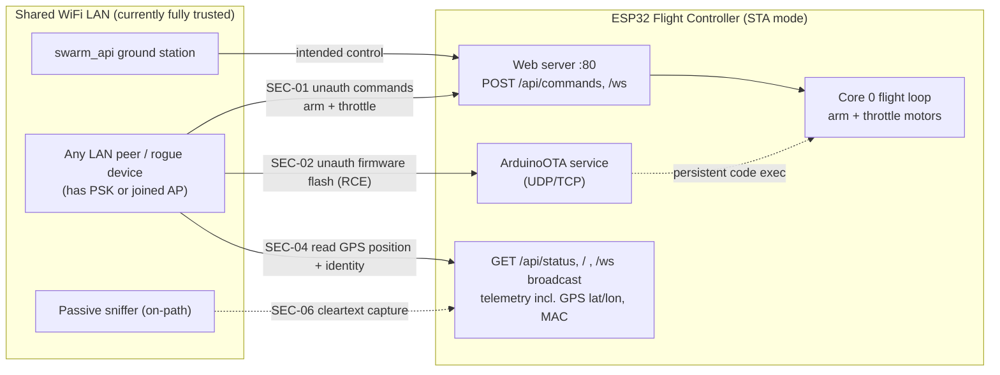

# Flight Controller — Security Posture & Threat Model

**Audience:** contributors and operators of the Floppi flight controller firmware.
**Last reviewed:** 2026-05-22 (against firmware in `flight_controller/`).
**Source of record:** [findings/security_audit_2026-05-22.md](findings/security_audit_2026-05-22.md)
(static, read-only audit of the real source). This document is the durable,
operator-facing synthesis; the audit has the per-line code references.

> **One-line summary.** This firmware is a WiFi-connected flight controller that
> spins motors and (optionally) reports GPS position. As shipped today it has
> **no application-layer authentication on any network surface** — on the flight
> network, command-and-control of the aircraft is available to any LAN peer.
> Hardening is being added this session (opt-in command token + OTA password +
> GPS-leak flag-gate). Until that lands and is enabled, **treat the flight LAN as
> the only security boundary** and keep it isolated.

---

## 1. Threat model

### What the device exposes
Only **ESP32** builds with WiFi enabled (`USE_WIFI`, which auto-defines
`USE_WEB_SERVER`, `USE_API_SERVER`, and `USE_OTA`) present a network attack
surface. Teensy builds with no radio link have none of this. On a networked
ESP32, in WiFi **STA mode** (the drone joins an existing WiFi network), the
device exposes:

| Surface | What it does | Auth today |
|---|---|---|
| `POST /api/commands` (TCP/80) | Sets the six RC channels (throttle, arm, attitude) | **none** |
| WebSocket `/ws` (TCP/80) | Same command path + telemetry stream | **none** |
| `GET /api/status`, `/`, `/ws` broadcast | Telemetry incl. GPS lat/lon, MAC, SSID, armed state | **none** |
| ArduinoOTA (UDP/TCP) | Flashes new firmware onto the FC | **none** |
| Outbound POST to `API_SERVER_URL` | Pushes telemetry to the swarm server (plain HTTP) | **none** |

### Who can reach it
Anyone on the same LAN: a compromised laptop, a guest device, a rogue
AP-joined device, or anyone who has the WiFi PSK. With ARP/DNS spoofing, an
on-path attacker can also impersonate the swarm server.

### What they can do (today, unauthenticated)
- **Arm and throttle the motors** — send `{"ch3":1000,"ch5":1000}` to arm, then
  `{"ch3":2000}` to spin up. Complete remote takeover. (SEC-01)
- **Flash arbitrary firmware** via OTA — persistent code execution that survives
  reboot and can disable every safety check. (SEC-02)
- **Read precise aircraft GPS position + device identity** (MAC) from telemetry,
  and learn armed/disarmed timing. (SEC-04)
- **Passively sniff** all of the above, since traffic is cleartext. (SEC-06)

### Trust assumptions (current)
The firmware **trusts the LAN entirely**. The design notes (WiFi STA mode, swarm
on the same network) assume a trusted network. The audit's position is that a
device which spins motors warrants defense even on a "trusted" LAN, because PSK
leakage, guest devices, and spoofing are realistic.

### Trust boundary / attack surface

---

## 2. Current posture & known gaps

### What IS mitigated today
- **RC-channel clamp is complete and correct.** Every command — from all three
  WiFi entry points and centrally in `getCommands()` — is constrained to
  `[1000, 2000]` µs, and missing/garbage JSON keys fall back to safe defaults.
  This bounds the *value* of a channel; it does **not** authenticate the sender.
  A perfectly in-range command is still accepted from anyone.
- **No exploitable memory-safety bug** was found on network-reachable paths. GPS
  NMEA parsing is bounds-checked; `strncpy` uses are sized correctly; PWM math is
  constrained. (One non-memory truncation issue, SEC-05, is noted below.)
- **Secrets in the repo are clean.** `wifi_credentials.h` and `wifi_certs.h` are
  git-tracked but contain placeholders only — no real SSID, password, identity,
  or certificate material is committed. Keep it that way.

### What is NOT mitigated today (the gaps)
**P0 — no authentication anywhere (the root problem):**
- **SEC-01 — Unauthenticated flight control.** Any LAN peer can drive the
  channels and arm/throttle the motors over `POST /api/commands` or `/ws`.
- **SEC-02 — Unauthenticated OTA = remote code execution.** `ArduinoOTA.begin()`
  is called with no password; any LAN peer can flash arbitrary firmware. The only
  guard skips OTA while armed-in-flight — it does nothing for a disarmed bench/
  staged drone, and an attacker can wait for a disarmed window.
- **SEC-03 — No auth on any surface (systemic).** This is the root cause that
  turns SEC-01/02/04 from theoretical into exploitable. Read and write authority
  are not separated; the network is trusted wholesale.

**P1 — telemetry / position leakage:**
- **SEC-04 — GPS + identity leak over unauthenticated, cleartext API.**
  `/api/status`, `/ws`, and `/` expose raw NMEA (lat/lon/alt), MAC, SSID, IP,
  RSSI, armed state, attitude, and motor outputs to any LAN peer. The same body
  is also pushed to the swarm server over plain HTTP, so the position trail
  crosses the wire in cleartext. This is disclosure, not control — but aircraft
  location + device fingerprint is a real opsec harm, and "armed: true" tells an
  attacker when to strike. **Confirmed live in code.**
- **SEC-05 — WebSocket telemetry can silently truncate to invalid JSON.** The
  `/ws` and swarm-POST paths serialize into a fixed 512 B buffer; with GPS +
  barometer both enabled the frame can exceed that and truncate. It cannot
  overflow memory (the serializer respects the size), but consumers (the swarm)
  can get malformed JSON. `/api/status` uses dynamic serialization and is not
  affected — so the two telemetry paths can disagree.

### Lower-severity items (tracked, not blocking)
- **P2 SEC-06** — no transport encryption (all HTTP/WS/OTA is cleartext).
- **P2 SEC-07** — WiFi command path has no replay protection; the 500 ms failsafe
  can hold WiFi authority briefly after an injected burst.
- **P2 SEC-08** — the I2C command ISR validates length only (no checksum/magic),
  unlike the Serial and iBUS parsers. Short-range wired bus, so lower network
  risk.
- **P3 SEC-09** — verbose info disclosure on `/` and `/api/status` (subsumed by
  SEC-04).
- **P3 SEC-10** — PPM/PWM "frame valid" heuristic is weak/spoofable; wired
  protocols, not network-exploitable.
- **P3 SEC-11** — mDNS/OTA hostname buffers were checked and are safe (cosmetic
  entry only).

---

## 3. Planned hardening (this session)

The wire-level contract for the auth scheme is being authored this wave by the
coding agent in **`docs/handoffs/api_auth_contract_2026-05-22.md`** — see that
file for the exact header/field names, hashing, and the swarm-API integration
details. This section is the operator-level summary; it does not duplicate the
wire details.

- **Opt-in command token (`USE_API_AUTH`) — addresses SEC-01/SEC-03.** When the
  flag is enabled, the command endpoints (`POST /api/commands` and the `/ws` data
  branch) require a shared secret compiled in from `wifi_credentials.h`; requests
  without a valid token are rejected. This is a *control-plane* gate. Note: until
  transport encryption exists (SEC-06), a bearer token is visible to a passive
  sniffer — an HMAC-with-counter scheme (which also defeats the SEC-07 replay
  gap) is the stronger target. The handoff contract specifies which is being
  shipped.
- **OTA password — addresses SEC-02.** An OTA password/hash sourced from a new
  define in `wifi_credentials.h`, with a build guard so an `USE_OTA` build cannot
  ship with no password. The hash form keeps plaintext out of flash strings.
- **GPS / position telemetry flag-gate — addresses SEC-04.** GPS/position fields
  become opt-in behind a build flag, so a default build does not broadcast
  aircraft location. Moving the swarm POST to HTTPS is a **cross-project** change
  (the `swarm_api/` ground station must terminate TLS and send the credential)
  and is out of the firmware work zone — flagged as a handoff, not done here.

> **Scope note.** SEC-03/04/06 have a `swarm_api/` side: the ground station must
> send the command credential and support HTTPS. Those changes live in the
> `swarm_api/` project, not this firmware, and must be coordinated in tandem.

---

## 4. Operator guidance

> For step-by-step instructions on enabling these controls (`USE_API_AUTH`, the OTA
> password, and the GPS position-privacy build switch), see
> [network_security_setup.md](network_security_setup.md).

Until the hardening above is merged **and you have enabled it**, operate as if
the firmware has no network security — because it does not.

1. **Isolate the flight network.** Run drones on a dedicated, trusted network or
   a private AP with no other devices. Do **not** join a shared/office/guest WiFi,
   and never expose the drone to an untrusted or internet-reachable network.
2. **Treat the WiFi PSK as a flight-control credential.** Anyone with the PSK can
   arm and fly the aircraft. Use a strong, private PSK; rotate it if it leaks.
3. **Enable `USE_API_AUTH`** once available, and set a **strong command token**
   in `wifi_credentials.h`. Make sure the swarm side sends it (cross-project).
4. **Set a strong OTA password** (and prefer the hash form). Consider building
   field firmware with OTA **off** entirely — it is a development convenience.
5. **Disable GPS/position telemetry** (the flag-gate) on builds where broadcasting
   aircraft location is not acceptable.
6. **Bench-test motor behavior with props off.** Several fixes (arm-over-WiFi
   rejection, OTA reject-on-bad-password, failsafe timing) must be bench-validated
   before they are trusted.
7. **Keep `wifi_credentials.h` / `wifi_certs.h` as placeholders in git.** Put real
   secrets only in your local working copy.

---

## 5. Severity table

Mirrors the audit. Status reflects the 2026-05-22 hardening wave.

| ID | Sev | Issue (one line) | Status |
|---|---|---|---|
| SEC-01 | P0 | Unauthenticated full flight control over WiFi (arm + throttle) | hardening-in-progress (`USE_API_AUTH` token) |
| SEC-02 | P0 | Unauthenticated OTA firmware update = remote code execution | hardening-in-progress (OTA password + build guard) |
| SEC-03 | P0 | No authentication on any network surface (systemic root cause) | hardening-in-progress (token + OTA pw; read/write split) |
| SEC-04 | P1 | Telemetry leak incl. GPS lat/lon + MAC over unauth/cleartext API | hardening-in-progress (flag-gate; HTTPS = cross-project) |
| SEC-05 | P1 | WebSocket/POST telemetry can truncate to invalid JSON (512 B buf) | open (buffer sizing / dynamic serialization) |
| SEC-06 | P2 | No transport encryption (cleartext HTTP/WS/OTA) | open (optional TLS; needs swarm_api) |
| SEC-07 | P2 | WiFi command replay + failsafe authority race (no counter) | open (monotonic command counter) |
| SEC-08 | P2 | I2C command ISR validates length only, no checksum | open (add checksum byte to contract) |
| SEC-09 | P3 | Verbose info disclosure on `/` and `/api/status` | open (subsumed by SEC-04) |
| SEC-10 | P3 | PPM/PWM frame-valid heuristic weak/spoofable (wired, low risk) | open (range-sanity check; bench) |
| SEC-11 | P3 | mDNS/OTA hostname buffers (checked, safe) | not an issue (recorded only) |

---

*This is defensive documentation for the project owner's own firmware. No source
was modified in producing it. For per-line code references and the full fix-
routing (statically-fixable vs. needs-bench-validation vs. cross-project), see
[findings/security_audit_2026-05-22.md](findings/security_audit_2026-05-22.md).*
