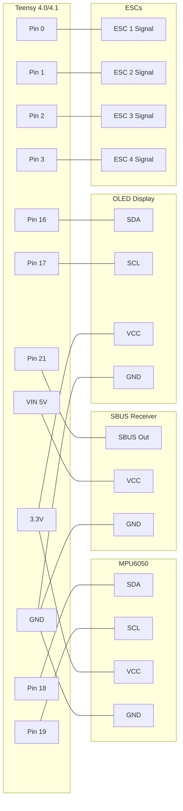

# Teensy 4.0/4.1 Wiring Guide (General Reference)

General pin reference for Teensy 4.0 and 4.1 flight controllers.

> **For specific build guides, see [wiring_diagrams/](wiring_diagrams/):**
>
> - [Teensy + FS-iA6B + Drone](wiring_diagrams/teensy_wiring_fsia6b_drone.md) — recommended starting point

---

## Wiring Diagram



---

## Pin Reference Tables

### Core Connections

| Component | Component Pin | Teensy Pin | Notes |
|-----------|---------------|------------|-------|
| MPU6050 | SDA | 18 | I2C data |
| MPU6050 | SCL | 19 | I2C clock |
| MPU6050 | VCC | 3.3V | **NOT 5V!** |
| MPU6050 | GND | GND | Common ground |
| SBUS Receiver | SBUS | 21 | Serial5 RX |
| SBUS Receiver | VCC | VIN | 5V power |
| SBUS Receiver | GND | GND | Common ground |
| OLED Display | SDA | 16 | Software I2C (separate from IMU) |
| OLED Display | SCL | 17 | Software I2C (separate from IMU) |
| OLED Display | VCC | 3.3V | 3.3V power |
| OLED Display | GND | GND | Common ground |
| Status LED | - | 13 | Built-in |

### Motors (PWM Output)

| Motor | Teensy Pin | Quad X Position | Rotation |
|-------|------------|-----------------|----------|
| Motor 1 | 0 | Front Left | CCW |
| Motor 2 | 1 | Front Right | CW |
| Motor 3 | 2 | Back Right | CCW |
| Motor 4 | 3 | Back Left | CW |
| Motor 5 | 4 | Optional | - |
| Motor 6 | 5 | Optional | - |

### Servos (50Hz PWM)

| Servo | Teensy Pin |
|-------|------------|
| Servo 1 | 6 |
| Servo 2 | 7 |
| Servo 3 | 8 |
| Servo 4 | 9 |
| Servo 5 | 10 |
| Servo 6 | 11 |
| Servo 7 | 12 |

### Alternative Receiver Protocols

| Protocol | RX Pin | TX Pin | Serial Port | Notes |
|----------|--------|--------|-------------|-------|
| SBUS | 21 | 20 | Serial5 | Inverted signal, 100kbaud |
| iBUS | 15 | 14 | Serial3 | 115200 baud |
| DSM/Spektrum | 15 | 14 | Serial3 | 115000 baud |
| PPM | 23 | - | - | Single wire, all channels |

### PWM Receiver (Individual Channels)

| Channel | Teensy Pin | Function |
|---------|------------|----------|
| CH1 | 23 | Roll |
| CH2 | 22 | Pitch |
| CH3 | 21 | Throttle |
| CH4 | 20 | Yaw |
| CH5 | 17 | Aux 1 (arm) |
| CH6 | 16 | Aux 2 (mode) |

---

## Motor Layout (Quad X)

```text
        FRONT
    M1 (CCW)    M2 (CW)
    Pin 0       Pin 1
        \      /
         \    /
          \  /
          /  \
         /    \
        /      \
    M4 (CW)     M3 (CCW)
    Pin 3       Pin 2
        BACK
```

**Propeller direction:**
- Motors 1 & 3: Counter-clockwise (CCW) props
- Motors 2 & 4: Clockwise (CW) props

---

## Power Notes

| Source | Voltage | Current | Use |
|--------|---------|---------|-----|
| USB | 5V | 500mA | Development only |
| VIN | 5-5.5V | - | Flight (from BEC) |
| 3.3V out | 3.3V | 250mA max | Sensors only |

**Important:**
- Power Teensy from a 5V BEC for flight (not USB)
- MPU6050 **must** use 3.3V (not 5V tolerant)
- ESCs need separate battery power
- Common ground between Teensy and all ESCs required

---

## Quick Wiring Checklist

- [ ] MPU6050 SDA → Pin 18
- [ ] MPU6050 SCL → Pin 19
- [ ] MPU6050 VCC → 3.3V
- [ ] MPU6050 GND → GND
- [ ] Receiver SBUS → Pin 21
- [ ] Receiver VCC → VIN (5V)
- [ ] Receiver GND → GND
- [ ] OLED SDA → Pin 16 (optional, software I2C)
- [ ] OLED SCL → Pin 17 (optional, software I2C)
- [ ] OLED VCC → 3.3V
- [ ] OLED GND → GND
- [ ] ESC 1 Signal → Pin 0
- [ ] ESC 2 Signal → Pin 1
- [ ] ESC 3 Signal → Pin 2
- [ ] ESC 4 Signal → Pin 3
- [ ] All ESC grounds → GND

**Supported OLED displays:** DSD TECH 0.91" (SSD1306 128x32), Generic 0.96" (SSD1306 128x64), HiLetGo 1.3" (SH1106 128x64). Select in config.h.

**Note:** OLED pins 16/17 overlap with PWM receiver CH5/CH6. If using PWM receiver, choose different OLED pins in pin_definitions.h.
