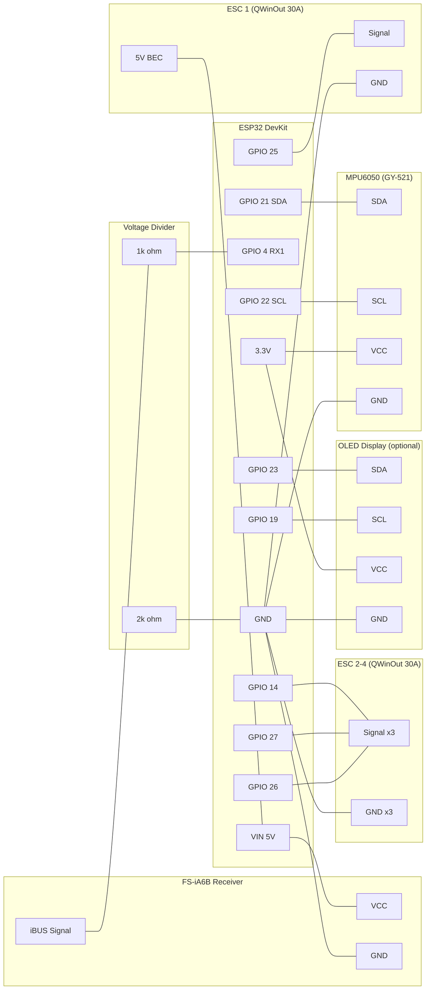

# ESP32 + FS-iA6B + Quad Drone Wiring Guide

Complete wiring reference for a quadcopter drone using ESP32, FlySky FS-iA6B receiver (IBus), QWinOut 30A ESCs, and MPU6050 IMU. WiFi-enabled with calibration web server.

> **Receiver protocol**: IBus (recommended). Set `#define USE_IBUS_RECEIVER` in config.h.
> **WiFi**: ESP32 connects to your network. Access calibration at `http://floppi-XXXX.local`

---

## Wiring Diagram (ESP32)



---

## Pin Reference (ESP32)

### Core Connections

| Component | Component Pin | ESP32 GPIO | Notes |
|-----------|---------------|------------|-------|
| MPU6050 | SDA | 21 | I2C data |
| MPU6050 | SCL | 22 | I2C clock |
| MPU6050 | VCC | 3.3V | **3.3V only! NOT 5V!** |
| MPU6050 | GND | GND | Common ground |
| FS-iA6B | iBUS signal | 4 (via divider) | Serial1 RX. **Voltage divider required!** |
| FS-iA6B | VCC | VIN (5V) | Power from BEC or USB |
| FS-iA6B | GND | GND | Common ground |
| OLED (optional) | SDA | 23 | Software I2C (separate from IMU) |
| OLED (optional) | SCL | 19 | Software I2C (separate from IMU) |
| OLED (optional) | VCC | 3.3V | 3.3V power |
| OLED (optional) | GND | GND | Common ground |
| Status LED | - | 2 | Built-in |

### ESC Connections (QWinOut 30A)

| ESC | Signal GPIO | Motor Position | Rotation | BEC VCC |
|-----|-------------|----------------|----------|---------|
| ESC 1 | 25 | Front Left | CCW | **Connected** to VIN |
| ESC 2 | 26 | Front Right | CW | **Disconnected** |
| ESC 3 | 27 | Back Right | CCW | **Disconnected** |
| ESC 4 | 14 | Back Left | CW | **Disconnected** |

Each ESC servo plug has 3 wires:
- **Signal** (white/yellow/orange) -> ESP32 motor GPIO
- **GND** (black/brown) -> ESP32 GND (**always connected**)
- **VCC** (red, 5V BEC output) -> **Only connect ONE ESC's VCC to VIN. Cut/remove the red wire on all other ESCs.**

> ESP32 outputs 3.3V PWM signals. QWinOut 30A ESCs accept 3.3V logic without issues.

---

## Voltage Divider (REQUIRED)

**ESP32 GPIOs are NOT 5V tolerant** (max 3.6V). The FS-iA6B outputs 5V logic on the iBUS signal pin.

```text
FS-iA6B iBUS signal ──[1k ohm]──┬── ESP32 GPIO 4
                                 |
                            [2k ohm]
                                 |
                                GND
```

Output voltage: 5V * 2k/(1k+2k) = 3.33V (safe for ESP32)

---

## ESP32-S3 Pin Reference

If using ESP32-S3 instead of ESP32, these pins change:

| Component | ESP32 GPIO | ESP32-S3 GPIO |
|-----------|------------|---------------|
| IMU SDA | 21 | 8 |
| IMU SCL | 22 | 9 |
| iBUS RX | 4 | 16 |
| Motor 1 | 25 | 35 |
| Motor 2 | 26 | 36 |
| Motor 3 | 27 | 37 |
| Motor 4 | 14 | 38 |
| OLED SDA | 23 | 3 |
| OLED SCL | 19 | 46 |
| LED | 2 | 48 |

All other wiring (voltage divider, ESC BEC, power) is identical.

---

## FS-iA6B Receiver Details

### IBus Pin Location

```text
  [Antenna 1]  [Antenna 2]
  +--------------------------+
  |   FS-iA6B                |
  |                    [LED] |
  |                   [BIND] |
  +--------------------------+
   CH1  CH2  CH3  CH4  CH5  CH6  B/VCC
   PPM                            iBUS
```

- **iBUS servo data** is on the **signal pin of the B/VCC header** (rightmost)
- Each header: Signal (top), VCC (middle), GND (bottom)

### Binding

1. Hold BIND button, power on receiver -> LED flashes
2. Transmitter: Settings > RX Bind > Bind
3. LED goes solid -> bound
4. Set transmitter output to **iBUS** (Settings > System > Output Mode > iBUS)

---

## ESP32 Dual-Core Architecture

The ESP32 runs two cores simultaneously:

| Core | Priority | Tasks |
|------|----------|-------|
| Core 0 | High (3) | Flight control loop (IMU read, PID, motor output) |
| Core 1 | Normal | WiFi, web server, OLED display, OTA updates |

WiFi and display run on Core 1 and **never interfere** with the flight control loop on Core 0.

### WiFi Features (automatic on ESP32)

- **Web server**: `http://floppi-XXXX.local` (mDNS) — calibration dashboard, live telemetry
- **WebSocket**: `ws://floppi-XXXX.local/ws` — streaming telemetry for fc_tool
- **OTA updates**: `pio run -t upload --upload-port floppi-XXXX.local`
- **API client**: HTTP POST telemetry to external servers

Configure WiFi credentials in `wifi_credentials.h`.

---

## Motor Layout (Quad X)

```text
        FRONT
    M1 (CCW)    M2 (CW)
    GPIO 25     GPIO 26
        \      /
         \    /
          \  /
          /  \
         /    \
        /      \
    M4 (CW)     M3 (CCW)
    GPIO 14     GPIO 27
        BACK
```

---

## Power Architecture

```text
LiPo Battery (3S or 4S)
    |
    +-- ESC 1 (power + signal + GND) --> Motor 1
    |       |
    |       +-- BEC 5V out --> ESP32 VIN (powers ESP32 + receiver)
    |
    +-- ESC 2 (power + signal + GND, NO BEC VCC) --> Motor 2
    +-- ESC 3 (power + signal + GND, NO BEC VCC) --> Motor 3
    +-- ESC 4 (power + signal + GND, NO BEC VCC) --> Motor 4
```

| Source | Voltage | Notes |
|--------|---------|-------|
| USB | 5V | Development only |
| ESC BEC | 5V / 3A | Flight power (to VIN) |
| 3.3V out | 3.3V | Sensors only |

**WiFi power spikes:** ESP32 WiFi TX can spike to 350mA. Use a quality 5V supply rated for 500mA+.

---

## ESP32 GPIO Notes

### Avoid These Pins

| GPIO | Reason |
|------|--------|
| 0 | Strapping pin (boot mode) |
| 2 | Strapping pin (OK after boot, used for LED) |
| 12 | Strapping pin (flash voltage) |
| 15 | Strapping pin (debugging) |
| 6-11 | Connected to internal flash |

### Input-Only Pins

GPIO 34, 35, 36 (VP), 39 (VN) — cannot output. Good for PPM/PWM receiver input.

---

## Alternative Receiver Protocols

| Protocol | Config Flag | ESP32 GPIO | Notes |
|----------|-------------|------------|-------|
| **iBUS** | `USE_IBUS_RECEIVER` | GPIO 4 (Serial1 RX) | **Recommended.** Voltage divider needed. |
| SBUS | `USE_SBUS_RECEIVER` | GPIO 16 (Serial2 RX) | Software inversion. For FrSky receivers. |
| PPM | `USE_PPM_RECEIVER` | GPIO 35 | Input-only pin, no divider needed for 3.3V PPM. |
| PWM | `USE_PWM_RECEIVER` | GPIO 35,34,39,36,23,19 | 6 wires. Uses many pins. |

---

## Quick Wiring Checklist

- [ ] MPU6050 SDA -> GPIO 21
- [ ] MPU6050 SCL -> GPIO 22
- [ ] MPU6050 VCC -> 3.3V (**not 5V!**)
- [ ] MPU6050 GND -> GND
- [ ] FS-iA6B iBUS signal -> 1k resistor -> GPIO 4
- [ ] 2k resistor from GPIO 4 to GND (voltage divider)
- [ ] FS-iA6B VCC -> VIN (5V from BEC)
- [ ] FS-iA6B GND -> GND
- [ ] ESC 1 signal -> GPIO 25, GND -> GND, BEC 5V -> VIN
- [ ] ESC 2 signal -> GPIO 26, GND -> GND, **red wire removed**
- [ ] ESC 3 signal -> GPIO 27, GND -> GND, **red wire removed**
- [ ] ESC 4 signal -> GPIO 14, GND -> GND, **red wire removed**
- [ ] OLED SDA -> GPIO 23 (optional)
- [ ] OLED SCL -> GPIO 19 (optional)
- [ ] WiFi credentials configured in wifi_credentials.h
- [ ] All grounds connected (common ground!)
- [ ] Props removed for initial testing!

**Config.h settings:**
```cpp
#define USE_IBUS_RECEIVER    // IBus protocol
//#define USE_SBUS_RECEIVER  // Comment out SBUS
```

**Supported OLED displays:** DSD TECH 0.91" (SSD1306 128x32), Generic 0.96" (SSD1306 128x64), HiLetGo 1.3" (SH1106 128x64). Select in config.h.
