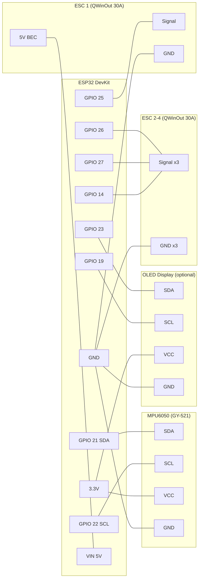

# ESP32 + Web API + Quad Drone Wiring Guide

Wiring reference for a WiFi-controlled quadcopter drone using ESP32 **without a physical RC receiver**. Commands are sent over WiFi from an external controller application. This is the simplest wiring configuration.

> **No RC receiver needed.** The ESP32 receives flight commands via WiFi API.
> This configuration requires a WiFi network and a controller application running on a separate computer.

---

## Wiring Diagram



---

## Pin Reference (ESP32)

### Core Connections

| Component | Component Pin | ESP32 GPIO | Notes |
|-----------|---------------|------------|-------|
| MPU6050 | SDA | 21 | I2C data |
| MPU6050 | SCL | 22 | I2C clock |
| MPU6050 | VCC | 3.3V | **3.3V only! NOT 5V!** |
| MPU6050 | GND | GND | Common ground |
| OLED (optional) | SDA | 23 | Software I2C |
| OLED (optional) | SCL | 19 | Software I2C |
| OLED (optional) | VCC | 3.3V | 3.3V power |
| OLED (optional) | GND | GND | Common ground |
| Status LED | - | 2 | Built-in |

No receiver pins needed — commands arrive over WiFi.

### ESC Connections (QWinOut 30A)

| ESC | Signal GPIO | Motor Position | Rotation | BEC VCC |
|-----|-------------|----------------|----------|---------|
| ESC 1 | 25 | Front Left | CCW | **Connected** to VIN |
| ESC 2 | 26 | Front Right | CW | **Disconnected** |
| ESC 3 | 27 | Back Right | CCW | **Disconnected** |
| ESC 4 | 14 | Back Left | CW | **Disconnected** |

---

## How WiFi Control Works

```text
Controller App (PC/laptop)          ESP32 Drone
========================          ==============
  Web dashboard                     WiFi STA mode
  Send commands via HTTP     --->   Web server receives
  POST throttle/roll/pitch/yaw      RadioComm processes
                                     channel_X_pwm values
                                     PID -> Motors
```

**Architecture:**
1. ESP32 connects to your WiFi network (STA mode)
2. Web server runs on Core 1, flight control on Core 0
3. Controller app sends commands via HTTP POST or WebSocket
4. Commands route through RadioComm (same path as RC receiver)
5. Failsafe activates if no commands received within timeout

**This is NOT a direct RC link.** WiFi has higher latency (~20-50ms) and is dependent on network quality. Suitable for:
- Indoor testing and development
- Slow/hovering flights
- Swarm coordination (multiple drones on same network)
- Autonomous flight with flight computer

**Not suitable for:**
- Fast FPV flying
- Outdoor flights beyond WiFi range
- Situations where RC failsafe is critical

---

## Motor Layout (Quad X)

```text
        FRONT
    M1 (CCW)    M2 (CW)
    GPIO 25     GPIO 26
        \      /
         \    /
          \  /
          /  \
         /    \
        /      \
    M4 (CW)     M3 (CCW)
    GPIO 14     GPIO 27
        BACK
```

---

## Power Architecture

Same as the FS-iA6B ESP32 guide, minus the receiver:

```text
LiPo Battery (3S or 4S)
    |
    +-- ESC 1 (power + signal + GND) --> Motor 1
    |       |
    |       +-- BEC 5V out --> ESP32 VIN
    |
    +-- ESC 2 (power + signal + GND, NO BEC VCC) --> Motor 2
    +-- ESC 3 (power + signal + GND, NO BEC VCC) --> Motor 3
    +-- ESC 4 (power + signal + GND, NO BEC VCC) --> Motor 4
```

---

## Quick Wiring Checklist

- [ ] MPU6050 SDA -> GPIO 21
- [ ] MPU6050 SCL -> GPIO 22
- [ ] MPU6050 VCC -> 3.3V (**not 5V!**)
- [ ] MPU6050 GND -> GND
- [ ] ESC 1 signal -> GPIO 25, GND -> GND, BEC 5V -> VIN
- [ ] ESC 2 signal -> GPIO 26, GND -> GND, **red wire removed**
- [ ] ESC 3 signal -> GPIO 27, GND -> GND, **red wire removed**
- [ ] ESC 4 signal -> GPIO 14, GND -> GND, **red wire removed**
- [ ] OLED SDA -> GPIO 23 (optional)
- [ ] OLED SCL -> GPIO 19 (optional)
- [ ] WiFi credentials configured in wifi_credentials.h
- [ ] All grounds connected (common ground!)
- [ ] Props removed for initial testing!

**Config.h settings:**
```cpp
// No receiver protocol needed — commands via WiFi API
// Comment out all receiver defines:
//#define USE_SBUS_RECEIVER
//#define USE_IBUS_RECEIVER
//#define USE_PPM_RECEIVER
//#define USE_PWM_RECEIVER
```

> WiFi API command routing through RadioComm is **fully implemented** (2026-02-10). POST `/api/commands` and WebSocket `/ws` both feed into RadioComm via spinlock-protected cross-core buffer. This configuration works as the sole command source — no RC receiver needed. See `swarm_api/` for the ground station that sends commands.
