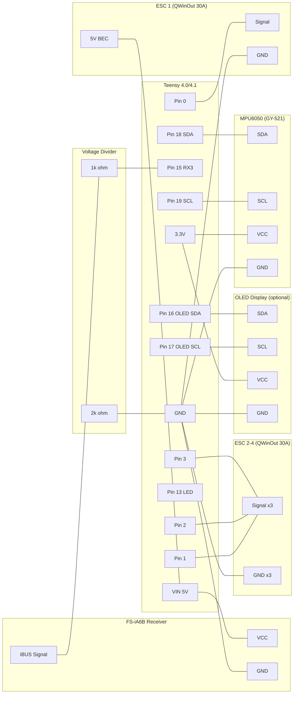

# Teensy 4.0 + FS-iA6B + Quad Drone Wiring Guide

Complete wiring reference for a quadcopter drone using Teensy 4.0/4.1, FlySky FS-iA6B receiver (IBus), QWinOut 30A ESCs, and MPU6050 IMU.

> **Receiver protocol**: IBus (recommended). Set `#define USE_IBUS_RECEIVER` in config.h.
> See [Alternative protocols](#alternative-receiver-protocols) for SBUS/PPM/PWM options.

---

## Wiring Diagram



---

## Pin Reference

### Core Connections

| Component | Component Pin | Teensy Pin | Notes |
|-----------|---------------|------------|-------|
| MPU6050 | SDA | 18 | I2C data (Wire) |
| MPU6050 | SCL | 19 | I2C clock (Wire) |
| MPU6050 | VCC | 3.3V | **3.3V only! NOT 5V!** |
| MPU6050 | GND | GND | Common ground |
| FS-iA6B | iBUS signal | 15 (via divider) | Serial3 RX. **Voltage divider required!** |
| FS-iA6B | VCC | VIN (5V) | Power from BEC or USB |
| FS-iA6B | GND | GND | Common ground |
| OLED (optional) | SDA | 16 | Software I2C (separate from IMU) |
| OLED (optional) | SCL | 17 | Software I2C (separate from IMU) |
| OLED (optional) | VCC | 3.3V | 3.3V power |
| OLED (optional) | GND | GND | Common ground |
| Status LED | - | 13 | Built-in |

### ESC Connections (QWinOut 30A)

| ESC | Signal Pin | Motor Position | Rotation | BEC VCC |
|-----|------------|----------------|----------|---------|
| ESC 1 | Pin 0 | Front Left | CCW | **Connected** to VIN |
| ESC 2 | Pin 1 | Front Right | CW | **Disconnected** |
| ESC 3 | Pin 2 | Back Right | CCW | **Disconnected** |
| ESC 4 | Pin 3 | Back Left | CW | **Disconnected** |

Each ESC servo plug has 3 wires:
- **Signal** (white/yellow/orange) -> Teensy motor pin
- **GND** (black/brown) -> Teensy GND (**always connected**)
- **VCC** (red, 5V BEC output) -> **Only connect ONE ESC's VCC to VIN. Cut/remove the red wire on all other ESCs.**

> **Why only one BEC?** Each QWinOut 30A ESC has a built-in 5V/3A BEC. Connecting multiple BECs in parallel causes voltage conflicts between regulators. Pick one ESC as the power source, disconnect the red wire on the others.

---

## FS-iA6B Receiver Details

### IBus Pin Location

The FS-iA6B has a row of 3-pin servo headers along one edge. Looking at the receiver from the top with the antenna wires pointing up:

```text
  [Antenna 1]  [Antenna 2]
  +--------------------------+
  |   FS-iA6B                |
  |                    [LED] |
  |                   [BIND] |
  +--------------------------+
   CH1  CH2  CH3  CH4  CH5  CH6  B/VCC
   PPM                            iBUS
```

- **iBUS servo data** is on the **signal pin of the B/VCC header** (rightmost header)
- Each header has 3 pins: Signal (top), VCC (middle), GND (bottom)
- Only one VCC/GND connection is needed (power distributes internally)

### Voltage Divider (REQUIRED)

**Teensy 4.0 is NOT 5V tolerant.** The FS-iA6B outputs 5V logic on the iBUS signal pin. A voltage divider is required to step it down to ~3.3V.

```text
FS-iA6B iBUS signal ──[1k ohm]──┬── Teensy Pin 15 (RX3)
                                 |
                            [2k ohm]
                                 |
                                GND
```

Output voltage: 5V * 2k/(1k+2k) = 3.33V (safe for Teensy)

Use 1% tolerance resistors for best accuracy. A 1k/2.2k pair also works (gives 3.44V, still safe).

### IBus Protocol Summary

| Parameter | Value |
|-----------|-------|
| Baud rate | 115200 |
| Format | 8N1 (standard UART, non-inverted) |
| Frame size | 32 bytes |
| Channels | 14 (first 6 used) |
| Channel range | 1000-2000 us (direct microseconds) |
| Update rate | ~143 Hz (~7ms per frame) |
| Checksum | 0xFFFF minus sum of preceding bytes |

**Why iBUS over other protocols?** All 14 channels are multiplexed into a single 32-byte serial frame — one signal wire carries everything. PWM needs one wire per channel (6 wires for 6 channels). iBUS is also **non-inverted** standard UART, unlike SBUS which requires signal inversion hardware. At ~143 Hz update rate, iBUS is faster than PWM (~50 Hz) and SBUS (~70-150 Hz). Protocol parsing takes microseconds on a 600MHz Teensy — the bottleneck is always the receiver's refresh rate, not the MCU.

### Binding the Receiver

1. Power off everything
2. Press and hold the BIND button on the FS-iA6B
3. While holding BIND, power on the receiver (connect 5V)
4. LED flashes rapidly — receiver is in bind mode
5. On the FS-i6/FS-i6X transmitter: go to Settings > RX Bind > Bind
6. LED goes solid — binding complete
7. Set transmitter output to **iBUS** (Settings > System > Output Mode > iBUS)

---

## Motor Layout (Quad X)

```text
        FRONT
    M1 (CCW)    M2 (CW)
    Pin 0       Pin 1
        \      /
         \    /
          \  /
          /  \
         /    \
        /      \
    M4 (CW)     M3 (CCW)
    Pin 3       Pin 2
        BACK
```

- Motors 1 & 3: Counter-clockwise (CCW) props
- Motors 2 & 4: Clockwise (CW) props
- If a motor spins the wrong way: swap any two of the three motor wires to the ESC

---

## Power Architecture

```text
LiPo Battery (3S or 4S)
    |
    +-- ESC 1 (power + signal + GND) --> Motor 1
    |       |
    |       +-- BEC 5V out --> Teensy VIN (powers Teensy + receiver)
    |
    +-- ESC 2 (power + signal + GND, NO BEC VCC) --> Motor 2
    +-- ESC 3 (power + signal + GND, NO BEC VCC) --> Motor 3
    +-- ESC 4 (power + signal + GND, NO BEC VCC) --> Motor 4
```

| Source | Voltage | Current | Use |
|--------|---------|---------|-----|
| USB | 5V | 500mA | Development/testing only |
| ESC BEC | 5V | 3A max | Flight power (to Teensy VIN) |
| Teensy 3.3V out | 3.3V | 250mA max | MPU6050 + OLED |

**Current budget (flight):**
- Teensy 4.0: ~100mA
- MPU6050: ~3.5mA
- FS-iA6B: ~70mA
- OLED display: ~20mA
- Total: ~200mA (well within 3A BEC capacity)

---

## Alternative Receiver Protocols

The FS-iA6B supports IBus, PPM, and individual PWM. Change the protocol in config.h:

| Protocol | Config Flag | Teensy Pin | Wires | Notes |
|----------|-------------|------------|-------|-------|
| **iBUS** | `USE_IBUS_RECEIVER` | Pin 15 (RX3) | 1 + power | **Recommended.** Voltage divider needed. |
| SBUS | `USE_SBUS_RECEIVER` | Pin 21 (RX5) | 1 + power | Not native on FS-iA6B (use with FrSky receivers) |
| PPM | `USE_PPM_RECEIVER` | Pin 23 | 1 + power | Set transmitter to PPM output. Lower update rate. |
| PWM | `USE_PWM_RECEIVER` | Pins 23-16 | 6 + power | One wire per channel. Uses many pins. |

---

## Quick Wiring Checklist

- [ ] MPU6050 SDA -> Pin 18
- [ ] MPU6050 SCL -> Pin 19
- [ ] MPU6050 VCC -> 3.3V (**not 5V!**)
- [ ] MPU6050 GND -> GND
- [ ] FS-iA6B iBUS signal -> 1k resistor -> Pin 15 (RX3)
- [ ] 2k resistor from Pin 15 to GND (voltage divider)
- [ ] FS-iA6B VCC -> VIN (5V from BEC)
- [ ] FS-iA6B GND -> GND
- [ ] ESC 1 signal -> Pin 0, GND -> GND, BEC 5V -> VIN
- [ ] ESC 2 signal -> Pin 1, GND -> GND, **red wire removed**
- [ ] ESC 3 signal -> Pin 2, GND -> GND, **red wire removed**
- [ ] ESC 4 signal -> Pin 3, GND -> GND, **red wire removed**
- [ ] OLED SDA -> Pin 16 (optional)
- [ ] OLED SCL -> Pin 17 (optional)
- [ ] All grounds connected (common ground!)
- [ ] Props removed for initial testing!

**Config.h settings:**
```cpp
#define USE_IBUS_RECEIVER    // IBus protocol
//#define USE_SBUS_RECEIVER  // Comment out SBUS
```

**Supported OLED displays:** DSD TECH 0.91" (SSD1306 128x32), Generic 0.96" (SSD1306 128x64), HiLetGo 1.3" (SH1106 128x64). Select in config.h.

---

## Troubleshooting: Common Wiring Mistakes

- **OLED SDA/SCL pin swap**: Pin 16 is SDA, Pin 17 is SCL. Many OLED breakout boards print these labels in the opposite order from what you'd expect. If the display powers on but shows nothing, swap the two data lines first — this is the most common cause.
- **Voltage divider omitted on iBUS**: The FS-iA6B outputs 5V logic. Without the 1k/2k divider, Serial3 RX on the Teensy may read garbage or damage the pin.
- **Multiple ESC BEC VCC wires connected**: Only one ESC's red (5V) wire should reach Teensy VIN. Cut or disconnect the red wire on all other ESCs to avoid regulator conflicts.
