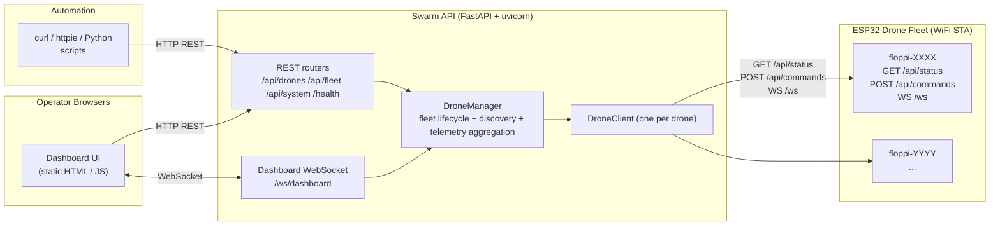
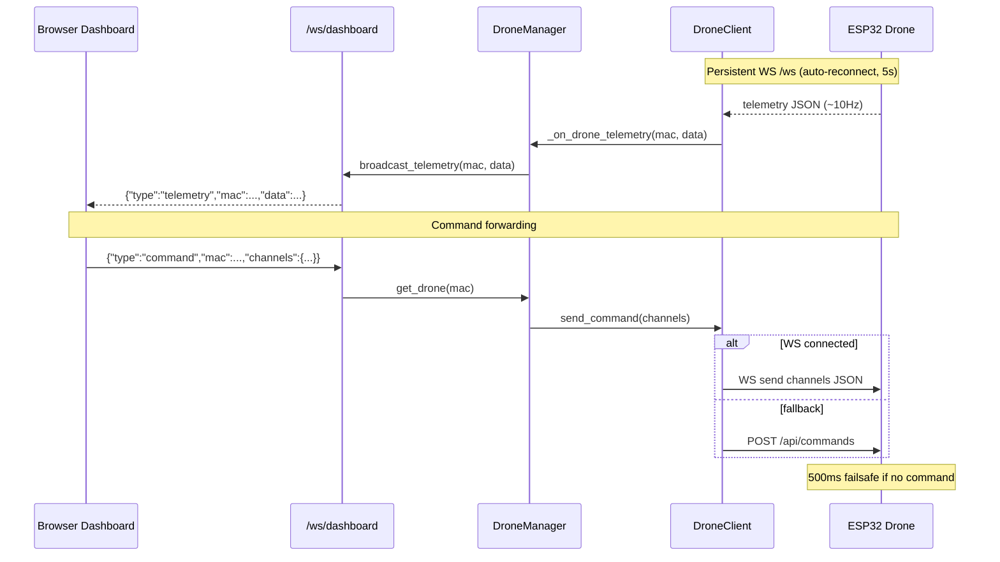
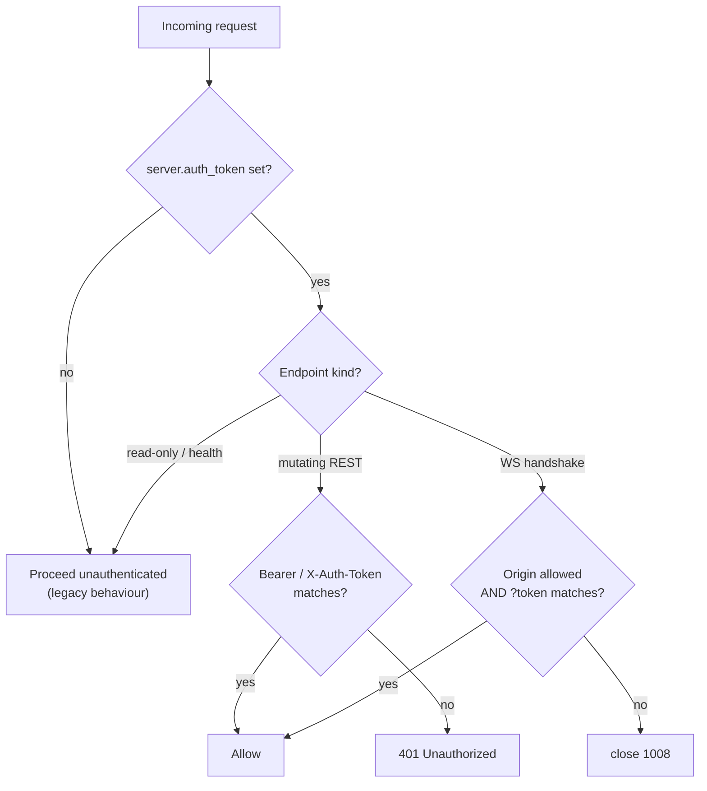
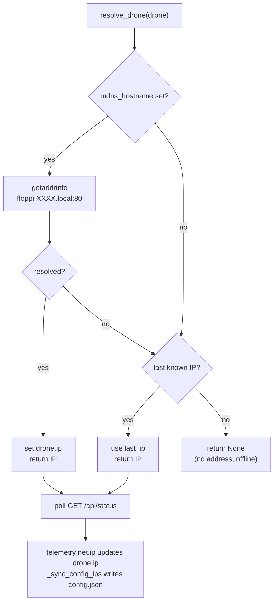

# Swarm API - Architecture

> Last updated: 2026-05-22

A high-level view of how the Swarm API ground station is put together. Grounded
in the actual source under `src/` — see `main.py`, `manager.py`, `drone.py`, and
`api/ws.py`.

---

## System Overview

The Swarm API is a single FastAPI + uvicorn process. It serves a static browser
dashboard, exposes a scripting-friendly REST API, and bridges a dashboard
WebSocket to a fleet of ESP32 drones over a shared WiFi network. Each drone is
represented by one `DroneClient`; the `DroneManager` owns the fleet, runs
discovery, and aggregates telemetry.

**Routers** (mounted in `main.py`):

- `/api` — drone CRUD, per-drone telemetry and commands (`api/drones.py`)
- `/api/fleet` — fleet status, filtered listing, batch commands, emergency disarm, groups/tags (`api/fleet.py`)
- `/api/system` — server info, config read/update (`api/system.py`)
- `/ws/dashboard` — dashboard WebSocket bridge (`api/ws.py`)
- `/` and `/health` — dashboard index and health check with fleet summary (`main.py`)

---

## WebSocket Bridge: Telemetry Broadcast + Command Forwarding

Each `DroneClient` keeps a persistent WebSocket to its drone's `/ws` (with
auto-reconnect, and a polling fallback for drones without WS). Inbound telemetry
flows up through the manager's listener chain to `broadcast_telemetry`, which
fans it out to every connected dashboard client. Commands flow the other way:
the dashboard sends a `command` message, the manager looks up the target drone,
and `DroneClient.send_command` prefers the drone WebSocket, falling back to
`POST /api/commands`.

The dashboard sends commands at ~10Hz while actively controlling, which keeps
the drone's 500ms failsafe from tripping. Channel values are clamped to
1000-2000us before sending.

---

## Server Authentication (Opt-In)

The Swarm API ships with an **opt-in** client-to-server auth layer (`src/api/auth.py`).
It is **default off**: when `server.auth_token` is unset/empty the server behaves
exactly as before (a startup warning is logged). When the token is set, it gates
all command-bearing and mutating surfaces. Read-only/telemetry/health endpoints
stay open so monitoring still works without a credential.

> This is the **client -> swarm_api** credential. It is distinct from
> `network.command_token`, which is the **swarm_api -> drone-firmware** credential.

**What gets gated when `auth_token` is set:**

| Surface | Endpoint(s) | Requirement |
| --- | --- | --- |
| Per-drone command | `POST /api/drones/{mac}/command` | `Authorization: Bearer <token>` or `X-Auth-Token: <token>` |
| Drone metadata | `PUT /api/drones/{mac}` | same |
| Add / remove drone | `POST /api/drones`, `DELETE /api/drones/{mac}` | same |
| Fleet batch command | `POST /api/fleet/command` | same |
| Emergency disarm | `POST /api/fleet/disarm` | same |
| Config mutation | `PUT /api/system/config/network` | same (also gated by `config_mutation_enabled`) |
| Dashboard WebSocket | `/ws/dashboard` | `?token=<token>` query param **and** allowed `Origin` |

REST rejection is HTTP `401` (`WWW-Authenticate: Bearer`). The WebSocket
handshake is rejected with close code **1008** (policy violation) for a
missing/invalid token or a disallowed `Origin`. The `Origin` allowlist is
`server.ws_allowed_origins` (empty list = same-origin only).

### How the dashboard uses it

The static dashboard (`src/static/index.html`) is backward compatible: with no
token it sends nothing extra and connects exactly as before. The operator can
paste a token into the header field (stored in `localStorage`). When a token is
present the dashboard:

- attaches `Authorization: Bearer <token>` to mutating REST calls (via an
  `authedFetch` wrapper),
- appends `?token=<token>` to the `/ws/dashboard` WebSocket URL,
- shows an "authentication required" banner and stops auto-reconnecting on a
  `401` or a WebSocket close `1008`, prompting for a valid token.

**Enabling it:** set `server.auth_token` to a strong random secret in
`config.json` (and, for browsers served from a different origin, add that origin
to `server.ws_allowed_origins`), then restart the server. Use TLS in front of
the server so the bearer token is not sent in cleartext.

---

## Drone Discovery (mDNS + Config Fallback)

`DroneManager.resolve_drone` resolves each drone's address. It tries mDNS first
(`floppi-XXXX.local`) and falls back to the last known IP from `config.json`. A
drone with neither is treated as offline. Once a drone responds, the `net.ip`
field from its telemetry updates the client, and `_sync_config_ips` periodically
writes fresh IPs back to `config.json`.

A background health loop re-resolves offline drones every 30s and syncs config
IPs. There is no network scanning — only known drones from `config.json` are
ever contacted (see `scope.md`).

---

## Related Docs

- [README.md](README.md) — overview and quick start
- [scope.md](scope.md) — boundaries and the ESP32 API contract
- [roadmap.md](roadmap.md) — feature progress
